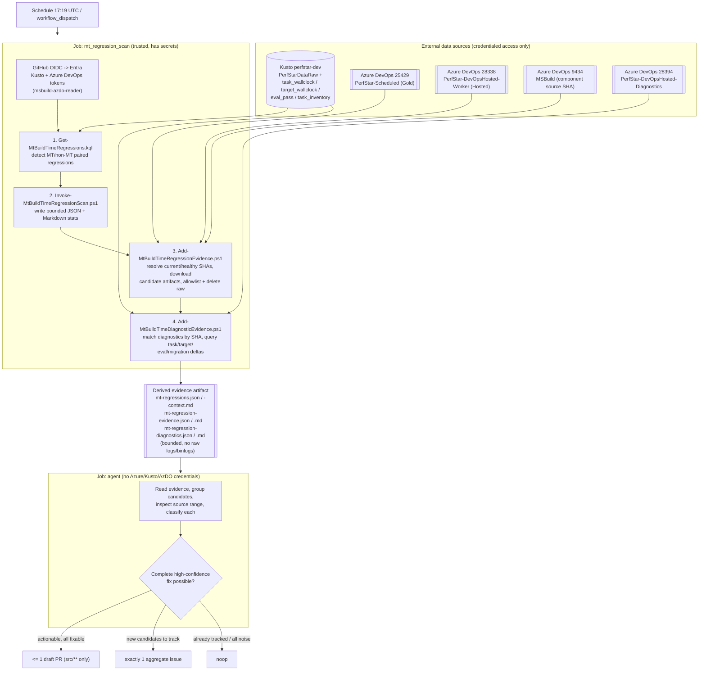

# PerfStar MT build regression agent

The `PerfStar MT Build Regression Investigator` GitHub Agentic Workflow scans production PerfStar
data for possible multithreaded (`/mt`) build-time regressions across both Gold and Hosted machines.
It investigates all candidates as one batch, creates at most one aggregate tracking issue per run,
and can open one draft pull request containing all high-confidence fixes.

## Attribution

The OIDC authentication pattern is based on [dotnet/msbuild#13743](https://github.com/dotnet/msbuild/pull/13743),
authored by Jan Krivanek. That pull request proved that a GitHub Actions workflow in this repository
can exchange a GitHub OIDC token for a Microsoft Entra token without storing an Azure DevOps PAT.

This workflow reuses the existing `msbuild-azdo-reader` identity and the repository secrets created
for that proof of concept:

- `AZDO_READER_CLIENT_ID`
- `AZDO_READER_TENANT_ID`

The workflow exchanges the OIDC token for a Kusto-scoped token. It does not expose that token or any
Azure credential to the AI agent.

## Data flow at a glance

The diagram below shows the data sources, the credentialed deterministic scan job, and the agent
sandbox. Every external data source is reached only by the trusted `mt_regression_scan` job. The
agent holds the Copilot PAT and GitHub token required by its toolsets, but no Azure, Kusto, or Azure
DevOps credentials; the only PerfStar data it receives is the derived evidence artifact.



## Execution flow

1. A deterministic custom job runs daily or through an authorized `workflow_dispatch`. Dispatches
   carrying pull-request `aw_context` are rejected.
2. The job uses GitHub OIDC to authenticate as `msbuild-azdo-reader`.
3. `queries/Get-MtBuildTimeRegressions.kql` queries `perfstar-dev/PerfStarDataRaw`.
4. `workflows/Invoke-MtBuildTimeRegressionScan.ps1` resolves each candidate's PerfStar run, discards
   candidates whose current run did not finish normally, and writes bounded JSON and Markdown
   statistical evidence.
5. `workflows/Add-MtBuildTimeRegressionEvidence.ps1` resolves the exact current and last-healthy MSBuild
   revisions, downloads only candidate-specific artifacts, extracts allowlisted metrics plus safe
   Hosted timing/completion lines, then deletes the raw files.
6. `workflows/Add-MtBuildTimeDiagnosticEvidence.ps1` finds scheduled diagnostic runs from definition 28394
   that use the exact current or last-healthy MSBuild source SHA, then queries Kusto task, target,
   evaluation-pass, and task-migration data.
7. The complete derived evidence is uploaded as a workflow artifact.
8. The Agentic Workflow downloads only the derived evidence into its sandbox, which has no Azure,
   Kusto, or Azure DevOps credentials.
9. The agent investigates every candidate and:
   - creates one aggregate issue when new candidates need tracking;
   - opens one draft PR only when it can safely address every actionable regression; or
   - emits a no-op when the complete candidate set is already tracked.

The workflow does not queue PerfStar validation runs. Automated experimental-build and targeted
PerfStar verification are intentionally deferred.

## Code organization

The implementation follows the same thin-workflow/module structure as the branch-freeze automation:

```text
.github/mt-build-regression/
├── components/
│   ├── clients/       # Azure DevOps and Kusto REST boundaries
│   ├── evidence/      # Detection, artifact sanitization, and diagnostic selection
│   └── reporting/     # JSON and Markdown evidence contracts
├── queries/           # Executable Kusto detector
├── tests/             # Pure component and evidence-contract tests
└── workflows/         # Small orchestration entry points called by GitHub Actions
```

The entry scripts validate credentials and inputs, compose the modules, and publish workflow
outputs. Network retries, artifact handling, allowlists, exact-SHA matching, and report formatting
remain encapsulated behind purpose-specific module functions.

## Detector scope

The detector uses production `build-time` rows from:

- `Backend == "Gold"` with `RunKind == "Gold"`
- `Backend == "Hosted"` with `RunKind == "Hosted"`
- Windows and Linux
- `SourceBranch == "refs/heads/main"`

MT and non-MT scenarios are paired by removing the `-mt-` infix or trailing `-mt`. Per-build medians
are used so runs with more iterations do not receive extra weight.

A pair is emitted only when:

- the current paired run is no more than two days old;
- at least four paired baseline runs exist in the 21-day window;
- MT regressed by at least 5% and 250 ms versus its historical median;
- current MT exceeds its historical p90; and
- the MT-minus-non-MT differential deteriorated by at least 250 ms and exceeds its historical p90.

The output remains a possible-regression signal. The agent must still evaluate measurement noise,
shared infrastructure, SDK or asset changes, and recent source changes.

`PerfStarDataRaw` is ingested while a run executes, so the newest rows can belong to a build that has
not finished and has therefore reported only part of its scenarios. Those scenarios are also measured
while the remaining ones still compete for the same machine. The scan step resolves every candidate's
run through Azure DevOps and keeps only runs that reached state `completed` with result `succeeded`
or `failed`; in-progress and canceled runs are excluded and recorded in `excludedRuns`. Run-level
failure is retained because it is the most common outcome for these pipelines and the scenarios that
did report may still be complete. An unusable last-healthy run drops only the comparison, not the
candidate.

## Required setup

The existing OIDC identity needs Kusto read access:

1. Open the `perfstar-dev` database permissions.
2. Add the `msbuild-azdo-reader` managed identity.
3. Grant `Database Viewer`.

Confirm the OIDC setup inherited from #13743:

- `AZDO_READER_CLIENT_ID` and `AZDO_READER_TENANT_ID` must be repository- or
  organization-scoped Actions secrets. The scan job deliberately does not use the
  `copilot-pat-pool` environment, so environment-only copies are not visible to it.
- The `msbuild-azdo-reader` federated credential must trust the exact subject
  `repo:dotnet/msbuild:ref:refs/heads/main` with audience `api://AzureADTokenExchange`.

It also needs Azure DevOps `View builds` access to:

- PerfStar-Scheduled, definition 25429;
- PerfStar-DevOpsHosted-Worker, definition 28338; and
- MSBuild, definition 9434, to resolve the component source revision.
- PerfStar-DevOpsHosted-Diagnostics, definition 28394, to match scheduled binlog runs by source SHA.

No Azure DevOps queue permission is required for the initial workflow.

The workflow reuses the repository's existing `copilot-pat-pool` environment and PAT rotation
mechanism used by the other Agentic Workflows.

## Issue deduplication

The deterministic scan hashes the sorted unique `Backend/Os/ScenarioPair` candidate set into a
stable `candidateSetKey`. The agent accepts an existing issue or pull request as coverage only when
it was authored by `github-actions[bot]` and contains both the hidden
`gh-aw-workflow-id: mt-build-regression.agent` marker and the exact visible candidate-set marker.
Issue and pull-request safe outputs explicitly use `GITHUB_TOKEN`, making that author check stable.
Title-only safe-output deduplication is deliberately disabled because a public issue could copy the
deterministic title and suppress a legitimate report. The separate workflow run ID remains an audit
marker, not a deduplication key.

## Dispatch and checkout boundary

The credentialed scan runs only after gh-aw's `pre_activation` authorization check succeeds.
Free-form `workflow_dispatch` context cannot select a pull request: both the scan and agent activation
reject `aw_context.item_type == pull_request`, making gh-aw's generated pull-request checkout path
unreachable.

## Current limitations

- The detector uses robust thresholds but cannot prove causality.
- The source comparison narrows the candidate commit range but does not prove causality.
- The agent receives allowlisted metrics and bounded timing/completion excerpts, not raw logs or
  binlogs.
- Scheduled binlog evidence is direct for Hosted candidates and supporting corroboration only for
  Gold candidates.
- Task and target wall-clock totals can include nested or repeated work; migrated task controls are
  included as the contention/noise floor.
- The workflow creates candidate fixes but does not run PerfStar against them.
- A draft PR is opened only when the agent can address every actionable candidate without claiming
  that noisy or insufficient-evidence candidates were fixed.
