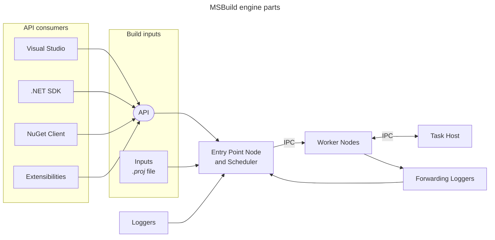
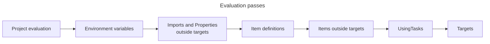
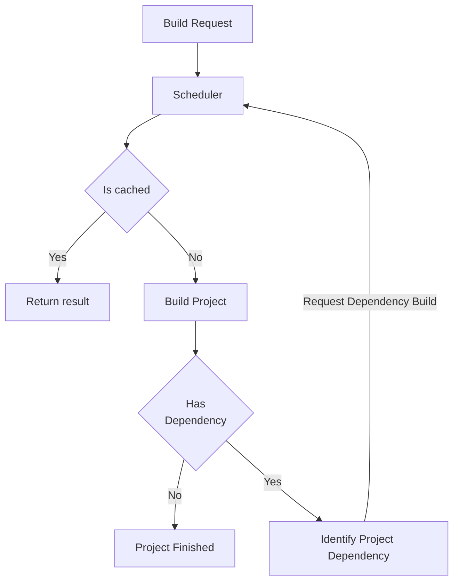

# What is MSBuild
MSBuild is a build platform used mainly for .NET and Visual Studio. When referencing MSBuild technically we can divide what MSBuild is in a few main parts:
- Programming language that uses XML to define build actions and data.
- A standard set of scripts authored in the MSBuild language (so called 'common targets') that are shipped together with the MSBuild binaries and that define what a build process means.
- API and command line interface that interprets and requests results from programs written in the programming language.
- Build engine that executes a build based on the programming language inputs.

MSBuild is extensible via XML and .NET plugins. These are built to increase customization and interaction capability.

This document covers all parts of MSBuild in a general manner from the perspective of an MSBuild codebase maintainer. There will be no in depth technical details, or how-to's. If you'd like to learn how to use MSBuild to improve your builds please visit Microsoft Learn's [MSBuild documentation](https://learn.microsoft.com/visualstudio/msbuild).


# MSBuild XML Language
The MSBuild markup language is a subset of XML with a focus on describing a project. An advanced example of this is our own [MSBuild executable's project](../src/MSBuild/MSBuild.csproj).

An MSBuild project file primarily declares a project's data. It uses various XML elements to do so:
- [Properties](https://learn.microsoft.com/visualstudio/msbuild/msbuild-properties) are name value pairs, they're used to store data that is used within the project.
- [Items](https://learn.microsoft.com/visualstudio/msbuild/msbuild-items) are data enumerations, where single element is a string value with optional enumeration of key-value strings - so called `metadata`. `Items` represent project files, code files, libraries and most things that a project can depend on. Together with `Properties`, `Items` are data inputs to the build system - mostly to tasks or targets.
- [Tasks](https://learn.microsoft.com/visualstudio/msbuild/msbuild-tasks) are how actions are defined in MSBuild, they're a unit of executable code to perform build operations. Many tasks are defined within MSBuild itself, but tasks can also be authored by third parties by implementing the `ITask` interface.
- [Targets](https://learn.microsoft.com/visualstudio/msbuild/msbuild-targets) represents a group of tasks, in which their order matters. It is a set of instructions for the MSBuild engine to execute. Targets can be ordered relative to other targets.

These attributes are defined within project files (`.csproj`, `.vbproj` etc.). Solution files (`.sln`) are not an MSBuild XML format. They are originally exclusive to Visual Studio, but the MSBuild command-line application can parse them to find projects to build.

While the project file defines the data used for the build, the actual build instructions are generally imported from a common location through the `Import` element or [MSBuild SDKs](https://learn.microsoft.com/visualstudio/msbuild/how-to-use-project-sdk) that contain their own tasks and targets. One example that is widely used is the [`Microsoft.NET.Sdk`](https://learn.microsoft.com/dotnet/core/project-sdk/overview) from the .NET SDK.


# Common Targets
MSBuild has some Common Targets that adds baseline functionality to the build. This functionality includes build management, like the creation and management of output folders and intermediary folders, defining a project's “primary output”, implementing the [`ProjectReference` protocol](ProjectReference-Protocol.md), and so on.

Visual Studio also depends on the common targets to enable configuring the build through UI and checkboxes, making sure that the user has access to those options and there is not a need to modify the project file XML directly. Some use cases for Visual Studio also include:
- Population of the Solution Explorer window. For each project, what files need to be added to the view of the complete solution.
- Executing [design-time builds](https://github.com/dotnet/project-system/blob/500720852f21ac8496390827881eabe4d718c5e2/docs/design-time-builds.md) to extract more detailed information for Visual Studio components like language services.


# MSBuild API
The MSBuild API is a .NET library that can build, fetch data from, and edit MSBuild projects. It is used by Visual Studio and the .NET SDK to integrate MSBuild as their project build system. This API is also available for any third parties to use.


# Engine
The MSBuild Engine's main responsibility is to execute the build instructions and process the results of builds. This includes managing the extensibility that MSBuild offers, integrating customizations into the build process even if they're authored by third parties.

The MSBuild engine's logic is divided into two main stages: 
- evalution stage
- execution stage.



## Entry points
There are a few entry points for the MSBuild engine: Visual Studio, .NET SDK (`dotnet build` command) and the CLI executable (`MSBuild.exe` on Windows, and `msbuild` in unix). These partner products are implementations or extensions of the MSBuild API, and we do care about their smooth integration with MSBuild, but do not support them directly.

The inputs necessary to start a build include:
 - Build logic for the projects, typically the entry point project's XML or from the imports within.
 - User defined imports
 - The generated build imports (`.g.props` and `.g.targets`) from NuGet restore.

 ```mermaid
flowchart TD    
    UL["`User defined import logic
    _.props_ and _.targets_`"]
    
    PROJ["`_.proj_ file`"
    eg. Foo.csproj]
    
    IL[Common Targets Logic
    SDK or VS]

    NI["`NuGet imports
    _.g.props_ and _.g.targets_`"]

    UL --> PROJ
    IL --> PROJ
    NI --> PROJ
 ```

An example of the imported build logic is the `<Project Sdk="Microsoft.NET.Sdk">` that can be seen in some of the built-in .NET templates. This indicates that the project will use build logic from the `Microsoft.NET.Sdk` component comes with the .NET SDK.

More on this in the [Restore](#restore) section below.

## Project Evaluation
For more detailed information on evaluation visit [Microsoft Learn](https://learn.microsoft.com/visualstudio/msbuild/build-process-overview#evaluation-phase).

Evaluation of a project is the first step of the process. Its main objective is to collect information on the project being built. This includes checking the entry point project for imports, items, and tasks. Some API consumers, like Visual Studio project systems, extract information about which C# files, solution files and project files are relevant to a project after evaluation.

The first step of evaluation is to load XML project file. There are multiple evaluation passes within the same project; each is responsible for evaluating a different type of data that may be required for subsequent passes. Data within the evaluation can be modified depending on the pass the build is currently executing. For example, during the pass that evaluates imports and properties, properties can be modified, but after that pass is done the properties are read-only until the execution phase.



Evaluation may occur before or after NuGet restore has run. Since NuGet packages can contain build logic, the pre-restore evaluation should be used only to run restore. After restore, all imports are files on disk and are processed as paths by the engine.

The evaluation stage should not have any side effect on disk, no new or deleted files. One exception is the SDK resolution phase. The .NET SDK resolver looks for SDKs already installed or existing on disk. But MSBuild also has support for resolvers that can run arbitrary .NET code such as referencing SDKs through a network share or fetching SDK packages from a remote server.
One such resolver that comes with the .NET SDK and Visual Studio is the NuGet's MSBuild SDK resolver (`Microsoft.Build.NuGetSdkResolver`) which downloads the SDK packages from NuGet repositories to local storage.

### Imports
In MSBuild imports are all treated like a property plus path expansion, however they can take various forms when being defined - a disk path, a property expansion, a known folder, or even environmental variables. There are also some main imports that come with the execution on other platforms, like the Visual Studio or SDK can have import directories that contain wild card imports.

Historically a single version of MSBuild supported multiple `ToolsVersions` that could result in differing imports for the same expression, but today an MSBuild distribution provides only the current version of `ToolsVersion` and selection between versions is expected to be done outside of MSBuild.

## Project Execution
For more detailed information on execution phase visit [Microsoft Learn](https://learn.microsoft.com/visualstudio/msbuild/build-process-overview#execution-phase).

The execution phase starts with a request to build a list of targets defined in the project (in its own XML or an import). Those targets and their prerequisite targets will then execute. The order of executed targets is defined using a few attributes: `BeforeTargets`, `DependsOnTargets`, and `AfterTargets`. However, the order in which targets are executed during a build will not strictly follow the one defined by those attributes as it depends on more things during a build. The full executing order can be [found here](https://learn.microsoft.com/visualstudio/msbuild/target-build-order#determine-the-target-build-order).

Another target order issue arises when there is a project dependency. Project dependencies are expressed using the `MSBuild` task, so a project target can start executing and then hit a project dependency that has not been completed yet. In this case, the project that is processing the targets will be considered blocked, and will pause its execution (the node building it may be used to work on another project). Once the dependencies have been fullfilled, the original build can resume resume and the target execution will continue in the original order.

### Task Host
MSBuild generally runs tasks in its own process, but has an ability to run tasks out of process via the “task host”. That allows tasks to run in a different .NET runtime or processor architecture than the one used by the build engine for the build execution.

A specific task host is automatically selected when a task explicitly declares the need for a specific runtime or architecture that is different from the one used by the executing MSBuild engine. The runtime and architecture can be requested via `Runtime` and `Architecture` attributes in [`UsingTask`](https://learn.microsoft.com/visualstudio/msbuild/usingtask-element-msbuild) element defining the task or in the [`Task`](https://learn.microsoft.com/visualstudio/msbuild/task-element-msbuild) element used for task invocation.

TaskHost can be opted-in via `TaskFactory="TaskHostFactory"` in the [`UsingTask`](https://learn.microsoft.com/visualstudio/msbuild/usingtask-element-msbuild) element defining the task. This opt-in behavior can be used for various cases:
- If a task's source code is in the same repository that is being built, and the repository's build needs to use that task during the build process. Using a Task Host makes sure the DLLs are not locked at the end of the build (as MSBuild uses long living worker nodes that survives single build execution)
- As an isolation mechanism - separating the execution from the engine execution process.

## Caches
### Project result cache
The project Result Cache refers to the cache used by the scheduler that keeps the build results of already executed project. The result of a target is success, failure, and a list of items that succeeded. Beyond that, the `Returns` and `Outputs` attributes from targets are also serialized with the build result, as to be used by other targets for their execution.

There is also another Project Cache Plugin, which focuses on result cache in distributed builds. More information about it is in the [Extensibility](#extensibility) section.

### Register Task Objects
During execution tasks might need to share state meaningfully between invocations in a single build or across builds. The MSBuild engine provides a mechanism to manage the lifetime of .NET objects to fill this gap. This lifetime can be defined by the user but has specific scopes: it can live per build or indefinitely. However, this mechanism is only available for communication within the same execution node, and it is not serializable.

### Incremental Build Cache
The build incrementality is controled by individual `Tasks` and `Targets`. Targets can define their `Inputs` and `Outputs` - and if both specified, MSBuild engine will skip execution of `Targets` that are deemed up to date. Tasks may also internally implement incremental behavior.
For this reason many `Targets` in the MSBuild SDK, that perform intermediate operations, specifies explicit `Inputs` and `Outputs` - while flushing the outputs usually into `IntermediateOutputDirectory` (AKA the 'obj' directory). This helps to follow the incrementality of the build. The `IntermediateOutputDirectory` can hence be regarded as the incremental build cache - though it's not any centraly managed cache with a single de/serialization mechanism. Each Target controls the way how it wants to create and read the intermediate files. The Targets within MSBuild SDK store only up front know data types (no type information is being stored into the cache).

#### RAR Cache
A special case of incremental build cache within a task implementation is the `ResolveAssemblyReference` (RAR) cache.
[`ResolveAssemblyReference`](../../src/Tasks/AssemblyDependency/ResolveAssemblyReference.cs) (RAR) is one of the most important tasks in the MSBuild toolset. It is responsible for computing the closure of all references needed to build the project and resolving the full paths to the assemblies representing those references (so that the compiler task can operate on a fully defined input). For more information on RAR please see [the RAR documentation](../documentation/wiki/ResolveAssemblyReference.md).
To speed subsequent runs over identical or almost-identical inputs, RAR stores assembly information in an intermediate file. The cache content is de/serialized via a custom MSBuild serialization protocol (`ITranslatable`).

## Scheduler
The scheduler is the part of the MSBuild engine responsible for scheduling work, as well as maintaining and managing the result of already executed projects. When a build starts, the scheduler assigns the entry point project to a worker node (generally the in-proc node). The project's execution starts and proceeds until the whole project ends or is blocked. A project is considered blocked when the project that it is currently building depends on another project that has not yet finished executing. When a node becomes free because it has completed its project or its project is blocked, the scheduler then assesses if it has more work to be given to that node and assigns it.

When a build request completes, the result is sent to the scheduler. The scheduler maintains results of all of the build's executed requests, so when a project or target depends on another to proceed execution, the scheduler can just retrieve that information from the Project Result Cache. This means that a project can be built only once even if referenced by many projects.

If the node's operation is blocked by a dependency, it asks the scheduler for the results of the dependency's execution. If the dependency has been executed, the result is retrieved from the Project Result Cache. If the process has not been executed, the scheduler suspends the current project, making the target / project a pending request. When a request is pending, the scheduler adds to the list of requests to execute, and will eventually assign the dependency to be executed on either the current node or another one that is free.



### Incremental build
Incremental builds are extremely useful for local development, as it speeds consecutive builds on local machines. For this, the output from build targets is persisted to disk, which becomes one big cache for MSBuild.

## Parallelism
Parallelism for MSBuild is implemented at the project level. Each project is assigned to a specific worker node, and the worker nodes will execute the project build in parallel, with the Scheduler organizing sequence and work division. Within project builds, targets run sequentially and within targets, tasks run sequentially; however a task can maintain its own internal parallelism.

For multi-targeted builds parallelism between TargetFrameworks is enabled by creating distinct projects for each "inner build" from an "outer build". The outer build produces a list of projects to build. This list contains the same project file with a different global property for the target framework. This list is then passed to the MSBuild execute target so the TargetFrameworks can be built in parallel.

### Processes and nodes
When a new build is started, MSBuild starts a process that runs some setup code and prepares itself to start a build. The process of defining the scheduler differs slightly depending on the environment the build is being executed. 

In the case of a CLI build the process that starts the build becomes the scheduler node and one of the worker nodes, becoming both the entry point for the project build and the scheduler. The main problem that arises from that is when the whole build finishes execution, the OS tears down the process, losing the memory cache and having to restart the whole build process from the start. 

This has been partially addressed by the long lived worker nodes feature (AKA 'node reuse'), where the worker nodes stay idle in the background for some time and can be reused by multiple build requests. The main node (with scheduler, loggers, etc.) is still torn down. In the case of a Visual Studio build that uses the MSBuild API to manage the builds, this problem has been solved by having the scheduler process be within the main Visual Studio process (`devenv.exe`) and keeping it very long lived. In case of CLI an experimental feature - [`MSBuild Server`](#msbuild-server) tries to address this gap by keeping the main node alive between build requests as well.


## IPC (Inter-Process Communication)
In multi-process MSBuild execution, many OS processes exist that need to communicate with each other. There are two main reasons:
 - Dealing with Build Result data: Communicating with the engine, scheduler, cache, etc...
 - Communication on task execution for a task host: Task definition, task inputs, task outputs.

The transport layer for messages is a [.NET named pipe](https://learn.microsoft.com/dotnet/standard/io/how-to-use-named-pipes-for-network-interprocess-communication).

The message layer has a custom serialization protocol that is specific to MSBuild. As of .NET 8, all message types used are known internal MSBuild types. Earlier MSBuild versions allowed `BinaryFormatter` serialization of plugin-controlled types.

## Graph build
A graph build changes the sequence in which MSBuild processes projects. Normally a project starts execution, and when it has a dependency on another project, then that project starts to build. A graph build evaluates all projects and their relationship before starting execution of any project. This is achieved by looking at specific items (like `ProjectReference`) after evaluation to construct the dependency graph.

There are a couple of different modes to run graph mode in (see [the spec](../documentation/specs/static-graph.md#what-is-static-graph) for more details):
- Standard mode (`-graph`): Tried to work from the leaves of the dependency graph and makes sure all results are within the cache. If there is a cache miss / unexpected reference, it just schedules the missing reference for execution.
- Strict / isolate mode (`-graph -isolate`): If there is a cache miss when building, the whole build is failed.
- Single project isolated mode: This is not directly invokable by users, instead it is used from higher order build systems to achive distributed / cached builds (in which the individual projects need to run in isolation from their dependencies - as those can be pulled from distributed cache or scheduled to run on different computation nodes).

## MSBuid Server
In normal MSBuild command-line build execution the main process exists after the build ends. The MSBuild Server project aims to change that, making the entry point process and the scheduler process node separate entities. This allows processes to preserve in-memory cache and make consecutive builds faster, like they are in Visual Studio and other API consumers.
For more information please see [the spec](../documentation/MSBuild-Server.md).

# Extensibility
MSBuild includes some features that are related to the build process but do not fit in the previous categories. These extensibility features are critical for the build process, but they can also be customized by third parties for their own use.

## Packaging
MSBuild interacts with external packages in almost every build. However, the MSBuild engine does not recognize external packages as third parties, and it also does not handle external dependencies. This is done by a packaging system. The supported one being NuGet. As such, it is NuGet that is responsible for finding the packages, downloading them, and providing the MSBuild engine with a package path for the build.

## Restore
The restore operation is defined as a no-op in common targets, but provided by NuGet in Visual Studio and .NET SDK. It is executed as any other target within MSBuild. The restore operation walks through the project references and package references to determine information about all the packages that need to be restored. This process might result in new or updated files on disk, as well as new imports to the build process.

## Tasks
An [msbuild task](https://learn.microsoft.com/en-us/visualstudio/msbuild/msbuild-tasks) is a unit of executable code used by MSBuild to perform build operations. There are many built-in tasks living in the [`Microsoft.Build.Tasks`](../src/Tasks/README.md) assembly. [Tasks can also be authored by third parties](https://learn.microsoft.com/visualstudio/msbuild/task-writing) by implementing the `ITask` interface.

Since a task can be delivered as a .NET assembly, it is possible to run arbitrary code during task execution.

### ToolTask
`ToolTask` is a widely-used helper class for the use case "build a command line for and then run a command-line tool".

## Diagnosability / Loggers
Current diagnosability within MSBuild follows a log focused approach, where MSBuild has a more robust logging system that contains more data to identify what is happening during a build.

### General Loggers
Logging within MSBuild consists of various integrated and third-party loggers. Both use the [`ILogger`](https://learn.microsoft.com/dotnet/api/microsoft.build.framework.ilogger) API. Built-in loggers include the Binary Logger which produces compressed `.binlog` files, the Console and Terminal loggers for interactive output, and a Text Log. Third party loggers  receive events through `ILogger`, and multiple loggers can be connected to a single build.

Loggers must be specified before the build begins. Because of this, build logic (and NuGet) is not able to manipulate loggers.

### Binary logger
The Binary Logger, also called binlog, is a structured log that captures all the events within a build as well as files that are critical to the build. To read a binlog, the MSBuild CLI can replay the events through arbitrary loggers, and third-party tooling like the [Structured Log Viewer](https://msbuildlog.com) can also read binlogs.


## Project result cache plugin
This system allows plugins to extend the per-build result cache to apply across builds and across machines. It functions as a middle layer between the scheduler and the Project Result Cache. So, when the scheduler requests a result for a target or project, the plugin responds first to check all the different distributed nodes for the result. When the plugin cache gets a hit on an input, it downloads and copies the file results to the right place, deserializes the resulting payload and provides it to the local engine to continue execution.

For more in depth information visit [the spec](specs/project-cache.md).

## BuildCheck
BuildCheck is new MSBuild extensible and configurable linting/diagnostic feature, that enables users to enable/configure and author checks flagging discouraged and anti-pattern practices.
For more information please see [the spec](../documentation/specs/BuildCheck/BuildCheck.md).

## Resolvers
There are a few elements within the MSBuild XML that indicate that a call to the .NET SDK is necessary. When such interaction is necessary for a project build, the first thing that needs to be done is to figure out where the SDK is installed so MSBuild can access the content. This is solved by resolvers, which look for the SDK version that was specified, or gets the latest version by looking for them on the folder adjacent to where MSBuild is executing from.

To read more about SDK resolver you can check the [Microsoft Learn page](https://learn.microsoft.com/visualstudio/msbuild/how-to-use-project-sdk#how-project-sdks-are-resolved), or see the [spec documentation](specs/sdk-resolvers-algorithm.md).

## Telemetry
MSBuild has a few telemetry points, mostly through the .NET SDK. It is implemented as a logger that keeps track of telemetry events in the SDK, this allows to have a single opt-out mechanism that also works for MSBuild.

Visual Studio telemetry was removed once MSBuild went open source, and it was never added again.

## FileTracker
In order to automatically detect task inputs and outputs, MSBuild can intercept Windows I/O API calls to track the dependencies. A [FileTracker](https://github.com/dotnet/msbuild/blob/main/src/Utilities/TrackedDependencies/FileTracker.cs) utility is used to accomplish this. It uses [Detours](https://github.com/microsoft/detours) to inject logging code when a tracked application performs filesystem operations.
