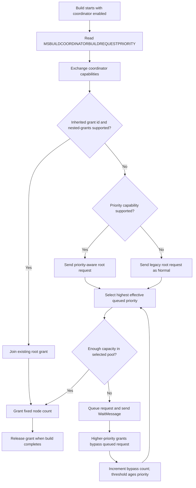

# MSBuild Build Coordinator: Architecture and Flow

> **Important Note:** This document describes the architecture and design of the MSBuild Build Coordinator at a high level. 
> For current implementation details, class structures, method signatures, or specific code patterns, always consult the source code directly.
> This ensures you're working with accurate, up-to-date information.

## Overview

The **MSBuild Build Coordinator** is a resource management system that orchestrates and enforces fair-share allocation of build nodes across multiple simultaneous MSBuild processes. It prevents system resource exhaustion by maintaining a global node budget and granting available nodes as builds start and finish.

The coordinator runs as a **separate process** (`MSBuild.Coordinator`), not inside `MSBuild.exe`. MSBuild clients connect to it over named pipes, request grants, and continue building with the granted node count.

### Purpose

When multiple MSBuild processes run concurrently (common in user multi-tasking), each process could independently attempt to spawn the maximum number of nodes, leading to:
- System resource exhaustion
- Excessive memory consumption
- CPU contention and slowdown
- Reduced overall build throughput

The coordinator solves this by:
1. **Enforcing a global node budget** (defaults to processor count)
2. **Capping individual grants** so one build does not assume it owns the whole machine
3. **Prioritizing queued builds** when hosts identify latency-sensitive work
4. **Reserving high-priority capacity** so interactive builds can start predictably
5. **Allowing nested build processes to share root grants** without consuming additional global budget
6. **Monitoring build health** via periodic heartbeats
7. **Auto-shutting down** after a timeout period

*Note*: The current default budget is intentionally conservative for V1. As we gather real-world usage data, we should experiment with alternative defaults, including moderate oversubscription above 1x processor count, and tune this value for better throughput without destabilizing interactive machine workloads.

---

## Architecture Overview

```
┌──────────────────────────────────────────────────────────────────┐
│                    System with Multiple Builds                   │
└──────────────────────────────────────────────────────────────────┘

  Build 1                 Build 2                 Build 3
    │                       │                       │
    │ RequestNodes(4)       │ RequestNodes(4)       │ RequestNodes(4)
    │                       │                       │
    │ ◄── NodeGrant(4)      │ ◄── NodeGrant(4)      │ ◄── Wait(queued)
    │                       │                       │
    └───────────────────────┼───────────────────────┘
              (via Named Pipes - IPC)
                      ↓
        ┌────────────────────────────────────┐
        │   MSBuild Build Coordinator        │
        │                                    │
        │  ┌──────────────────────────────┐  │
        │  │  Node Budget Manager         │  │
        │  │  • Total Budget: 8 nodes     │  │
        │  │  • Allocated: 8              │  │
        │  │  • Available: 0              │  │
        │  └──────────────────────────────┘  │
        │                                    │
        │  ┌──────────────────────────────┐  │
        │  │  Active Builds               │  │
        │  │  • Build 1: 4 nodes          │  │
        │  │  • Build 2: 4 nodes          │  │
        │  └──────────────────────────────┘  │
        │                                    │
        │  ┌──────────────────────────────┐  │
        │  │  Waiting Builds Queue        │  │
        │  │  • Build 3: waiting          │  │
        │  └──────────────────────────────┘  │
        └────────────────────────────────────┘

  Later, when one 4-node build releases:
    Build 3 ◄── NodeGrant(4)
```

---

## Component Architecture

### Key Components

**Coordinator Server** ([src/MSBuild.Coordinator/](../src/MSBuild.Coordinator/))
- `CoordinatorServer.cs` - Main coordinator server that listens for client connections via named pipe
- `NodeBudgetManager.cs` - Implements node allocation and fair-share logic
- `CoordinatorServer.Connection.cs` - Handles initial server-side handshake and request negotiation
- `CoordinatorServer.ConnectedClient.cs` - Manages accepted client connections
- `BuildGrant.cs` - Represents a node allocation to a build
- `Program.cs` - Server launcher and singleton instance management

**Client-Side** ([src/Build/BackEnd/BuildManager/](../src/Build/BackEnd/BuildManager/))
- `CoordinatorClient.cs` - Client connection handler integrated into BuildManager
- `BuildManager.cs` - Requests nodes from coordinator and sets build parallelism from the fixed coordinator grant

**Protocol** ([src/Framework/Coordinator/](../src/Framework/Coordinator/))
- Handshake messages: `ClientHandshakeMessage`, `ServerHandshakeMessage`
- Client messages: `RequestNodesMessage`, `RequestNodesWithPriorityMessage`, `JoinGrantMessage`, `HeartbeatMessage`, `ReleaseNodesMessage`
- Server messages: `NodeGrantMessage`, `NodeGrantWithIdMessage`, `WaitMessage`, `ErrorMessage`
- `Capabilities.cs` - Capability constants for feature negotiation
- `CoordinatorSettings.cs` - Configuration management

---

## Communication Protocol

### Handshake

Every connection begins with a capabilities handshake:

1. Client sends `ClientHandshakeMessage` (ConnectionId, ProcessId, capabilities)
2. Server responds with `ServerHandshakeMessage` (capabilities)

Both sides advertise the features they support; unknown capabilities are ignored, allowing older clients to work with newer servers.

### Versioning

The coordinator does not use a protocol version number. Instead, it uses a **capabilities-based** versioning model:

- Each side sends a list of capability strings during the handshake.
- A capability represents a discrete feature or behavior that both sides must agree on to use.
- Unknown capabilities received from the other side are silently ignored.
- Required behavior is gated on whether the peer advertised the corresponding capability.

This design avoids the "version bump" problem where a single version number forces all-or-nothing upgrades. New features can be added incrementally — a newer coordinator can offer capabilities that older clients simply don't use, and vice versa. Both sides degrade gracefully when a capability is absent.

### Message Types

After the handshake, the coordinator uses a binary protocol with these message types:

**Client → Server:**
- `RequestNodesMessage` - Requests a node grant (contains requested node count)
- `RequestNodesWithPriorityMessage` - Requests a node grant with queue scheduling priority (`Low`, `Normal`, or `High`)
- `JoinGrantMessage` - Requests to join an existing root grant (requires `nested-grants` capability)
- `HeartbeatMessage` - Periodic keep-alive message (default: every 5 seconds)
- `ReleaseNodesMessage` - Sent when build completes, releases allocated nodes

**Server → Client:**
- `NodeGrantMessage` - Grants nodes to a build
- `NodeGrantWithIdMessage` - Grants nodes and includes a root grant token (requires `nested-grants` capability)
- `WaitMessage` - Indicates build is queued, no nodes immediately available
- `ErrorMessage` - Indicates an error condition

**Source:** [src/Framework/Coordinator/](../src/Framework/Coordinator/)

### Message Flow Example

```
Successful Grant:
  Build → ClientHandshakeMessage(ConnectionId, PID, capabilities)
  Build ← ServerHandshakeMessage(capabilities)
  Build → RequestNodesMessage(4) or RequestNodesWithPriorityMessage(4, Normal)
  Build ← NodeGrantMessage(4)
  Build → Heartbeat (every 5s)
  Build → ReleaseNodesMessage (on completion)

Build Queued:
  Build → ClientHandshakeMessage(ConnectionId, PID, capabilities)
  Build ← ServerHandshakeMessage(capabilities)
  Build → RequestNodesMessage(4) or RequestNodesWithPriorityMessage(4, Normal)
  Build ← WaitMessage
  Build → Heartbeat (every 5s while waiting)
  Eventually: Build ← NodeGrantMessage(N)
    [In uncapped mode, N is fair-share computed from available nodes and contenders,
     capped by requested nodes (N <= 4 here). In capped mode, N is the fixed slice up
     to the request and cap.]

Nested Build:
  Root Build → ClientHandshakeMessage(..., capabilities: nested-grants)
  Root Build ← ServerHandshakeMessage(..., capabilities: nested-grants)
  Root Build → RequestNodesMessage(4) or RequestNodesWithPriorityMessage(4, High)
  Root Build ← NodeGrantWithIdMessage(grantId, 4)
  Nested Build inherits grantId from the root build process environment
  Nested Build → ClientHandshakeMessage(..., capabilities: nested-grants)
  Nested Build ← ServerHandshakeMessage(..., capabilities: nested-grants)
  Nested Build → JoinGrantMessage(grantId, 4)
  Nested Build ← NodeGrantWithIdMessage(grantId, 4)
```

### Priority Scheduling Flow



---

## Nested Grants

Some build operations launch child MSBuild processes while the parent build still owns its coordinator grant. A common example is NuGet static graph restore, which can invoke a nested MSBuild process as part of an already-running coordinated build.

Without nested grants, the child process could request a new root grant while the parent is still holding the full budget. If no budget is available, the child waits for resources that the parent cannot release until the child completes, causing a deadlock.

Nested grants avoid this by treating child processes as participants in the parent grant:

1. The root build receives a grant token in `NodeGrantWithIdMessage`.
2. `BuildManager` records that token in the build process environment as `MSBUILDCOORDINATORGRANTID`, so task-launched child processes inherit it.
3. A child process that sees the token and a server that supports `nested-grants` sends `JoinGrantMessage`.
4. The coordinator validates that the root grant is still active.
5. If valid, the child receives a grant capped by the root grant's node count without consuming additional global budget.
6. Releasing a nested grant does not release global budget or invalidate the root grant token.

Nested grants do not implement a scheduler within the root grant. Each nested process is capped by the root grant's node count, but the coordinator does not track combined concurrency across the root process and all nested participants. The root build is expected to coordinate its own nested work so it does not oversubscribe the resources it was granted.

Nested grant validation happens when the nested process joins the root grant. If the root grant is released later, the coordinator rejects new joins for that grant ID, but it does not revoke nested grants that were already issued. Those nested builds continue until they release or disconnect.

Nested grants are capability-gated. Older clients that do not advertise `nested-grants` continue to receive the legacy `NodeGrantMessage` shape, and clients only send `JoinGrantMessage` when the server advertises the capability.

---

## Allocation Algorithm

### Core Concept

When multiple builds compete for limited nodes, the coordinator either computes a fair share per grant or uses fixed-size node slices, depending on configuration.

New requests that arrive while same- or higher-priority builds are already queued are placed in the wait queue in both capped and uncapped modes.

When `MSBUILDCOORDINATORMAXNODESPERBUILD` is `0`, there is no per-build cap. During wait-queue draining, this preserves the previous fair-share behavior:

```
fair_share = max(1, available_nodes / same_effective_priority_waiting_builds)
granted_nodes = min(fair_share, requested_nodes)
```

`same_effective_priority_waiting_builds` includes the build currently being evaluated for a grant. Effective priority includes deterministic aging, so a lower-priority request can eventually participate in a higher-priority fair-share group after higher-priority work has bypassed it enough times. By default, a queued request ages upward by one effective priority level after 3 bypasses. Set `MSBUILDCOORDINATORPRIORITYAGINGTHRESHOLD` to a positive integer to tune that threshold.

When `MSBUILDCOORDINATORMAXNODESPERBUILD` is positive, each build can receive at most that many nodes. Requests for at least the effective cap are only granted when a full slice is available:

```
effective_cap = max_nodes_per_build for High, or min(max_nodes_per_build, low_normal_pool) for Low/Normal
desired_nodes = min(requested_nodes, effective_cap)
granted_nodes = desired_nodes if available_nodes >= desired_nodes, otherwise wait
```

For `Low` and `Normal` priority builds, the coordinator rounds usable non-high-priority capacity down to a full-slice boundary when a cap is configured. For example, with a 10-node budget, 4 high-priority reserved nodes, and a 4-node cap, only one 4-node normal build is started by default; the leftover 2 nodes are not used to start a large 2-node normal build. This avoids creating under-provisioned long-running builds. If an explicit cap is larger than the non-high-priority pool, that pool size becomes the effective slice for `Low` and `Normal` builds so they can still make progress.

Capped-mode queue draining preserves FIFO ordering within the same effective priority for builds competing for the same capacity pool. If an older request needs a full 4-node slice and only 1-3 nodes are free, a later same-priority request for fewer nodes does not bypass it. Those partial fragments may remain idle until the older request can receive its slice. A genuine `High` request can still use high-priority reserved capacity when an aged non-`High` waiter cannot use the non-high-priority pool, because those requests draw from different pools.

Wait-queue drain ordering:

```
effective_priority = highest_priority_after_aging(waiting_builds)
grant next build at the selected priority if enough capacity is available
```

This ensures:
- Each grant is capped by what the build requested and by the configured per-build cap
- Uncapped mode divides available nodes across wait-queue contenders in the current drain phase
- Capped mode grants full slices and may leave partial fragments idle to preserve FIFO ordering
- Wait-queue entries are processed FIFO within the same effective priority and capacity pool
- Higher-priority queued builds are drained before lower-priority queued builds
- Lower-priority builds age as higher-priority builds bypass them, preventing starvation

All requests default to `Normal` priority. Older clients use `RequestNodesMessage`, which the coordinator treats as `Normal`. If every queued build is `Normal`, the priority-aware scheduler preserves FIFO ordering. Set both strict policy variables to `0` to restore uncapped, no-reservation sizing; deferred grants then use the fair-share behavior described above. When auto strict policy is active, grants may be capped or reserved as described above.

Priority is intentionally generalized. Hosts should map their own intent to `Low`, `Normal`, or `High`; for example, a UI-blocking design-time build can request `High`, while background refresh work can request `Low`. Hosts can set `MSBUILDCOORDINATORBUILDREQUESTPRIORITY=Low`, `Normal`, or `High` in the build process environment. The coordinator does not inspect project properties such as `DesignTimeBuild`.

### Strict Node Slices and High-Priority Reserved Nodes

The coordinator can reserve a fixed amount of capacity for `High` priority requests. The reservation is configured by `MSBUILDCOORDINATORHIGHPRIORITYRESERVEDNODES`. The per-build slice is configured by `MSBUILDCOORDINATORMAXNODESPERBUILD`.

By default these settings are auto-computed from the coordinator node budget:

| Total node budget | High-priority reservation | Max nodes per build |
| ---: | ---: | ---: |
| 1-7 | 0 | 0 (uncapped) |
| 8+ | 4 | 4 |

Set either variable to `0` to disable that part of the strict policy. Set a positive integer to force a specific value; values larger than the node budget are clamped to the effective range. Missing, negative, or non-integer values use the auto-computed value.

When a reservation is configured, `Low` and `Normal` requests are granted from `TotalNodeBudget - HighPriorityReservedNodes`, clamped so that at least one node remains available to non-high-priority builds. When a per-build cap is configured, that non-high-priority pool is also rounded down to full per-build slices. `High` requests may use the full node budget, but still respect `MSBUILDCOORDINATORMAXNODESPERBUILD` when a per-build cap is configured. This keeps headroom available for latency-sensitive work without adding runtime node expansion, shrink, oversubscription, or preemption of already-running builds.

The reservation is intentionally generalized. A design-time-build host can map UI-blocking work to `High`, but the coordinator only sees priority; it does not contain DTB-specific logic.

Overflow capacity does not need a separate policy knob. Users who intentionally want to experiment with oversubscription can set `MSBUILDCOORDINATORNODEBUDGET` higher than the processor count while keeping the same reservation and per-build cap policy.

### Example Scenarios

**First Normal Build Requests Full Budget** (8 total nodes, auto strict policy)
- No builds are active and no builds are waiting
- Build A requests 8 nodes
- Auto policy reserves 4 nodes for high-priority work and caps one build at 4 nodes
- Build A is `Normal`, so it is granted 4 nodes

**Normal Build Plus High-Priority Build** (8 total nodes, auto strict policy)
- Build A is `Normal` and requests 8 nodes
- Build A is granted 4 nodes
- Build B is `High` and requests 8 nodes
- Build B can use the reserved capacity and is granted 4 nodes

**Three Full-Budget Requests Launched Together** (16 total nodes, strict policy disabled)
- Builds A, B, and C are launched at roughly the same time, each requesting 16 nodes
  - *Note*: This is the default request when `/m` is specified without a value on a 16-logical-processor machine, or when a host explicitly sets `MaxNodeCount` to 16
- Strict policy is disabled by setting both `MSBUILDCOORDINATORHIGHPRIORITYRESERVEDNODES=0` and `MSBUILDCOORDINATORMAXNODESPERBUILD=0`
- Build A gets all 16 nodes
- Builds B and C receive `WaitMessage`
- When Build A releases, the wait queue drains with available 16 and 2 waiters
- Build B: fair_share = max(1, 16 / 2) = 8 -> granted min(8, 16) = 8
- Build C: fair_share = max(1, 8 / 1) = 8 -> granted min(8, 16) = 8

**Three Full-Budget Requests Launched Together** (16 total nodes, auto strict policy)
- Builds A, B, and C are launched at roughly the same time, each requesting 16 nodes
- Auto policy reserves 4 nodes for high-priority work and caps one build at 4 nodes
- Each normal build gets one 4-node slice, for 12 active normal nodes total

**Queued Full-Budget Request** (16 total nodes, auto strict policy)
- Three normal builds are active with 4 nodes each
- A fourth normal build requests 16 nodes
- Only reserved high-priority capacity remains, so the fourth normal build receives `WaitMessage`
- A high-priority build requesting 16 nodes can still receive a 4-node grant

**Uncapped Fair-Share Scenario** (8 total nodes, strict policy disabled)
- Build A and Build X are active with 4 nodes each (budget fully allocated)
- Build B requests 6 and Build C requests 8 while available is 0, so both are queued
- When Build A releases, drain begins with available 4 and 2 waiters
- Build B: fair_share = max(1, 4 / 2) = 2 → granted min(2, 6) = 2
- Build C: fair_share = max(1, 2 / 1) = 2 → granted min(2, 8) = 2

---

## Integration with BuildManager

### How Coordination Works

**During build initialization:**

1. BuildManager checks if `MSBUILDUSECOORDINATOR` environment variable is set
2. If enabled, `CoordinatorClient` attempts to connect to the coordinator
3. Sends a node request with desired node count (the value of `/maxcpucount` passed to MSBuild — defaults to 1 if omitted, or the logical processor count if `/m` is passed without a value). The request priority comes from `MSBUILDCOORDINATORBUILDREQUESTPRIORITY` when set. New clients send `RequestNodesWithPriorityMessage` when the server advertises priority support; otherwise they send `RequestNodesMessage`.
4. Receives either `NodeGrantMessage` (nodes granted) or `WaitMessage` (queued)
   - *Note*: If `WaitMessage` is received, `CoordinatorClient` starts sending periodic heartbeats while waiting for the deferred `NodeGrantMessage`, so the coordinator doesn't consider it stale during the queue wait.
5. Initializes the build's maximum node count from the grant
6. If the grant includes a grant ID, records it in the build process environment so nested child processes can join the root grant

> *Compatibility behavior*: The number of nodes granted to a build is fixed at initialization and does not change during the build's lifetime. The grant persists as long as the build is running (indicated by heartbeats) and is released only when the build completes.

**During build execution:**

7. BuildManager spawns build nodes up to the maximum node count, which may have been limited by the number of nodes granted by the coordinator
8. `CoordinatorClient` continues sending periodic heartbeats to indicate the build is still active

**On build completion:**

9. Sends `ReleaseNodesMessage` to free nodes for other waiting builds

**Key Principle:** The coordinator is entirely optional. If it's unavailable or disabled, the build uses its requested node count without coordination.

**Sources:**
- [src/Build/BackEnd/BuildManager/BuildManager.cs](../src/Build/BackEnd/BuildManager/BuildManager.cs)
- [src/Build/BackEnd/BuildManager/CoordinatorClient.cs](../src/Build/BackEnd/BuildManager/CoordinatorClient.cs)
- [src/Framework/Traits.cs](../src/Framework/Traits.cs) - Enablement logic

---

## Configuration and Environment Variables

### Environment Variables

| Variable | Default | Purpose |
|----------|---------|---------|
| `MSBUILDUSECOORDINATOR` | (empty) | Enable coordinator (set to any value to enable) |
| `MSBUILDCOORDINATORPIPENAME` | `msbuild-coordinator-{UserName}` | Override default pipe name |
| `MSBUILDCOORDINATORNODEBUDGET` | Processor count | Override total node budget |
| `MSBUILDCOORDINATORHEARTBEAT` | 5000 | Override heartbeat interval (ms) |
| `MSBUILDCOORDINATORSHUTDOWNTIMEOUT` | 60000 | Override shutdown timeout (ms) |
| `MSBUILDCOORDINATORGRANTID` | (empty) | Internal token used by child processes to join an active root grant |
| `MSBUILDCOORDINATORBUILDREQUESTPRIORITY` | `Normal` | Request coordinator queue priority for this build. Valid values are `Low`, `Normal`, and `High`; missing or invalid values use `Normal`. |
| `MSBUILDCOORDINATORHIGHPRIORITYRESERVEDNODES` | Auto: 0 for budgets below 8; otherwise 4 | Reserve nodes from low/normal-priority grants for high-priority requests. Set to 0 to disable. Missing, negative, or non-integer values use Auto. |
| `MSBUILDCOORDINATORMAXNODESPERBUILD` | Auto: uncapped for budgets below 8; otherwise 4 | Cap the number of nodes granted to one build. Set to 0 to disable. Missing, negative, or non-integer values use Auto. |
| `MSBUILDCOORDINATORPRIORITYAGINGTHRESHOLD` | 3 | Number of bypasses required before a queued request ages upward by one effective priority level. Missing, non-positive, or non-integer values use 3. |

*Note*: `MSBUILDCOORDINATORNODEBUDGET` remains the primary knob for total machine budget. Set it higher than the processor count to intentionally experiment with oversubscription. For example, on a 16-core machine, `MSBUILDCOORDINATORNODEBUDGET=20` with auto strict policy allows four 4-node normal slices plus 4 nodes reserved for high-priority work. When auto strict policy resolves to an active reservation or cap, coordinator startup/debug output includes the resolved policy and the relevant opt-out environment variables.

---

## Lifecycle and Operation

### Coordinator Startup

1. When first MSBuild process needs coordination, it performs a fast pipe probe (~200ms)
2. If no coordinator is running, it acquires a launch mutex to serialize launch attempts
3. Checks the coordinator's server mutex to determine if another client already launched one
4. If not, launches the coordinator process and polls for its server mutex to appear
5. Releases the launch mutex so concurrent clients can wait for the pipe in parallel
6. Connects to the coordinator's named pipe once it's ready
7. Coordinator uses a system-wide mutex to ensure only one instance runs

**Source:** [src/MSBuild.Coordinator/Program.cs](../src/MSBuild.Coordinator/Program.cs)

### Heartbeat Monitoring

The coordinator detects stalled or crashed clients through periodic heartbeats:

- Clients send heartbeat messages at configured intervals (default: 5 seconds)
- Coordinator tracks missed heartbeats
- After threshold is reached (default: 3 misses = 15 seconds), client is considered stalled
- Coordinator automatically releases nodes allocated to stalled client
- Waiting builds can then be granted those nodes

**Source:** [src/MSBuild.Coordinator/CoordinatorServer.cs](../src/MSBuild.Coordinator/CoordinatorServer.cs)

### Graceful Shutdown

When a build completes normally:

1. Client sends `ReleaseNodesMessage` for its connection
2. Coordinator frees those nodes
3. Processes waiting queue to allocate freed nodes to waiting builds
4. If no active or waiting clients remain, coordinator enters timeout mode
5. After 60 seconds of inactivity, coordinator exits

**Source:** [src/MSBuild.Coordinator/CoordinatorServer.cs](../src/MSBuild.Coordinator/CoordinatorServer.cs)

---

## Error Handling

### Resilient Design

The coordinator system is designed to be fully optional:

- **Unavailable coordinator** → Build proceeds without coordination using full node count
- **Connection failure** → Build proceeds independently
- **Unsupported capabilities** → Unknown capabilities are ignored; both sides degrade gracefully
- **Crashed client** → Detected via heartbeat timeout, resources cleaned up
- **Coordinator crash** → Next build can launch new instance

This means coordinator failures never block or degrade build execution—they only disable coordination.

**Sources:**
- [src/Build/BackEnd/BuildManager/CoordinatorClient.cs](../src/Build/BackEnd/BuildManager/CoordinatorClient.cs)
- [src/MSBuild.Coordinator/CoordinatorServer.cs](../src/MSBuild.Coordinator/CoordinatorServer.cs)

---

## Testing

### Unit Tests

Comprehensive test coverage in [src/MSBuild.Coordinator.UnitTests/](../src/MSBuild.Coordinator.UnitTests/):

- Protocol serialization/deserialization
- Node budget manager allocation logic
- Fair-share algorithm correctness
- Priority-aware queue ordering and all-`Normal` compatibility
- High-priority reserved capacity and per-build grant caps
- Heartbeat monitoring
- Multi-build coordination scenarios
- Error conditions and edge cases

---

## Source Code References

For detailed implementation information, refer to:

- **Server Implementation:** [src/MSBuild.Coordinator/](../src/MSBuild.Coordinator/)
- **Protocol Definitions:** [src/Framework/Coordinator/](../src/Framework/Coordinator/)
- **Client Integration:** [src/Build/BackEnd/BuildManager/](../src/Build/BackEnd/BuildManager/)
- **Configuration:** [src/Framework/Traits.cs](../src/Framework/Traits.cs), [src/Framework/Coordinator/CoordinatorSettings.cs](../src/Framework/Coordinator/CoordinatorSettings.cs)
- **Tests:** [src/MSBuild.Coordinator.UnitTests/](../src/MSBuild.Coordinator.UnitTests/)
