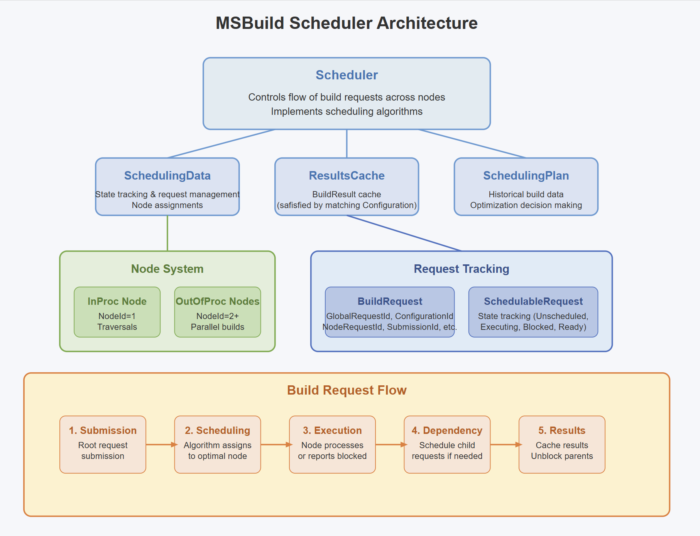
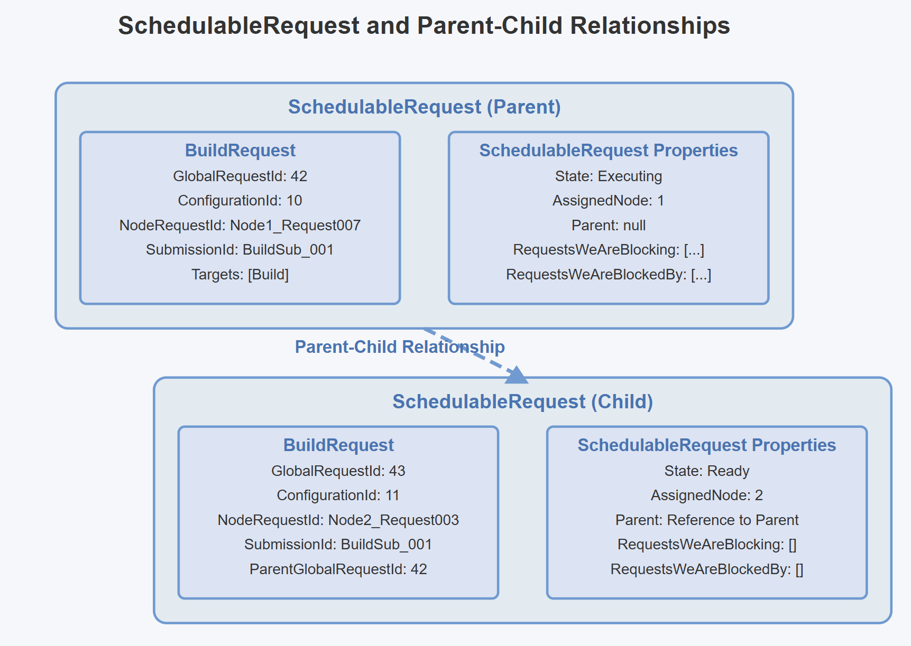

# MSBuild Scheduler Architecture

The diagram below illustrates the key components and workflows of the MSBuild Scheduler system.

## Request Lifecycle

### 1. Submission
- BuildManager generates root request to the Scheduler
- Configuration is registered and SchedulableRequest is created

### 2. Scheduling
- Scheduler applies algorithm to select node for request
- Request is assigned to node and moves to Executing state

### 3. Execution
- Node processes request and may encounter dependencies
- If blocked, node reports to Scheduler with blocker information
- Scheduler creates new requests for dependencies and schedules them

### 4. Completion
- Node reports build results back to Scheduler
- Results are cached and request is marked complete
- Parent requests are unblocked with results

### 5. Result Processing
- Results propagate through dependency chain
- When all requests complete, submission is reported complete

## Core Components

### SchedulableRequest
The SchedulableRequest is a crucial internal wrapper class in the MSBuild scheduler that manages the lifecycle of build requests.
It tracks:

- The current state of the request (Unscheduled, Executing, Blocked, Ready, Yielding, Completed)
- Which node it's assigned to
- The relationships to other requests (parent/child or blocking/blocked-by)
- Timing and execution details

Think of `BuildRequest` as the "what" and `SchedulableRequest` as the "how" to build a project.

#### When does SchedulableRequest have a parent?
In MSBuild, builds often have dependencies. When a project needs to build another project first, it creates a child request.
The original one becomes the "parent request" of this new child request.
For example:

`ProjectA` is building (parent request) => `ProjectA` references `ProjectB`, so it creates a request to build `ProjectB` (child request) => `ProjectA's` request is considered the "parent request" of `ProjectB's` request

This parent-child relationship is tracked through:
- `ParentGlobalRequestId` in the `BuildRequest`
- The `Parent` property in the `SchedulableRequest`

The parent request is blocked while its child request is executing. This is a fundamental aspect of MSBuild's dependency handling system.
When a parent request determines it needs results from a child request, the following happens:

1) The parent request enters the "Blocked" state
2) The scheduler creates the child request
3) The parent remains blocked until the child completes
4) Once the child request finishes, its results are returned to the parent
5) The parent moves from "Blocked" to "Ready" state
6) The scheduler can then resume executing the parent request

If parent is absent, a schedulable request has `parentRequest = null`.

### Scheduler
Central controller that manages build requests:
- Assigns `SchedulableRequests` to nodes
- Handles blocking and unblocking requests
- Checks if the result can be satisfied from the MSBuild cache

### SchedulingData
Tracks state of all `SchedulableRequest`
- Request `SchedulableRequest` state transitions
- Node assignments
- Configuration tracking

### SchedulingPlan
Historical build information
- Project references
- Build times
- Configuration mappings
This data can then be used by subsequent builds to determine how best to distribute work among several nodes.

## Request Management

### BuildRequest
Basic representation of build operation
- `GlobalRequestId`: A unique identifier for the request across the entire build session. This ID stays constant regardless of which node processes the request. It allows the scheduler to track and reference the request throughout the build lifecycle. If two requests are semantically identical (same targets for the same project **configuration**), they may share the same GlobalRequestId to enable result reuse.
- `ConfigurationId`: Identifies which project configuration this request is for. A configuration represents a unique combination of project file + global properties + tools version.
- `NodeRequestId`: A node-specific identifier for the request. Each node maintains its own request IDs, which are used for local tracking on that node (whether in-process or out-of-process).
- `SubmissionId`: an identifier that groups related BuildRequests that originate from a single top-level build command or operation.
- `ParentGlobalRequestId`: References the GlobalRequestId of the request that created this one. For example, if ProjectA depends on ProjectB, the request to build ProjectB would have ProjectA's request ID as its ParentGlobalRequestId. This allows the scheduler to track dependencies and manage the build process effectively.
- `Targets`: The list of targets to build in this project. These are the specific build tasks to execute, like "Clean", "Build", or "Publish".

## Caching System

### ConfigCache
Project configuration storage
- Project files
- Global properties
- Targets
- ToolsVersion

### ResultsCache
Build result storage
- Target outputs
- Build success/failure
- Target-level granularity

## Scheduling Algorithms

So the default scheduling algorithm varies based on:

### Single-Processor Case (MaxNodeCount = 1):
Uses AssignUnscheduledRequestsFIFO (First-In-First-Out)

### Multi-Processor Case (MaxNodeCount > 1):
- First calls AssignUnscheduledRequestsByTraversalsFirst to prioritize traversal projects
- Then calls AssignUnscheduledProxyBuildRequestsToInProcNode for proxy builds
- Then chooses based on whether a valid scheduling plan exists:

#### With Valid Plan:
- For 2 nodes: AssignUnscheduledRequestsWithPlanByMostImmediateReferences
- For 3+ nodes: AssignUnscheduledRequestsWithPlanByGreatestPlanTime

#### Without Valid Plan:
- AssignUnscheduledRequestsWithConfigurationCountLevelling

A "valid plan" in MSBuild refers to historical build data that was collected from previous successful builds and stored for optimization purposes.
A scheduling plan contains information about:

1) Build Times: How long each project took to build
2) Project References: Which projects reference other projects
3) Configuration Maps: How project paths map to configuration IDs

This data is saved at the end of a successful build, typically in a file with extension `.buildplan`, so it can be used to make better scheduling decisions in future builds. To have this build plan generated, environment variable `MSBUILDENABLEBUILDPLAN` should be set with `true` value.

MSBuild supports multiple scheduling algorithms that can be selected via the `MSBUILDCUSTOMSCHEDULER` environment variable:

### FIFO
First-come, first-served scheduling - assigns requests in the order they are received. This is the simplest algorithm and works well for single-processor scenarios.

### ByTraversalsFirst
Prioritizes traversal projects (like solution files) to identify more work quickly. This algorithm identifies and schedules projects that reference many other projects first, helping to discover parallelization opportunities early in the build.

### WithConfigurationCountLevelling
Balances configurations across nodes to distribute work evenly. This algorithm tries to ensure each node has approximately the same number of distinct project configurations, which can improve caching behavior.

### WithPlanByMostImmediateReferences
Prioritizes projects with the most direct references to other projects. This requires a valid scheduling plan from a previous build and helps maximize parallelism by tackling projects with many dependencies first.

### WithPlanByGreatestPlanTime
Uses historical build times to prioritize longer-running tasks. This requires a valid scheduling plan from a previous build and schedules the most time-consuming projects first to minimize overall build time.

### WithSmallestFileSize
Prioritizes projects with smaller source file sizes. This can be useful when you want to complete many small projects quickly before tackling larger ones.

### WithLargestFileSize
Prioritizes projects with larger source file sizes. This assumes that larger project files may take longer to build and schedules them earlier.

### WithMaxWaitingRequests
Prioritizes requests that have the most other requests waiting on them, using the transitive closure of the dependency tree. This helps unblock the maximum number of dependent projects.

### WithMaxWaitingRequests2
Similar to WithMaxWaitingRequests, but only considers direct dependencies rather than the full transitive closure of waiting requests.

### CustomSchedulerForSQL
Specialized algorithm for SQL builds to avoid node overloading. This algorithm intentionally limits the number of configurations assigned to any single node, which helps with builds that have many configurations that reference the same projects. It can be fine-tuned with the `MSBUILDCUSTOMSCHEDULERFORSQLCONFIGURATIONLIMITMULTIPLIER` environment variable.
