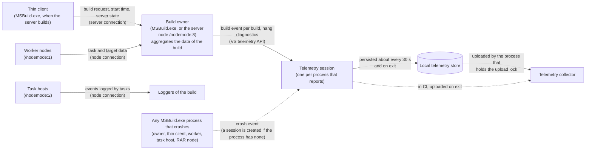

# MSBuild Visual Studio Telemetry Data

This document describes the telemetry data collected by MSBuild and sent to Visual Studio telemetry infrastructure. The telemetry helps the MSBuild team understand build patterns, identify issues, and improve the build experience.

## Overview

MSBuild collects telemetry at multiple levels:
1. **Build-level telemetry** - Overall build metrics and outcomes
2. **Task-level telemetry** - Information about task execution
3. **Target-level telemetry** - Information about target execution and incrementality
4. **Error categorization telemetry** - Classification of build failures

All telemetry events use the `VS/MSBuild/` prefix as required by VS exporting/collection. Properties use the `VS.MSBuild.` prefix.

---

## How telemetry flows

One process owns each build and reports it. The other nodes of the build send their data to that process over the connection they already have with it, and send telemetry on their own only to report a crash. The owner gives the data to a telemetry session, which saves it to a local store and uploads it to the collector.

- The build owner is the `MSBuild.exe` process that runs the build in-process, or the MSBuild server node when the server runs it. A build reports one `VS/MSBuild/build` event, however many nodes it uses, because the owner aggregates the data of all of them.
- The events that tasks log in a task host go to the loggers of the build. They are not part of the `build` event.
- [Which processes report](#which-processes-report) lists the session that each process owns, and [Crashes](#crashes) explains how a process without a session reports a crash.
- Inside Visual Studio, MSBuild adds its events to the telemetry session of Visual Studio, which Visual Studio owns and MSBuild never shuts down.
- On .NET, MSBuild creates no telemetry session. It publishes its data as activities of an `ActivitySource` for the host, such as the .NET SDK, to consume. See [MSBuild Telemetry](wiki/CollectedTelemetry.md).

---

## 1. Build Telemetry (`build` event)

The primary telemetry event capturing overall build information.

### Properties

| Property | Type | Description |
|----------|------|-------------|
| `BuildDurationInMilliseconds` | double | Total build duration from start to finish |
| `InnerBuildDurationInMilliseconds` | double | Duration from when BuildManager starts (excludes server connection time) |
| `BuildEngineHost` | string | Host environment: "VS", "VSCode", "Azure DevOps", "GitHub Action", "CLI", etc. |
| `BuildSuccess` | bool | Whether the build succeeded |
| `BuildTarget` | string | The target(s) being built |
| `BuildEngineVersion` | Version | MSBuild engine version |
| `BuildEngineDisplayVersion` | string | Display-friendly engine version |
| `BuildEngineFrameworkName` | string | Runtime framework name |
| `BuildCheckEnabled` | bool | Whether BuildCheck (static analysis) was enabled |
| `MultiThreadedModeEnabled` | bool | Whether multi-threaded build mode was enabled |
| `TaskHostConsoleOutputForwarded` | bool | Whether the parent received and forwarded non-empty stdout or stderr from an eligible primary `-mt` task host during this build |
| `SACEnabled` | bool | Whether Smart Application Control was enabled |
| `IsStandaloneExecution` | bool | True if MSBuild runs from command line |
| `InitialMSBuildServerState` | string | Server state before build: "cold", "hot", or null |
| `ServerFallbackReason` | string | If server was bypassed: "ServerBusy", "ConnectionError", or null |
| `ProjectPath` | string | Path to the project file being built |
| `FailureCategory` | string | Primary failure category when build fails (see Error Categorization) |
| `ErrorCounts` | object | Breakdown of errors by category (see Error Categorization) |

`TaskHostConsoleOutputForwarded` records actual use, not enablement, and contains no console text or task identity.

---

## 2. Error Categorization

When a build fails, errors are categorized to help identify the source of failures.

### Error Categories

| Category | Error Code Prefixes | Description |
|----------|---------------------|-------------|
| `Compiler` | CS, FS, VBC | C#, F#, and Visual Basic compiler errors |
| `MsBuildGeneral` | MSB4001-MSB4099, MSB4500-MSB4999 | General MSBuild errors |
| `MsBuildEvaluation` | MSB4100-MSB4199 | Project evaluation errors |
| `MsBuildExecution` | MSB4300-MSB4399, MSB5xxx-MSB6xxx | Build execution errors |
| `MsBuildGraph` | MSB4400-MSB4499 | Static graph build errors |
| `Task` | MSB3xxx | Task-related errors |
| `SdkResolvers` | MSB4200-MSB4299 | SDK resolution errors |
| `NetSdk` | NETSDK | .NET SDK errors |
| `NuGet` | NU | NuGet package errors |
| `BuildCheck` | BC | BuildCheck rule violations |
| `NativeToolchain` | LNK, C1xxx-C4xxx, CL | Native C/C++ toolchain errors (linker, compiler) |
| `CodeAnalysis` | CA, IDE | Code analysis and IDE analyzer errors |
| `Razor` | RZ | Razor compilation errors |
| `Wpf` | XC, MC | WPF/XAML compilation errors |
| `AspNet` | ASP, BL | ASP.NET and Blazor errors |
| `Other` | (all others) | Uncategorized errors |

## 3. Task Telemetry

### Task Factory Event (`build/tasks/taskfactory`)

Tracks which task factories are being used.

| Property | Type | Description |
|----------|------|-------------|
| `AssemblyTaskFactoryTasksExecutedCount` | int | Tasks loaded via AssemblyTaskFactory |
| `IntrinsicTaskFactoryTasksExecutedCount` | int | Built-in intrinsic tasks |
| `CodeTaskFactoryTasksExecutedCount` | int | Tasks created via CodeTaskFactory |
| `RoslynCodeTaskFactoryTasksExecutedCount` | int | Tasks created via RoslynCodeTaskFactory |
| `XamlTaskFactoryTasksExecutedCount` | int | Tasks created via XamlTaskFactory |
| `CustomTaskFactoryTasksExecutedCount` | int | Tasks from custom task factories |

## 4. Build Incrementality Telemetry

Classifies builds as full or incremental based on target execution patterns.

### Incrementality Info (Activity Property)

| Field | Type | Description |
|-------|------|-------------|
| `Classification` | enum | `Full`, `Incremental`, or `Unknown` |
| `TotalTargetsCount` | int | Total number of targets |
| `ExecutedTargetsCount` | int | Targets that ran |
| `SkippedTargetsCount` | int | Targets that were skipped |
| `SkippedDueToUpToDateCount` | int | Skipped because outputs were current |
| `SkippedDueToConditionCount` | int | Skipped due to false condition |
| `SkippedDueToPreviouslyBuiltCount` | int | Skipped because already built |
| `IncrementalityRatio` | double | Ratio of skipped to total (0.0-1.0) |

A build is classified as **Incremental** when more than 70% of targets are skipped.

---

## Privacy Considerations

### Data Hashing

Custom and potentially sensitive data is hashed using SHA-256 before being sent:
- **Custom task names** - Hashed to protect proprietary task names
- **Custom target names** - Hashed to protect proprietary target names
- **Custom task factory names** - Hashed if not in the known list
- **Metaproj target names** - Hashed to protect solution structure
- **Custom logger type names** - Hashed in hang diagnostics to protect custom logger names. The names of types in a `Microsoft.` namespace, such as the built-in loggers, are sent in plain text
- **Project file names** - Hashed in hang diagnostics, which use only the file name, without its directory
- **BuildCheck custom check loading failure messages** - Paths are removed from the message and it is truncated, and then hashed

### Known Task Factory Names (Not Hashed)

The following Microsoft-owned task factory names are sent in plain text:
- `AssemblyTaskFactory`
- `TaskHostFactory`
- `CodeTaskFactory`
- `RoslynCodeTaskFactory`
- `XamlTaskFactory`
- `IntrinsicTaskFactory`

### Crash Events

Crash events don't include exception messages, which can contain customer data. They include exception types, HRESULTs, a stack hash, and stack traces with file paths removed.

Hang diagnostics are crash events that MSBuild emits while `EndBuild` waits too long. They describe the state of the build: the wait phase and its duration, counts, node and submission ids, and state flags. They contain no project paths. The project that a node was working on is identified by the hash of its file name. A registered logger type is identified by its name when the type is in a `Microsoft.` namespace, and by the hash of its name otherwise.

## Collection and Delivery

Inside Visual Studio, MSBuild adds its events to the Visual Studio telemetry session, which Visual Studio owns. MSBuild never shuts that session down. The opt-out variables described under [Consent](#consent) also apply there. The rest of this section applies to `MSBuild.exe` on .NET Framework, as installed with Visual Studio or Build Tools.

### Which processes report

Only the process that owns a build reports it, and it creates its telemetry session before it runs builds in-process. A process that doesn't report a build creates no session, so it doesn't pay for creating and shutting one down.

| Process | Telemetry session | Sends |
|---------|-------------------|-------|
| `MSBuild.exe` that builds in-process | Created right before the build. | The `build` event of each build, hang diagnostics, and crash events. |
| MSBuild server node (`/nodemode:8`) | Created when the node starts, and shared by all the builds that the node runs. | The same events. |
| Thin client (`MSBuild.exe` when the server builds) | None, unless it falls back to building in-process. Then it is created right before that build. | The build request to the server, with its start time and the server state, and crash events. |
| Worker node (`/nodemode:1`) | None. | Task and target data to the build owner, and crash events. |
| Task host (`/nodemode:2`) | None. | The events that tasks log, to the loggers of the build, and crash events. |
| RAR node (`/nodemode:3`) | None. | Crash events. |

- A build reports one `VS/MSBuild/build` event, however many nodes it uses, because the owner aggregates the data of the other nodes. Hang diagnostics come only from the owner.
- A process without a session creates one only to report a crash, see [Crashes](#crashes).
- Tasks that post events to the Visual Studio default telemetry session, for example tasks from Visual Studio SDKs, use the session of the owner when they run in its process. In other processes they create their own session.

### Crashes

The process that crashes reports its own crash, because nothing else can.

- The unhandled exception handler records the crash and shuts telemetry down within the shutdown budget, so that the event is saved before the process exits.
- A crash that MSBuild handles before it exits is reported when the process shuts down.
- A process that has a session adds the crash event to it. A process without one, such as a worker node, task host, RAR node, or thin client, creates a session just for the crash. Only `MSBuild.exe` does this. In a process that MSBuild is hosted in, such as Visual Studio, the crash goes to the session of the host, and nothing is reported when there is none.
- The same consent, opt-out, and shutdown rules apply as for any other event, see [Consent](#consent) and [Delivery](#delivery).

### Consent

- `MSBUILD_TELEMETRY_OPTOUT=1` or `DOTNET_CLI_TELEMETRY_OPTOUT=1` (or `true`) turns MSBuild's telemetry off on .NET Framework, both in `MSBuild.exe` and inside Visual Studio. No session is created and no MSBuild events are sent. Inside Visual Studio only MSBuild's events are affected, not the rest of Visual Studio's telemetry.
- On .NET, only `DOTNET_CLI_TELEMETRY_OPTOUT` applies, for example to `dotnet build`.
- Otherwise the session uses the Visual Studio consent: the [Visual Studio Customer Experience Improvement Program](https://learn.microsoft.com/visualstudio/ide/visual-studio-experience-improvement-program) setting, including machine-wide policy. When consent is not given, the session is created but no events are sent. MSBuild does not change consent, and running in CI does not opt a machine in.

### Delivery

A session saves its events to the local Visual Studio telemetry store, `%LOCALAPPDATA%\Microsoft\VSApplicationInsights\vstel<hash>\*.trn`. All the processes on the machine that use the same collector share this store.

- The events are saved about every 30 seconds while the process runs, and what is still pending is saved when the session shuts down on exit.
- The process that holds the cross-process upload lock polls the store about every 10 seconds and uploads what it finds, including the events that other processes saved. That process can be Visual Studio or a later `MSBuild.exe`. Outside CI, `MSBuild.exe` doesn't wait for an upload on exit.
- A server node keeps its session between builds, so its events reach the store periodically and when the node exits: when it times out while idle, when it is asked to shut down, or on Ctrl+C. A live session can't be flushed on demand, so there is no upload after each build.
- In CI, as detected by the same environment variables that disable the terminal logger (for example `CI`, `TF_BUILD`, `GITHUB_ACTIONS`, `TEAMCITY_VERSION`, `JENKINS_URL`, or `GITLAB_CI`), `MSBuild.exe` uploads the pending events just before it exits, because an ephemeral agent is often discarded before a later process could upload what was saved. It does so only when the process started at least one event and the session is opted in, because waiting cannot help otherwise. The detection is shared with the terminal logger, so a generic variable such as `BUILD_ID` on a developer machine also triggers it. The cost of such a false positive is a bounded wait, followed by saving the events locally.
- The shutdown is best effort and bounded. It waits at most 10 seconds by default; `MSBUILD_TELEMETRY_SHUTDOWN_TIMEOUT_MS` changes this budget, and `0` means don't wait. In CI the upload gets up to 80% of the budget. If it fails or doesn't complete in that time, it is canceled and the events are saved locally in the rest of the budget, so that a later process can upload them. When nothing completes within the budget, `MSBuild.exe` exits without waiting further, and pending events may be lost. A second shutdown request, for example when the process exits after the unhandled exception handler has started the shutdown, waits for the first one within what is left of the budget. Telemetry never changes the build result or exit code.
- Events are not delivered in these cases:
  - Telemetry is opted out or consent is not given.
  - The process is terminated forcibly, or crashes without running its handlers, for example on a stack overflow.
  - The collector is unreachable. The events stay in the store until a later process uploads them, which never happens on an agent that is discarded.
  - An agent is discarded while a server node still holds events that were not delivered yet.
  - Another Visual Studio telemetry process on the same machine holds the upload lock. That process uploads the stored events instead.

### Host identification

`BuildEngineHost` is determined in this order:

1. `VS` when MSBuild runs inside Visual Studio.
2. The value of `MSBUILD_HOST_NAME`, when set.
3. `Azure DevOps` when `TF_BUILD` is `true`.
4. `GitHub Action` when `GITHUB_ACTIONS` is `true`.
5. `VSCode` when `VSCODE_CWD` is set or `TERM_PROGRAM` is `vscode`.
6. Otherwise no host is reported.

Other CI systems are detected for upload on exit, but they are not reported as a host.

### Deployment requirements

`MSBuild.exe` loads these files from `MSBuild\Current\Bin`:

- `Microsoft.VisualStudio.Telemetry.dll`
- `Microsoft.VisualStudio.RemoteControl.dll`
- `Microsoft.VisualStudio.Utilities.Internal.dll`
- `Newtonsoft.Json.dll`

The 64-bit and ARM64 `MSBuild.exe` find them through `codeBase` entries in their `MSBuild.exe.config`. If the files can't be loaded, telemetry is disabled for that process, and the build is not affected.

### Diagnostics

Set `MSBUILD_TELEMETRY_DIAGNOSTICS=1` to write telemetry status lines, prefixed with `MSBuild telemetry:`, to standard error. They report:

- Whether telemetry was opted out.
- Initialization: session ownership, consent, CI detection, and the path of the loaded telemetry assembly.
- Initialization and dependency failures, with the exception.
- The outcome of the shutdown and how long it took: whether the events were uploaded or saved, whether they were saved because the upload did not complete, or whether it timed out. Also the budget, and what decides the upload in CI: CI detection, whether events were started, and whether the session is opted in.
- Upload and shutdown failures, with the exception.

The messages contain no session identifiers or event data. CI steps that fail on any standard error output (for example `failOnStderr`) will fail when this is on.

## Related Files

| File | Description |
|------|-------------|
| [BuildTelemetry.cs](../src/Framework/Telemetry/BuildTelemetry.cs) | Main build telemetry class |
| [BuildInsights.cs](../src/Framework/Telemetry/BuildInsights.cs) | Container for detailed insights |
| [TelemetryDataUtils.cs](../src/Framework/Telemetry/TelemetryDataUtils.cs) | Data transformation utilities |
| [BuildErrorTelemetryTracker.cs](../src/Build/BackEnd/Components/Logging/BuildErrorTelemetryTracker.cs) | Error categorization |
| [ProjectTelemetry.cs](../src/Build/BackEnd/Components/Logging/ProjectTelemetry.cs) | Per-project task telemetry |
| [LoggingConfigurationTelemetry.cs](../src/Framework/Telemetry/LoggingConfigurationTelemetry.cs) | Logger configuration |
| [BuildCheckTelemetry.cs](../src/Framework/Telemetry/BuildCheckTelemetry.cs) | BuildCheck telemetry |
| [KnownTelemetry.cs](../src/Framework/Telemetry/KnownTelemetry.cs) | Static telemetry accessors |
| [TelemetryManager.cs](../src/Framework/Telemetry/TelemetryManager.cs) | Session ownership, opt-out, and shutdown |
| [CrashTelemetryRecorder.cs](../src/Framework/Telemetry/CrashTelemetryRecorder.cs) | Crash events and hang diagnostics |
| [TelemetryConstants.cs](../src/Framework/Telemetry/TelemetryConstants.cs) | Telemetry naming constants |
