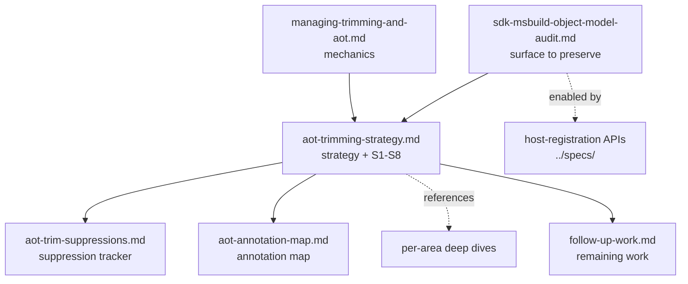

# MSBuild trimming & Native AOT documentation

This folder collects the design notes, strategy, living trackers, and per-area analyses behind making
**MSBuild trim- and Native-AOT-capable**. The goal is to let an **AOT-compiled host - the
`dotnet` CLI -** run the MSBuild object model **in-process**: evaluate and inspect projects directly, and,
where an AOT image cannot do something (load a task, SDK resolver, logger, or build check by reflection, or
emit code at run time), **detect that and fall back** to a JIT MSBuild rather than crash.

> **The one rule that governs everything here: fail observably, never silently**
> ([definition](managing-trimming-and-aot.md#msbuilds-overriding-design-criterion-fail-observably-never-silently)).
> A trimmed/AOT path that cannot run must surface a reported build **error** (e.g. **MSB4282**, **MSB4283**)
> or a branchable property - never a silent no-op and never an uncaught crash.

The companion **host-registration API proposals** live one folder up in [`../specs/`](../specs/) (per the
repo convention that API proposals belong under `specs/`); they are linked from the index below.

## Evaluation and execution

The trim/AOT effort is evaluation-first. Evaluation - reading a project's properties, items, imports, and
conditions - is mostly MSBuild's own managed code and is the primary in-process object-model surface the
SDK CLI needs. Execution - running targets and tasks - is the harder tier because arbitrary tasks, loggers,
SDK resolvers, project-cache plugins, and build checks are discovered at run time. This change makes more
execution possible through closed-world host registration (for example registered SDK resolvers and task
classes), while unsupported open-world execution paths must fail observably so the host can fall back.

## Start here

Pick the entry point that matches what you are doing:

| If you want to… | Read, in order |
| --- | --- |
| **Understand the annotation model** (you are new to trim/AOT) | [managing-trimming-and-aot.md](managing-trimming-and-aot.md) → [aot-trimming-strategy.md](aot-trimming-strategy.md) |
| **Decide what to do with a flagged code path** | [aot-trimming-strategy.md](aot-trimming-strategy.md) (the S1-S8 catalog) → [aot-trim-suppressions.md](aot-trim-suppressions.md) (is it already tracked?) → [aot-annotation-map.md](aot-annotation-map.md) (where annotations live + next steps) |
| **See the current suppression / annotation state** | [aot-trim-suppressions.md](aot-trim-suppressions.md) and [aot-annotation-map.md](aot-annotation-map.md) |
| **See current Backlog work** | [follow-up-work.md](follow-up-work.md) |
| **Build an AOT host** (e.g. an AOT `dotnet` CLI) | [sdk-msbuild-object-model-audit.md](sdk-msbuild-object-model-audit.md) (the surface you depend on) → the [host-registration APIs](#host-registration-api-proposals-in-specs) → [follow-up-work.md](follow-up-work.md) (what remains) |
| **Work on a specific subsystem** | the matching [per-area deep dive](#per-area-deep-dives) |

## The documents

### Design & strategy

- [aot-trimming-strategy.md](aot-trimming-strategy.md) - **the decision framework.** When to *remove, gate,
  register, annotate, or suppress* an AOT-unfriendly path; the **S1-S8** strategy catalog; and the
  operating rules for keeping the warning gate and live trackers honest. Start here for "what do I do with
  this warning?"
- [follow-up-work.md](follow-up-work.md) - **the remaining work.** A single, consolidated list of follow-up
  items after the current annotation and host-registration pass.
- [managing-trimming-and-aot.md](managing-trimming-and-aot.md) - **the mechanics how-to**, for someone new to
  the space: what each attribute means (`[RequiresUnreferencedCode]`, `[DynamicallyAccessedMembers]`,
  `[FeatureSwitchDefinition]`, `[FeatureGuard]`), the **analyzer-vs-trimmer** split, the `IL4000` gotcha, and
  feature-switch plumbing. Defines the **fail-observably** criterion the rest of the work obeys.

### Living trackers (kept in sync with the code)

- [aot-trim-suppressions.md](aot-trim-suppressions.md) - every `[UnconditionalSuppressMessage]` for a trim/AOT
  rule, each with a status (**Vetted** / **Investigate** / **Backlog**), plus the merged Backlog deep
  analysis.
- [aot-annotation-map.md](aot-annotation-map.md) - where the `[RequiresUnreferencedCode]`,
  `[DynamicallyAccessedMembers]`, and feature-guard annotations live (counts by subsystem), a correctness
  review, and prioritized suggestions to drive the remaining suppressions down.

### Per-area deep dives

- [sdk-resolution.md](sdk-resolution.md) - how SDK resolution works and the plan to make it trim/AOT-safe
  (in-box resolution stays reflection-free; a dynamically-loaded resolver fails observably with **MSB4282**).
- [sdk-msbuild-object-model-audit.md](sdk-msbuild-object-model-audit.md) - audit of how the .NET SDK CLI
  consumes the MSBuild object model, mapped to the CLI command that exposes each usage - the surface a
  trimmed/AOT host must keep working, and where evaluation versus execution boundaries fall.
- [task-factory-aot.md](task-factory-aot.md) - how MSBuild creates and executes tasks through the
  `ITaskFactory` family, why that is fundamentally reflection-bound, and the design for an AOT-safe task
  mechanism.
- [task-parameter-types.md](task-parameter-types.md) - precisely which .NET types are legal as a task
  parameter, how `<ParameterGroup>` resolves a `ParameterType` string to a `Type`, the `ITaskItem`
  implementations, and whether a trim-safe type registry is feasible.
- [property-functions-reachability.md](property-functions-reachability.md) - which types and members a
  property-function expression can reach by "dotting in," and the receiver-restriction design (§10) that
  bounds that surface for trimming.
- [buildcheck-reflection-removal.md](buildcheck-reflection-removal.md) - how the BuildCheck system discovers
  and runs checks, and a proposal to remove reflection from it (permanently, or only under trim/AOT).

### Host-registration API proposals (in `../specs/`)

These propose the public, reflection-free APIs a host uses so the engine can run without reflecting at run
time. All three are **implemented**.

- [../specs/task-class-registration-api.md](../specs/task-class-registration-api.md) -
  `Microsoft.Build.Utilities.Task.RegisterTask<T>`: register task classes so the engine constructs, binds,
  and runs them with reflective task execution disabled.
- [../specs/task-parameter-type-registration-api.md](../specs/task-parameter-type-registration-api.md) -
  `Microsoft.Build.Utilities.TaskItem.RegisterTaskParameterValueType`/`RegisterTaskParameterItemType`: resolve
  task parameter types without a by-name `Type.GetType`.
- [../specs/sdk-resolver-host-registration-api.md](../specs/sdk-resolver-host-registration-api.md) -
  `SdkResolver.Register`: contribute a reflection-free SDK resolver instead of MSBuild loading one by
  reflection.

## How these relate

