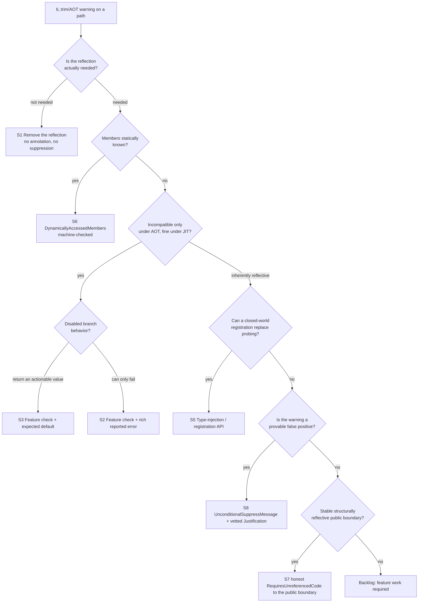

# MSBuild trimming & Native AOT — design and strategy

**Status:** Living. This is the **single source of truth** for *how MSBuild
decides what to do* with a trim/AOT-unfriendly code path. It collapses the design rationale and
the per-area tactics that were previously scattered across the AOT specs into one decision
framework, a catalog of concrete strategies, and the operating rules for driving suppressions and
annotations down.

It is deliberately *strategy*, not *mechanics*. For the annotation model itself — what each
attribute does, the analyzer-vs-trimmer split, the IL4000 gotcha, feature-switch internals —
read the companion how-to and keep this document as the layer above it.

See the [folder README](README.md) for the full document map. The two most relevant companions:
the **mechanics how-to** ([managing-trimming-and-aot.md](managing-trimming-and-aot.md)) for the
annotation model, and the **live tracker** ([aot-trim-suppressions.md](aot-trim-suppressions.md)) for
every active suppression. Known Backlog work is tracked in [follow-up-work.md](follow-up-work.md).

---

## 1. Why we are doing this

MSBuild is being made trim/AOT-capable so an **AOT-compiled host - the `dotnet` CLI -** can run
the MSBuild object model **in-process** (MSBuild compiled into the host). The host evaluates and
inspects projects directly; when it needs something an AOT image cannot do (load a task, SDK
resolver, logger, or build check by reflection; emit code at runtime), it must **detect that and
fall back** to a JIT MSBuild (the managed CLI, or `MSBuild.exe` out of process).

Two facts follow and shape everything below:

1. **Evaluation is the high-value, achievable target; execution is the hard tier.** Evaluating a
   project - reading its properties, items, imports, conditions - is almost entirely MSBuild's own
   managed code and is reachable under trimming. Executing targets pulls in arbitrary third-party
   task assemblies discovered at runtime and is structurally reflective. The plan is to keep
  evaluation trim-clean now and make execution **opt-in / closed-world** later. The SDK-facing
  evaluation and execution surfaces are mapped in
  [sdk-msbuild-object-model-audit.md](sdk-msbuild-object-model-audit.md).
2. **The fallback only works if MSBuild fails *observably*.** That is the overriding design
   criterion (next section). A silent no-op or a crash deep in the engine gives the host nothing
   to branch on.

---

## 2. The overriding design criterion: fail observably, never silently

Canonical statement:
[managing-trimming-and-aot.md §"MSBuild's overriding design criterion"](managing-trimming-and-aot.md#msbuilds-overriding-design-criterion-fail-observably-never-silently).
In one line: **express intent, or fail loudly — never suppress a real problem, never go silent,
never crash.**

- **No silent failures.** A path that cannot work under trim/AOT must surface a build **error** (or
  set a host-readable property) — never quietly do nothing or return a wrong result. Dropping a
  project's expressed intent (a custom task, resolver, check) without a word is a silent failure.
- **No crashes.** An unhandled exception or `PlatformNotSupportedException` deep in the engine is
  *worse* than an error — a host cannot cleanly fall back from a crash. Convert incompatible paths
  into clean, reported errors.
- **A suppression may never hide a real problem.** `[UnconditionalSuppressMessage]` is legitimate
  **only** for a provable false positive. Suppressing an *accurate* warning hides exactly the
  signal the host relies on to fall back.

---

## 3. Principles (the rules this document enforces)

These encode the explicit direction for this effort:

- **P-A — No unjustified suppressions.** Every `[UnconditionalSuppressMessage]` for an IL rule must
  be tracked as `Vetted`, `Investigate`, or `Backlog`. `Vetted` means the warning is a false positive:
  code provably trim/AOT-safe that the analyzer simply cannot see, with a `Justification` that states
  the invariant. `Backlog` means the warning is accurate and requires additional feature work; it is
  not an accepted end-state. (This is also the official .NET guidance: a suppression is valid only
  when the warning "doesn't represent a real issue at runtime."[^suppress])
- **P-B — Public API may be annotated, but not casually.** We **can** put
  `[RequiresUnreferencedCode]` / `[RequiresDynamicCode]` / `[DynamicallyAccessedMembers]` on
  **public** surface when the API is structurally reflective and no trim-safe contract exists. It is
  a public-surface decision, not a convenient way to quiet a warning. Preview annotations remain
  candidates for removal before the surface becomes stable; the public task-factory interface RUC is
  in that bucket.
- **P-C — Prefer feature checks to isolate AOT-unfriendly code.** When a path is incompatible under
  AOT but fine under the JIT, gate it behind a **feature check** (`[FeatureSwitchDefinition]`,
  optionally `[FeatureGuard]`, or `RuntimeFeature.IsDynamicCodeSupported`). The trimmer folds the
  switch to a constant and **physically removes** the unsafe branch from the AOT image, so the
  warning is gone with no suppression *and* the dangerous code does not ship.
- **P-D — A gated-off path must fail observably or degrade to an expected value.** The disabled
  branch of a feature check must do exactly one of two things (§5): **(a)** raise a useful,
  reported error so the host can fall back, or **(b)** return a value that is *correct and
  actionable* in an AOT host (e.g. "no custom resolver available; use the in-box one"). Never an
  unreported skip.
- **P-E — Keep the warning gate and inventories honest.** `Microsoft.Build` must stay clean on the
  analyzed TFM, the AOT harness must publish and run, and the live trackers
  ([aot-trim-suppressions.md](aot-trim-suppressions.md) and
  [aot-annotation-map.md](aot-annotation-map.md)) must be updated in the same change that moves a
  warning, suppression, or annotation. The tracker is not archival decoration; it is the reviewable
  contract for every remaining exception.
- **P-F — Treat `Backlog` as pending feature work, not a waiver.** A `Backlog` suppression requires
  additional feature work. Observable failure is the minimum safety bar while that work is pending;
  it is not a reason to call an accurate warning resolved.

Decision order when you hit (or are about to write) an IL warning:



`[UnconditionalSuppressMessage]` is the **bottom** of the order as a final state, reachable only when
the warning is a false positive. An *accurate* warning can remain only as `Backlog` while feature work
  is pending; the final state is S2/S3 (gated + observable), S5 (registered), or S7 (honest RUC on a
  stable public boundary that is truly structurally reflective).

Apply the catalog with this loop:

1. **Start from the warning or code path, not a subsystem tour.** Identify the reflective leaf and
   the first boundary that makes the warning user-visible.
2. **Classify the row in the live tracker.** Use the same labels everywhere: `Vetted`, `Investigate`,
   or `Backlog`.
3. **Apply the first matching strategy.** Remove vestigial reflection (S1), register a closed-world
   type (S5), gate the JIT-only feature with an observable branch or expected default (S2/S3), add
   honest RUC to a real boundary (S7), or add DAM when the member set is statically knowable (S6).
4. **Tighten while you are there.** Remove over-broad RUC on methods that only invoke delegates,
   localize unavoidable DAM suppressions to the smallest member, and update the tracker when a row
   moves or disappears.
5. **Verify the touched slice.** A change that affects the analyzed engine must keep
   `Microsoft.Build` at 0 warnings / 0 errors on both `net10.0` and `net472`, publish and run the
   AOT harness when the closure changes, and run the targeted tests for the switch/path being moved.

---

## 4. Strategy catalog

Each strategy is a concrete way to make a path trim/AOT-correct **without** an unjustified
suppression. Ordered roughly best-to-last-resort. The examples are real changes in the codebase.

### S1 — Remove the reflection entirely

The best fix: the reflection was vestigial, so delete it and read the value directly. Clears the
warning (including **dataflow** warnings, which *no* guard or switch can silence) with nothing left
behind.

| Where | Was | Now |
| --- | --- | --- |
| `BuildEnvironmentHelper.CheckIfRunningTests` (`src/Framework/`) | reflected over `TestInfo.s_runningTests` — IL2026 **+ IL2075 dataflow** | direct `_runningTests ?? TestInfo.s_runningTests` read |
| `ProjectCollection.Version` (`src/Build/Definition/`) | `FileVersionInfo.GetVersionInfo(Assembly.Location)` — empty under single-file → throw | read `AssemblyFileVersionAttribute` directly (same value, no file path) |
| `NuGetFrameworkWrapper` (`src/Build/Utilities/`) | reflective wrapper | net-core partner `.Direct.cs` references `NuGet.Frameworks` directly (`new()`, no reflection); the reflective `.Reflection.cs` compiles only on net472 where the analyzer never runs |

**When:** the reflected member is in the same closure, or a direct API exists. Always check this
first — it is the only fix that also clears IL2067–IL2095 dataflow warnings.

### S2 — Feature check that **fails observably** with a rich error

For a path that is meaningless or unsupported under AOT and that a project can *reach*: gate it
behind a feature switch whose **disabled** branch raises a reported, actionable error. Under the
JIT the switch is on and behavior is unchanged; under trimming the switch folds to a constant, the
reflective branch is **removed**, and the only thing left is the throw. This is P-C + P-D(a) and is
the reference shape for "reachable incompatible path."

| Switch (in [`src/Framework/FeatureSwitches.cs`](../../src/Framework/FeatureSwitches.cs)) | Gated path | Disabled-branch failure |
| --- | --- | --- |
| `EnableSdkResolverDynamicLoading` (`[FeatureSwitchDefinition]`+`[FeatureGuard(RUC)]`) | `SdkResolverService.GetResolvers` — plugin SDK-resolver assembly load | `ProjectFileErrorUtilities.ThrowInvalidProjectFile("SdkResolverDynamicLoadingNotSupported")` → **MSB4282** |
| `EnableConfigurationFileToolsets` (`[FeatureSwitchDefinition]`) | `ToolsetReader.ReadAllToolsets` — `ToolsetConfigurationReader` / `System.Configuration` | `ErrorUtilities.ThrowArgument("OM_ConfigurationFileToolsetsNotSupported")` (and the whole `System.Configuration` dependency drops out of the trimmed closure) |
| `EnableCustomPluginProbing` (BuildCheck path) | `BuildCheckBuildEventHandler.HandleBuildCheckAcquisitionEvent` — custom-check load | `checkContext.DispatchAsErrorFromText(...)` — a reported build error instead of a silent skip |
| `EnableReflectiveTaskExecution` (`[FeatureSwitchDefinition]`+`[FeatureGuard(RUC)]`) | `TaskExecutionHost.FindTask` / `InitializeForBatch` / `SetTaskParameters` — the reflective task load/instantiate/bind leaves | `ProjectErrorUtilities.ThrowInvalidProject("ReflectiveTaskExecutionNotSupported")` → **MSB4283**. Gating the leaf freed the whole build-execution chain (nodes, `BuildRequestEngine`, `RequestBuilder`/`TargetBuilder`/`TaskBuilder`, `TaskHost`, their interfaces) of `[RequiresUnreferencedCode]`, removing 5 boundary suppressions — see [aot-trim-suppressions.md - Group A](aot-trim-suppressions.md#group-a--the-il2026-build-execution-boundary) |
| `RuntimeFeature.IsDynamicCodeSupported` (recognized IL3050 guard) | Task entry points that use runtime code generation, such as `XslTransformation.Execute()` and `GenerateManifestBase.Execute()` (`XslCompiledTransform`, `XmlSerializer`) | Reuse an existing task error resource with a clear detail, return `false`, and avoid crashing deep in the BCL under Native AOT. This guards **IL3050 only**; trim warnings (`IL2026`, `IL2070`, `IL2057`) still need RUC guards, DAM, registration, or Backlog feature work. |

**Pattern:** `if (FeatureSwitches.X) { <reflective work> } else { <ThrowReportedError> }`. The
switch-guarded `then` branch is what the trimmer dead-strips; the `else` keeps the analyzer happy
(the RUC call stays in the `then`) and gives the host a clean failure. Authoring a new reported
error: see [authoring-errors-and-warnings skill](../../.github/skills/authoring-errors-and-warnings/SKILL.md).

### S3 — Feature check with an **expected, actionable default** return

Same mechanism, but the disabled branch returns a value that is *correct* for an AOT host rather
than an error — because falling back is the right behavior, not a failure (P-D(b)). The trimmer
removes the unsafe branch; the default is what AOT ships.

| Check | Gated path | AOT default (why it is correct) |
| --- | --- | --- |
| `EnableCustomPluginProbing` | `MSBuildLoadContext.Load`, `TaskEngineAssemblyResolver.ResolveAssembly` | `return null` — defers to the default `AssemblyLoadContext`, which still throws `FileNotFoundException` if the assembly is genuinely needed (so it is *not* silent; it removes only MSBuild's *extra* reflective search) |
| `RuntimeFeature.IsDynamicCodeSupported` | `AssemblyLoadsTracker` (`AppDomain.AssemblyLoad` never fires under AOT) | early-return `EmptyDisposable.Instance` → ILC proves the tracker is never instantiated and strips its `Assembly.Location` read (clears **IL3000** with no suppression) |
| `RuntimeFeature.IsDynamicCodeSupported` | `BuildEnvironmentHelper.Initialize` / `GetProcessFromRunningProcess` | prefer the versioned SDK directory the host publishes through the `Microsoft.DotNet.Sdk.Root` AppContext value (`DotNetSdkPaths`, mirroring SDK [PR #55110](https://github.com/dotnet/sdk/pull/55110)); only when it is unset fall straight to the running process path (an empty `Assembly.Location` is meaningless under AOT anyway) |
| `RuntimeFeature.IsDynamicCodeSupported` | `NativeMethods.FrameworkCurrentPath` | empty string — every consumer already treats empty as ".NET Framework not found", which is correct (an AOT process has no .NET Framework) |
| `EnableAllPropertyFunctions` (default **false**) | property-function *type probing* | the curated allowlist is the only path; the wide "probe any assembly" branch is removed |
| `RestrictPropertyFunctionReceivers` (trimmed default **true**) | instance "dotting-in" receiver set | bounded, side-effect-free receiver allowlist (`PropertyFunctionReceiver`) — see [property-functions-reachability.md §10](property-functions-reachability.md) |

**When:** the gated feature has a sensible "not available here" behavior the rest of the engine
already copes with. The default must be **observable-compatible** — i.e. it must not mask a needed
operation (the `Load → null → default loader → FileNotFoundException` chain is observable; a bare
swallow would not be).

### S4 — Overloads / fast-path splits that **avoid** the reflective code path

Restructure so the common case never reaches the reflective member, and the reflective member is
either isolated behind honest RUC or only used by an opt-in overload.

| Where | Split |
| --- | --- |
| `ProjectCollection` ctors (`src/Build/Definition/`) | master ctor split into a **private trim-safe core** (builds the collection, registers ordinary loggers) + a thin **`[RequiresUnreferencedCode]` public wrapper** that registers forwarding loggers. Overloads that pass no forwarding loggers (and `GlobalProjectCollection`) chain to the core and are honestly non-RUC. Cleared **5× IL2026** with no public-API change. |
| `TypeLoader.Create<TInterface>()` (`src/Shared/`) | factory stores the interface *as data* and does the `GetInterface` match inside the already-`[RequiresUnreferencedCode]` load path → retired an **IL2070** (and the per-filter `Func` delegate) |
| SDK resolution | the in-box `DefaultSdkResolver` is a **reflection-free** directory probe tried **first**; only plugin resolvers reflect, and they are gated (S2). The reflection-free path is the default. |

**When:** a method mixes a trim-safe majority with a reflective minority. Separate them so only the
minority carries the cost.

### S5 — Type-injection / registration APIs for lookup tables (closed-world)

Replace *probing for types by name at runtime* with *the host handing us the type up front*. The
registered type is referenced from the host's compile graph, so the trimmer can see and preserve
it. This is the **only** way to make an otherwise open-world plugin lookup trim-safe, and it is how
the runtime itself solves the same problem (§6).

| API | Replaces |
| --- | --- |
| `SdkResolver.Register(SdkResolver)` (`src/Framework/Sdk/SdkResolver.cs`) — host pushes a pre-constructed resolver, folded into `SdkResolverLoader.GetDefaultResolvers()` on the reflection-free pass ([sdk-resolver-host-registration-api.md](../specs/sdk-resolver-host-registration-api.md)) | discovering & `Assembly.LoadFrom`-ing SDK-resolver plugins |
| `Task.RegisterTask<T>(...)` / `TaskClassRegistry.Register<T>(...)` — host supplies the concrete task type at registration, with DAM rooting the public parameterless constructor and public properties ([task-class-registration-api.md](../specs/task-class-registration-api.md)) | discovering a task type by name and constructing/binding it through the public task-factory interface path |
| `TaskParameterTypeRegistry.RegisterValueType<T>(...)` — host supplies known task parameter value types so `<ParameterGroup>` parsing resolves known names before the by-name fallback ([task-parameter-type-registration-api.md](../specs/task-parameter-type-registration-api.md)) | `Type.GetType(string)` for known task parameter value types |
| `PropertyFunctionReceiver` allowlist — a closed `FrozenSet<Type>` of side-effect-free receiver types ([property-functions-reachability.md §10](property-functions-reachability.md)) | dotting into the open-ended BCL type graph |
| **Backlog:** explicit metadata for `RegisterTask(string, Func<ITask>)` and generated task parameter binders ([task-factory-aot.md §7](task-factory-aot.md)) | lazy `_createInstance().GetType()` metadata discovery and reflective property get/set over registered task types |

The annotation recipe for "we still reflect, but only over *registered* types" is in §6 — it is the
part the user asked us to get right, and it has a direct runtime precedent in
`TypeDescriptor.RegisterType<T>`.

### S6 — `[DynamicallyAccessedMembers]` (preserve members; localize to the smallest member)

When the reflection *is* needed and the member kinds *are* statically known, annotate the flow.
This is machine-checked end-to-end and is the **preferred** annotation. Localize an unavoidable
residual to the smallest possible member so the surrounding code stays clean.

| Where | Annotation |
| --- | --- |
| `TypeExtensions.InvokeMemberPublicOnly` (`src/Framework/Utilities/`) | receiver annotated with the exact public-member surface it binds |
| `Expander.FunctionBuilder.SetReceiverType` (`src/Build/Evaluation/`) | DAM on the one-line backing-field setter; the single residual IL2069 lives here so `Function.ExtractPropertyFunction` is suppression-free |
| `ITaskFactory.TaskType` (`src/Framework/`) | `[DynamicallyAccessedMembers(PublicProperties)]` on the public property |

### S7 — Honest `[RequiresUnreferencedCode]` to a stable public boundary (P-B)

When the path is **structurally** reflective (runtime-named types that don't exist in the trimmed
world), the API is a stable public contract, and no closed-world registration or feature gate can express
the behavior, mark the public contract honestly and propagate the requirement up the real call chain.
This is *not* a defeat - it tells the caller the truth and lets a host fall back.

Use S7 only after asking whether the public surface should instead be changed before it stabilizes.
Preview-era annotations are Backlog when feature work can remove them. The current
`ITaskFactory` / `ITaskFactory2` / `ITaskFactory3` `Initialize` / `CreateTask` RUC is in that category:
registered and intrinsic tasks already bypass those public interface methods through non-interface
construction paths, so the strategy is to prove any remaining interface path analyzer-clean,
feature-gated, or observably unsupported and then remove those RUC annotations before the surface is
treated as stable.

### S8 — Vetted false-positive suppression (the only final suppression)

`[UnconditionalSuppressMessage]` is allowed **only** when the analyzer is wrong: the code is
provably safe by an invariant it cannot see, and the `Justification` states that invariant. These
are the `Vetted` rows in the tracker. Accurate warnings that still have suppressions are `Backlog`,
which means they require additional feature work.

| Where | Why it is a false positive |
| --- | --- |
| `TypeExtensions.CreateDefault` (IL2067) | only invoked for value types (guarded by `IsValueType`), which always have a public parameterless ctor |
| `TypeExtensions.InvokeMemberPublicOnly` (IL2070) | sole caller rejects `BindingFlags.NonPublic`; receiver's public surface preserved via DAM |
| `TypeExtensions.GetAssemblyPath` (IL3000) | the generic `Assembly.Location` self-discovery primitive, correct in a hosted/JIT layout, hardened to return the empty path rather than throw |
| Property-function receiver dataflow (`FunctionBuilder.SetReceiverType`, `Function.Execute`, `Function.GetTypeForStaticMethod`) | receiver sets are bounded to preserved-member allowlists (`AvailableStaticMethods` and `PropertyFunctionReceiver`), with `RestrictPropertyFunctionReceivers` substituted `true` under trim and `Constants.PropertyFunctionMembers` preserving the reflected surface |
| `Enum.GetValues(Type)` rooted through property-function allowlists | rooted by `typeof(Enum)` but unreachable via property functions because authors cannot supply a `Type` argument (MSB4185/MSB4186), proven by AOT property-function tests |

> The companion IL4000 `#pragma warning disable` on every `[FeatureGuard]` switch is **not** in this
> category — it is the BCL-sanctioned acknowledgement that the analyzer cannot model an
> `AppContext.TryGetSwitch` body, signed against the contract that the trimmer substitutes the whole
> getter. See [managing-trimming-and-aot.md §6.4](managing-trimming-and-aot.md#64-the-il4000-gotcha-the-definitive-explanation).

### Current Backlog buckets

Backlog means the warning is accurate or the subsystem is not trim/AOT-ready; it requires feature work.
The current buckets are:

| Bucket | Strategy direction |
| --- | --- |
| Host-supplied task type metadata (`RegisterTask(string, Func<ITask>)`) | S5/S6: add an explicit trim-safe type or metadata contract so MSBuild does not infer metadata by calling the factory and reading `GetType()` |
| Node forwarding-logger initialization | S2: reuse `EnableReflectiveLoggerLoading` at the out-of-proc node configuration leaf |
| Build-manager solution/logger/plugin boundary | S2/S5: gate solution-metaproject generation and project-cache plugin loading; keep logger/plugin initialization behind feature switches or registration paths |
| Serialized task parameter value types | S5: reuse `TaskParameterTypeRegistry` for serialized names where possible, keeping the open-world fallback isolated |
| Public task-factory interface RUC | S4/S7 review: prove remaining `ITaskFactory` interface call paths analyzer-clean, feature-gated, or observably unsupported, then remove preview RUC before the surface is treated as stable |
| `Microsoft.Build.Tasks` XML handling | Feature work for `XmlSerializer`, `XslCompiledTransform`, and `SignedXml`: use task-entry `RuntimeFeature.IsDynamicCodeSupported` guards for graceful IL3050 failure, evaluate source-generated or pre-generated XML serializers for genuinely AOT-capable paths, and keep IL2xxx trimming work separate. Smaller Backlog rows cover attribute reflection and assembly metadata. |

---

## 5. Two flavors of a gated-off branch — choose deliberately

Every feature-checked path (S2/S3) must pick one, and the choice is a design decision, not an
accident:

| | **Fail observably (S2)** | **Expected default (S3)** |
| --- | --- | --- |
| Use when | the project *expressed intent* the AOT host cannot honor (a custom resolver, a config-file toolset, a custom check) | "not available here" is a *correct, normal* outcome the engine already handles |
| Disabled branch | raises a reported error (`MSBxxxx`, `ArgumentException`, dispatched build error) | returns a value (`null`, empty path, the in-box default) the caller copes with |
| Host sees | a clean error → fall back to JIT MSBuild | nothing to fall back from — it just works with the reduced surface |
| Trap to avoid | — | the default must still be **observable-compatible**: it may not swallow a genuinely-needed operation (verify the *downstream* still throws if the thing is truly required) |

If you cannot honestly put a path in either column — i.e. the disabled branch would have to silently
do nothing useful — then a feature check is the **wrong** tool and you owe either S5 (register it) or
S7 (honest RUC).

---

## 6. AOT-safe reflection over *registered* types — the annotation recipe

This is the recipe for S5 ("we still reflect, but only over types the host registered") and the
research the effort specifically asked for. The principle: a generic registration entry point
carries the reflection requirement on its **type parameter**, so the trimmer preserves exactly the
needed members of every concrete type that is ever registered, and the call site does no
unannotated reflection.

**The pattern.**

```csharp
// Registration entry point: the DAM on T preserves the ctor of every registered type.
public static void Register<[DynamicallyAccessedMembers(DynamicallyAccessedMemberTypes.PublicParameterlessConstructor)] T>()
    where T : ITask, new()
{
    s_factories[typeof(T).Name] = static () => new T();   // typed delegate — no Activator.CreateInstance(Type)
}

// Lookup + create: reflection-free; the delegate closes over `new T()`.
ITask Create(string name) => s_factories[name]();
```

Why it is trim-safe: the `[DynamicallyAccessedMembers]` on `T` flows to every `Register<Concrete>()`
call; the trimmer roots `Concrete`'s parameterless ctor; `new T()` (and the captured delegate) are
ordinary statically-analyzable code. No `Activator.CreateInstance(Type)`, no `Type.GetType(string)`.

**Choosing the member kinds** (full list:
[DynamicallyAccessedMemberTypes](https://learn.microsoft.com/dotnet/api/system.diagnostics.codeanalysis.dynamicallyaccessedmembertypes)):

| Reflection you do on the registered type | DAM kind to require on the registration param |
| --- | --- |
| `new T()` / `Activator.CreateInstance` | `PublicParameterlessConstructor` |
| construct with args | `PublicConstructors` |
| read/write public properties (e.g. task parameter binding) | `PublicProperties` |
| invoke public methods | `PublicMethods` |
| combination | bit-or them (`PublicParameterlessConstructor | PublicProperties`) |

**Runtime precedent — `System.ComponentModel`.** The runtime added exactly this shape for
TypeDescriptor/TypeConverter under trimming:
[`TypeDescriptor.RegisterType<T>()`](https://learn.microsoft.com/dotnet/api/system.componentmodel.typedescriptor.registertype)
(net9+) — *"Registers the type so it can be used by reflection-based providers in trimmed
applications."* Its `T` carries a DAM annotation; calling it roots the members the
reflection-based provider will touch, and the provider then works without a trim warning. When an
MSBuild lookup table needs reflection over host-supplied types, this is the model to copy.

**Adjacent AOT-friendly primitives worth preferring:**

- **`Activator.CreateInstance<T>()`** (the generic form) is statically analyzable and AOT-friendly;
  **`Activator.CreateInstance(Type)`** is not (it needs the `Type` to carry
  `PublicParameterlessConstructor` and warns otherwise).
- **`[DynamicDependency]`** can *root* members the trimmer would drop, but it does **not** silence a
  warning by itself and is a last resort — prefer the DAM-on-generic-parameter flow above.[^suppress]
- For generated metadata specifically, the same "generator emits a static registry" idea is the
  Backlog direction for registered task parameter binders ([task-factory-aot.md §7](task-factory-aot.md)).

**When registration is *not* enough.** If the type name is genuinely open-world — a
`<UsingTask AssemblyFile="...">` against an assembly the host never references, or a
user-/serialization-supplied `Type.GetType(name)` — no annotation can preserve a type the trimmer
cannot see. Stable public open-world APIs may need S7; implementation paths stay Backlog until they are
gated, registered, or narrowed. Registration covers the *closed-world subset* (e.g. the SDK's own tasks
compiled into a future AOT `dotnet build`); AOT support is necessarily a subset.

---

## 7. Vetting against the `dotnet-aot-compat` skill

The repo's [`dotnet-aot-compat`](../../.github/skills/dotnet-aot-compat/SKILL.md) skill is a solid
*mechanical warning-cleanup* recipe and is correct on the fundamentals MSBuild also follows:

- **Keep:** prefer `[DynamicallyAccessedMembers]`; fix innermost-first and let cascades guide you;
  propagate RUC to a public boundary; preserve annotation flow (don't box `Type` through `object[]`);
  the trimmed **test-app + `TrimmerRootAssembly`** validation pattern; multi-TFM gotchas and polyfills.

But it is a *generic app-cleanup* skill, and for MSBuild's **engine/host** problem it **falls short**
in specific, important ways. Where this document and the skill disagree, **this document governs for
MSBuild**.

1. **"NEVER use `[UnconditionalSuppressMessage]`" and "NEVER use `#pragma warning disable`" are too
   absolute.** The skill bans both outright. That contradicts the **official** .NET guidance, which
   sanctions `[UnconditionalSuppressMessage]` for a warning that "doesn't represent a real issue at
   runtime" with a stated `Justification`,[^suppress] and it contradicts MSBuild's reality: we keep
   **vetted false-positive** suppressions (S8) and we use the **BCL-sanctioned `#pragma warning
   disable IL4000`** on every feature-guard property (the analyzer provably cannot model an
   `AppContext.TryGetSwitch` body). The correct rule is **P-A** ("no *unjustified* suppression"),
   not "none."
2. **It omits feature switches entirely.** `[FeatureSwitchDefinition]` / `[FeatureGuard]` /
   `RuntimeFeature.IsDynamicCodeSupported` — MSBuild's **primary** tool for isolating AOT-unfriendly
   code so the trimmer *removes* it (S2/S3) — does not appear in the skill at all. For an engine that
   must keep JIT behavior while shedding code under AOT, this is the single biggest gap.
3. **It omits the "fail observably" design criterion.** The skill's world is "make the warning go
   away." MSBuild's is "the AOT host must be able to *detect* an unsupported path and fall back," so a
   gated-off branch must raise a reported error or return an actionable default (§2, §5). The skill
   has no concept of the disabled-branch contract.
4. **It is `JsonSerializer`-centric.** Its headline "Strategy C" (source-generated JSON) is the
   recommended first move and assumes IL2026/IL3050 are dominated by `JsonSerializer`. MSBuild has no
   `System.Text.Json` on the evaluation/execution hot path; that strategy is inapplicable here.
5. **It omits type-injection / registration APIs.** The closed-world registration pattern (S5) and
   its annotation recipe (`Register<[DynamicallyAccessedMembers(...)] T>()`, the
   `TypeDescriptor.RegisterType<T>` precedent, `Activator.CreateInstance<T>()`) — the way MSBuild
   turns an open-world plugin lookup trim-safe — is absent. The skill treats reflection only as
   something to *annotate*, never as something to *restructure into a closed world*.
6. **It omits single-file `IL3000` and the dead-strip exclusion pattern.** `Assembly.Location`
   returning empty under single-file/AOT, and the `RuntimeFeature.IsDynamicCodeSupported`
   early-return that lets ILC dead-strip a whole feature (S3 — `AssemblyLoadsTracker`,
   `FrameworkCurrentPath`), are core MSBuild techniques the skill does not cover.
7. **It frames `[RequiresUnreferencedCode]` as a "last resort."** For a stable, structurally
  reflective **public contract**, honest RUC on the boundary can be the correct outcome (P-B / S7),
  not merely a last resort. But preview public annotations should still be challenged: if feature work
  can make the path analyzer-clean, feature-gated, or observably unsupported, track it as Backlog and
  remove the public RUC before the surface is treated as stable.
8. **Its "don't explore the codebase / stay warning-driven / cap at 3 iterations then escalate to
   RUC" loop is the wrong altitude for the hard cases.** That tight loop is fine for annotating a
   `Type` parameter, but MSBuild's hard paths (task loading, SDK resolution, property functions,
   toolset config) need a **design decision** — remove vs register vs gate vs honest-RUC — that the
   warning text alone cannot make. This document exists precisely for those decisions; use the skill
   for the mechanical cascade *within* a chosen strategy.

Net: treat the skill as the **how-to for executing S6/S7 mechanically once a strategy is chosen**,
and treat this document as the **strategy chooser** (S1–S8) and the keeper of the fail-observably
contract.

> The other AOT-adjacent skills — [`cswin32-interop`](../../.github/skills/cswin32-interop/SKILL.md)
> and [`cswin32-com`](../../.github/skills/cswin32-com/SKILL.md) — are **interop mechanics**
> (CsWin32-generated P/Invoke and struct-based COM bindings), not strategy. They are complementary:
> reach for them when a specific Win32/COM call needs an AOT-friendly binding. They do not speak to
> the remove-vs-gate-vs-register-vs-annotate decision this document owns, and they have no gap to
> flag for that purpose.

[^suppress]: [Prepare .NET libraries for trimming — "UnconditionalSuppressMessage"](https://learn.microsoft.com/dotnet/core/deploying/trimming/prepare-libraries-for-trimming#unconditionalsuppressmessage):
a suppression is valid for code whose intent "can't be expressed with the annotations" and that
"generates a warning but doesn't represent a real issue at runtime," and you are "responsible for
guaranteeing the trim compatibility … based on invariants you know to be true by inspection and
testing." `[DynamicDependency]` is called out as a **last resort** that keeps members but does not
silence warnings on its own.
