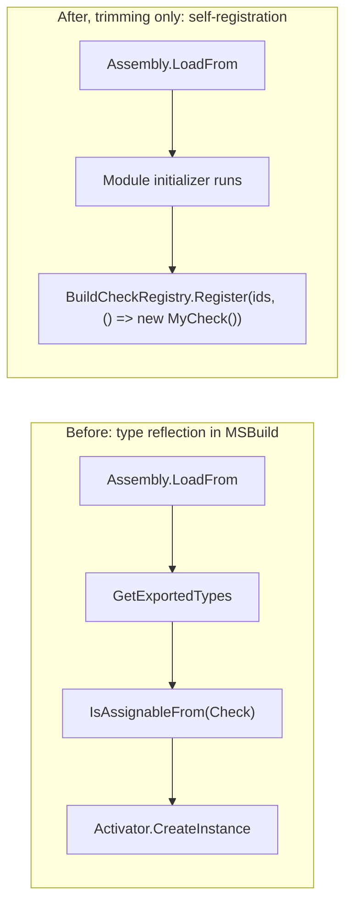

# BuildCheck: execution model, discovery, and a proposal to remove reflection

**Status:** Design proposal. Option 1 (fail custom checks observably under trim/AOT) is implemented; Options 2-3 are not.

This document explains how the BuildCheck (MSBuild analyzer) system works: when checks
run relative to evaluation and execution, how they are discovered and registered, how
they are invoked, and which parts of the system are public. It ends with a concrete
proposal to remove reflection from the model, either permanently or only in
trimmed/AOT scenarios.

It complements the existing specs:

* [BuildCheck - Design Spec](../specs/BuildCheck/BuildCheck.md) (user point of view)
* [BuildCheck - Architecture and Implementation Spec](../specs/BuildCheck/BuildCheck-Architecture.md) (internal)
* [Custom BuildCheck Analyzers](../specs/BuildCheck/CustomBuildCheck.md)

All file references point at the implementation under
[`src/Build/BuildCheck`](../../src/Build/BuildCheck) and
[`src/Framework/BuildCheck`](../../src/Framework/BuildCheck). Line numbers drift;
search by member name if a link looks stale.

---

## TL;DR (direct answers)

* **When do checks run? Are they part of evaluation, or only execution?**
  Neither, exclusively. BuildCheck is a **cross-cutting observer of the entire build**.
  It consumes build data as that data is produced and fires each check's registered
  callbacks **synchronously as the relevant data arrives**. That data spans *both*
  phases: evaluation-derived data (evaluated properties/items, property reads/writes,
  environment-variable reads, imports) and execution data (task invocations,
  project start/finish). So evaluation-oriented checks effectively run during/just
  after evaluation, and execution-oriented checks run during execution - but the check
  code itself lives in the BuildCheck infrastructure (a logger plus an engine
  component), not inside the evaluator or the task host.

* **How are checks discovered?**
  Two kinds. **Built-in ("inbox") checks** are a compile-time list instantiated with
  `new()` (no reflection). **Custom checks** ship as NuGet packages, are announced by a
  `$([MSBuild]::RegisterBuildCheck(<path>))` property-function call during evaluation,
  and are loaded by reflection from the assembly path.

* **How are they run?**
  Each check's `Initialize` method registers callbacks for the data categories it cares
  about. The infrastructure translates incoming build data into a small typed object
  model and invokes those callbacks. A check reports findings via `ReportResult`; the
  infrastructure filters/severity-maps them and emits them through the normal MSBuild
  logging pipeline as warnings/errors/messages.

* **Is any of it public?**
  Yes. The authoring surface is **public but `[Experimental]`**, in namespace
  `Microsoft.Build.Experimental.BuildCheck` (`Check`, `CheckRule`, `CheckConfiguration`,
  `BuildCheckResult`, the `CheckData` object model, etc.). The infrastructure
  (manager, acquisition module, event handler, event args) is internal.

* **Where is the reflection?**
  In exactly one place: custom-check loading in
  [`BuildCheckAcquisitionModule.CreateCheckFactories`](../../src/Build/BuildCheck/Acquisition/BuildCheckAcquisitionModule.cs)
  (`Assembly.LoadFrom` -> `GetExportedTypes` -> `IsAssignableFrom` ->
  `Activator.CreateInstance`). Built-in checks use none.

---

## How BuildCheck works (in brief)

The TL;DR above is all the orientation the proposal below needs; the full execution model
(logger-plus-engine-component hosting, live/replay modes, discovery and registration, the check
lifecycle, the event-to-callback pipeline, and the public `[Experimental]` authoring surface) lives
in the BuildCheck specs linked at the top of this document and is not repeated here.

The one fact the rest of this document turns on: **built-in checks are a compile-time list
instantiated with `new()` (no reflection); custom checks are loaded by reflection from a NuGet
assembly path.** Everything below follows from that split.

---

## Where reflection lives

The entire reflective surface of BuildCheck is the custom-check loader,
[`BuildCheckAcquisitionModule.CreateCheckFactories`](../../src/Build/BuildCheck/Acquisition/BuildCheckAcquisitionModule.cs):

```csharp
// 1. Load a third-party assembly from a path
assembly = s_coreClrAssemblyLoader.LoadFromPath(path);   // net core
// assembly = Assembly.LoadFrom(path);                   // net472

// 2. Enumerate its public types
Type[] availableTypes = assembly.GetExportedTypes();

// 3. Find the ones that are checks
Type[] checkTypes = availableTypes.Where(t => typeof(Check).IsAssignableFrom(t)).ToArray();

// 4. Build a factory per check that instantiates it
checksFactories.Add(() => (Check)Activator.CreateInstance(checkCandidate)!);
```

That is the only place. The trim/AOT analyzer therefore flags a chain of
`[RequiresUnreferencedCode]` members rooted here:

| Member | File | Why |
| --- | --- | --- |
| `IBuildCheckAcquisitionModule.CreateCheckFactories` | `Acquisition/IBuildCheckAcquisitionModule.cs` | contract for the loader |
| `BuildCheckAcquisitionModule.CreateCheckFactories` | `Acquisition/BuildCheckAcquisitionModule.cs` | the reflection above |
| `IBuildCheckManager.ProcessCheckAcquisition` / impl | `Infrastructure/IBuildCheckManager.cs`, `BuildCheckManagerProvider.cs` | calls the loader |
| `RegisterCustomCheck`, `SetupSingleCheck` | `Infrastructure/BuildCheckManagerProvider.cs` | invoke the reflectively-built factories |

Two call sites had to either propagate `[RequiresUnreferencedCode]` or suppress it,
because they sit on boundaries that cannot carry the attribute (an event handler and a
mixed built-in/custom setup loop):

* `BuildCheckBuildEventHandler.HandleBuildCheckAcquisitionEvent` (the event-dispatch
  boundary).
* `BuildCheckManagerProvider.SetupChecksForNewProject` (materializes *all* checks for a
  project - built-in and custom - so it cannot simply be marked RUC without implying
  built-in checks are unsafe).

Built-in checks contribute **zero** reflection: their factories are `Construct<T>()`
(`new()`), and the type list is referenced at compile time.

---

## Proposal: removing reflection

The original brief was to remove reflection "permanently, or in AOT scenarios only."
Answering honestly means separating two publish modes that are usually lumped together as
"trim/AOT" but that have **opposite** capabilities here.

### Trimming is not AOT, and that decides what is possible

* **Trimming (`PublishTrimmed`)** still uses the JIT (or ReadyToRun with a JIT fallback).
  **Runtime assembly loading works**: `Assembly.LoadFrom` of a custom-check package
  succeeds and the loaded code runs. The trimmer's only concern is that it could not see,
  and may have removed, types that the loaded assembly - or MSBuild's reflection over it -
  depends on. So the BuildCheck reflection (`GetExportedTypes` / `IsAssignableFrom` /
  `Activator`) is a trim-*correctness* warning (IL2026 / IL2070), not a hard block.
  **Custom checks can work under trimming.**
* **Native AOT (`PublishAot`)** has no JIT. **An external managed assembly cannot be
  loaded and executed at run time at all** - there is no compiled code for its types. A
  custom check ships as a NuGet assembly that was never part of the AOT image, so it can
  never load or run under AOT. This is a hard platform limitation, not an annotation
  problem: **no design that loads a third-party check by path can support Native AOT.**

So:

* **Built-in checks** (compiled into `Microsoft.Build`, instantiated with `new()`) work
  everywhere, including AOT.
* **Custom checks** are categorically **impossible under Native AOT** and must be disabled
  there. Under trimming they remain possible; their only problem is the type-reflection
  warnings.

### What "remove reflection" can and cannot mean

* You **cannot** remove *all* reflection while still supporting load-by-path third-party
  checks: loading the assembly (`Assembly.LoadFrom`) is irreducible and is itself
  `[RequiresUnreferencedCode]`.
* You **can** remove the *type-discovery + `Activator`* reflection MSBuild performs over
  the loaded assembly - but that only helps **trimming**, because under AOT the assembly
  cannot load in the first place.
* The only way to make BuildCheck *fully* reflection-free permanently is to **stop
  supporting load-by-path third-party checks** (ship only built-in or compile-time-
  referenced checks).

### Option 1 - Fail custom checks observably under trim/AOT (the only AOT story)

Gate the acquisition path behind the existing
[`FeatureSwitches.EnableCustomPluginProbing`](../../src/Framework/FeatureSwitches.cs)
`[FeatureGuard(typeof(RequiresUnreferencedCodeAttribute))]` switch - the same mechanism
already used for plugin-dependency probing (`MSBuildLoadContext`) and task-assembly
resolution (`TaskEngineAssemblyResolver`). The switch is `true` under the JIT and
substituted `false` when trimmed (via a `RuntimeHostConfigurationOption`).

Because a project *explicitly* requests a custom check, the disabled branch must obey
MSBuild's [fail-observably design criterion](managing-trimming-and-aot.md#msbuilds-overriding-design-criterion-fail-observably-never-silently):
it does **not** silently drop the request, it raises a build **error** naming the check it
could not load, so an AOT host can detect the failure and fall back to a JIT MSBuild.
(Unlike `MSBuildLoadContext`/`TaskEngineAssemblyResolver`, which return `null` and defer to
the default resolver - which itself fails observably when an assembly is genuinely missing -
acquisition has no such downstream failure, so it must raise the error itself.)

```csharp
if (FeatureSwitches.EnableCustomPluginProbing)
{
    // existing reflective acquisition
}
else
{
    // The project asked for a custom check this host cannot load by reflection. Fail
    // observably instead of returning silently, so the host can detect it and fall back.
    string message = ResourceUtilities.FormatResourceStringStripCodeAndKeyword(
        out string? errorCode,
        out string? helpKeyword,
        "BuildCheckCustomCheckNotSupportedInTrimmedHost",
        acquisitionData.AssemblyPath);

    checkContext.DispatchAsErrorFromText(
        null,
        errorCode,
        helpKeyword,
        string.IsNullOrEmpty(acquisitionData.ProjectPath)
          ? BuildEventFileInfo.Empty
          : new BuildEventFileInfo(acquisitionData.ProjectPath),
        message);
}
```

* **Under the JIT:** unchanged - custom checks load and run exactly as today.
* **Under trim/AOT:** custom-check acquisition cannot run, so the guard's disabled branch
  **emits a build error** naming the check it could not load (it never silently drops the
  project's request); built-in checks run normally; the trimmer dead-strips the reflective
  branch and the IL2026 warnings disappear with no suppression.
* **This is the only correct behavior under Native AOT** - you cannot load the check
  assembly at all, so failing observably (rather than attempting and crashing, or skipping
  in silence) is the only option. It is also a reasonable, detectable failure under
  trimming.
* **Status: implemented.** The event-handler entry point
  (`HandleBuildCheckAcquisitionEvent`) is guarded by `EnableCustomPluginProbing`, and its
  disabled branch **dispatches a localized MSB4284 build error** instead of silently returning (the
  observable-failure contract). `ProcessCheckAcquisition` and `CreateCheckFactories` keep
  `[RequiresUnreferencedCode]` and are reachable only through that guarded entry, so the
  analyzer treats the reflective acquisition as removed under trim. The materialization loop
  turned out to need **no** annotation: `SetupChecksForNewProject` -> `SetupSingleCheck` and
  `RegisterCustomCheck` only invoke already-built `CheckFactory` delegates (built-in =
  `Construct<T>()`; custom factories are built, and stay RUC, in `CreateCheckFactories`), so
  their former `[RequiresUnreferencedCode]` and the `SetupChecksForNewProject`
  `[UnconditionalSuppressMessage]` were over-broad and have been removed. No suppression
  remains on the acquisition path.
* **Pros:** tiny, low-risk, preserves full JIT behavior, removes the suppressions, and
  fails observably (a build error a host can detect and fall back from) rather than
  silently dropping the check.
* **Cons:** a trimmed/AOT MSBuild **cannot** run a project's custom checks - it reports a
  build error for each requested check (an intentional, detectable behavior change for
  those configurations), and the reflection code still exists in the JIT build.

### Option 2 - Reduce reflection under *trimming* via self-registration (does NOT enable AOT)

This option is **only about the trimmed-but-jitted case.** It removes the type-discovery
and `Activator` reflection so custom checks keep working under trimming with the IL2026 /
IL2070 warnings gone. It does **not** make custom checks work under Native AOT: the loaded
assembly still has to execute, and AOT cannot execute a separately loaded assembly. Under
AOT this path is still skipped by Option 1.

Replace MSBuild's type discovery with an explicit registration contract emitted by the
custom-check template's source generator - for example a **module initializer** that
self-registers when the assembly is loaded:

```csharp
[ModuleInitializer]
internal static void Register()
    => BuildCheckRegistry.Register(MyCheck.Rules, static () => new MyCheck());
```

MSBuild's loader becomes: load the assembly (which runs the module initializer); the
assembly hands back typed `() => new MyCheck()` factories. No `GetExportedTypes`, no
`IsAssignableFrom`, no `Activator.CreateInstance` on the MSBuild side.



* **Pros (trimming only):** removes MSBuild-side **type** reflection (the IL2026 / IL2070
  on `GetExportedTypes` / `IsAssignableFrom` / `Activator`); the author's `new MyCheck()`
  factories are trim-safe inside their own assembly; aligns with how source generators
  self-register.
* **Cons:** does **not** help Native AOT at all - the `Assembly.LoadFrom` still cannot run
  there, and it remains `[RequiresUnreferencedCode]`. It also changes the custom-check
  **authoring contract** (the template must emit the registrar; existing checks recompile),
  which is acceptable only because the API is `[Experimental]`, and needs a new public
  `BuildCheckRegistry.Register(...)` API.

### Option 3 - Permanent, total removal: drop load-by-path checks

The only way to remove **all** reflection (including `Assembly.LoadFrom`) permanently and
in every mode is to stop supporting third-party checks loaded by path - ship only built-in
checks, or checks referenced at compile time. That deletes the custom-check plugin model
entirely. It is the only thing that makes the *whole* BuildCheck system AOT-capable with no
reflection, but it is a large product decision and is not recommended unless the plugin
model is judged not worth its cost.

### Recommendation

* **For AOT there is exactly one option: Option 1.** You cannot load a custom check under
  Native AOT, so the correct behavior is to stop attempting acquisition and instead **fail
  observably** (a build error per requested check) while built-in checks keep working -
  letting an AOT host detect the failure and fall back to a JIT MSBuild. Completing the
  `EnableCustomPluginProbing` guard across all four acquisition entry points *is* what
  "remove reflection in AOT scenarios only" means in practice, and it is already started.
* **For trimming**, Option 1 (disable) is the simplest. If custom checks should keep
  *working* under trimming, layer Option 2 (self-registration) on top to drop the
  type-reflection warnings - but treat it as a trimming refinement, not an AOT enabler; it
  still guards off under AOT.
* **Option 3** (dropping load-by-path checks) is the only route to a fully reflection-free
  model and should be considered only if first-class AOT support for *all* checks ever
  becomes a hard requirement.
