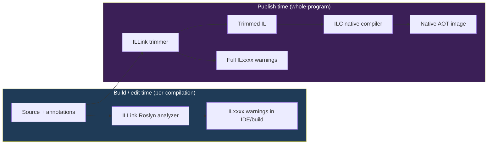
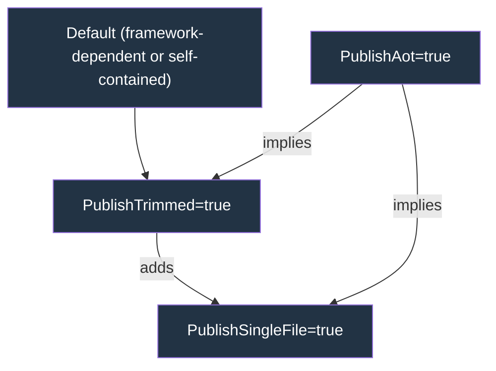
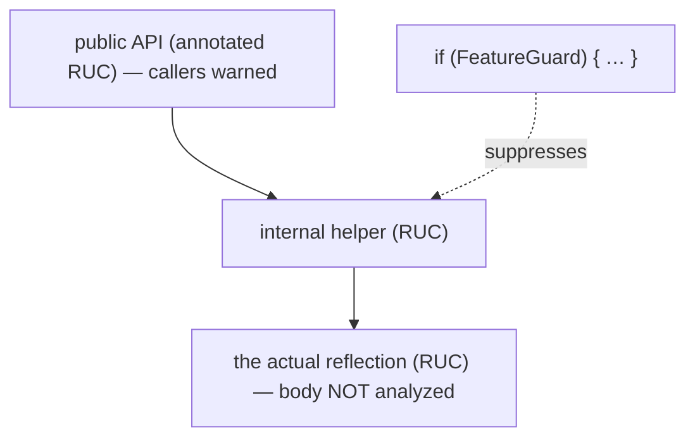
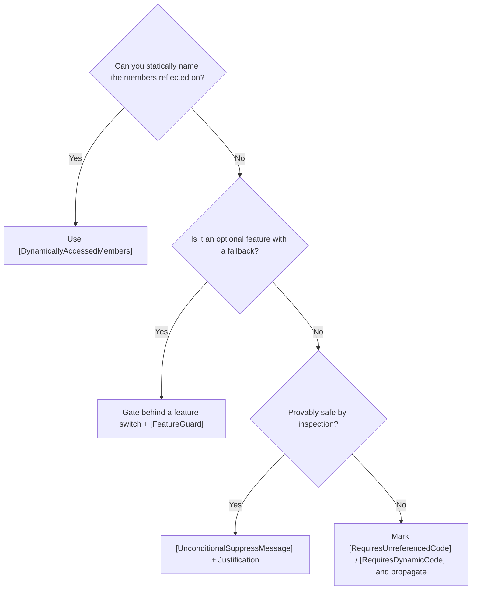
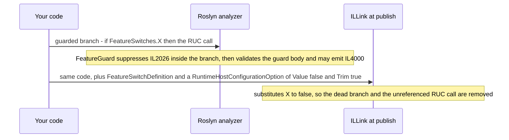
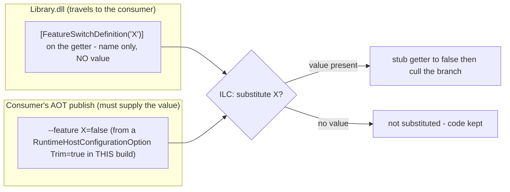
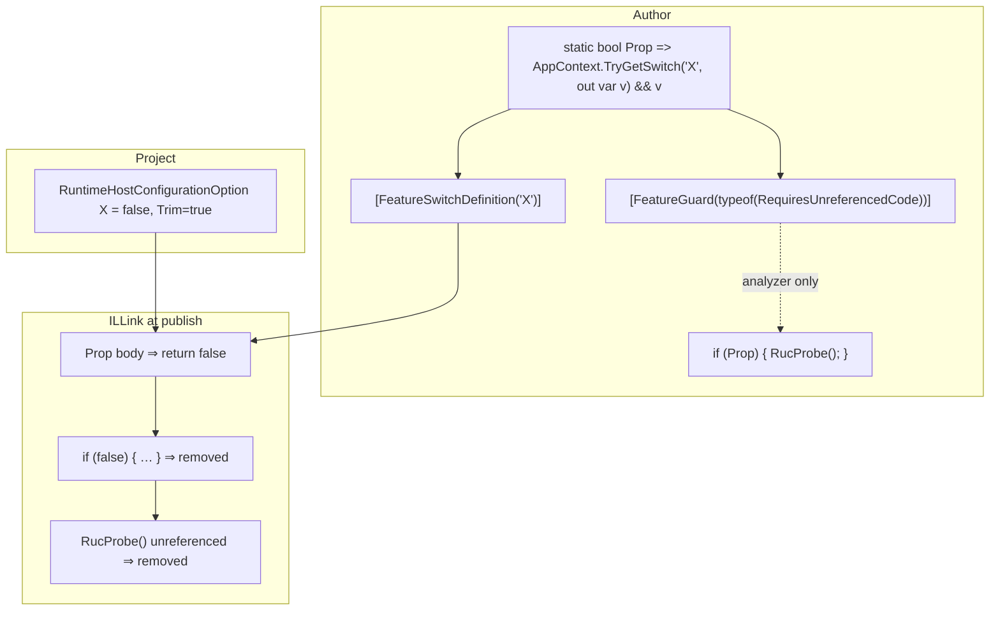
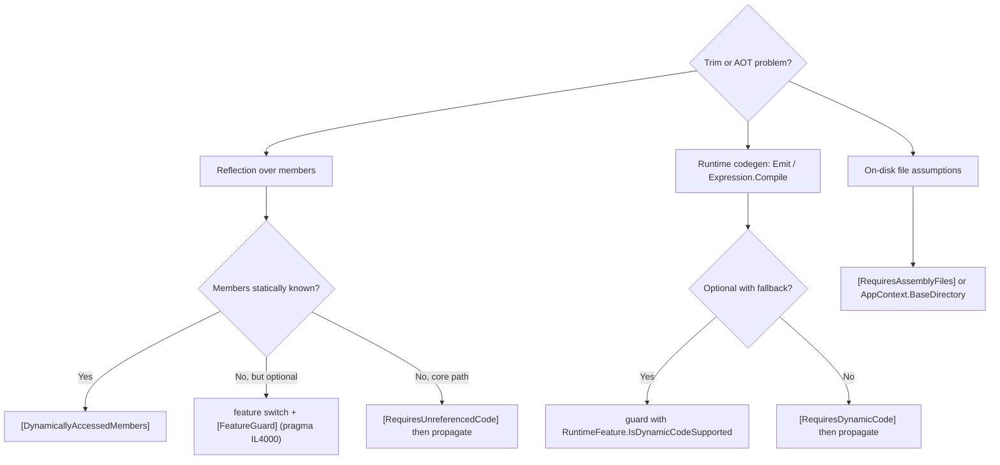

# Managing Trimming and Native AOT Annotations

**Status:** Living reference.

A practical, source-grounded guide to making code trim- and AOT-safe, written for an
expert developer who is **completely new to this space**. It explains the annotation
model (`[RequiresUnreferencedCode]`, `[DynamicallyAccessedMembers]`,
`[FeatureSwitchDefinition]`, `[FeatureGuard]`, …), exactly what the **analyzer** does at
build time versus what the **trimmer / AOT compiler** does at publish time, and the
**precise** runtime limitations of trimming, single-file, and Native AOT — including
which limitations are configurable.

**How to read this:** §1-4 are the on-ramp (the mental model and the four annotations) - read these
first. §5-7 are **deep reference** (exact per-mode limitations and feature-switch internals) to return
to when you need specifics; §8-9 are day-to-day conventions and a cheat sheet.

> Companion documents (see the [folder README](README.md) for the full map):
> [aot-trimming-strategy.md](aot-trimming-strategy.md) is the **strategy layer** (decide what to do with
> an AOT-unfriendly path); [aot-trim-suppressions.md](aot-trim-suppressions.md) is the **live tracker** of
> every active suppression. This guide explains the *why* (the mechanics) behind both.

---

## 1. TL;DR / mental model

There are **two independent machines** that read the same annotations:

| | Build / edit time | Publish time |
| --- | --- | --- |
| **Tool** | ILLink **Roslyn analyzer** (in-process with the C# compiler) | **ILLink** trimmer (`PublishTrimmed`) / **ILC** AOT compiler (`PublishAot`) |
| **Sees** | One method/assembly at a time, a *limited* subset of patterns | The whole-program closure of everything reachable |
| **Produces** | Squiggles / `ILxxxx` warnings | The trimmed or native output, plus the full set of `ILxxxx` warnings |
| **Acts on switches** | Treats `[FeatureGuard]` as a guard; does **not** constant-fold feature switches | **Substitutes** `[FeatureSwitchDefinition]` properties to a constant and removes dead branches |

The annotations are a **contract** you write so that *both* machines agree on what is
safe. The analyzer gives you fast, local feedback; the trimmer/ILC make the actual
decisions about what code survives.



**Golden rules**

1. Prefer *expressing intent* (`[DynamicallyAccessedMembers]`, feature switches) over
   *silencing* (`[UnconditionalSuppressMessage]`).
2. When code is genuinely incompatible, mark it `[RequiresUnreferencedCode]` /
   `[RequiresDynamicCode]` and **propagate** the attribute up to a public boundary.
3. **Suppress only a false positive.** `[UnconditionalSuppressMessage]` is permitted
   **only when the warning is inaccurate** - the code is provably safe and the analyzer
   simply cannot see it. Never suppress an *accurate* warning to make a build quiet.

### MSBuild's overriding design criterion: fail observably, never silently

MSBuild is being made trim/AOT-capable so that an **AOT-compiled host - the dotnet CLI -**
can run the MSBuild object model in-process (MSBuild is compiled into the host). When a
project needs something the AOT host cannot do (load a task, SDK resolver, logger, or
build check by reflection; emit dynamic code; ...), the host must **detect the failure and
fall back** to a JIT-based MSBuild (the managed CLI, or `MSBuild.exe` out of process).
That fallback only works if MSBuild fails *observably*. Therefore, for any code the
trim/AOT analyzers flag:

* **No silent failures.** A path that cannot work under trim/AOT must surface a build
  **error** (or otherwise fail in a host-detectable way) - never quietly do nothing or
  return a wrong result. A project that registers a custom check, a custom task, etc. is
  expressing intent; dropping that intent without a word is a silent failure.
* **No crashes.** An unhandled exception or `PlatformNotSupportedException` deep in the
  engine is *worse* than an error - a host cannot cleanly fall back from a crash. Convert
  incompatible paths into clean, reported errors.
* **`[UnconditionalSuppressMessage]` may NEVER be used if it causes a silent failure or a
  crash.** The only valid suppression is a known-inaccurate warning (rule 3 above). If the
  warning is accurate, suppressing it hides exactly the signal the host relies on to fall
  back.
* **Reachable incompatible paths fail observably via a guard.** When a path is genuinely
  incompatible and a project can reach it, gate it behind a feature guard
  (`[FeatureGuard]`) whose *disabled* branch raises a reported error. That keeps full
  behavior under the JIT and turns the unsupported case into a clean, detectable failure
  under trim/AOT - not a silent skip, and not a suppression.

In one line: **express intent, or fail loudly - never suppress a real problem, never go
silent, never crash.**

---

## 2. The three deployment modes




`PublishAot` is the strict superset: it **implies trimming and single-file**, and adds
its own native-code constraints. So an AOT-*compatible* library is automatically trim- and
single-file-compatible, but not vice-versa.

> **Trimming and AOT happen only at the *final* compilation.** They are whole-program steps
> that run **once**, at the leaf application's `dotnet publish` — there is no library-to-library
> or intermediate AOT, and no "AOT-to-AOT" build. A library (even one marked
> `IsAotCompatible`/`IsTrimmable`) always ships as **IL**; `IsAotCompatible` is a static
> *annotation/promise*, whereas AOT *compilation* (ILC) and trimming (ILLink) run only in the
> app that publishes. So where this guide says a library "trims/AOTs," it is shorthand for
> *a consuming application trims or AOT-publishes a closure that includes that library.*

| Mode | MSBuild switch | What the toolchain does | Analyzer enabled by |
| --- | --- | --- | --- |
| **Trimming** | `PublishTrimmed=true` | ILLink removes unreferenced types/members; substitutes feature switches; disables trim-incompatible framework features. | `EnableTrimAnalyzer` |
| **Single-file** | `PublishSingleFile=true` | Bundles assemblies into one host executable; files are no longer on disk. | `EnableSingleFileAnalyzer` |
| **Native AOT** | `PublishAot=true` | Runs the trimmer, then ILC compiles IL → native code; **no JIT** ships. | `EnableAotAnalyzer` |

A library opts into **all** of the relevant analyzers at once with:

```xml
<IsAotCompatible>true</IsAotCompatible>
<!-- defaults IsTrimmable, EnableTrimAnalyzer, EnableSingleFileAnalyzer, EnableAotAnalyzer = true -->
```

`<IsTrimmable>true</IsTrimmable>` alone marks the assembly trimmable and enables only the
trim analyzer. Use `<EnableTrimAnalyzer>true</EnableTrimAnalyzer>` to get warnings without
marking the assembly trimmable.

> **TFM note:** the analyzers run only on .NET 8+ (`net8.0` for AOT/single-file analyzers,
> `net6.0`+ for trim). They do **not** run on `net472`/`netstandard2.0`. This matters for
> multi-targeted projects like MSBuild — see [§8](#8-msbuild-specific-conventions).

---

## 3. The warning families

Authoritative index: [dotnet/runtime `docs/tools/illink/error-codes.md`](https://github.com/dotnet/runtime/blob/main/docs/tools/illink/error-codes.md).

| Range | Family | Emitted for | Typical cause |
| --- | --- | --- | --- |
| **IL2xxx** | Trim analysis | `PublishTrimmed` / `IsTrimmable` | Reflection the trimmer can't follow |
| **IL3000–IL3002** | Single-file | `PublishSingleFile` | `Assembly.Location`, `Assembly.GetFiles`, `[RequiresAssemblyFiles]` |
| **IL3050–IL30xx** | AOT (dynamic code) | `PublishAot` | `Reflection.Emit`, `MakeGenericType`, runtime codegen |
| **IL4000–IL4001** | Feature checks | trim analysis | A `[FeatureGuard]` whose body the analyzer can't validate |

The most important individual codes:

| Code | Meaning |
| --- | --- |
| **IL2026** | Calling a method annotated `[RequiresUnreferencedCode]`. |
| **IL2067–IL2095** | Dataflow: a `Type`/member value doesn't satisfy a `[DynamicallyAccessedMembers]` requirement (parameter `…67`, return `…73/74`, field `…74/77`, `this` `…70/75`, generic `…91/96`, etc.). |
| **IL2057** | `Type.GetType(string)` with a name not statically known. |
| **IL3000** | `Assembly.Location` is empty in a single-file app. |
| **IL3001** | `Assembly.GetFiles` / satellite probing not available single-file. |
| **IL3002** | Calling a method annotated `[RequiresAssemblyFiles]`. |
| **IL3050** | Calling a method annotated `[RequiresDynamicCode]`. |
| **IL4000** | A `[FeatureGuard]` property's body doesn't *provably* return `false` when the guarded feature is disabled (see [§6.4](#64-the-il4000-gotcha-the-definitive-explanation)). |

---

## 4. The core annotations

All live in `System.Diagnostics.CodeAnalysis`. On older TFMs they are polyfilled (MSBuild
keeps copies in [AotTrimmingPolyfills.cs](../../src/Framework/Polyfills/AotTrimmingPolyfills.cs)).

### 4.1 The "Requires" family — *"this code is fundamentally incompatible"*

`[RequiresUnreferencedCode]` (RUC, → IL2026), `[RequiresDynamicCode]` (RDC, → IL3050),
`[RequiresAssemblyFiles]` (→ IL3002).

Putting one of these on a method does two things:

1. **Silences all in-body trim/AOT warnings** for that method (the method is declared
   incompatible, so the analyzer stops checking *inside* it).
2. **Warns at every caller** — which you fix by propagating the same attribute up, until
   you reach a public API boundary or a guarded call site.



> **Key subtlety used throughout MSBuild:** RUC on a method also covers **lambdas and
> local functions** declared inside it. That is why
> `TypeLoader.AssemblyInfoToLoadedTypes.IsDesiredType` can call `Type.GetInterface`
> with no per-call suppression — it is only reached from `[RequiresUnreferencedCode]`
> load methods whose RUC covers the nested closures.

### 4.2 `[DynamicallyAccessedMembers]` (DAM) — *"preserve these members"*

When you *can* describe statically which members reflection will touch, annotate the
`Type`/parameter/field/return with the member kinds to keep. The trimmer preserves them;
the analyzer flows the requirement to every assignment and call (IL2067-family) until it
reaches a concrete `typeof(...)` or another annotation.

```csharp
static void Use([DynamicallyAccessedMembers(DynamicallyAccessedMemberTypes.PublicMethods)] Type t)
    => t.GetMethods();          // no warning: the requirement is satisfied by the annotation
```

This is the **preferred** fix: it is machine-checked end-to-end, unlike a suppression.
MSBuild example: [TypeExtensions.InvokeMemberPublicOnly](../../src/Framework/Utilities/TypeExtensions.cs)
annotates its receiver with the exact public-member surface it binds.

### 4.3 Escape hatches — `[UnconditionalSuppressMessage]` and `[DynamicDependency]`

- `[UnconditionalSuppressMessage("Trimming", "IL2026", Justification = "…")]` — persisted
  in IL and honored by the trimmer. Use **only** when you can guarantee safety by
  inspection. The `Justification` must explain the invariant.
- `[DynamicDependency("Member", typeof(T))]` — *keeps* a member the trimmer would
  otherwise remove. It does **not** silence warnings on its own; pair with a suppression.

### 4.4 Choosing an annotation



### 4.5 What silences which warning, and what cannot

Each mechanism covers a specific slice of the warning space. The single most important fact,
and the one most often gotten wrong: **feature switches and `[FeatureGuard]` only ever silence
the three "Requires\*" call-site warnings (IL2026 / IL3050 / IL3002). They never silence a
dataflow (DAM) warning** (the IL2067–IL2095 band).

| To clear this warning | Use |
| --- | --- |
| **IL2026** `RequiresUnreferencedCode` | `[FeatureGuard(typeof(RequiresUnreferencedCodeAttribute))]`, or propagate `[RequiresUnreferencedCode]`, or `[UnconditionalSuppressMessage]` |
| **IL3050** `RequiresDynamicCode` | `[FeatureGuard(typeof(RequiresDynamicCodeAttribute))]` (`RuntimeFeature.IsDynamicCodeCompiled` / `IsDynamicCodeSupported`), or propagate `[RequiresDynamicCode]`, or suppress |
| **IL3002** `RequiresAssemblyFiles` | `[FeatureGuard(typeof(RequiresAssemblyFilesAttribute))]`, or propagate, or suppress |
| **IL2067–IL2095** dataflow (DAM on param/return/field/`this`/generic) | `[DynamicallyAccessedMembers]` on the value's declaration, or `[UnconditionalSuppressMessage]` — **never a switch or guard** ([§4.6](#46-why-a-feature-switch-cannot-silence-a-dataflow-warning)) |
| **IL2057** `Type.GetType(string)` | a statically-known type name + `[DynamicallyAccessedMembers]`, or suppress |
| **IL3000 / IL3001** single-file file APIs | `AppContext.BaseDirectory`, `[RequiresAssemblyFiles]`, or suppress |

Read the other way — exactly what each guard covers:

| `[FeatureGuard(typeof(...))]` | Silences | Does **not** silence |
| --- | --- | --- |
| `RequiresUnreferencedCodeAttribute` | IL2026 | IL3050, IL3002, **all dataflow** |
| `RequiresDynamicCodeAttribute` | IL3050 | IL2026, IL3002, **all dataflow** |
| `RequiresAssemblyFilesAttribute` | IL3002 (+ IL3000/IL3001 patterns) | IL2026, IL3050, **all dataflow** |

`FeatureGuardAttribute` is `AllowMultiple = true`, so one property can stack guards and silence
several "Requires" families at once — MAUI's `IsHybridWebViewSupported` carries both
`RequiresUnreferencedCode` and `RequiresDynamicCode` ([§6.6](#66-external-example-a-product-switch-registry-maui)).
There is still **no** stack that reaches dataflow.

### 4.6 Why a feature switch cannot silence a dataflow warning

This is the question everyone asks: *"I guard the reflection with `if (!Switch) return;` and I
know the trimmer deletes that branch — so why does IL2075 still fire?"* Three facts explain it:

1. **You are looking at the analyzer, not the trimmer.** The warning comes from the Roslyn
   ILLink **analyzer**, which runs per-method at compile time — before any publish-time elision.
   When it runs, nothing has been trimmed.
2. **The analyzer never constant-folds a feature switch.** Per [§6.2](#62-the-three-pieces-and-exactly-what-each-does),
   `[FeatureSwitchDefinition]` is *metadata* to the analyzer; it does not evaluate the switch or
   treat either branch as dead. Both branches are "live," so every warning in them is reported.
   The dead-branch removal is the **trimmer's** job at publish ([§7](#7-end-to-end-how-a-feature-switch-is-removed)).
3. **`[FeatureGuard]` is a narrow exception that, by construction, only covers "Requires."** A
   guard lets the analyzer accept one specific claim inside `if (guard)`: *"a method that requires
   capability X was called."* A dataflow warning is a different kind of claim — *"this `Type`
   value must carry [these members], but the value flowing in doesn't promise them."* No boolean
   can express which members a `Type` carries; that fact can only travel **with the value**, as a
   `[DynamicallyAccessedMembers]` annotation. So there is nothing for a guard to certify, and no
   guard-shaped form of it exists.

**What elision actually buys you.** If you *do* supply the switch value (`Trim="true"`), the
trimmer folds the getter to a constant, removes the dead branch, and emits **no publish-time**
warning for the removed code — the elision is real. But it happens at publish, in the trimmer;
it does not retroactively quiet the build-time analyzer, and official builds fail on the analyzer
warning. So a dataflow warning has exactly two cures, both of which satisfy the analyzer itself:
annotate the flow with `[DynamicallyAccessedMembers]` (preferred — machine-checked end to end),
or `[UnconditionalSuppressMessage]` it where you can prove safety by inspection.

> **Rule of thumb:** if the code is in the **IL2067–IL2095** dataflow band, stop looking for a
> switch — reach for a DAM annotation or a localized suppression. Switches and guards are for the
> **IL2026 / IL3050 / IL3002** "Requires" family only.

---

> **Deep reference begins here.** §1-4 above are the on-ramp; the sections below (exact per-mode
> limitations, the feature-switch deep dive, and the end-to-end removal walkthrough) are reference
> material - consult them as needed rather than reading front to back.

## 5. Single-file, trimming, and AOT: exact limitations

### 5.1 Trimming (`PublishTrimmed`)

**What it does:** whole-program reachability analysis; unreferenced types/members are
removed; feature switches are substituted; trim-incompatible framework features are
disabled by default.

**Runtime reality:** the JIT is still present — you *can* still `Assembly.LoadFrom`, emit
IL, etc. The hazard is purely that **members the trimmer couldn't see may be gone**, so
reflection over them throws `MissingMethod`/`MissingMember` or returns `null`.

**Framework features _disabled by default_ when trimming** (re-enable "at your own risk"):
`BuiltInComInteropSupport`, `CustomResourceTypesSupport`, `EnableCppCLIHostActivation`,
`EnableUnsafeBinaryFormatterInDesigntimeLicenseContextSerialization`, `StartupHookSupport`.

### 5.2 Single-file (`PublishSingleFile`)

**What it does:** bundles managed assemblies into the host executable; at runtime they are
loaded from the bundle, not from files on disk.

**Exact limitations** (the IL300x analyzer covers these):

| API | Behavior single-file |
| --- | --- |
| `Assembly.Location` | Returns an **empty string** (IL3000). |
| `Assembly.GetFiles`, `Assembly.CodeBase`, `Module.FullyQualifiedName` | Throw / unavailable (IL3001). |
| `AppContext.BaseDirectory` | Works (points at the extraction/app dir). |
| Native libraries | Extracted or loaded from bundle depending on settings. |

**Configurable:** `IncludeNativeLibrariesForSelfExtract`,
`IncludeAllContentForSelfExtract`, `EnableCompressionInSingleFile`, `SelfContained`.

### 5.3 Native AOT (`PublishAot`)

**What it does:** ILC compiles IL to native code ahead of time. **No JIT ships.** Implies
trimming + single-file.

**Exact, non-negotiable limitations** (from the
[official limitations list](https://learn.microsoft.com/dotnet/core/deploying/native-aot/#limitations-of-native-aot-deployment)):

- **No runtime code generation** — `System.Reflection.Emit`, `DynamicMethod`.
- **No dynamic assembly loading** — `Assembly.LoadFile`/`LoadFrom` of managed IL.
- **`System.Linq.Expressions` always interpreted** (never `Compile()`d) → slower.
- **No C++/CLI**, **no built-in COM** (Windows).
- **All generic instantiations are pre-generated** — struct type arguments and generic
  virtual methods expand at compile time, affecting binary size; instantiations that can't
  be discovered statically fail.
- Requires trimming (inherits all trim limitations) and single-file (all those too).
- Some runtime libraries aren't fully annotated → a few unactionable warnings.

**The runtime gate:** [`RuntimeFeature.IsDynamicCodeSupported`](https://learn.microsoft.com/dotnet/api/system.runtime.compilerservices.runtimefeature.isdynamiccodesupported)
is `false` under Native AOT and `true` under the JIT — it is the property you check to fall back
at run time:

```csharp
if (RuntimeFeature.IsDynamicCodeSupported)
    UseEmit();        // IL3050 suppressed here; ILC removes this branch
else
    UseFallback();
```

There are in fact **two** related properties, and it is worth knowing which is which. Under
Native AOT the runtime hard-codes both to `false`
([`RuntimeFeature.NativeAot.cs`](https://github.com/dotnet/runtime/blob/main/src/coreclr/nativeaot/System.Private.CoreLib/src/System/Runtime/CompilerServices/RuntimeFeature.NativeAot.cs)):

```csharp
[FeatureSwitchDefinition("System.Runtime.CompilerServices.RuntimeFeature.IsDynamicCodeSupported")]
public static bool IsDynamicCodeSupported => false;

[FeatureGuard(typeof(RequiresDynamicCodeAttribute))]
public static bool IsDynamicCodeCompiled => false;
```

| Property | Attribute | Role |
| --- | --- | --- |
| `IsDynamicCodeSupported` | `[FeatureSwitchDefinition]` | The **switch** the trimmer substitutes; the analyzer also recognizes a check of it as an IL3050 guard. |
| `IsDynamicCodeCompiled` | `[FeatureGuard(typeof(RequiresDynamicCodeAttribute))]` | The **explicit guard** (it just returns the switch). |

They diverge only on the Mono interpreter, where code is *supported* but never JIT-*compiled*
(`IsDynamicCodeSupported == true`, `IsDynamicCodeCompiled == false`). For an AOT-vs-JIT fork
either reads correctly; prefer `IsDynamicCodeCompiled` when the fallback exists specifically
because there is no compiled codegen (for example `Expression.Compile`). **Both gate IL3050
only** — neither silences IL2026 or any dataflow warning ([§4.5](#45-what-silences-which-warning-and-what-cannot)).

For MSBuild tasks that call runtime-code-generation APIs (`XslCompiledTransform`, `XmlSerializer`,
`Reflection.Emit`, `Expression.Compile`, and similar APIs), put the guard at the task entry point,
before any dynamic-code work runs:

```csharp
#if NET
if (!RuntimeFeature.IsDynamicCodeSupported)
{
  Log.LogErrorWithCodeFromResources(
    "<existing task error resource>",
    "Dynamic code generation is not supported in this runtime environment.");
  return false;
}
#endif
```

Use an existing task-specific error resource with a detail slot when one exists. The guard is `#if NET`
because .NET Framework always supports runtime code generation; add `using System.Runtime.CompilerServices;`
when needed. The analyzer recognizes the early return as an IL3050 guard, so entry-point IL3050 suppressions
can be removed while leaf helpers that actually require dynamic code keep `[RequiresDynamicCode]`.

Do not use this guard for trimming warnings. `RuntimeFeature.IsDynamicCodeSupported` does **not** silence
IL2026, IL2070/IL2075, IL2057, or any other dataflow warning. Those require the normal trim strategies:
remove the reflection, add DAM, use a `[FeatureGuard(typeof(RequiresUnreferencedCodeAttribute))]` switch,
register the type up front, or track the row as Backlog.

### 5.4 Configurable framework feature switches (trimming **and** AOT)

These MSBuild properties trim the corresponding code *and* set the matching
`runtimeconfig` switch. Full list + runtimeconfig names:
[feature-switches.md](https://github.com/dotnet/runtime/blob/main/docs/workflow/trimming/feature-switches.md).

| Property | Effect when set |
| --- | --- |
| `InvariantGlobalization=true` | Removes globalization data/code. |
| `UseSystemResourceKeys=true` | Strips `System.*` exception message text. |
| `EventSourceSupport=false` | Removes EventSource logic. |
| `MetadataUpdaterSupport=false` | Removes hot-reload support. |
| `StackTraceSupport=false` | Removes runtime stack-trace generation. |
| `DebuggerSupport=false` | Removes debugger aids (also strips symbols). |
| `HttpActivityPropagationSupport=false` | Removes `System.Net.Http` diagnostics. |
| `MetricsSupport=false` | Removes `System.Diagnostics.Metrics` instrumentation. |
| `AutoreleasePoolSupport=true` | Adds autorelease pools (Apple platforms). |
| `EnableUnsafeBinaryFormatterSerialization=false` | Removes `BinaryFormatter`. |
| `EnableUnsafeUTF7Encoding=false` | Removes UTF-7. |
| `XmlResolverIsNetworkingEnabledByDefault=false` | File-only XML resolving. |
| `UseSizeOptimizedLinq=true` (.NET 10+) | Smaller, less throughput-optimized LINQ (default under AOT). |

You can author **your own** switches with the same mechanism — that is [§6](#6-feature-switches-deep-dive).

---

## 6. Feature switches deep dive

This is the part most people get wrong, so it is the most detailed.

### 6.1 Design and history

- Original design: [dotnet/designs — feature-switch.md (2020)](https://github.com/dotnet/designs/blob/main/accepted/2020/feature-switch.md).
- Attribute model (the `[FeatureSwitchDefinition]`/`[FeatureGuard]` you use today):
  API proposal [dotnet/runtime#96859](https://github.com/dotnet/runtime/issues/96859),
  design discussion [dotnet/designs#305](https://github.com/dotnet/designs/pull/305),
  analyzer implementation [dotnet/runtime#94944](https://github.com/dotnet/runtime/pull/94944).
- API docs: [FeatureSwitchDefinitionAttribute](https://learn.microsoft.com/dotnet/api/system.diagnostics.codeanalysis.featureswitchdefinitionattribute),
  [FeatureGuardAttribute](https://learn.microsoft.com/dotnet/api/system.diagnostics.codeanalysis.featureguardattribute).

A **feature switch** is a named boolean (an `AppContext` switch) that the trimmer can fold
to a constant, letting it delete the disabled feature's code.

### 6.2 The three pieces and exactly what each does

| Piece | Where | Build/analysis time | Publish/trim time |
| --- | --- | --- | --- |
| `[FeatureSwitchDefinition("Name")]` | on a `static bool` property | Metadata only — the analyzer does **not** constant-fold it. | ILLink **substitutes the property body** with the configured constant, enabling dead-branch removal. |
| `[FeatureGuard(typeof(RequiresX))]` | on a `static bool` property | Analyzer treats `if (Prop)` as guarding `RequiresX` code → no IL2026/IL3050 inside; **validates** the guard body (→ IL4000). | Not used directly; the trimmer relies on substitution. |
| `RuntimeHostConfigurationOption Include="Name" Value="v" Trim="true"` | csproj | — | Writes the `runtimeconfig` default **and** (because `Trim="true"`) supplies the switch value `v` to ILLink, which drives the substitution above. **Build-local** — it is *not* embedded in the assembly and does **not** transit to consumers; see [§6.5](#65-how-a-librarys-switch-reaches-a-consumer-transitivity-defaulting-override). |




So: the **analyzer** uses `[FeatureGuard]` to stay quiet at call sites; the **trimmer**
uses `[FeatureSwitchDefinition]` + the host-config value to actually delete the code.
They are complementary and you normally need **all three** pieces.

**Where the SDK and runtime implement this.** `RuntimeHostConfigurationOption` is an
SDK/runtime item (not an MSBuild-engine one); three targets across two repos consume it:

| Consumer | Repo · target file | Target / how |
| --- | --- | --- |
| `runtimeconfig.json` `configProperties` | dotnet/sdk · [Microsoft.NET.Sdk.targets](https://github.com/dotnet/sdk/blob/main/src/Tasks/Microsoft.NET.Build.Tasks/targets/Microsoft.NET.Sdk.targets) | `GenerateBuildRuntimeConfigurationFiles` calls the `GenerateRuntimeConfigurationFiles` task with `HostConfigurationOptions="@(RuntimeHostConfigurationOption)"`. |
| Trim substitution (the `Trim="true"` half) | dotnet/runtime · [Microsoft.NET.ILLink.targets](https://github.com/dotnet/runtime/blob/main/src/tools/illink/src/ILLink.Tasks/build/Microsoft.NET.ILLink.targets) | `_PrepareTrimConfiguration` builds `@(_TrimmerFeatureSettings)` from options where `%(Trim)=='true'`; `_RunILLink` passes them as `FeatureSettings` to the `ILLink` task. |
| Native AOT | dotnet/runtime · [Microsoft.NETCore.Native.targets](https://github.com/dotnet/runtime/blob/main/src/coreclr/nativeaot/BuildIntegration/Microsoft.NETCore.Native.targets) | Emits `--feature:Name=Value` (from `_TrimmerFeatureSettings`) **and** `--runtimeknob:Name=Value` (from every option) to ILC. |

**Trimmer eligibility — the exact shape a feature-switch property must have.** ILLink only
substitutes a getter that passes
[`MemberActionStore.TryGetFeatureCheckValue`](https://github.com/dotnet/runtime/blob/main/src/tools/illink/src/linker/Linker/MemberActionStore.cs):
it must be **static**, **return `bool`**, be a **property getter**, and the property must
have **no setter**. There is **no accessibility requirement** — `public`, `internal`, and
`private` all work (the API docs' "public … property" wording is descriptive, not
enforced; the BCL and MSBuild both use `internal`). The switch value must also be *supplied*
(via `--feature`, i.e. the `Trim="true"` `RuntimeHostConfigurationOption`); a
`[FeatureSwitchDefinition]` with no supplied value is left untouched. When eligible,
[`CodeRewriterStep`](https://github.com/dotnet/runtime/blob/main/src/tools/illink/src/linker/Linker.Steps/CodeRewriterStep.cs)
(`RewriteBodyToStub` → `CreateStubBody`) **discards the entire body** and replaces it with
`return <const>` (`ldc.i4.0` / `ldc.i4.1`). Because the body is thrown away wholesale, its
logic is never evaluated at trim time — which is exactly why a body like
`AppContext.TryGetSwitch(...)` (or even one reading an environment variable) substitutes
correctly even though the analyzer cannot model it ([§6.4](#64-the-il4000-gotcha-the-definitive-explanation)).
Hard limits of the stub mechanism: the method must be IL (not an intrinsic/native method)
and must have no `out` parameters.

### 6.3 Worked example (MSBuild)

[FeatureSwitches.cs](../../src/Framework/FeatureSwitches.cs) +
[Microsoft.Build.Framework.csproj](../../src/Framework/Microsoft.Build.Framework.csproj):

```csharp
[FeatureSwitchDefinition("Microsoft.Build.EnableAllPropertyFunctions")]
[FeatureGuard(typeof(RequiresUnreferencedCodeAttribute))]
#pragma warning disable IL4000 // see §6.4
internal static bool EnableAllPropertyFunctions =>
  AppContext.TryGetSwitch("Microsoft.Build.EnableAllPropertyFunctions", out bool isEnabled)
    ? isEnabled
    : Environment.GetEnvironmentVariable("MSBUILDENABLEALLPROPERTYFUNCTIONS") == "1";
#pragma warning restore IL4000
```
```xml
<RuntimeHostConfigurationOption Include="Microsoft.Build.EnableAllPropertyFunctions" Value="false" Trim="true" />
```

At the probing call site in
[`GetTypeForStaticMethod`](../../src/Build/Evaluation/Expander.Function.cs) (in the
de-genericized `Expander<P, I>.Function` partial), the `[FeatureGuard]` lets the trim-unsafe
assembly-probing run with **no per-call `[UnconditionalSuppressMessage]`** — it replaced a
standing IL2026 suppression; the trimmer removes the whole branch from a trimmed/AOT build
because the switch folds to `false`. In untrimmed builds the getter preserves the legacy
`MSBUILDENABLEALLPROPERTYFUNCTIONS` behavior when the AppContext switch is unset; in trimmed/AOT
builds the getter body is replaced with `false`, so the environment variable cannot re-enable the
removed probing path.

### 6.4 The IL4000 gotcha (the definitive explanation)

You will hit `IL4000: "Return value does not match FeatureGuard annotations of the
property. The check should return false whenever any of the features referenced in the
FeatureGuard annotations is disabled."` — even for the textbook
`AppContext.TryGetSwitch(...) && isEnabled` body. Here is precisely why, from the analyzer
source:

The analyzer computes which features a guard body checks in
[`FeatureChecksVisitor`](https://github.com/dotnet/runtime/blob/main/src/tools/illink/src/ILLink.RoslynAnalyzer/DataFlow/FeatureChecksVisitor.cs):

```csharp
public override FeatureChecksValue DefaultVisit(IOperation operation, StateValue state)
{
    // Visiting a non-understood pattern should return the empty set of features, which will
    // prevent this check from acting as a guard for any feature.
    return FeatureChecksValue.None;
}
```

The **only** body shapes it understands as guarding a feature are:

- a reference to **another property that is itself a recognized `[FeatureGuard]`/Requires
  check** (e.g. `RuntimeFeature.IsDynamicCodeSupported`) — `VisitPropertyReference`;
- the **literal `false`** (guards everything) — `VisitLiteral`;
- boolean **combinations** of those (`!`, `==`, `!=`, `is` patterns).

`AppContext.TryGetSwitch(...)` is a **method invocation** — there is no `VisitInvocation`,
so it falls through to `DefaultVisit` → `FeatureChecksValue.None`. Then
[`FeatureCheckReturnValuePattern`](https://github.com/dotnet/runtime/blob/main/src/tools/illink/src/ILLink.RoslynAnalyzer/TrimAnalysis/FeatureCheckReturnValuePattern.cs)
reports IL4000 because the computed set doesn't contain the guarded feature:

```csharp
foreach (string feature in FeatureCheckAnnotations.GetKnownValues())
    if (!returnValueFeatures.Contains(feature))
        diagnosticContext.AddDiagnostic(DiagnosticId.ReturnValueDoesNotMatchFeatureGuards, …);
```

**Consequence:** a feature guard implemented with `AppContext.TryGetSwitch` **always**
trips IL4000 because the analyzer only models a small, "obvious" set of
patterns; introduced in [#94944](https://github.com/dotnet/runtime/pull/94944)). The real
ILLink trimmer doesn't evaluate the body at all — it *substitutes* the property — so
trimming is still correct.

**The sanctioned fix is a one-line `#pragma warning disable IL4000`**, exactly as the BCL
does for its own guards: `System.Data.DataSet.XmlSerializationIsSupported`,
`System.ComponentModel.TypeDescriptor.IsComObjectDescriptorSupported`,
`System.ComponentModel.DefaultValueAttribute.IsSupported`,
`System.ComponentModel.Design.IDesignerHost.IsSupported`. (There is **no** open bug to
"fix" this; it is intended conservative analyzer behavior.)

**Why the analyzer is *designed* to fire here.** Two levels are worth separating, and both
matter. *Mechanically*, the analyzer warns because it can't model the body:
`AppContext.TryGetSwitch` is a method invocation, so `FeatureChecksVisitor` yields the empty
feature set and the guard can't be certified (above). That conservatism exists **because** a
feature-switch body is destined for wholesale substitution and the analyzer
cannot trace the ramifications of that replacement. Its job is to certify that a guard
property faithfully tracks a feature — so it can both suppress the `Requires` warning inside
`if (guard)` *and* trust that the trimmer will fold that exact branch away when it substitutes
the switch. It can make that promise only for bodies it can model as feature checks; for
anything else it refuses to certify the guard, because an un-verifiable body plus substitution
could silently desynchronize the suppressed warning from the code that actually survives. The
analyzer is being conservative *about the side effects of a replacement it knows is coming but
cannot reason through* — which is exactly the design point.

This is why a body the analyzer *can* model is treated differently even though it is
substituted just the same:

```csharp
[FeatureGuard(typeof(RequiresDynamicCodeAttribute))]
static bool IsDynamicCodeSupported => RuntimeFeature.IsDynamicCodeSupported; // no IL4000
```

Here the analyzer can verify the body *is* the feature switch, so it certifies the guard and
stays quiet. The dividing line is therefore not substitution itself (which happens in both
cases) but whether the analyzer can prove the body tracks the switch it is being substituted
from — a proof it demands precisely because the replacement is coming.

So `#pragma warning disable IL4000` is not "silence a false positive" — it is a deliberate
contract you sign: *the trimmer will discard this entire getter and replace it with the
constant supplied by `RuntimeHostConfigurationOption … Value="v" Trim="true"`*, so whatever
logic the body contains is irrelevant to the trimmed/AOT result. You take responsibility for
the two facts that make that true:

1. the property really is a `[FeatureSwitchDefinition]` switch (so it is *eligible* for
   substitution — see the trimmer-eligibility rules in [§6.2](#62-the-three-pieces-and-exactly-what-each-does)), and
2. a value for it is supplied at trim time (the `Trim="true"` option).

If either is missing the body is **not** substituted: the getter keeps running its real logic
(returning `false` for an unset switch), the guard becomes a no-op, and the branch is *kept*.
That is still correct at run time — it just means nothing was trimmed.

> Corollary: do **not** read an environment variable inside a guard body. Any non-switch
> expression also yields the empty feature set. If you need env-var behavior, keep the
> guard a pure `AppContext.TryGetSwitch` and consult the env var at a separate,
> non-guarding call site (MSBuild does this at the property-function *gates*).

### 6.5 How a library's switch reaches a consumer (transitivity, defaulting, override)

`RuntimeHostConfigurationOption` is a **build-local MSBuild item** — evaluated only in the
project that declares it, and it does **not** transit across `ProjectReference` /
`PackageReference`. What actually travels inside the built assembly is only the
`[FeatureSwitchDefinition("X")]` attribute — the trimmer reads it
([`MemberActionStore.TryGetFeatureCheckValue`](https://github.com/dotnet/runtime/blob/main/src/tools/illink/src/linker/Linker/MemberActionStore.cs))
to learn *which* member switch `X` controls, but **the attribute carries no value**. So at a
consumer's trim/AOT publish ILC substitutes the getter **only if the value of `X` is supplied
in that consumer's own build**.



Two consequences for a library (like `Microsoft.Build`) consumed programmatically — e.g. by
the dotnet SDK:

- **Runtime default is automatic.** With a body of `AppContext.TryGetSwitch(name, out v) && v`,
  an unset switch makes the getter return `false`, so the feature is off at run time even with
  nothing configured. Only the **code removal** needs the value to flow.
- **Trim/AOT code removal is *not* automatic** unless the value reaches the consumer's build.

**How the runtime's own framework switches get auto-culled for AOT.** The SDK does it, not the
runtime DLLs: a `<PropertyGroup Condition="'$(PublishTrimmed)' == 'true'">` in
[Microsoft.NET.ILLink.targets](https://github.com/dotnet/runtime/blob/main/src/tools/illink/src/ILLink.Tasks/build/Microsoft.NET.ILLink.targets)
hardcodes the trim-safe default of every framework switch (`StartupHookSupport=false`,
`EventSourceSupport`, `UseSystemResourceKeys`, `DebuggerSupport`, …), and
[Microsoft.NET.Sdk.targets](https://github.com/dotnet/sdk/blob/main/src/Tasks/Microsoft.NET.Build.Tasks/targets/Microsoft.NET.Sdk.targets)
maps those MSBuild properties to `RuntimeHostConfigurationOption … Trim="true"`. At publish
those become `--feature Name=Value`, the `[FeatureSwitchDefinition]` getters are substituted,
and the dead branches are culled. **The defaults live in the SDK, gated on
`PublishTrimmed`/`PublishAot`** — `PublishAot` implies `PublishTrimmed`, so AOT inherits them.

**To make your *own* switch default to elided in AOT**, pick one (there is no in-DLL attribute
that carries a default — the value must come from the build):

| Option | Mechanism | Auto-flows to consumers? | Overridable? |
| --- | --- | --- | --- |
| **buildTransitive props** *(library-owned, recommended)* | ship `buildTransitive/<PackageId>.props` adding `RuntimeHostConfigurationOption Include="X" Value="false" Trim="true"` (optionally `Condition="'$(PublishTrimmed)'=='true'"`) | Yes — via the NuGet package, transitively | Yes (consumer sets the property/option to `true`) |
| **SDK injection** *(consumer-owned)* | the consuming SDK adds the default like a framework switch (the runtime pattern above) | Only within that SDK | Yes |
| **Unconditional embedded `ILLink.Substitutions.xml`** | embed `<method signature="System.Boolean get_X()" body="stub" value="false" />` (no `feature=` condition) | Yes — the trimmer reads it from the DLL | **No** — forced off in *any* trimmed/AOT build |

For your SDK scenario the clean, self-contained answer is **buildTransitive props in the
`Microsoft.Build` package** (see
[NuGet: MSBuild props/targets in a package](https://learn.microsoft.com/nuget/concepts/msbuild-props-and-targets)):
the SDK then gets the trim-safe default for free, without dotnet/sdk needing to know each
switch. Use the **unconditional embedded substitution** only when the AOT-unsafe path must
*never* be resurrected in a trimmed build (it removes the escape hatch). A bare
`RuntimeHostConfigurationOption` in the *library's* csproj does none of these.

**Override + the `Trim="true"` baking caveat.** A consumer overrides by setting the value in
their build (`RuntimeHostConfigurationOption … Value="true" Trim="true"`). But because
`Trim="true"` makes ILC bake the constant at publish, a **runtime** `AppContext.SetSwitch` or
environment variable has **no effect** on the substituted getter in a trimmed/AOT app (the
body is gone). In an *untrimmed* app the getter runs normally, so the switch / env var work
at run time.

### 6.6 External example: a product switch registry (MAUI)

MSBuild keeps its switches in one `internal static` registry ([FeatureSwitches.cs](../../src/Framework/FeatureSwitches.cs));
.NET MAUI does the same in [`RuntimeFeature`](https://github.com/dotnet/maui/blob/main/src/Core/src/RuntimeFeature.cs),
and it is a useful second reference because it shows the multi-target and stacked-guard cases:

```csharp
// dotnet/maui · src/Core/src/RuntimeFeature.cs (abridged)
internal static class RuntimeFeature
{
    private const bool IsHybridWebViewSupportedByDefault = true;

#pragma warning disable IL4000 // AppContext.TryGetSwitch is not a body the analyzer can model — §6.4
#if NET9_0_OR_GREATER
    [FeatureSwitchDefinition("Microsoft.Maui.RuntimeFeature.IsHybridWebViewSupported")]
    [FeatureGuard(typeof(RequiresUnreferencedCodeAttribute))]
    [FeatureGuard(typeof(RequiresDynamicCodeAttribute))]   // one property may stack guards
#endif
    internal static bool IsHybridWebViewSupported =>
        AppContext.TryGetSwitch("Microsoft.Maui.RuntimeFeature.IsHybridWebViewSupported", out bool isSupported)
            ? isSupported : IsHybridWebViewSupportedByDefault;
#pragma warning restore IL4000
}
```

What it adds to the MSBuild example:

- **Stacked guards.** `[FeatureGuard]` is `AllowMultiple` — `IsHybridWebViewSupported` guards
  both `RequiresUnreferencedCode` *and* `RequiresDynamicCode`, for a fallback that covers
  reflection and runtime codegen at once.
- **Default-valued bodies.** `AppContext.TryGetSwitch(name, out v) ? v : DefaultConst` lets a
  switch default **true** (the const), where MSBuild's `… && isEnabled` form defaults **false**.
  Pick per feature; both still trip IL4000, hence the class-wide pragma.
- **TFM fencing vs polyfills.** MAUI fences the attributes with `#if NET9_0_OR_GREATER`; MSBuild
  instead polyfills them ([AotTrimmingPolyfills.cs](../../src/Framework/Polyfills/AotTrimmingPolyfills.cs))
  so the source stays unfenced ([§8](#8-msbuild-specific-conventions)).
- **Defaults live in SDK targets.** As in MSBuild, the MSBuild-property→switch mapping and the
  trimmed defaults are declared in the product's SDK (`Microsoft.Maui.Sdk.Before.targets`), not
  the library.

---

## 7. End-to-end: how a feature switch is removed




---

## 8. MSBuild-specific conventions

- **Central registry:** declare new switches in
  [FeatureSwitches.cs](../../src/Framework/FeatureSwitches.cs) and add the matching
  `RuntimeHostConfigurationOption` in
  [Microsoft.Build.Framework.csproj](../../src/Framework/Microsoft.Build.Framework.csproj).
  Package consumers also need those switch values at their own publish, so the Framework package carries
  matching `buildTransitive` targets. ProjectReference-only consumers, including the in-repo AOT harness,
  still re-declare the options locally because `RuntimeHostConfigurationOption` items do not flow across
  project references.
- **Plugin probing uses expected-default guards.** `EnableCustomPluginProbing` gates
  `MSBuildLoadContext.Load` and `TaskEngineAssemblyResolver.ResolveAssembly`. When disabled, those methods
  return `null` and defer to the default loader, which still fails if the dependency is truly required. That
  makes the disabled branch observable-compatible without logging an error there. Paths with no downstream
  failure, such as custom BuildCheck acquisition, must instead emit their own reported error (currently
  `MSB4284`).
- **Polyfills:** the attributes don't exist on `net472`/`netstandard2.0`, so MSBuild
  defines internal copies in
  [AotTrimmingPolyfills.cs](../../src/Framework/Polyfills/AotTrimmingPolyfills.cs) under
  `#if !NET`. The analyzer never runs on those TFMs, so the polyfills only need to compile.
  - Gotcha: a `<see cref="RequiresUnreferencedCodeAttribute"/>` doc-comment is **ambiguous**
    on `net472` (the polyfill plus embedded copies in dependencies) → `CS0419`. Use
    `<c>RequiresUnreferencedCode</c>` in XML docs instead.
- **Suppression budget:** every `[UnconditionalSuppressMessage]` is tracked in
  [aot-trim-suppressions.md](aot-trim-suppressions.md) with a status
  (`Vetted` / `Investigate` / `Backlog`). Add a row when you add a suppression.
- **Warnings are errors:** official builds treat new `ILxxxx` warnings as build breaks, so
  a new reflection pattern is a hard failure, not a squiggle.
- **Prefer refactors that move reflection into an already-`[RequiresUnreferencedCode]`
  context** over adding a new suppression (e.g. the `TypeLoader.Create<TInterface>()`
  refactor that avoids an IL2070 suppression — see the suppression tracker).
- **Localize an unavoidable suppression to the smallest member.** When a
  `[DynamicallyAccessedMembers]` store genuinely can't be proven, push it into a one-line
  setter instead of annotating a whole method — e.g. `FunctionBuilder.SetReceiverType` in
  [Expander.FunctionBuilder.cs](../../src/Build/Evaluation/Expander.FunctionBuilder.cs) owns the
  single IL2067 suppression for the property-function receiver type, keeping
  `Function.ExtractPropertyFunction` suppression-free.

---

## 9. Cheat sheet




---

## 10. References

**Official docs**
- Trimming options & feature properties: <https://learn.microsoft.com/dotnet/core/deploying/trimming/trimming-options>
- Prepare libraries for trimming: <https://learn.microsoft.com/dotnet/core/deploying/trimming/prepare-libraries-for-trimming>
- Trim warnings index: <https://learn.microsoft.com/dotnet/core/deploying/trimming/trim-warnings/>
- Native AOT overview & limitations: <https://learn.microsoft.com/dotnet/core/deploying/native-aot/>
- Single-file overview & incompatibilities: <https://learn.microsoft.com/dotnet/core/deploying/single-file/overview>
- `RuntimeFeature.IsDynamicCodeSupported`: <https://learn.microsoft.com/dotnet/api/system.runtime.compilerservices.runtimefeature.isdynamiccodesupported>
- `FeatureGuardAttribute`: <https://learn.microsoft.com/dotnet/api/system.diagnostics.codeanalysis.featureguardattribute>

**Designs / proposals / PRs**
- Feature-switch design (2020): <https://github.com/dotnet/designs/blob/main/accepted/2020/feature-switch.md>
- Attribute-model API proposal: <https://github.com/dotnet/runtime/issues/96859>
- Attribute-model design discussion: <https://github.com/dotnet/designs/pull/305>
- Analyzer support for feature checks (introduces IL4000): <https://github.com/dotnet/runtime/pull/94944>

**Sources**
- Feature-check body modeling: [FeatureChecksVisitor.cs](https://github.com/dotnet/runtime/blob/main/src/tools/illink/src/ILLink.RoslynAnalyzer/DataFlow/FeatureChecksVisitor.cs)
- IL4000 decision: [FeatureCheckReturnValuePattern.cs](https://github.com/dotnet/runtime/blob/main/src/tools/illink/src/ILLink.RoslynAnalyzer/TrimAnalysis/FeatureCheckReturnValuePattern.cs)
- IL4000 warning text: [SharedStrings.resx](https://github.com/dotnet/runtime/blob/main/src/tools/illink/src/ILLink.Shared/SharedStrings.resx)
- `RuntimeHostConfigurationOption` → trimmer feature switches: [Microsoft.NET.ILLink.targets](https://github.com/dotnet/runtime/blob/main/src/tools/illink/src/ILLink.Tasks/build/Microsoft.NET.ILLink.targets) (targets `_PrepareTrimConfiguration`, `_RunILLink`)
- `RuntimeHostConfigurationOption` → ILC args: [Microsoft.NETCore.Native.targets](https://github.com/dotnet/runtime/blob/main/src/coreclr/nativeaot/BuildIntegration/Microsoft.NETCore.Native.targets)
- `RuntimeHostConfigurationOption` → runtimeconfig.json: [Microsoft.NET.Sdk.targets](https://github.com/dotnet/sdk/blob/main/src/Tasks/Microsoft.NET.Build.Tasks/targets/Microsoft.NET.Sdk.targets) (target `GenerateBuildRuntimeConfigurationFiles`)
- Error-code list: <https://github.com/dotnet/runtime/blob/main/docs/tools/illink/error-codes.md>
- Feature-switch list: <https://github.com/dotnet/runtime/blob/main/docs/workflow/trimming/feature-switches.md>

**Real-world feature-switch registries**
- BCL `RuntimeFeature` under Native AOT (both properties hard-coded `false`): [RuntimeFeature.NativeAot.cs](https://github.com/dotnet/runtime/blob/main/src/coreclr/nativeaot/System.Private.CoreLib/src/System/Runtime/CompilerServices/RuntimeFeature.NativeAot.cs)
- .NET MAUI's product switch registry (stacked guards, const defaults, `#if NET9_0_OR_GREATER`): [RuntimeFeature.cs](https://github.com/dotnet/maui/blob/main/src/Core/src/RuntimeFeature.cs)

**This repo** — see the [folder README](README.md) for the full document map. Key source:
- Central feature switches: [FeatureSwitches.cs](../../src/Framework/FeatureSwitches.cs)
- Attribute polyfills: [AotTrimmingPolyfills.cs](../../src/Framework/Polyfills/AotTrimmingPolyfills.cs)
- Property-function reflection, `[FeatureGuard]` probing, and the env-var gates: [Expander.Function.cs](../../src/Build/Evaluation/Expander.Function.cs)
- Localized IL2067 suppression (`SetReceiverType`): [Expander.FunctionBuilder.cs](../../src/Build/Evaluation/Expander.FunctionBuilder.cs)
- Curated property-function receiver allowlist: [PropertyFunctionReceiver.cs](../../src/Build/Evaluation/PropertyFunctionReceiver.cs)
