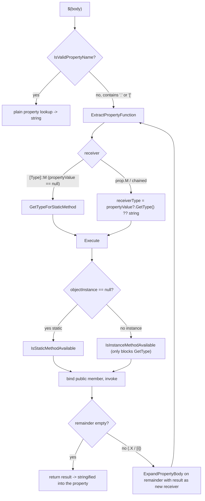

# Property functions: execution model, reachability, and constraints

**Status:** Background analysis. The constraining mode it motivates shipped in PR #14079 (see §10).

**Bottom line:** instance property-function "dotting-in" could reach an open-ended, partly
state-mutating BCL type graph; the receiver surface is now **bounded to a small, rooted allowlist** and
the wide path is gated off (and trim-removed) behind feature switches. The analysis below is why.

> Scope note: this document analyzes which types and members a property-function
> expression can reach by "dotting in" through chained calls. The reachable set
> matters for two engine concerns: **trimming/AOT** - an unbounded receiver surface
> forces the trimmer to root the members of an open-ended BCL type graph for
> reflection, which cannot be made trim-correct - and **the read-only expectation of
> property evaluation** - populating a property is expected to compute a value, so
> members that mutate external state fall outside that contract. The constraining
> design in §10 addresses both by bounding the receiver types to a small, statically
> rooted, side-effect-free set.

## 1. Summary

A *property function* is a call embedded in a `$(...)` property expression, e.g.
`$([System.Math]::Max(1, 2))` (static) or `$(SomeProp.Substring(0, 3))`
(instance). The engine parses the expression, resolves a receiver `Type`, binds a
public member by reflection, invokes it, and feeds the result back into the
remainder of the expression so calls can be **chained** (`$(P.A().B())`).

Two gates are intended to constrain what can be called:

1. **Static calls** are limited to a curated allowlist of types/members
   (plus the MSBuild intrinsics).
2. **Instance calls** are allowed on *any* public member except `GetType`.

The second gate is effectively unbounded. Because each chained call rebinds against
the **runtime type of the previous return value**, any allowlisted static that
returns a rich object (most importantly `System.IO.Directory.GetParent` →
`DirectoryInfo`) exposes that object's entire public surface, and transitively the
connected BCL object graph. This open-ended "dotting-in" reach is the core problem
both for trimming (the reflected member surface that must be rooted is unbounded)
and for the read-only expectation of property evaluation (the reachable surface
includes state-mutating members).

## 2. Where the code lives

The property-function code lives in the `Expander.*.cs` partial classes - primarily
[Expander.Function.cs](../../src/Build/Evaluation/Expander.Function.cs) (the nested type
`PropertyExpander<T>.Function<T>`), with the outer property expansion in
[Expander.PropertyExpander.cs](../../src/Build/Evaluation/Expander.PropertyExpander.cs) and the
argument splitter in [Expander.cs](../../src/Build/Evaluation/Expander.cs). The monolithic
`Expander.cs` was later split into these partials, so the inline `Expander.cs#L...` line anchors further
down predate the split and are approximate; the table here is current.

| Concern | Member | Location |
| --- | --- | --- |
| Parse a `$(...)` body into a function and recurse the chain | `PropertyExpander<T>.ExpandPropertyBody` | [Expander.PropertyExpander.cs#L255](../../src/Build/Evaluation/Expander.PropertyExpander.cs#L255) |
| Split a comma-separated argument list (atomic `$()` / quotes) | `ExtractFunctionArguments` | [Expander.cs#L606](../../src/Build/Evaluation/Expander.cs#L606) |
| Extract receiver/method/args/remainder; **derive receiver type** | `Function<T>.ExtractPropertyFunction` | [Expander.Function.cs#L206](../../src/Build/Evaluation/Expander.Function.cs#L206) |
| Split method name / arguments / remainder | `Function<T>.ConstructFunction` | [Expander.Function.cs#L888](../../src/Build/Evaluation/Expander.Function.cs#L888) |
| Execute the call, escape the result, recurse the remainder | `Function<T>.Execute` | [Expander.Function.cs#L367](../../src/Build/Evaluation/Expander.Function.cs#L367) |
| Resolve a static receiver `Type` | `GetTypeForStaticMethod` | [Expander.Function.cs#L671](../../src/Build/Evaluation/Expander.Function.cs#L671) |
| **Static** allow gate | `IsStaticMethodAvailable` | [Expander.Function.cs#L1134](../../src/Build/Evaluation/Expander.Function.cs#L1134) |
| **Instance** allow gate (only blocks `GetType`) | `IsInstanceMethodAvailable` | [Expander.Function.cs#L1154](../../src/Build/Evaluation/Expander.Function.cs#L1154) |
| Argument coercion fallback | `CoerceArguments` | [Expander.Function.cs#L999](../../src/Build/Evaluation/Expander.Function.cs#L999) |
| Late-bound overload resolution | `LateBindExecute` | [Expander.Function.cs#L1244](../../src/Build/Evaluation/Expander.Function.cs#L1244) |
| Public-only binding invariant | `AllowedBindingFlags` + ctor assert | [Expander.Function.cs#L87](../../src/Build/Evaluation/Expander.Function.cs#L87) |
| The static allowlist data | `AvailableStaticMethods.InitializeAvailableMethods` | [Constants.cs#L305](../../src/Build/Resources/Constants.cs#L305) |
| Well-known function fast paths (no reflection) | `WellKnownFunctions.TryExecuteWellKnownFunction` | [WellKnownFunctions.cs](../../src/Build/Evaluation/Expander/WellKnownFunctions.cs) |
| Feature switch / legacy env-var escape hatch (read by **type resolution** and the **gates**) | `FeatureSwitches.EnableAllPropertyFunctions` | [FeatureSwitches.cs](../../src/Framework/FeatureSwitches.cs) |

## 3. Execution model



The chaining recursion is the crux. `Execute` finishes by calling
`ExpandPropertyBody(_remainder, functionResult, ...)`
([Expander.cs#L4277](../../src/Build/Evaluation/Expander.cs#L4277)). The
`functionResult` is carried as a **live object** - it is only converted to a
string if it already *is* a string (the escaping branch at
[Expander.cs#L4267](../../src/Build/Evaluation/Expander.cs#L4267)). When the
remainder is parsed, the next receiver type is
`propertyValue?.GetType() ?? typeof(string)`
([Expander.cs#L4019](../../src/Build/Evaluation/Expander.cs#L4019)) - i.e. the
**runtime type** of the previous result, with its full public surface.

### 3.1 Static call gating is two-stage

A static call `[Type]::Method(...)` is checked twice:

1. **Type resolution** in `GetTypeForStaticMethod`
   ([Expander.cs#L4373](../../src/Build/Evaluation/Expander.cs#L4373)):
   - the allowlist cache (`AvailableStaticMethods.GetTypeInformationFromTypeCache`), then
   - `Type.GetType(typeName)` against **corelib / the calling assembly only** (no
     assembly-qualified probing), then
   - assembly probing **only** when the `EnableAllPropertyFunctions` feature
     switch is on.
   A type that is neither allowlisted nor in corelib (e.g.
   `System.Diagnostics.Process`) fails here → `InvalidFunctionTypeUnavailable`
   (MSB4212).
2. **Execution gate** in `IsStaticMethodAvailable`
   ([Expander.cs#L4835](../../src/Build/Evaluation/Expander.cs#L4835)): the
   resolved type + method must be in the allowlist (or be `IntrinsicFunctions`,
   or `EnableAllPropertyFunctions` must be set). A corelib type that resolved in
   stage 1 but is not allowlisted (e.g. `System.GC`) fails here →
   `InvalidFunctionMethodUnavailable` (MSB4185).

### 3.2 Instance call gating is effectively unbounded by default

In the **unrestricted** configuration (the untrimmed default), `IsInstanceMethodAvailable`
([Expander.cs#L4853](../../src/Build/Evaluation/Expander.cs#L4853)) reduces to a single denial:

```csharp
return !string.Equals("GetType", methodName, StringComparison.OrdinalIgnoreCase);
```

so every other public instance method/property/field on the runtime receiver type is callable.
That unbounded surface is exactly what the **now-implemented** receiver restriction bounds: when
`RestrictPropertyFunctionReceivers` is on - the default under trimming, opt-in otherwise - this gate
instead consults the `PropertyFunctionReceiver` allowlist (§10). The reachability analysis in §4-§8
describes the unrestricted surface; §10 is what closes it.

## 4. The static allowlist

Defined in
[`AvailableStaticMethods.InitializeAvailableMethods`](../../src/Build/Resources/Constants.cs#L305).
Two shapes of entry:

- **Whole-type** (every public static is callable): numeric primitives, `Convert`,
  `DateTime`, `DateTimeOffset`, `Enum`, `Guid`, `Math`, `String`, `StringComparer`,
  `TimeSpan`, `Regex`, `Uri`, `UriBuilder`, `Version`, `IO.Path`,
  `RuntimeInformation`, `OSPlatform`, `OperatingSystem`, plus the MSBuild
  intrinsics `IntrinsicFunctions` (`[MSBuild]::`) and `ToolLocationHelper`.
- **Specific-member only** (only the named members are callable, but the receiver
  *type* is still bound, so its full surface is reflected over once you have an
  instance of it): `Environment`, `IO.Directory`, `IO.File`,
  `Globalization.CultureInfo`.

Every allowlisted `File`/`Directory`/`Environment` member is **read-only**. There
is no write/delete/move member anywhere in the allowlist, and `IntrinsicFunctions`
contains no filesystem/registry/process mutator.

## 5. Parameters and conversions

### 5.1 What an argument can be

Arguments are parsed by `ExtractFunctionArguments`
([Expander.cs#L848](../../src/Build/Evaluation/Expander.cs#L848)): the content
between the call parentheses is split on `,`, with two kinds of span treated
atomically (commas inside them do not split):

- a nested property expression `$(...)` (scanned by `ScanForClosingParenthesis`), and
- a quoted span using `` ` ``, `"`, or `'` (scanned by `ScanForClosingQuote`).

Each raw argument is therefore a **string** at parse time. Empty entries are kept
and later treated as `null` ("We will keep empty entries so that we can treat them
as null"). At execution, each argument is expanded by
`ExpandPropertiesLeaveTypedAndEscaped`
([Expander.cs#L4110](../../src/Build/Evaluation/Expander.cs#L4110)), so a
nested `$()` *can* yield a typed object, but a bare literal stays a string
(unescaped before being passed out).

Consequence: **you cannot express an arbitrary object argument.** There is no
syntax to construct a `System.Type`, a `byte[]`, a delegate, a `Stream`, a
`FileMode` other than via enum-from-string coercion, etc. This single fact
excludes large swaths of the BCL from being *callable* even though the types are
*reachable* as receivers (see §6 "inadvertent constraints").

### 5.2 How a string becomes a typed parameter

Binding happens in `Execute` in three tiers:

1. **Well-known fast path** - `WellKnownFunctions.TryExecuteWellKnownFunction`
   handles common functions without reflection
   ([Expander.cs#L4209](../../src/Build/Evaluation/Expander.cs#L4209)).
2. **Standard binder** - `_receiverType.InvokePublicMember(name, flags, instance, args)`
   ([Expander.cs#L4245](../../src/Build/Evaluation/Expander.cs#L4245)) lets the
   default reflection binder match and coerce.
3. **Late bind** - on `MissingMethodException`, `LateBindExecute`
   ([Expander.cs#L4907](../../src/Build/Evaluation/Expander.cs#L4907)) tries an
   all-`string` signature, then matches by name + argument count and runs
   `CoerceArguments`.

`CoerceArguments`
([Expander.cs#L4700](../../src/Build/Evaluation/Expander.cs#L4700)) is the
explicit conversion table:

| Parameter type | Conversion |
| --- | --- |
| `char[]` | `arg.ToString().ToCharArray()` |
| an `enum` and the string contains `.` | strip leaf/full type name, `|`→`,`, `Enum.Parse` |
| anything else | `Convert.ChangeType(arg, paramType, InvariantCulture)` |

Failures are swallowed and turned into "no match": `InvalidCastException`,
`FormatException`, and `OverflowException` all return `null`
([Expander.cs#L4743](../../src/Build/Evaluation/Expander.cs#L4743)). A
parameter type that is not `IConvertible`-coercible from a string therefore makes
the overload silently fail to bind.

### 5.3 Special-case argument handling (in `Execute`)

- **`Equals` / `CompareTo`**: the single argument is `Convert.ChangeType`-d to the
  receiver's runtime type so comparisons line up
  ([Expander.cs#L4162](../../src/Build/Evaluation/Expander.cs#L4162)).
- **`File` / `Directory` / `Path` receivers**: string args run through
  `FileUtilities.FixFilePath`, and `File`/`Directory` path args are made absolute
  against the thread working directory in `-mt` mode
  ([Expander.cs#L4128](../../src/Build/Evaluation/Expander.cs#L4128)).
- **`new`**: routed to a constructor (`TryExecuteWellKnownConstructorNoThrow` or
  `LateBindExecute` as a constructor). Only public constructors on the resolved
  receiver type are eligible, so object construction is limited to allowlisted
  types (e.g. `[System.Globalization.CultureInfo]::new('en-US')`).
- **`out _`**: out-parameters are defaulted and passed through `GetMethodResult`.

### 5.4 Binding is public-only

`AllowedBindingFlags`
([Expander.cs#L3789](../../src/Build/Evaluation/Expander.cs#L3789)) is
`IgnoreCase | Public | Static | Instance | InvokeMethod | GetProperty | GetField`.
`BindingFlags.NonPublic` is never set; the `Function` constructor masks the
incoming flags and asserts the invariant
([Expander.cs#L3853](../../src/Build/Evaluation/Expander.cs#L3853)). Private and
internal members are unreachable.

## 6. Constraints, explicit and inadvertent

### 6.1 Explicit constraints (designed gates)

| Constraint | Code | Effect |
| --- | --- | --- |
| Static type must resolve from allowlist/corelib/(probe) | `GetTypeForStaticMethod` [L4373](../../src/Build/Evaluation/Expander.cs#L4373) | non-corelib, non-allowlisted type → "type unavailable" |
| Static method must be allowlisted | `IsStaticMethodAvailable` [L4835](../../src/Build/Evaluation/Expander.cs#L4835) | corelib-but-not-allowlisted method → "not available" |
| Instance method must not be `GetType` | `IsInstanceMethodAvailable` [L4853](../../src/Build/Evaluation/Expander.cs#L4853) | blocks reflection bootstrap via `obj.GetType()` |
| Public-only binding | `AllowedBindingFlags` [L3789](../../src/Build/Evaluation/Expander.cs#L3789) | private/internal members unreachable |

### 6.2 Inadvertent constraints (things that fail to bind by accident)

These are not designed constraints; they are limits of the syntax and the binder that
happen to make many otherwise-reachable members uncallable. They are the reason
the *practical* reachable set is far smaller than a naive type-graph closure.

| Apparent capability | Why it actually fails | Code |
| --- | --- | --- |
| Reflection (`Type`, `Assembly`, `MethodInfo`, ...) | No argument can be a `System.Type`, so `Enum.GetUnderlyingType(Type)` (the only allowlisted member returning `Type`) can't be called; and `obj.GetType()` is blocked. The reflection graph is unreachable despite being in the type closure. | `ExtractFunctionArguments` [L848](../../src/Build/Evaluation/Expander.cs#L848); `IsInstanceMethodAvailable` [L4853](../../src/Build/Evaluation/Expander.cs#L4853) |
| `async` overloads returning `Task<T>` | The allowlisted entry points (`File`/`Directory`) don't expose async statics, and reaching async I/O instance methods needs non-string args (`byte[]` buffers) that can't be expressed. | allowlist [Constants.cs#L305](../../src/Build/Resources/Constants.cs#L305); `CoerceArguments` [L4700](../../src/Build/Evaluation/Expander.cs#L4700) |
| Methods needing a non-coercible parameter (`Stream`, delegate, complex object) | `Convert.ChangeType` throws → caught → overload returns `null` → `MissingMethodException` → error. | `CoerceArguments` [L4743](../../src/Build/Evaluation/Expander.cs#L4743) |
| Array element access `arr[i]` | There is no indexer syntax. (Workaround: `arr.GetValue(0)` is a normal public method and *does* work - see §7.) | `ConstructFunction` [L4589](../../src/Build/Evaluation/Expander.cs#L4589) |
| Ending a chain on a non-string object | Not an error: the object is `ToString()`-ed into the property, often producing a useless value like `System.Threading.Tasks.Task\`1[...]`. "Works" only if the final value stringifies usefully. | result handling [L4267](../../src/Build/Evaluation/Expander.cs#L4267) |

## 7. Vetted reachability examples

All confirmed against a locally-built bootstrap MSBuild. Representative results:

### 7.1 Reachable via dotting (observed result)

| Expression | Result | Note |
| --- | --- | --- |
| `$([System.IO.Path]::GetFileName('x/HelloWorld').Substring(0,5))` | `Hello` | static → instance chain (normal) |
| `$([System.IO.Directory]::GetParent('F').Parent.FullName)` | parent dir | read-only directory navigation |
| `$(...GetFiles().GetValue(0).OpenRead().Length)` | `15` | array index reaches the open-ended `FileInfo`/`FileStream` surface |
| `$(...GetFiles('n').GetValue(0).OpenWrite().CanWrite)` | `True` | reaches a **state-mutating** member |
| `$(...GetFiles('n').GetValue(0).Delete())` | (empty) | reaches a **state-mutating** member |

From `GetValue(0)` onward the chain flows through `FileInfo`/`FileStream`/`DirectoryInfo` - open-ended
types whose entire public surface would have to be rooted for trimming, several of whose members mutate
state (outside the read-only expectation of property evaluation). §10 bounds the receiver set so these
types are unreachable under the restriction.

### 7.2 Blocked (observed error)

| Expression | Error | Reason |
| --- | --- | --- |
| `$([System.IO.File]::ReadAllTextAsync('F'))` | MSB4185 | async static not allowlisted |
| `$([System.Diagnostics.Process]::GetCurrentProcess().Id)` | MSB4212 | type not allowlisted and not in corelib |
| `$([System.Enum]::GetUnderlyingType('System.DayOfWeek'))` | MSB4186 | `string`→`Type` can't coerce; no way to obtain a `Type` |
| `$(P.GetType().FullName)` | MSB4184 | `GetType` is the one denied instance method |

## 8. Implications and the constraining hook

- **Reads are already a supported capability** (`File::ReadAllText`,
  `Directory::GetFiles`, `[MSBuild]::GetRegistryValue`, `Environment` reads), so
  the read-via-`OpenRead` path adds no new capability - but it still reaches the
  open-ended `Stream` surface, which bounded type rooting must exclude.
- **The members outside the read-only expectation are the state-mutating ones** -
  `OpenWrite`/`Create`/`CopyTo`/`Delete`/`MoveTo`/`CreateSubdirectory` reached
  through `DirectoryInfo`/`FileInfo`. Nothing in the read-only allowlist grants
  these. They run at **evaluation time** (IDE folder open, `restore`, design-time
  builds, `-getProperty`, auto-imported `Directory.Build.props`, NuGet-injected
  `.props`/`.targets`), where populating a property is expected to be a read-only
  computation and no target or task runs.
- The reachable I/O is **local filesystem only** (`HttpClient`/`WebClient` can't be
  constructed; `Uri` does no I/O); there is no reachable network primitive.

The **now-implemented** constraining mode (§10) does exactly this: it hooks `IsInstanceMethodAvailable`
([Expander.cs#L4853](../../src/Build/Evaluation/Expander.cs#L4853)), giving it the receiver runtime
`Type`, and enforces an **allowlist of side-effect-free receiver types** (string, primitives, `DateTime`/`TimeSpan`/
`Version`/`Guid`/`decimal`, `CultureInfo`, `Uri`, `Regex`/`Match`, enums) over a
member deny-list - a small, statically known set the trimmer can root, rather than the
open BCL closure. Because dir-walk idioms such as
`$([System.IO.Directory]::GetParent($(X)).Parent.FullName)` are common in real
builds, the restriction is **opt-in under the JIT** (the `RestrictPropertyFunctionReceivers`
feature switch, default off) and **forced on under trimming** - a `[FeatureSwitchDefinition]` rather
than a `Trait` (which the trimmer keeps) or a `ChangeWave` (time-boxed opt-*outs*), so it folds to a
constant and the unbounded branch is removed. The full trim-safe design is in §10.

## 9. The existing escape hatch and trim-time substitution

`MSBUILDENABLEALLPROPERTYFUNCTIONS=1` widens reachability in untrimmed builds. The important trim
detail is that the environment variable is read through the
`FeatureSwitches.EnableAllPropertyFunctions` property, not directly at the call sites:

- **The gates** `IsStaticMethodAvailable`
  ([Expander.cs#L4843](../../src/Build/Evaluation/Expander.cs#L4843)) and
  `IsInstanceMethodAvailable`
  ([Expander.cs#L4855](../../src/Build/Evaluation/Expander.cs#L4855)) read
  `FeatureSwitches.EnableAllPropertyFunctions`, so the "anything goes" branch is guarded by a
  trimmer-substitutable property.
- **Type resolution** `GetTypeForStaticMethod`
  ([Expander.cs#L4435](../../src/Build/Evaluation/Expander.cs#L4435)) reads
  `FeatureSwitches.EnableAllPropertyFunctions`
  ([FeatureSwitches.cs](../../src/Framework/FeatureSwitches.cs)), a
  `[FeatureSwitchDefinition]` for `Microsoft.Build.EnableAllPropertyFunctions`. In untrimmed builds,
  when the AppContext switch is unset, that property honors the legacy environment variable. Under
  trimming the property is substituted with the constant `false`, so the assembly-probing branch and
  its `[RequiresUnreferencedCode]` helpers (`GetTypeFromAssembly`
  [L4509](../../src/Build/Evaluation/Expander.cs#L4509),
  `GetTypeFromAssemblyUsingNamespace`
  [L4467](../../src/Build/Evaluation/Expander.cs#L4467)) are removed.

**Consequence.** In a *trimmed* application both the assembly-probing path and the wide
property-function gates are removed, and no runtime setting can re-enable them. In an untrimmed
application, the legacy environment variable still behaves as before when no AppContext switch was set.

## 10. Constraining mode (implemented in #14079)

**Status: implemented (PR #14079).** The unbounded instance "dotting-in" surface analyzed above is now
bounded by an opt-in / trim-forced receiver-type restriction.

What shipped:

- A receiver allowlist, [`PropertyFunctionReceiver`](../../src/Build/Evaluation/PropertyFunctionReceiver.cs),
  gated by the `RestrictPropertyFunctionReceivers` feature switch in
  [`FeatureSwitches`](../../src/Framework/FeatureSwitches.cs). The wide property-function gates now read
  `FeatureSwitches.EnableAllPropertyFunctions` (a `[FeatureGuard]` switch) instead of the old `Traits`
  environment read, so the trimmer can substitute a constant and remove the unbounded branch.
- The allowlist is a small, static `typeof(...)` set of side-effect-free receivers (`string`, the numeric
  primitives, `bool`/`char`, `DateTime`/`DateTimeOffset`/`TimeSpan`, `Guid`, `Version`, `CultureInfo`,
  `Uri`, `Regex`/`Match`/`Group`/`Capture`, plus any enum). Directory/file navigation is allowed via a
  **member** allowlist (`FullName`, `Name`, `Exists`, `Parent`, `Root`, `Extension`, `Length`, `Directory`,
  `DirectoryName`) that excludes every state-mutating member (`Open*`, `Create*`, `CopyTo`, `MoveTo`,
  `Delete`, ...), so the common `$([System.IO.Directory]::GetParent($(X)).Parent.FullName)` idiom keeps
  working while `FileInfo.OpenWrite`/`Delete` become unreachable.

**Why a feature switch (not a `Trait` or a `ChangeWave`):** a `Trait` is a runtime environment read the
trimmer keeps, so it could not satisfy "no runtime re-enablement under trimming"; a
`[FeatureSwitchDefinition]` is substituted to a constant and its dead branch removed. ChangeWaves are
time-boxed opt-*outs*; this is a permanent trim boundary that must be non-disableable under trimming.

**Behavior:** the untrimmed default is **wide** (unchanged - opt in via the
`Microsoft.Build.RestrictPropertyFunctionReceivers` AppContext switch, which has no environment variable);
a trimmed/AOT MSBuild **enforces the restriction by default**, and no runtime setting (including
`MSBUILDENABLEALLPROPERTYFUNCTIONS=1`) can re-open the removed branches. The one remaining suppression is
the `InvokePublicMember` call in [Expander.cs](../../src/Build/Evaluation/Expander.cs), whose
`DynamicallyAccessedMembers` justification is now honest because only allowlisted receiver types flow to it.
