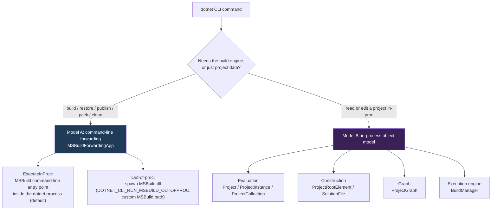

# Audit: MSBuild object model usage in the .NET SDK CLI

**Status:** Background analysis.

This document audits how the .NET SDK (`dotnet` CLI) consumes the **MSBuild object
model** (the `Microsoft.Build.*` evaluation/execution/construction/graph APIs), and maps
each usage to the **CLI command** that exposes it. It is a companion to the MSBuild
trim/AOT specs - it identifies the precise OM surface a trimmed/AOT MSBuild host (the
`dotnet` CLI) must keep working, and which CLI commands drive the reflective execution
engine that cannot run under AOT (see the [folder README](README.md) for the full map):

* [managing-trimming-and-aot.md](managing-trimming-and-aot.md) (the trim/AOT how-to and the
  fail-observably design criterion)
* [aot-trimming-strategy.md](aot-trimming-strategy.md) (the strategy for removing, gating,
  registering, annotating, or honestly marking trim/AOT-unfriendly paths)

> **Method.** Audited a local checkout of `dotnet/sdk` at `n:\repos\sdk`
> (`main`, commit `7b0f367f33`) by searching for imports and call sites of
> `Microsoft.Build.Evaluation` / `Execution` / `Construction` / `Graph` / `Definition`
> and the forwarding-app types. SDK file paths below are repo-relative to `n:\repos\sdk`;
> line numbers drift, so search by member name. Test projects and the MSBuild **tasks**
> the SDK *ships* (`src/Tasks`, `src/WebSdk`, `src/RazorSdk`, ...) are not covered here - this
> audit is about the CLI **consuming** the OM, not authoring tasks.

---

## 1. Two consumption models

The SDK reaches MSBuild in two fundamentally different ways.

### Model A - command-line forwarding (the build path)

The dominant path. The CLI parses its own arguments, re-emits them as an MSBuild command
line, and runs MSBuild. It does **not** drive the object model - it hands a string[] to
MSBuild's entry point.

* `MSBuildForwardingApp` (`src/Cli/dotnet/Commands/MSBuild/MSBuildForwardingApp.cs`) wraps
  `MSBuildForwardingAppWithoutLogging`
  (`src/Cli/Microsoft.DotNet.Cli.Utils/MSBuildForwardingAppWithoutLogging.cs`).
* `Execute()` runs MSBuild one of two ways:
  * **In-process** (`_forwardingAppWithoutLogging.ExecuteInProc(arguments)`) - the default
    when invoking the bundled `MSBuild.dll`. MSBuild's command-line front end runs *inside
    the `dotnet` process*. This is the host that the trim/AOT effort ultimately targets.
  * **Out-of-process** (`ProcessStartInfo.Execute()` via `ForwardingAppImplementation`) -
    selected when `DOTNET_CLI_RUN_MSBUILD_OUTOFPROC=1`, a non-default `--msbuildPath` is
    used, or an env-var edge case forces it. Spawns `MSBuild.dll` as a child process.
  * Optionally via the **MSBuild server** (`DOTNET_CLI_USE_MSBUILD_SERVER` ->
    `MSBUILDUSESERVER=1`).
* The **only** OM member this path touches is
  `Microsoft.Build.Evaluation.ProjectCollection.DisplayVersion` (for `dotnet --version` /
  `dotnet msbuild --version`). Everything else is argument, environment, and process
  plumbing.
* It attaches the CLI's distributed **telemetry logger** pair (`MSBuildLogger` +
  `MSBuildForwardingLogger`) via `-distributedlogger`.
* `RestoringCommand` (`src/Cli/dotnet/Commands/Restore/RestoringCommand.cs`) is the base
  class for commands that implicitly restore and then build through this path.

**Commands using Model A:** `build`, `clean`, `restore`, `publish`, `pack`, `msbuild`,
`store`, `package add`, `package list` (and the implicit restore baked into most of the
above). For these, MSBuild's *own* trim/AOT story governs - the SDK adds essentially no OM
surface.

### Model B - in-process object model

A sizable set of commands evaluate, inspect, edit, or build projects **in-process** using
the OM directly. These are the commands that pin a concrete OM surface, enumerated below.

---

## 2. Object-model API surface the SDK depends on

| Namespace | Types / members used | Where (representative) |
| --- | --- | --- |
| `Microsoft.Build.Evaluation` | `ProjectCollection` (many ctor overloads incl. `reuseProjectRootElementCache`, `GlobalProjectCollection`, `DisplayVersion`, `LoadProject`, `RegisterLogger`, `UnloadAllProjects`), `Project` (`CreateProjectInstance`, evaluated props/items via extensions), `ToolsetDefinitionLocations`, `Context.EvaluationContext` (`SharingPolicy.Shared`) | forwarding (`DisplayVersion`), `MsbuildProject`, `RunCommand`, `MSBuildEvaluator`, Test MTP, `dotnet watch`, completion |
| `Microsoft.Build.Execution` | `ProjectInstance` (`FromFile`, `new(ProjectRootElement)`, `GetPropertyValue`, `GetItems`, `CreateProjectInstance`), `BuildManager` (`DefaultBuildManager`, `BeginBuild`, `PendBuildRequest`/`ExecuteAsync`, `EndBuild`, `CancelAllSubmissions`, `ShutdownAllNodes`), `BuildParameters`, `BuildRequestData`, `BuildResult` / `BuildResultCode`, `TargetResult`, `ProjectOptions` | `ReleasePropertyProjectLocator`, `RunCommand`, `ProjectConvertCommand`, Test MTP, `dotnet watch` (`ProjectBuildManager`), `build-server`, file-based build |
| `Microsoft.Build.Construction` | `ProjectRootElement` (`Open`, `Create`, `CreateItemElement`, item/group elements), `ProjectItemElement`, `ProjectItemGroupElement`, `SolutionFile` (`Parse`, `ProjectsInOrder`, `SolutionConfigurations`, `GetDefaultConfigurationName`/`PlatformName`, **internal** `ProjectShouldBuild`) | `MsbuildProject`, `SolutionAddCommand`, `VirtualProjectBuilder`, `VirtualProjectPackageReflector`, Test MTP |
| `Microsoft.Build.Graph` | `ProjectGraph`, `ProjectGraphEntryPoint`, `ProjectCreationFailedException` | `dotnet watch` (`ProjectGraphFactory`, `LoadedProjectGraph`), `workload restore` |
| `Microsoft.Build.Definition` | `ProjectOptions` (passed to `ProjectInstance.FromFile` / `Project`) | `VirtualProjectBuilder`, `ProjectConvertCommand`, Test MTP |
| `Microsoft.Build.Logging` | `ConsoleLogger`, `BinaryLogger`, `SimpleErrorLogger`; plus the CLI's `MSBuildLogger` / `MSBuildForwardingLogger` | `MsbuildProject` (interactive auth), `VirtualProjectBuildingCommand`, `dotnet watch`, forwarding |
| `Microsoft.Build.Framework` | `ILogger`, `LoggerVerbosity`, `BuildEventArgs` (logging contracts consumed by the loggers above) | across the OM consumers |

---

## 3. Command -> object model map

Legend for **OM tier**: **Fwd** = forwarding only; **Eval** = evaluation + property/item
reads; **Constr** = XML construction; **Graph** = `ProjectGraph`; **Exec** = drives
`BuildManager` / the build engine in-proc.

| CLI command | OM tier | What the OM is used for | Key SDK file(s) |
| --- | --- | --- | --- |
| `dotnet build` | Fwd | Emit MSBuild command line; run in-proc or out-of-proc | `Commands/Build/*`, `Commands/Restore/RestoringCommand.cs`, `Commands/MSBuild/MSBuildForwardingApp.cs` |
| `dotnet clean` | Fwd | same | `Commands/Clean/CleanCommand.cs` |
| `dotnet restore` | Fwd | same | `Commands/Restore/RestoreCommand.cs` |
| `dotnet msbuild` | Fwd | Pass-through to MSBuild | `Commands/MSBuild/MSBuildCommand.cs` |
| `dotnet store` | Fwd | Runtime store build | `Commands/Tool/Store/StoreCommand.cs` |
| `dotnet package add` / `list` | Fwd | Edit/list package refs via MSBuild targets | `Commands/Package/Add`, `Commands/Package/List` |
| `dotnet publish` | Fwd + **Eval** | Build via forwarding; **plus** evaluate the project/solution to read `PublishRelease` and inject `Configuration=Release` | `Commands/Publish/PublishCommand.cs`, `ReleasePropertyProjectLocator.cs` |
| `dotnet pack` | Fwd + **Eval** | same, for `PackRelease` | `Commands/Pack/*`, `ReleasePropertyProjectLocator.cs` |
| `dotnet reference add` / `remove` | **Constr** + **Eval** | Edit `ProjectReference` items in the project XML (`ProjectRootElement`); evaluate `Project` to check TFM / RID / Configuration compatibility | `MsbuildProject.cs`, `Commands/Reference/Add`, `Commands/Reference/Remove` |
| `dotnet reference list` | **Constr** + **Exec*** | `ProjectRootElement` + `new ProjectInstance(root)` then `GetItems("ProjectReference")` | `Commands/Reference/List/ReferenceListCommand.cs` |
| `dotnet solution add` | **Constr** + **Exec*** | `ProjectRootElement.Open` + `new ProjectInstance(root)`; `GetItems("ProjectReference")` to add referenced projects/solution folders | `Commands/Solution/Add/SolutionAddCommand.cs` |
| `dotnet run` (project) | **Eval** + **Exec*** | `ProjectCollection.LoadProject(...).CreateProjectInstance()`; read `RunCommand`/`RunArguments`/`RunWorkingDirectory`/`OutputType`/`TargetFramework(s)`; `GetItems(ProjectCapability)`; invoke the `ComputeRunArguments` target | `Commands/Run/RunCommand.cs` |
| `dotnet run file.cs` (file-based app) | **Constr** + **Eval** + **Exec** | Build an **in-memory** virtual project (`ProjectRootElement` -> `ProjectInstance`) and build it via `BuildManager` (or skip to a CSC fast path) | `Commands/Run/VirtualProjectBuildingCommand.cs`, `Microsoft.DotNet.ProjectTools/VirtualProjectBuilder.cs` |
| `dotnet project convert` | **Eval** + **Exec** | Materialize a real `.csproj` from a file-based app: `VirtualProjectBuilder.CreateProjectInstance`, `ProjectInstance.FromFile`, `GetItems`/`GetPropertyValue` | `Commands/Project/Convert/ProjectConvertCommand.cs` |
| `dotnet pack file.cs` / file-based package | **Constr** + **Exec** | Reflect NuGet's edits back to directives via `ProjectRootElement`; build the virtual project | `Commands/Package/VirtualProjectPackageReflector.cs`, `Commands/NuGet/NuGetVirtualProjectBuilder.cs` |
| `dotnet run-api` (IDE protocol) | **Eval** + **Exec** | `VirtualProjectBuilder.CreateProjectInstance` to answer IDE run queries | `Commands/Run/Api/RunApiCommand.cs` |
| `dotnet test` (Microsoft.Testing.Platform) | **Constr** + **Eval** + **Exec*** | `SolutionFile.Parse` to enumerate projects; per-project `ProjectInstance.FromFile` evaluation over a shared `EvaluationContext` to read `IsTestProject`, `IsTestingPlatformApplication`, `TargetFramework(s)`, `RunCommand`, `TargetPath`, ... | `Commands/Test/MTP/MSBuildUtility.cs`, `Commands/Test/MTP/SolutionAndProjectUtility.cs` |
| `dotnet new` (templates) | **Eval** | `ProjectCollection` + `Project` evaluation to read **project capabilities** / SDK-style / TFM for template constraint matching | `Commands/New/MSBuildEvaluation/MSBuildEvaluator.cs`, `.../ProjectCapabilityConstraint.cs` |
| `dotnet workload restore` | **Eval** + **Graph** | Evaluate the project/graph to discover workload references to restore | `Commands/Workload/Restore/WorkloadRestoreCommand.cs` |
| `dotnet build-server shutdown` | **Exec** | `BuildManager.DefaultBuildManager.ShutdownAllNodes()` | `BuildServer/MSBuildServer.cs` |
| shell tab completion | **Eval** | `new ProjectCollection()` to evaluate for completion candidates | `CliCompletion.cs` |
| `dotnet watch` | **Eval** + **Graph** + **Exec** | Build a `ProjectGraph` (watched-file set + dependency order) over a cached `ProjectCollection`; run **incremental in-proc builds** via `BuildManager` for Hot Reload | `src/Dotnet.Watch/Watch/Build/*` (`ProjectGraphFactory`, `LoadedProjectGraph`, `ProjectBuildManager`, `EvaluationResult`, `ProjectGraphUtilities`), `.../HotReload/CompilationHandler.cs`, `.../Build/MsBuildFileSetFactory.cs` |

\* **Exec\*** here means a `ProjectInstance` is constructed (which runs *evaluation*), but
no `BuildManager` build is driven - only evaluated data is read. True build-engine drivers
(`BuildManager`) are `dotnet watch`, the file-based `run`/`pack`/`convert`/`run-api`
virtual builds, and `build-server`.

---

## 4. Deep dives on the in-process consumers

### 4.1 Release-configuration detection (`publish`, `pack`)

`ReleasePropertyProjectLocator` exists because `Configuration` cannot be set *inside* a
project file but must be known *before* evaluation. The CLI evaluates the targeted project
(or an arbitrary project from a solution) as a `ProjectInstance` and reads `PublishRelease`
/ `PackRelease` (`ProjectInstance.GetPropertyValue`) so it can inject
`-property:Configuration=Release` into the subsequent forwarding build. For solutions it
parses with the SDK's `SlnFileFactory` and evaluates projects in parallel, throwing
`GracefulException` if projects disagree. **Pure evaluation + property reads.**

### 4.2 Project / solution editing (`reference`, `solution add`)

`MsbuildProject` is the shared helper. Reference add/remove operate on the **construction**
model (`ProjectRootElement`, `ProjectItemElement`, `ProjectItemGroupElement`,
`CreateItemElement`) - editing `ProjectReference` items in the XML and saving. Listing and
`solution add` additionally construct a `ProjectInstance` from the `ProjectRootElement` to
enumerate evaluated `ProjectReference` items. TFM/RID/Configuration compatibility checks go
through an evaluated `Project` (`GetTargetFrameworks`, `GetRuntimeIdentifiers`,
`GetConfigurations`). For interactive restore it registers a `ConsoleLogger`. **No build
engine.**

### 4.3 `dotnet run` (project)

`RunCommand` loads the project (`ProjectCollection.LoadProject(...).CreateProjectInstance()`),
validates it (`OutputType`, `TargetFramework(s)`), reads `RunCommand`/`RunArguments`/
`RunWorkingDirectory`, checks `ProjectCapability` items, and can invoke the
`ComputeRunArguments`/run-arguments target to compute how to launch the app. The build
itself is delegated to the forwarding path unless `--no-build`. **Evaluation + targeted
property/item reads (+ a target invocation).**

### 4.4 File-based apps (`run file.cs`, `project convert`, file-based `pack`, `run-api`)

This is the heaviest OM dependency. `VirtualProjectBuilder`
(`src/Microsoft.DotNet.ProjectTools`) constructs an **in-memory** project from a `.cs`
file's `#:` directives: it builds a `ProjectRootElement` (Construction + Definition),
produces a `ProjectInstance`, and `VirtualProjectBuildingCommand` either runs a **CSC-only
fast path** (when the file needs no MSBuild props/targets/restore) or a full
`BuildManager` build. Notable engine couplings:

* It **pins** the virtual `ProjectRootElement` to keep MSBuild's `ProjectRootElementCache`
  from demoting it to a weak reference (otherwise nested `<MSBuild>` re-evaluations fail
  with `MSB4025`, because the project does not exist on disk). This is a deliberate
  dependence on `ProjectRootElementCache` GC semantics.
* `ProjectConvertCommand` turns the virtual project into a real `.csproj`, reading items
  and properties (`UserSecretsId`, default props) off the `ProjectInstance`.

These paths drive the **full build engine in-process** and therefore exercise the
reflective task-loading subsystem.

### 4.5 `dotnet test` (Microsoft.Testing.Platform mode)

`MSBuildUtility` + `SolutionAndProjectUtility` parse a `SolutionFile`
(`SolutionFile.Parse`, `ProjectsInOrder`, `SolutionConfigurations`) and evaluate each
project (`ProjectInstance.FromFile` over a shared `EvaluationContext`) to discover test
modules and their properties (`IsTestProject`, `IsTestingPlatformApplication`,
`TargetFramework(s)`, `RunCommand`, `TargetPath`, `TestTfmsInParallel`). It reaches into
MSBuild's **internal** `SolutionFile.ProjectShouldBuild` via `[UnsafeAccessor]` - see the
caveat in section 6. **Solution parse + evaluation; the actual build is forwarded.**

### 4.6 `dotnet new` (template engine)

`MSBuildEvaluator` keeps a `ProjectCollection` and evaluates the project at the output
location to feed template **constraints** (project capabilities, SDK-style detection,
target frameworks). **Pure evaluation.**

### 4.7 `dotnet watch`

The richest consumer. `ProjectGraphFactory` builds a `ProjectGraph` over a long-lived
`ProjectCollection` constructed with `reuseProjectRootElementCache: true` and
`maxNodeCount: 1`, with a custom `ProjectInstance` factory. `LoadedProjectGraph` derives
the watched-file set and dependency order. `ProjectBuildManager` then drives **incremental
in-proc builds** with the full Execution API: `BuildManager.DefaultBuildManager`,
`BuildParameters(collection)`, `BuildRequestData(projectInstance, targets)`,
`BeginBuild` / `PendBuildRequest(...).ExecuteAsync(...)` / `EndBuild`,
`CancelAllSubmissions`, and reads `BuildResult` / `TargetResult` / `BuildResultCode`. Hot
Reload (`CompilationHandler`) reuses these evaluated instances. **Graph + evaluation + the
build engine.**

---

## 5. The SDK already partitions the object model for AOT

The SDK ships an **AOT build of the CLI** (`src/Cli/dotnet-aot/`) and guards OM-heavy code
behind the `CLI_AOT` compilation symbol. For example, `MsbuildProject.cs` wraps **all** of
its `Microsoft.Build.Construction` / `Evaluation` usage in `#if !CLI_AOT`, and
`MSBuildForwardingAppWithoutLogging` is `#if NET`. Files currently carrying the partition
include `MsbuildProject.cs`, `CommandBase.cs`, `Program.cs`, `Parser.cs`,
`CommandLineInfo.cs`, `Extensions/ParseResultExtensions.cs`, and
`Commands/Solution/SolutionCommandParser.cs`.

The takeaway for MSBuild: the SDK already treats the in-proc object model as **not
AOT-ready** and routes its AOT CLI toward the forwarding/process model. A trim/AOT-capable
MSBuild evaluation OM is what would let those `#if !CLI_AOT` exclusions shrink.

---

## 6. Implications for the MSBuild trim/AOT effort

Mapping the surface above onto the [fail-observably design
criterion](managing-trimming-and-aot.md#msbuilds-overriding-design-criterion-fail-observably-never-silently)
and the strategy in [aot-trimming-strategy.md](aot-trimming-strategy.md):

The practical target is **evaluation first, execution by closed-world opt-in**. Evaluation is the
highest-value surface for the SDK and can be kept trim/AOT-clean. Execution is still the hard tier, but it
is no longer an all-or-nothing wall: intrinsic tasks and host-registered task classes can run in-process under
AOT, while arbitrary runtime-discovered tasks and plugins must report an observable error so the CLI can fall
back to a JIT MSBuild.

1. **The forwarding path is already trim-safe** (it only reads `ProjectCollection.DisplayVersion`).
   It is also the dominant build path, so `build`/`restore`/`publish`/`pack`/`clean` ride
   on MSBuild's *own* command-line front end - whatever AOT story MSBuild has for
   `MSBuild.dll` covers them.
2. **Evaluation + property/item reads are the SDK's real OM dependency.**
   `publish`/`pack` (release detection), `new`, `test` discovery, `run` (project),
   `reference` compatibility, `workload restore`, completion, and the `watch` graph all
   need `Project` / `ProjectInstance` / `ProjectCollection` evaluation plus
   `GetPropertyValue` / `GetItems` / `ProjectGraph` to be trim-safe. This is the highest-value
   surface to keep working under trim/AOT.
3. **Construction (XML) editing is inherently trim-safe.** `reference`/`solution` editing
   uses `ProjectRootElement` / `SolutionFile` (XML and text parsing, no task loading) and
   needs no special treatment beyond ordinary trim-correctness.
4. **The execution-engine drivers are the trim/AOT-hard paths.** `dotnet watch`'s
   incremental `BuildManager` builds and the file-based `run`/`pack`/`convert`/`run-api`
   virtual builds drive the full engine. A closed-world subset can run under AOT when the host
   registers the tasks it needs, and intrinsic `MSBuild`/`CallTarget` tasks stay available; an
   open-world task/plugin path that needs reflective loading must **fail observably** (or fall back to a
   JIT/out-of-proc MSBuild). The forwarding path is the natural fallback the AOT CLI already has.
5. **`SolutionFile.ProjectShouldBuild` is consumed via `[UnsafeAccessor]`** (a private
   member) in `dotnet test`. This is a fragile cross-repo coupling; MSBuild exposing a
   public equivalent (tracked by dotnet/msbuild#12711) would remove a reflective dependency
   from the SDK's test path.
6. **`ProjectRootElementCache` semantics are load-bearing.** The file-based-app builder
   pins its in-memory `ProjectRootElement` to survive cache demotion (else `MSB4025`).
   Changes to cache eviction or `reuseProjectRootElementCache` behavior can break
   `dotnet run file.cs`.

---

## 7. Appendix - production OM consumers (file inventory)

`src/Cli/dotnet`:

* `Commands/MSBuild/MSBuildForwardingApp.cs`, `Commands/MSBuild/MSBuildCommand.cs`
* `Commands/Restore/RestoringCommand.cs`, `Commands/Restore/RestoreCommand.cs`
* `ReleasePropertyProjectLocator.cs`
* `MsbuildProject.cs`, `Extensions/ProjectExtensions.cs`,
  `Extensions/ProjectInstanceExtensions.cs`, `Extensions/ProjectRootElementExtensions.cs`
* `Commands/Reference/{Add,List,Remove}/*`, `Commands/Solution/Add/SolutionAddCommand.cs`
* `Commands/Run/{RunCommand,VirtualProjectBuildingCommand,RunCommandSelector,EnvironmentVariablesToMSBuild,RunProperties,RunTelemetry}.cs`,
  `Commands/Run/Api/RunApiCommand.cs`
* `Commands/Project/Convert/ProjectConvertCommand.cs`,
  `Commands/Package/VirtualProjectPackageReflector.cs`,
  `Commands/NuGet/NuGetVirtualProjectBuilder.cs`
* `Commands/Test/MTP/{MSBuildUtility,SolutionAndProjectUtility,MicrosoftTestingPlatformTestCommand}.cs`
* `Commands/New/MSBuildEvaluation/{MSBuildEvaluator,ProjectCapabilityConstraint}.cs`
* `Commands/Workload/Restore/WorkloadRestoreCommand.cs`
* `BuildServer/MSBuildServer.cs`, `CliCompletion.cs`,
  `CommandFactory/CommandResolution/MSBuildProject.cs`

`src/Cli/Microsoft.DotNet.Cli.Utils`:

* `MSBuildForwardingAppWithoutLogging.cs`, `Extensions/MSBuildProjectExtensions.cs`

`src/Microsoft.DotNet.ProjectTools`:

* `VirtualProjectBuilder.cs`

`src/Dotnet.Watch/Watch`:

* `Build/{ProjectGraphFactory,LoadedProjectGraph,ProjectBuildManager,EvaluationResult,ProjectGraphUtilities,FilePathExclusions,BuildResult,BuildRequest,MsBuildFileSetFactory}.cs`
* `HotReload/{CompilationHandler,HotReloadDotNetWatcher}.cs`, plus the `AppModels/*` set
