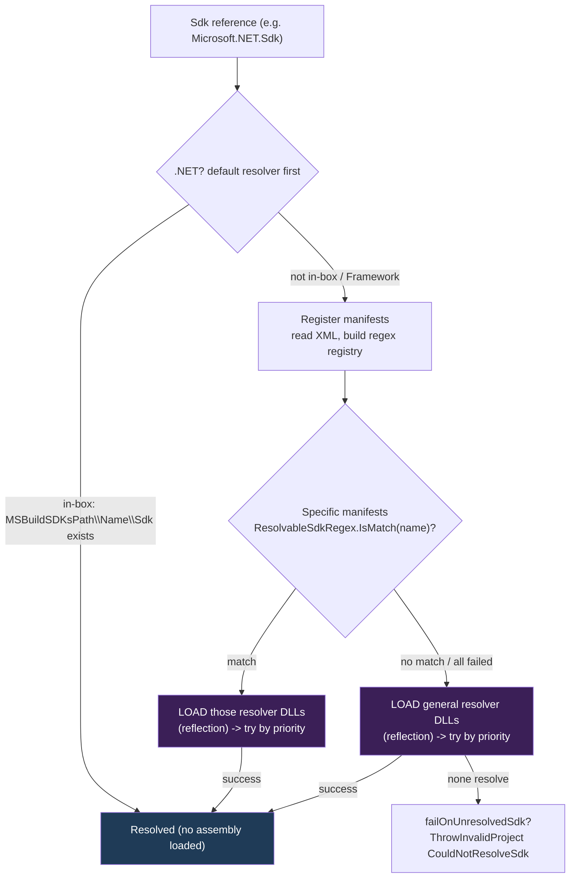

# SDK resolution in MSBuild: how it works, and a plan to make it trim/AOT-safe

**Status:** Implemented (the fail-observably SDK-resolution path; see Part 2).

This document has two parts:

1. **How SDK resolution works** - where resolver manifests come from, what the built-in
   fallback is, and how discovered resolvers are matched to a project's `Sdk` (including
   `<Project Sdk="Microsoft.NET.Sdk">` and a project with no `Sdk` at all).
2. **A plan** to stop the SDK-resolution path from surfacing `[RequiresUnreferencedCode]`
   all the way up to the `Project` constructors, and instead **fail observably** (via
   `ProjectFileErrorUtilities.ThrowInvalidProjectFile`) when an SDK actually needs a
   dynamically loaded resolver.

See the [folder README](README.md) for the full map; this most directly complements the mechanics
how-to, [managing-trimming-and-aot.md](managing-trimming-and-aot.md). File and line
references drift - search by member name.

---

## Part 1 - How SDK resolution works

### 1.1 What triggers resolution

An SDK reference enters evaluation in one of these forms, all of which become an
`SdkReference` on a (possibly implicit) `ProjectImportElement`:

* `<Project Sdk="Microsoft.NET.Sdk">` or `Sdk="Name/Version"` - MSBuild synthesizes two
  **implicit imports**: `Sdk.props` at the very top of the project and `Sdk.targets` at the
  very bottom, each carrying the `SdkReference`.
* `<Sdk Name="..." Version="..." />` element - same implicit-import behavior.
* `<Import Project="Sdk.props" Sdk="Microsoft.NET.Sdk" />` - an explicit SDK-style import.

During evaluation, `Evaluator.ExpandAndLoadImportsFromUnescapedImportExpression`
([Evaluator.cs](../../src/Build/Evaluation/Evaluator.cs)) sees `importElement.SdkReference`
is non-null and calls `_sdkResolverService.ResolveSdk(...)` to turn the SDK *name* into a
*path*, then loads the imported file from `Path.Combine(sdkResult.Path, project)`.

**A project with no `Sdk`** - no `Sdk` attribute, no `<Sdk>` element, and no `Sdk=` on any
`<Import>` - never produces an `SdkReference`, so `ResolveSdk` is **never called** and no
resolver (not even the default one) is touched. This is the trivial, fully trim-safe case.

### 1.2 Where resolver manifests come from

The central resolver is `SdkResolverService`
([SdkResolverService.cs](../../src/Build/BackEnd/Components/SdkResolution/SdkResolverService.cs)).
On first use it builds a manifest registry via `RegisterResolversManifests` ->
`SdkResolverLoader.GetResolversManifests`
([SdkResolverLoader.cs](../../src/Build/BackEnd/Components/SdkResolution/SdkResolverLoader.cs))
-> `FindPotentialSdkResolversManifests`:

* Root folder = `BuildEnvironmentHelper.Instance.MSBuildToolsDirectoryRoot` + `\SdkResolvers`.
* Each **immediate subfolder** is one resolver package. For a subfolder `Foo\`, the loader
  looks for, in order:
  * `Foo\Foo.xml` - a **manifest** (preferred):
    ```xml
    <SdkResolver>
      <Path>relative-or-absolute\Resolver.dll</Path>
      <ResolvableSdkPattern>Optional regex of SDK names this resolver handles</ResolvableSdkPattern>
    </SdkResolver>
    ```
  * `Foo\Foo.dll` - the resolver assembly directly (no pattern), if there is no manifest.
  * If **neither** exists -> `ProjectFileErrorUtilities.ThrowInvalidProjectFile("SdkResolverNoDllOrManifest")`.
* Manifest parsing (`SdkResolverManifest.Load`) reads the XML and, if present, compiles
  `ResolvableSdkPattern` into a `Regex` (with a 500 ms match timeout). **This step is
  reflection-free** - it only reads files and builds a registry; no resolver assembly is
  loaded yet.

Knobs:

* `MSBUILDADDITIONALSDKRESOLVERSFOLDER` (and `_NET` / `_NETFRAMEWORK` variants) - test hook
  that adds an override resolver folder.
* `MSBUILDINCLUDEDEFAULTSDKRESOLVER=false` - drop the built-in default resolver.
* Legacy path: when ChangeWave 17.10 is **disabled**, `SdkResolverService` uses a
  non-caching `SdkResolverLoader` and the eager `LoadAllResolvers`, which scans
  `MSBuildToolsDirectory32\SdkResolvers` and loads **every** resolver up front. The default
  (17.10 enabled) path is manifest-based and lazy via `CachingSdkResolverLoader`.

### 1.3 The built-in fallback resolver

`SdkResolverLoader.GetDefaultResolvers()` returns a single, in-process, **reflection-free**
`DefaultSdkResolver`
([DefaultSdkResolver.cs](../../src/Build/BackEnd/Components/SdkResolution/DefaultSdkResolver.cs)),
Priority `10000` (lowest). It resolves an SDK purely by probing the filesystem:

```
sdkPath = Path.Combine(BuildEnvironmentHelper.Instance.MSBuildSDKsPath, sdk.Name, "Sdk")
-> Directory.Exists(sdkPath) ? success(sdkPath) : failure
```

`MSBuildSDKsPath` is the SDK install's `Sdks` folder (`<dotnet>\sdk\<version>\Sdks`), or VS's
`MSBuild\Sdks`, or the `MSBUILDSDKSPATH` override. **No assembly is loaded.**

On **.NET** (`dotnet build`), `ResolveSdk` asks the `DefaultSdkResolver` **first** (the
`#if NET` + Wave17_10 block at the top of `SdkResolverService.ResolveSdk`), as a perf
optimization and for parity with the Framework `Microsoft.DotNet.MSBuildSdkResolver`. So
**in-box SDKs are resolved by a directory probe before any plugin assembly is loaded.**

### 1.4 How resolvers are matched to a project's SDK

If the default resolver does not resolve it, `ResolveSdkUsingResolversWithPatternsFirst`
runs a two-pass match over the manifest registry:

1. **Specific resolvers** = manifests that have a `ResolvableSdkPattern`. The SDK name is
   tested with `manifest.ResolvableSdkRegex.IsMatch(sdk.Name)`. Every matching manifest's
   resolvers are **loaded** (this is the reflective step - see 1.6), sorted by `Priority`,
   and tried in order until one returns success.
2. **General resolvers** = manifests with **no** pattern (they apply to any SDK name). If the
   first pass did not succeed, these are loaded, sorted by `Priority`, and tried next.

First success wins; the `SdkResult` carries the resolved `Path` (plus optional version,
properties, and items). So a resolver opts into a name family by declaring
`<ResolvableSdkPattern>`; with no pattern it is a general resolver tried for every SDK.



### 1.5 Worked examples

* **`<Project Sdk="Microsoft.NET.Sdk">` on `dotnet build`:** the `DefaultSdkResolver`
  probes `<dotnet>\sdk\<ver>\Sdks\Microsoft.NET.Sdk\Sdk`, which exists, so it resolves with
  **no plugin assembly loaded**. (On `MSBuild.exe`/Framework, `Microsoft.DotNet.MSBuildSdkResolver`
  - a plugin - does the equivalent in-box lookup plus global.json/workload logic.)
* **`<Project Sdk="MSTest.Sdk/3.8.3">` (a NuGet-delivered SDK):** the default resolver fails
  (not under `MSBuildSDKsPath`), so the general `Microsoft.Build.NuGetSdkResolver` is
  **loaded by reflection** and downloads/resolves the package.
* **A workload SDK:** the workload resolver (`Microsoft.NET.Sdk.WorkloadMSBuildSdkResolver`)
  - a plugin - handles it.
* **No `Sdk` at all:** `ResolveSdk` is never invoked.

### 1.6 Where the reflection (the RUC root) is

The only reflective work is **loading a resolver assembly**, in
[SdkResolverLoader.cs](../../src/Build/BackEnd/Components/SdkResolution/SdkResolverLoader.cs):

* `LoadResolverAssembly` -> `Assembly.LoadFrom` / `Assembly.Load` / `CoreClrAssemblyLoader.LoadFromPath`.
* `GetResolverTypes` -> `assembly.ExportedTypes` + `typeof(SdkResolver).IsAssignableFrom(t)`.
* `LoadResolvers` -> `Activator.CreateInstance` of each resolver type.

These are `[RequiresUnreferencedCode]`, and the attribute propagates up the call graph:
`LoadResolversFromManifest` -> `SdkResolverService.GetResolvers` ->
`ResolveSdkUsingResolversWithPatternsFirst` -> `ResolveSdk` -> `ISdkResolverService.ResolveSdk`
(and its `Caching`/`MainNode`/`OutOfProc`/`Hosted` implementations) ->
`Evaluator.ExpandAndLoadImports*` / `Evaluator.Evaluate` -> **every public `Project` and
`ProjectInstance` constructor and factory** (see
[Project.cs](../../src/Build/Definition/Project.cs)). That propagation is *honest* today, but
it taints the entire evaluation entry surface that the .NET SDK depends on.

### 1.7 How resolution fails today

* No resolver resolves and `failOnUnresolvedSdk` is set (the default unless
  `ProjectLoadSettings.IgnoreMissingImports`): the evaluator already **fails observably** via
  `ProjectErrorUtilities.ThrowInvalidProject(importElement.SdkLocation, "CouldNotResolveSdk", ...)`.
* A resolver throws: it becomes `SDKResolverFailed` / `SDKResolverCriticalFailure` (also a
  reported project-file error).
* A manifest folder has neither a `.dll` nor a `.xml`: `SdkResolverNoDllOrManifest`.

So evaluation already has an observable-failure contract for *unresolvable* SDKs. The plan
below adds one more observable-failure case: an SDK that *could* be resolved, but only by a
resolver that would have to be **dynamically loaded** in a host that cannot do so.

---

## Part 2 - Plan: stop surfacing RUC; fail observably when a resolver must be dynamically loaded

> **Status: implemented.** All steps below are in the tree: the `EnableSdkResolverDynamicLoading`
> feature switch, the guarded `SdkResolverService.GetResolvers` funnel, the `MSB4282`
> (`SdkResolverDynamicLoadingNotSupported`) resource, the RUC removal up to the public
> `Project`/`ProjectInstance`/`ProjectGraph`/`ProjectCollection` surface, the
> `SdkResolverService_Tests` switch tests, and the `aot-validation` harness's
> `Evaluation_InBoxSdkResolvesReflectionFree` test (the harness's `#pragma warning disable IL2026`
> is gone). `Microsoft.Build` builds warning-free for `net10.0`; the harness is green under Native AOT.

### 2.1 Goal and shape

Per the
[fail-observably design criterion](managing-trimming-and-aot.md#msbuilds-overriding-design-criterion-fail-observably-never-silently),
the trim/AOT analyzers should **not** see a `[RequiresUnreferencedCode]` chain rooted in SDK
resolution running up into the `Project` constructors. Instead:

* **In-box SDK resolution stays trim-safe.** The `DefaultSdkResolver` (a directory probe, no
  reflection) keeps working, so `<Project Sdk="Microsoft.NET.Sdk">` and friends evaluate
  under Native AOT.
* **Dynamically loaded resolvers fail observably.** When an SDK can only be resolved by a
  plugin resolver that must be loaded by reflection (NuGet, workload, custom), the engine
  raises a clean, reported evaluation error via `ProjectFileErrorUtilities.ThrowInvalidProjectFile`
  tied to the `<Project Sdk=...>` location - instead of attempting `Assembly.LoadFrom` (which
  cannot work under AOT) and instead of carrying RUC up to evaluation.

This is tractable precisely because **manifest discovery and the default resolver are
reflection-free, and on .NET the default resolver runs first** (1.3) - so the common case
(in-box SDKs) never reaches plugin loading and is unaffected.

### 2.2 Step 1 - add a feature switch

Add to [src/Framework/FeatureSwitches.cs](../../src/Framework/FeatureSwitches.cs) (mirroring the
existing `EnableAllPropertyFunctions`):

```csharp
private const bool EnableSdkResolverDynamicLoadingByDefault = true;

/// <summary>
/// Controls whether MSBuild may load SDK resolver plugin assemblies from disk by reflection.
/// True under the JIT; substituted to false when trimmed so the trimmer dead-strips - and the
/// analyzer treats as unreachable - the reflective resolver-loading branch. When false, an SDK
/// that needs a dynamically loaded resolver fails observably instead.
/// </summary>
[FeatureSwitchDefinition("Microsoft.Build.EnableSdkResolverDynamicLoading")]
[FeatureGuard(typeof(RequiresUnreferencedCodeAttribute))]
internal static bool EnableSdkResolverDynamicLoading =>
    AppContext.TryGetSwitch("Microsoft.Build.EnableSdkResolverDynamicLoading", out bool enabled)
        ? enabled
        : EnableSdkResolverDynamicLoadingByDefault;
```

Add the trimmer substitution to [Microsoft.Build.Framework.csproj](../../src/Framework/Microsoft.Build.Framework.csproj):

```xml
<RuntimeHostConfigurationOption Include="Microsoft.Build.EnableSdkResolverDynamicLoading"
                                Value="false" Trim="true" />
```

`[FeatureGuard(typeof(RequiresUnreferencedCodeAttribute))]` makes the analyzer treat
`if (EnableSdkResolverDynamicLoading) { <RUC call> }` as safe; the
`RuntimeHostConfigurationOption` makes the trimmer fold the value to `false` and remove the
branch. (A one-line `#pragma warning disable IL4000` on the property is needed, the same way
`EnableAllPropertyFunctions` does it - the analyzer cannot see the trimmed default.)

### 2.3 Step 2 - guard the single load funnel and fail observably

`SdkResolverService.GetResolvers` is the one place that turns manifests into loaded
resolvers. Gate the load and throw in the disabled branch:

```csharp
[RequiresUnreferencedCode(...)]  // REMOVE in step 3 once the guard is in place
private List<SdkResolver> GetResolvers(IReadOnlyList<SdkResolverManifest> resolversManifests,
    LoggingContext loggingContext, ElementLocation sdkReferenceLocation, SdkReference sdk)  // thread sdk for the message
{
    List<SdkResolver> resolvers = new();
    foreach (var resolverManifest in resolversManifests)
    {
        IReadOnlyList<SdkResolver> newResolvers;
        lock (_lockObject)
        {
            if (!_manifestToResolvers.TryGetValue(resolverManifest, out newResolvers))
            {
                if (FeatureSwitches.EnableSdkResolverDynamicLoading)
                {
                    newResolvers = _sdkResolverLoader.LoadResolversFromManifest(resolverManifest, sdkReferenceLocation);
                }
                else
                {
                    // Trimmed / Native AOT host: we cannot load a plugin SDK resolver by reflection.
                    // Fail observably so the caller (e.g. the AOT dotnet CLI) can fall back to a JIT MSBuild.
                    ProjectFileErrorUtilities.ThrowInvalidProjectFile(
                        new BuildEventFileInfo(sdkReferenceLocation),
                        "SdkResolverDynamicLoadingNotSupported",
                        sdk.Name,
                        resolverManifest.DisplayName);
                }

                _manifestToResolvers[resolverManifest] = newResolvers;
            }
        }
        resolvers.AddRange(newResolvers);
    }

    resolvers.Sort((l, r) => l.Priority.CompareTo(r.Priority));
    return resolvers;
}
```

Why this placement is correct:

* On .NET, in-box SDKs are resolved by the default resolver *before* `GetResolvers` is ever
  called, so they are unaffected.
* If control reaches `GetResolvers`, the default resolver already failed, so the SDK
  genuinely needs a plugin - and every manifest-based resolver requires loading its DLL.
  Throwing is the right, detectable outcome.
* The throw uses `ProjectFileErrorUtilities.ThrowInvalidProjectFile` with the `<Project Sdk=...>`
  location, so the developer gets a precise error and an AOT host can detect it.

### 2.4 Step 3 - remove the now-unnecessary RUC up the chain

With the guard in place, the analyzer no longer sees a reflective call escaping
`GetResolvers`, so its RUC, and the RUC of everything that only reached reflection *through*
it, can be removed. Drop `[RequiresUnreferencedCode]` from (build-verify after each layer):

* `SdkResolverService`: `GetResolvers`, `ResolveSdkUsingResolversWithPatternsFirst`, `ResolveSdk`.
* `ISdkResolverService.ResolveSdk` and its implementers: `CachingSdkResolverService`,
  `MainNodeSdkResolverService` (also delete its `[UnconditionalSuppressMessage("IL2026")]` on
  `PacketReceived` - tracked in [aot-trim-suppressions.md](aot-trim-suppressions.md)),
  `OutOfProcNodeSdkResolverService`, `HostedSdkResolverServiceBase`.
* `Evaluator`: `Evaluate` (static + instance), `EvaluateImportElement`,
  `EvaluateImportGroupElement`, `ExpandAndLoadImports`,
  `ExpandAndLoadImportsFromUnescapedImportExpression[Conditioned]`, and the design-time query
  helpers that re-evaluate (`GetAllGlobs`, `GetItemProvenance`, `Reevaluate*`, `Initialize`,
  `CreateProjectInstance`).
* [Project.cs](../../src/Build/Definition/Project.cs) and `ProjectInstance`: the public
  constructors and factories (`FromFile`, `FromProjectRootElement`, `FromXmlReader`,
  `CreateProjectInstance`, `ReevaluateIfNecessary`, `GetAllGlobs`, `GetItemProvenance`).

**Keep** `[RequiresUnreferencedCode]` on the genuinely reflective leaves, now reachable only
through the guard: `SdkResolverLoader.LoadResolverAssembly`, `GetResolverTypes`,
`LoadResolvers`, `LoadResolversFromManifest`, `LoadAllResolvers`, and
`CachingSdkResolverLoader.LoadResolversFromManifest`.

Legacy note: the `LoadAllResolvers` path (only used when ChangeWave 17.10 is disabled) is also
reflective. Either apply the same guard there, or document that disabling Wave17.10 is not part
of the trim-safe contract (the default, caching, manifest-based path is what trims).

### 2.5 Step 4 - the error resource

Add to [src/Build/Resources/Strings.resx](../../src/Build/Resources/Strings.resx) (assigned `MSB4282`;
see the
[authoring-errors-and-warnings skill](../../.github/skills/authoring-errors-and-warnings/SKILL.md)):

```xml
<data name="SdkResolverDynamicLoadingNotSupported" xml:space="preserve">
  <value>MSB4282: The SDK "{0}" could not be resolved because it requires an SDK resolver ("{1}") that must be loaded dynamically, which is not supported in this trimmed or Native AOT host. SDKs available in the SDK installation are supported; build with a JIT-based MSBuild to use NuGet, workload, or custom SDK resolvers.</value>
  <comment>{StrBegin="MSB4282: "} {0} is the SDK name; {1} is the resolver manifest display name.</comment>
</data>
```

### 2.6 Step 5 - tests and validation

* **Unit tests** (`Microsoft.Build.Engine.UnitTests`, SDK-resolution fixtures): with the
  AppContext switch off, a project whose SDK only a manifest resolver can resolve throws
  `InvalidProjectFileException` carrying the new code at the `Sdk` location; an in-box SDK
  resolved by `DefaultSdkResolver` still succeeds with the switch off.
* **AOT harness** ([aot-validation/](../../src/aot-validation/)): add a test that evaluates a real
  `<Project Sdk="Microsoft.NET.Sdk">` end to end under Native AOT (now reachable because the
  RUC is gone and in-box resolution is reflection-free), and a test asserting that a
  NuGet-SDK project throws the observable error under AOT. These replace the harness's current
  `#pragma warning disable IL2026`.
* **Warning check**: rebuild `Microsoft.Build` for `net10.0` and confirm zero new IL warnings
  - the `[FeatureGuard]` satisfies the analyzer and the leaves keep their RUC.

### 2.7 Payoff and risk

* **Payoff:** the `Project` / `ProjectInstance` constructors become non-RUC, so the SDK CLI's
  in-process **evaluation** surface (the audit's "Eval" tier - `dotnet new`, `run`, `test`
  discovery, `publish`/`pack` release detection, reference/workload) is honestly trim-safe,
  and in-box-SDK projects evaluate under Native AOT. SDKs needing a plugin resolver fail
  observably, letting an AOT host fall back to a JIT/out-of-proc MSBuild.
* **Risk:** the behavior change happens **only under trim/AOT** (the switch is substituted
  `false`); under the JIT the default is `true` and behavior is identical to today. No
  ChangeWave is needed because it is trim-only, opt-out via the AppContext switch.
* **Out-of-proc nodes:** a worker forwards SDK resolution to the main node
  (`OutOfProcNodeSdkResolverService` -> `MainNodeSdkResolverService`); under trim the main
  node hits the same guard, so the failure is consistent.
* **Environment dependency:** the in-box path uses `BuildEnvironmentHelper.MSBuildSDKsPath`,
  which (like the rest of evaluation) needs the host to provide its toolset location under AOT
  - see the `MSBUILD_EXE_PATH` finding in [aot-validation/README.md](../../src/aot-validation/README.md).
