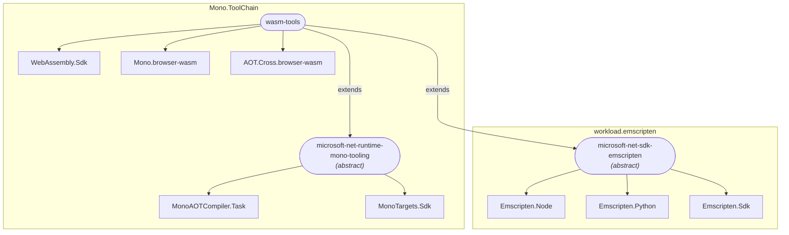
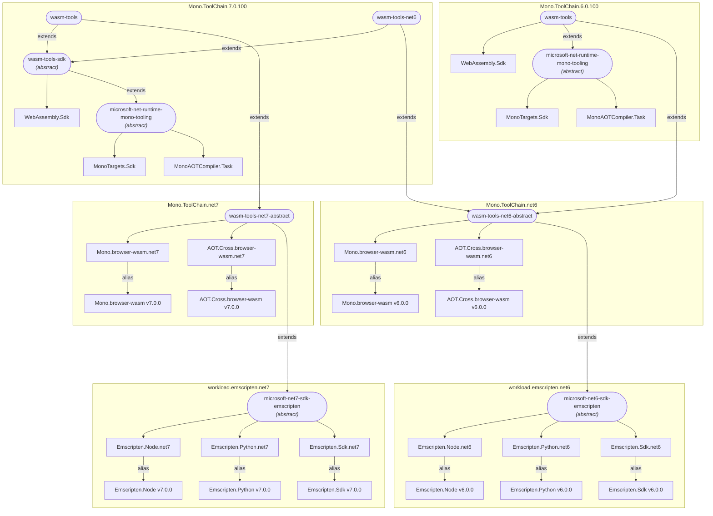

# Handling workload assets across major .NET versions

The latest version of the .NET SDK supports targeting previous versions of .NET.  To do so, it needs assets produced from the build of the previous version of the .NET runtime.  Prior to .NET 6, this included packs such as targeting packs and runtime packs, and the packs were acquired as needed during NuGet restore.  We will call packs that are specific to the version of the runtime being targeted "runtime-specific packs".  Runtime-specific packs are produced as part of the build of the corresponding runtime, but are used by later versions of the .NET SDK when targeting that version of the runtime.  For example, when the the .NET 7 SDK builds a project targeting .NET 6, it will need targeting packs and runtime packs for .NET 6 which were produced by the .NET 6 build.

In .NET 6, some runtime-specific packs are now delivered as workload packs.  In the .NET 7 SDK, these packs need to be available for projects that are targeting .NET 6.  The packs that are traditional targeting and runtime packs can be downloaded using existing mechanisms without being installed as part of a workload, but there are other packs which do not support this.  These include the pack delivering the Mono AoT cross-compiler, and the Emscripten toolchain for Blazor WASM apps.  The Mono AoT cross-compiler is similar to CrossGen 2, which we already support downloading via NuGet restore.  Thus, we can and probably should update the .NET SDK and the workloads which use this AoT compiler to support downloading it in a similar fashion to CrossGen 2.

However, the Emscripten toolchain is large (~700 MB), and we don't want to require downloading such a large component via NuGet restore.  The toolchain is also closely linked to the runtime version of .NET being targeted, so it is delivered as runtime-specific packs, and the .NET 6 versions of the packs need to be used when the .NET 7 SDK builds a Blazor WASM app targeting .NET 6.  This means we will need to have a workload in the .NET 7 SDK that installs the .NET 6 version of the Emscripten toolchain to support building Blazor WASM apps that target .NET 6.  As long as we have such a workload, we will also include the runtime and Mono AoT packs required for this scenario, even if they could be downloaded via NuGet restore.

Creating and managing such cross-version workloads will be complex.  We have the following goals:

- Each version of a workload pack (and the corresponding MSI) should be created out of a single branch / repo.  Runtime-specific packs should be built in the corresponding runtime branch
- We should not introduce cross-version build dependencies, ie the .NET 7 build should not depend on artifacts produced by the .NET 6 build
- Artifacts produced in one version of .NET should not need to know which future versions of .NET they will be consumed in (ie the .NET 6 build should not need to produce a manifest versioned for 7.0.100)
- Different (major) versions of the SDK should be able to share workload packs for targeting a specific runtime.  For example, if the .NET 6 and .NET 7 SDKs are both installed, they should both be able to use the same Emscripten workload packs for targeting .NET 6

## Current wasm-tools dependency graph

The current dependency graph for the wasm-tools workload is shown below.  The large yellow boxes represent the different workload manifests.  The boxes with rounded corners are workloads, and the boxes with square corners are workload packs.  Names have been shortened for simplicity, for example the `Microsoft.NET.Runtime.WebAssembly.Sdk` workload pack is displayed as `WebAssembly.Sdk`.



The runtime-specific packs include the three Emscripten workload packs, the Mono.browser-wasm runtime pack, and the AOT.Cross.browser-wasm pack which includes the AOT compiler.  The .NET 6 version of these packs should continue to be used by the .NET 7 SDK when building a project targeting .NET 6.  The rest of the packs should "roll forward", ie always use the version of the pack corresponding to the .NET SDK version being used.

## Dependency graph for wasm-tools for .NET 6 and .NET 7

The graph below shows the proposed organization of workloads, workload packs, and workload manifests to enable .NET 6 runtime components to be consumed by the .NET 7 SDK.  The runtime-specific workload packs have been factored out into separate runtime-specific workload manifests.  (As in the previous diagram, pack and manifest IDs have been shortened.)



## Aliased workload packs

Workload pack aliases will be used to support depending on different versions of the same workload pack ID.  This is similar to the [Side-by-Side Workload Pattern](https://github.com/dotnet/designs/blob/main/accepted/2020/workloads/workload-manifest.md#side-by-side-workload-pattern) described in the workload manifest design spec.  Using `Emscripten.Sdk` as an example, there will be a version 6.0.0 and a version 7.0.0 of the workload pack.  The `workload.emscripten.net6` manifest will alias `Emscripten.Sdk.net6` to version 6.0.0 of the package, and the `workload.emscripten.net7` manifest will alias `Emscripten.Sdk.net7` to version 7.0.0 of the package.  Then the logic which imports the workload pack can conditionally import the right version of the pack based on the target framework version.  This logic is expected to be in the `WorkloadManifest.targets` file for the workload manifest that defines the `wasm-tools` workload.  For the 7.0.100 version of that manifest, the import logic would look something like this:

```xml
  <ImportGroup Condition="'$(RunAOTCompilation)' == 'true' And '$(TargetFrameworkIdentifier)' == '.NETCoreApp' And '$(TargetFrameworkVersion)' == '6.0'">
    <Import Project="Sdk.props" Sdk="Emscripten.Sdk.net6" />
  </ImportGroup>
  <ImportGroup Condition="'$(RunAOTCompilation)' == 'true' And '$(TargetFrameworkIdentifier)' == '.NETCoreApp' And '$(TargetFrameworkVersion)' == '7.0'">
    <Import Project="Sdk.props" Sdk="Emscripten.Sdk.net7" />
  </ImportGroup>
```

## .NET 6 manifests in .NET 7 SDK

The workload manifests are included in the .NET SDK.  This presents an issue for the runtime-specific workload manifests, as they would naturally be produced from the branch of the runtime they help target, but we don't want to introduce cross-branch build dependencies.

Our solution to this will be to create copies of these runtime-specific manifests in branches corresponding to later SDK versions.  For example, the `workload.emscripten.net6` manifest would naturally be produced out of the .NET 6 branch.  It would use the 6.0.100 feature band, and would have a version number such as 6.0.0.  However, for consumption in the .NET 7 SDK, we would *also* produce a version of the `workload.emscripten.net6` manifest out of the .NET 7 branch.  In that case it would use the 7.0.100 feature band, and would have a version number such as 7.0.0.

The workload packs referred to by this manifest would only be produced out of the .NET 6 branch.  The packs themselves are not used when building the .NET SDK.  They are needed in order to install the corresponding workload, so during testing of builds the right NuGet feeds will need to be set up in order to access the .NET 6 assets.  This is similar to what we already have today where the right feeds need to be set up in order to test self-contained builds.

We will need to keep the versions of the runtime-specific workload packs synced between the .NET 6 and .NET 7 versions of the runtime-specific workload manifests.  During previews for .NET 7, this will be a manual process, where we will update the versions in the .NET 7 manifest manually when a new servicing version of .NET 6 is released.  After .NET 7 is released, we hope to be able to automatically calculate the .NET 6 version numbers by adding a fixed amount to the .NET 7 patch version.  For example, if .NET 7.0.1 releases together with .NET 6.0.12, then we can add 11 to the patch version of .NET 7 to calculate the corresponding version for the .NET 6 runtime-specific packs.  This would let us avoid having to manually sync the version numbers for each servicing release.

# Visual Studio insertions

The runtime-specific .NET 6 packs should be inserted into Visual Studio as part of the insertion of other .NET 6 assets.  For versions of Visual Studio that include the .NET 7 SDK, the runtime-specific workload manifest should be inserted from .NET 7, and NOT from .NET 6.  The tooling to create VS insertions and drops will need to be able to handle inserting packs without a corresponding manifest, and inserting a manifest without a corresponding pack.

# Future major .NET versions

For simplicity, this document mainly discusses .NET 6 and .NET 7.  The same pattern should apply to future versions.  For example, the .NET 8 SDK would have runtime-specific workloads, workload manifests, and workload packs for .NET 6 and .NET 7.  The packs would come from the .NET 6 and .NET 7 builds, while the manifests would be produced in the .NET 8 builds.