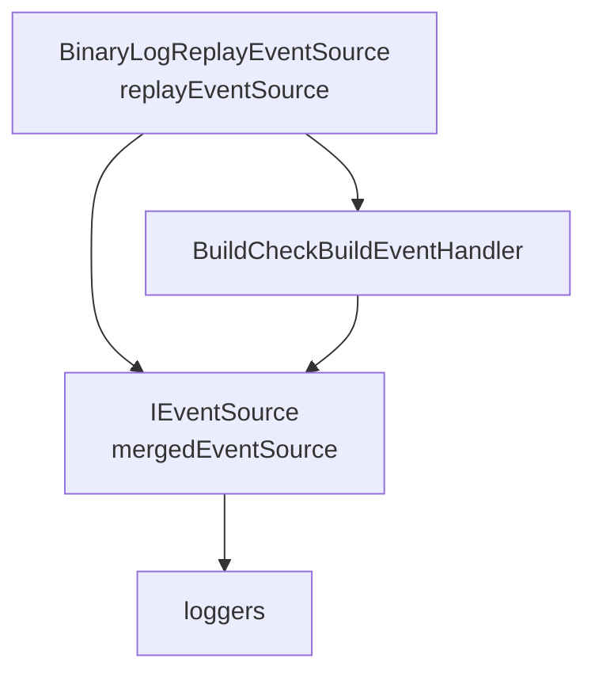

# BuildCheck - Architecture and Implementation Spec

This is an internal engineering document. For general overview and user point of view - please check the [BuildCheck - Design Spec](BuildCheck.md).

# Areas of Ownership

| Area     |      Owner     |
|----------|:-------------|
| PM                  | @baronfel |
| Advisory/Leadership | @rainersigwald |
| Infrastructure      | @jankrivanek |
| Configuration       | @f-alizada   |
| Custom Analyzers    | @YuliiaKovalova |
| Inbox Analyzers     | @ladipro |
| Replay Mode         | @surayya-MS |
| Tracing             | @maridematte |
| Perf Advisory       | @AR-May |


# Infrastructure and Execution

## Data Source

The major source of data for BuildCheck will be the `BuildEventArgs` data - as it is already well established diagnostic source for MSBuild builds.

BuildCheck can source this data either offline from the binlog, or as a plugged logger during the live build execution. Choice was made to support both modes.

The actual OM exposed to users will be translating/mapping/proxying the underlying MSBuild OM and hence the implementation details and actual extent of the data (whether internal or public) will be hidden.

### Sourcing unexposed data from within execution

For agility we'll be able to source internal data during the evaluation and/or execution directly from the build engine, without the `BuildEventArgs` exposure.

To simplify the switch between 'in-node direct data' and 'properly remoted data that can be exposed via public OM' we will internally expose execution data consuming interface - that will be implemented by `LoggingService` as well as BuildCheck infrastructure. This way we can have a simple toggle logic in `LoggingService` that will either forward data to BuildCheck infrastructure (in-proc) or translate them to appropriate `BuildEventArgs` and send them via logging infrastructure.

The following diagram ilustrates the case where data are being consumed directly in node - minimizing the performance and resources impact:


Once the implemented BuildCheck will solidify the idea of need for specific data, those can then be remoted via logging infrastructure and then publicly exposed after translation in BuildCheck central logger connector:


In both cases the sink for the data is actualy a `LoggingContext` - this is to ensure a valid `BuildEventContext` for all data that might be consumed by BuildCheck. BuildCheck needs to know the currently build project path (for proper configuration of the rules and proper reporting) - for this reasen we need to ensure passing of `BuildEventContext` with all data.


#### Sample in-node data case - evaluated project

One example of rich data that might be helpful for internal analyses is [`Project`](https://github.com/dotnet/msbuild/blob/28f488a74ed75bf5f21ca93ac2463a8cb1586d79/src/Build/Definition/Project.cs#L49). This OM is not currently being used during the standard build execution (`ProjectInstance` is used instead) - but we can conditionaly create and expose `Project` and satisfy the current internal consumers of `ProjectInstance` - spike of that is available [in experimental branch](https://github.com/dotnet/msbuild/compare/main...JanKrivanek:msbuild:research/analyzers-evaluation-hooking#diff-08a12a2fa138c3bfcabc7639bb75dda8534f3b662db4aca4f2b5595dbf9ba197).

## Execution Modes

**Replay Mode** - so that users can choose to perform analyses post build, without impacting the performance of the build. And so that some level of analysis can be run on artifacts from builds produced by MSBuild from NET 9.0 / VS 17.12 or newer. The older versions won't be supported.

**Live mode** - this is what users are used to from compilation analyses. Integrating into build execution will as well help driving adoption by opting-in users by default to some level of checking and hence exposing them to the feature.

## Live Mode Hosting

Prerequisites: [MSBuild Nodes Orchestration](../../wiki/Nodes-Orchestration.md#orchestration)

The BuildCheck infrastructure will be prepared to be available concurrently within the `scheduler node` as well as in the additional `worker nodes`. There are 2 reasons for this:
* BuildCheck will need to recognize custom analyzers packages during the evaluation time - so some basic code related to BuildCheck will need to be present in the worker node.
* Presence in worker node (as part of the `RequestBuilder`), will allow inbox analyzers to agile leverage data not available within `BuildEventArgs` (while data proven to be useful should over time be exposed to `BuildEventArgs`)

## Replay Mode

Prerequisites: [MSBuild Replaying a Binary Log](../../wiki/Binary-Log.md#replaying-a-binary-log)

When replaying a binary log, we can apply BuildCheck with help of `-analyze` switch:
```
> msbuild.exe msbuild.binlog -analyze
```

If BuildCheck is enabled, then the events from `BinaryLogReplayEventSource` and new events from BuildCheck are merged into the `IEventSource`, from which the loggers get events.


1. The events from `BinaryLogReplayEventSource replayEventSource` are passed to the `IEventSource mergedEventSource` unchanged.
2. The events from `BinaryLogReplayEventSource replayEventSource` are passed to `BuildCheckBuildEventHandler` in order to produce new events from BuildCheck.
3. The `BuildCheckBuildEventHandler` uses the `IEventSource mergedEventSource` to invoke new events.

`BuildCheckBuildEventHandler` is an internal infrastructural class and serves as an entry point for producing new events from BuildCheck.

## Handling the Distributed Model

We want to get some benefits (mostly inbox analyzers agility) from hosting BuildCheck infrastructure in worker nodes, but foremost we should prevent leaking the details of this model into public API and OM, until we are sure we cannot achieve all goals from just scheduler node from `BuildEventArgs` (which will likely never happen - as the build should be fully reconstructable from the `BuildEventArgs`).

How we'll internally handle the distributed model:
* Each node will have just a single instance of infrastructure (`IBuildCheckManager`) available (registered via the MSBuild dependency injection container - `IBuildComponentHost`). This applies to a scheduler node with inproc worker node as well.
* Scheduler node will have an MSBuild `ILogger` registered that will enable communicating information from worker nodes BuildCheck module to the scheduler node BuildCheck module - namely:
    * Acquisition module from worker node will be able to communicated to the scheduler node that it encountered `PackageReference` for particular analyzer and that it should be loaded and instantiated in the main node.
    * Tracing module will be able to send perf stats from current worker node and aggregate all of those together in the main node.
    * Theoretical execution-data-only sourcing inbox analyzer will be able to aggregate data from the whole build context (again - we should use this only for agility purposes, but shoot for analyzer that needs presence only in scheduler node). The way to do that can be via being present in all worker nodes, sending a specific type of 'in progress result' BuildEventArgs and aggreggating those intermediary results in the single instance running in the main node.
* Apart from the scenarios above - the BuildCheck infrastructure modules in individual nodes should be able to function independently (namely - load the inbox analyzers that should live in nodes; send the analyzers reports via logging infrastructure; load user configuration from `.editorconfig` and decide on need to enable/disable/configure particular analyzers).
* The custom analyzers will be hosted only in the main node - and hence the distributed model will be fully hidden from them. This might be a subject for revision in future versions.
* Communication from main to worker node between BuildCheck infra modules is not planned (this might be revisited - even for the V1).

## Analyzers Lifecycle

Planned model:
* Analyzers factories get registered with the BuildCheck infrastructure (`BuildCheckManager`)
    * For inbox analyzers - this happens on startup.
    * For custom analyzers - this happens on connecting `ILogger` instance in scheduler node receives acquistion event (`BuildCheckAcquisitionEventArgs`). This event is being sent by worker node as soon as it hits a special marker (a magic property function call) during early evaluation. Loading is not processed by worker node as currently we want custom analyzers only in the main node (as they will be only given data proxied from BuildEventArgs).
    The `BuildCheckAcquisitionEventArgs` should be sent prior `ProjectEvaluationStartedEventArgs` (buffering will need to take place), or main node will need to replay some initial data after custom analyzer is registered.
* `BuildCheckManager` receives info about new project starting to be build
    * On scheduler node the information is sourced from `ProjectEvaluationStartedEventArgs`
    * On worker node this is received from `RequestBuilder.BuildProject`
* `BuildCheckManager` calls Configuration module and gets information for all analyzers in it's registry
    * Analyzers with issues in configuration (communicated via `BuildCheckConfigurationException`) will issue an error and then be deregistered for the rest of the build.
    * Global configuration issue (communicated via `BuildCheckConfigurationException`) will issue an error and then entirely disable BuildCheck.
* `BuildCheckManager` instantiates all newly enabled analyzers and updates configuration for all already instantiated analyzers.
* At that point of time analyzers are prepared for receiving data and performing their work. MSBuild will start calling `BuildCheckManager` callbacks (mostly pumping `BuildEventArgs`), passed data will be translated into BuildCheck OM and passed to analyzers.
* Analyzers may decide to report results of their findings (via `BuildCheckDataContext.ReportResult`), the infrastructure will then perform post-processing (filter out reports for `Rule`s that are disabled, set the severity based on configuration) and send the result via the standard MSBuild logging infrastructure.
* Analysis result might hence be reported after project's final `ProjectFinishedEventArgs`
* Final status of the build should not be reported (and `BuildFinishedEventArgs` logged) until all analyzers are done processing and their results are accounted for.

# Configuration

[Configuration implmentation details](../../../src/Build/BuildCheck/Infrastructure/EditorConfig/README.md).

## High-level logic

MSBuild engine always finds and parses relevant `.editorconfig` files to see which analyzers should be enabled, if any. In typical builds this operation will not be expensive compared to everything else happening as part of building a project. It's a new cost to all builds though, and in the unlikely case that it starts showing as a perf bottleneck, we can cache the data relevant to MSBuild in a separate intermediate file, in a process-wide in-memory cache invalidated by timestamp checks, and so on.

The rest of the configuration comes directly or indirectly from project files in the form of properties, which creates an interesting ordering issue. For the engine to know the final values of properties such as `TargetFramework`, it needs to evaluate the project. However, if it turns out that an analyzer should be enabled that is interested in _tracing_ the evaluation, it is already too late. It's important to note that this issue exists only for a subset of analyzers. Analyzers interested in the _result_ of evaluation, for example, are fine. The best way of handling this would be to simply evaluate again. Technically, we only need to finish Pass 1 of evaluation to know the value of properties and have the relevant property functions called, so the extra work can be limited to pass 0 and 1. Measurements show that 75% of evaluation is spent in passes 0 and 1. In the very worst case when an extra pass 0/1 runs for each project and lacks any kind of further optimization, single-process incremental build of OrchardCore has been measured to take about 5% longer. There are opportunities for optimizing this, for example by adding a marker to SDK targets files notifying MSBuild of the point after which `TargetFramework` is expected to be fixed so the engine can bail early.

Once `TargetFramework` is known, we can combine the default analyzer config with what came from `.editorconfig`, restart evaluation if an evaluation-tracing analyzer just got enabled, and continue with the rest of the build. Unlike `TargetFramework` which has an additive effect on the enabled analyzers, a master switch like `RunMSBuildChecks` may instruct the engine to not run anything. It would be unfortunate if the user had to pay any extra cost when `RunMSBuildChecks` evaluates to false. So preferrably we don't do anything perf sensitive until we hit the point in evaluation when `TargetFramework`, `RunMSBuildChecks`, `SdkAnalysisLevel`, ... are all known and the set of analyzers to use is finalized.

Since we are unlikely to enable any analyzers by default in .NET 9, the focus in this release should be on optimizing the `.editorconfig` handling.

# Acquisition

BuildCheck employs two distinct types of analyzers: inbox and custom. As a result, the acquisition and distribution processes vary.
Inbox rules are integrated into the MSBuild repository, while custom analyzers can be packaged as NuGet packages and detected by MSBuild provided they adhere to a specific structure. 

To streamline the creation of custom rules, a special [template](https://learn.microsoft.com/dotnet/core/tools/custom-templates) has been introduced.
To enable MSBuild to recognize a custom analyzer, it must invoke the intrinsic function [`void RegisterBuildCheck(string path)`](https://github.com/dotnet/msbuild/blob/1c3b240ce7417223672c62862a6ff7e884e6997a/src/Build/Evaluation/IntrinsicFunctions.cs#L700), which requires the path to the assembly as input. Therefore, it's essential for the user to ensure that the assembly exists in the specified location.
Additionally, the custom rule must use [`BuildAnalyzerRule`](https://github.com/dotnet/msbuild/blob/9cdb3615adb4115f92b390de2f258fac5f320909/src/Build/BuildCheck/API/BuildAnalyzerRule.cs#L11C14-L11C31) as a parent class; otherwise, MSBuild will not register it.

Examples of custom rules can be found in the [end-to-end tests](https://github.com/dotnet/msbuild/blob/1c3b240ce7417223672c62862a6ff7e884e6997a/src/BuildCheck.UnitTests/EndToEndTests.cs#L139), showcasing various scenarios:

1. [`Single Custom Rule Packaged as a NuGet Package`](https://github.com/dotnet/msbuild/tree/main/src/BuildCheck.UnitTests/TestAssets/AnalysisCandidate): Demonstrates the implementation of a custom rule encapsulated within a NuGet package. It contains the process of creating, packaging, and integrating a single custom rule into a project.
2. [`Project with Multiple Analyzers Referenced`](https://github.com/dotnet/msbuild/tree/main/src/BuildCheck.UnitTests/TestAssets/AnalysisCandidateWithMultipleAnalyzersInjected): Illustrates a project setup where multiple custom analyzers are referenced. This scenario is common in larger projects where multiple rule sets need to be enforced simultaneously.

Important Notes: 
- In these examples, pay attention to the presence of the `CustomAnalyzerName.props` file. This file contains intrinsic function invocations necessary for successful rule registration. Understanding and correctly implementing these invocations are crucial for integrating custom rules into your projects effectively.
- The examples do not include references to third-party assemblies that might be required in other custom analyzers. To load the custom instance in MSBuild, third-party assemblies have to be included in the NuGet package. The current implementation achieves this goal by using a special target: [AddNuGetDlls](https://github.com/dotnet/msbuild/blob/1c3b240ce7417223672c62862a6ff7e884e6997a/template_feed/Microsoft.AnalyzerTemplate/Company.AnalyzerTemplate.csproj#L22).

### Future Enhancements
As our library of custom rules expands, we plan to enrich this section with real-world production rule examples. These examples will showcase a diverse range of rules addressing common development challenges. Once these production rules are published and available on nuget.org, we will update this documentation accordingly.

# Build OM for Analyzers Authoring

**TBD** - details for the initial inbox analyzers set to be amended by @ladipro
