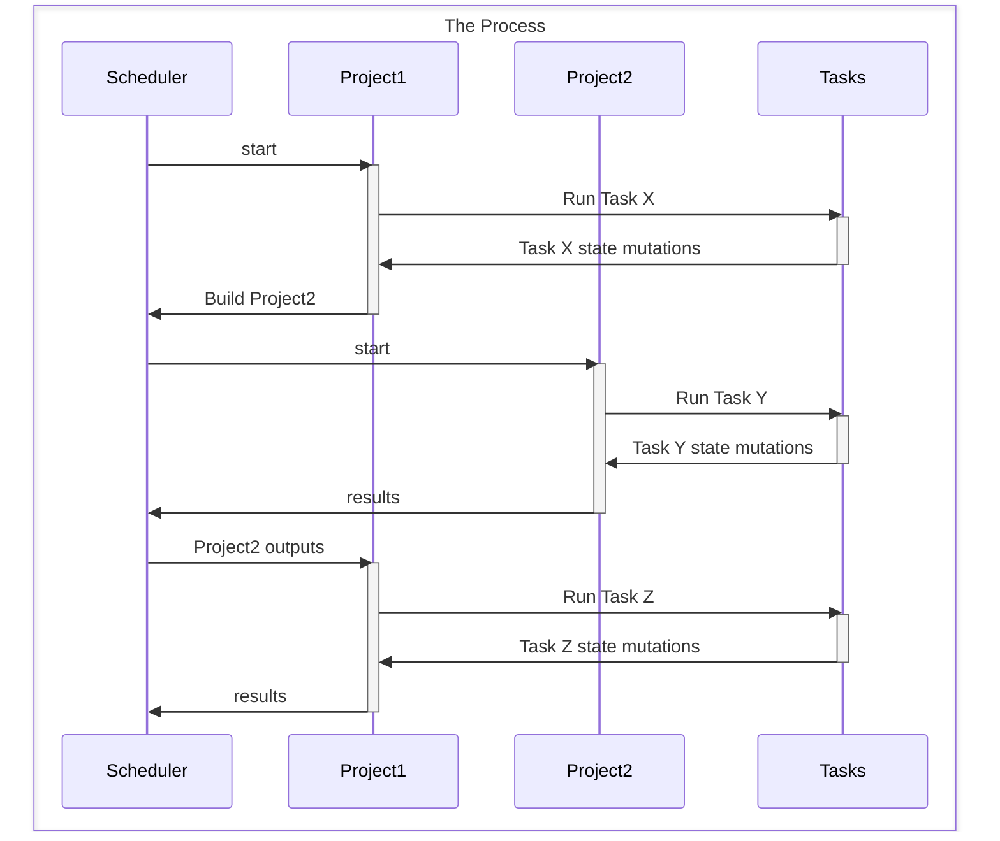
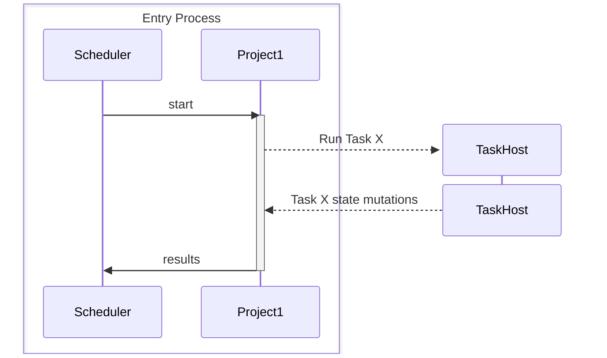
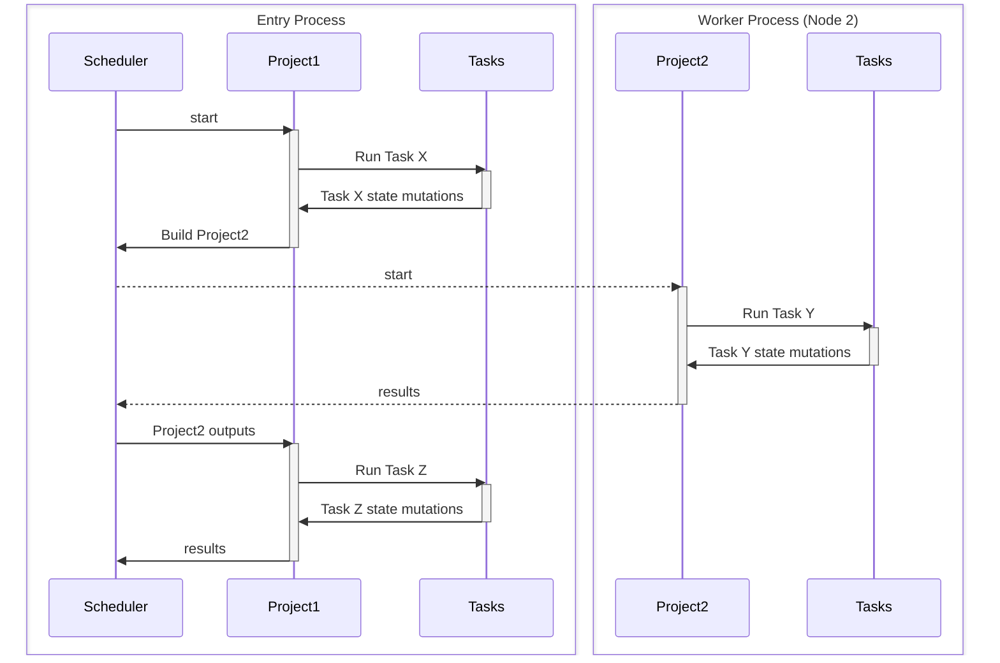
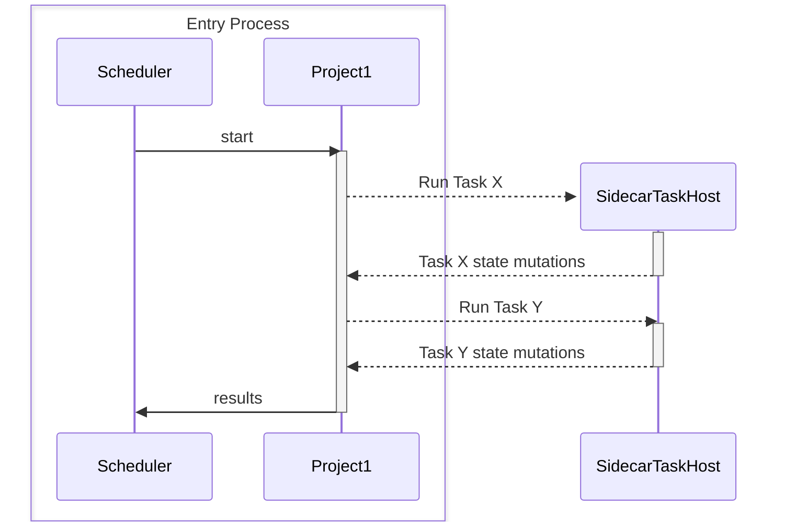

# Multithreaded MSBuild

Currently, MSBuild supports parallel builds (a critical feature for a build system) by spawning worker processes. This made adoption easier because it didn't impose any requirements on tasks: they continue to own the whole process while they are executing. But it's a pretty strange design decision in the modern age, where we assume things are multithreaded and async.

## Current state

There are several components of MSBuild that are relevant to parallel builds:

* The **scheduler** decides what projects to build (and where, if there are options).
* **Projects** maintain mutable state, especially Properties and Items.
* Projects are assigned to **nodes** (worker processes) that execute the build. Once a project is assigned to a node, it is not moved to another node.
* **Tasks** are executed in targets in projects.

### Single-proc builds

In the oldest MSBuild mode of operation, there is a single process that executes the build. When a project is started, the engine `cd`s into the project directory and begins executing. If the process environment or current working directory is mutated during the project, it is saved when the project yields (either because it's waiting on results from another project or because it has finished executing). When the project is resumed, the environment is restored to the saved state. Tasks are instantiated and executed in the same process, so they can access the environment and current working directory.

### Out-of-proc task execution

Even in single-proc mode, MSBuild supports out-of-proc task execution. This is done by spawning a new process to execute the task, which allows the task to run in isolation from the main build process. MSBuild handles passing the necessary information to the task process, such as the current environment, working directory, and explicit inputs. The task process can then execute and return results back to the main build process.

### Multi-proc builds

In multi-proc builds, the scheduler assigns projects to multiple worker processes (nodes). There is one in-process node running in the entry process, and multiple out-of-process nodes running in separate worker processes, with one node per worker process. Each node is responsible for executing the projects assigned to it. The scheduler manages the creation of the nodes, distribution of projects, and ensures that dependencies are respected. When a project is assigned to a node, it is not moved to another node, which means that the state of the project is maintained within that node.

(This diagram is simplified: the scheduler will not create a new node for every project, so in a two-project build, the scheduler will assign both projects to the same node.)

A task that needs to run out of process can spawn a new process, as in a single-proc build, with potentially many TaskHost processes running concurrently.

## Multithreading MSBuild

The goal of multithreading MSBuild is to allow tasks to run concurrently within the same process, rather than spawning separate processes for each task. This would enable better resource utilization and potentially faster builds, as fewer processes would need to be created, reducing .NET runtime overhead and inter-process communication as well as increasing the efficacy of task-level caching.

But tasks are not currently designed to be multithreaded. They assume that they own the whole process while they are executing, and they mutate the process state (environment, working directory, etc.). To make MSBuild multithreaded while maintaining task compatibility, we need to consider what parts of the build process can be moved to a multithreaded model without breaking existing tasks, as well as allowing new tasks to opt into multithreading.

The scheduler is already capable of juggling multiple projects, and there's already an abstraction layer for "where a project runs", so we will need to add a new type of node that is neither "the only in-proc node" nor "a process" but a "a thread in the in-proc node". This will allow us to run multiple projects concurrently within the same process.

Within that node, we can track the state of the projects assigned to the node. Since projects are independent from each other that should generally already be thread-safe.

This leaves us with tasks. Tasks will need to be modified to support multithreading (see [Thread-safe tasks]), but we need a way to maintain compatibility with existing tasks that do not implement the new interface, so they can still run in a process they "own" while allowing new tasks to take advantage of multithreading.

For most tasks, an engine-level decision to push the tasks to a TaskHost process will maintain compatibility: the process will only run one task at a time, so the task will still "own" the process. When a task is pushed out of process this way, we will need to be careful to capture and preserve any global-process-state mutations that the task makes, so that they can be communicated back to the main MSBuild process and available to subsequent tasks in the same project.

Some tasks or sets of tasks will break if they are run in short-lived processes, because they expect to be able to mutate process state including things like static fields in shared classes.

## Sidecar TaskHosts

One feature addition that will support multithreading MSBuild is the ability to run tasks in sidecar TaskHosts. This means that tasks can be executed in separate processes, but these processes are long-lived and dedicated to a specific project-execution node, as opposed to short-lived TaskHost processes that are spawned for each task execution.
 
This will also apply to .NET (Core) tasks, which must run out of process in Visual Studio/MSBuild.exe on .NET Framework. Sidecar TaskHosts will reduce the overhead of pushing task execution out of process, as the process will already be running, ready to execute tasks, and have an established IPC connection to the main MSBuild process.

With a sidecar TaskHost per node, the fact that much of the MSBuild-level state is maintained and manipulated in a different process than the tasks themselves are running in should be transparent to the tasks, since they'll have the same "within a single project" view of the world.

## Thread-safe tasks

To mark that a task is multithreaded-MSBuild-aware, we will introduce a new interface that tasks can implement. We will provide an object with information about the task invocation, including the current environment and working directory, so that tasks can access the same information they would have in a single-threaded or out-of-process execution.

To ease task authoring, we will provide a Roslyn analyzer that will check for known-bad API usage, like `System.Environment.GetEnvironmentVariable` or `System.IO.Directory.SetCurrentDirectory`, and suggest alternatives that use the object provided by the engine.

## Tasks transition

In the initial phase of development of multithreaded execution mode, all tasks will run in sidecar taskhosts. Over time, we will update tasks that are maintained by us and our partners (such as MSBuild, SDK, and NuGet) to implement and use the new thread-safe task interface. As these tasks become thread-safe, their execution would be moved into the entry process. Customers' tasks would be executed in the sidecar taskhosts unless they implement the new interface.
