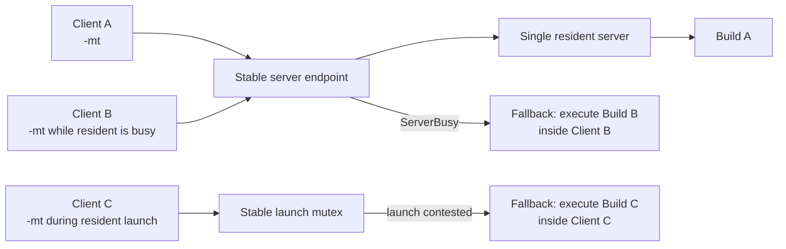
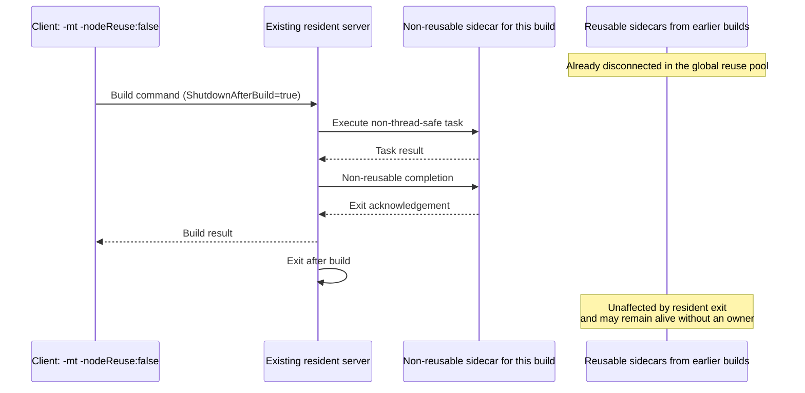
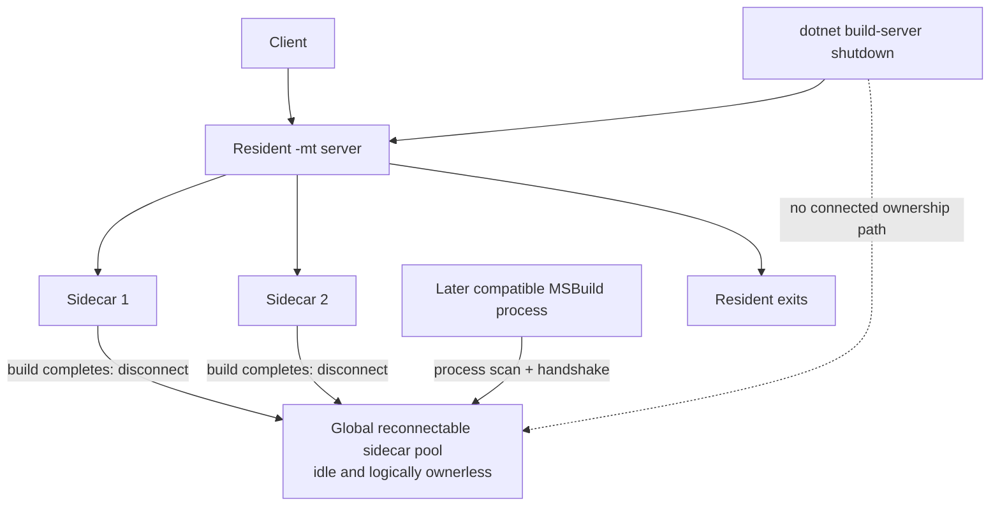
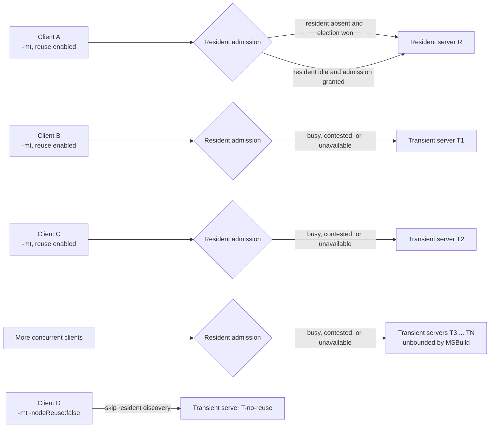
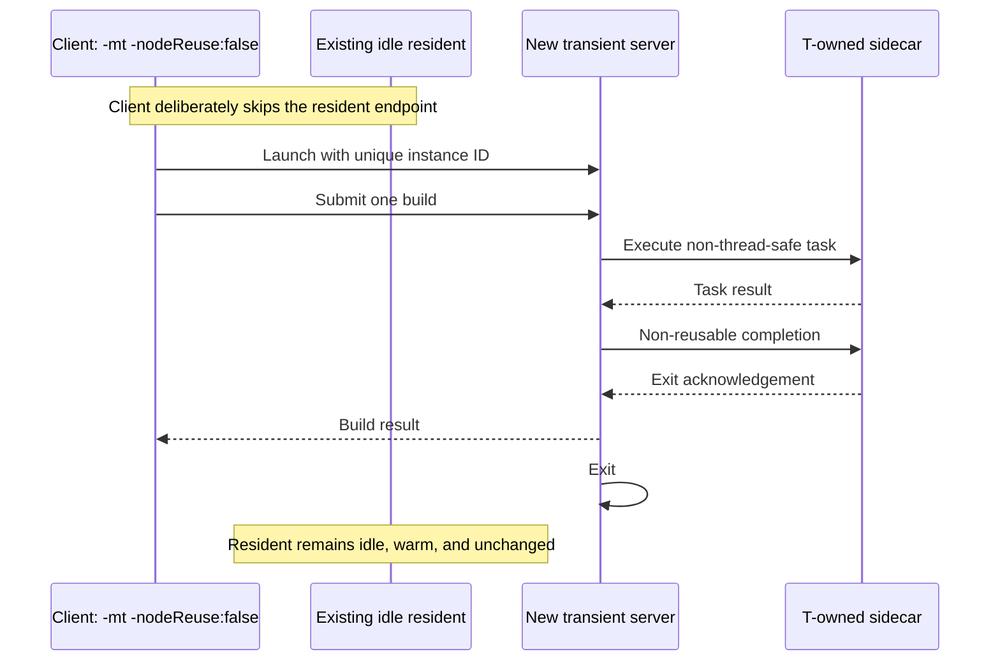
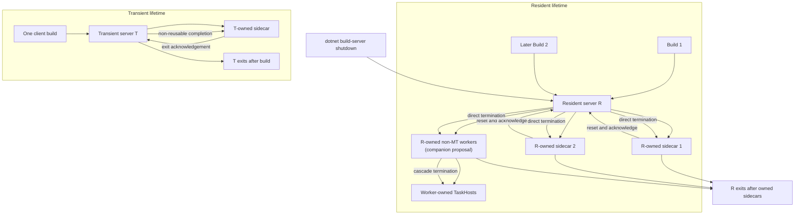

# Multithreaded MSBuild Server and Sidecar Ownership

**Status:** Proposed

Companion proposal:
[Non-Multithreaded MSBuild Server Worker-Node Ownership](../non-mt-server-worker-node-ownership.md).

Both proposals describe the same stable resident server. The server identity
does not include an MT/non-MT discriminator: one resident may serve both modes
over its lifetime. It owns direct sidecars created for MT work and worker nodes
created for non-MT work. Server GC policy is orthogonal to these ownership
proposals.

## Summary

Multithreaded (`-mt`) command-line builds use the MSBuild Server so the process
that owns the scheduler, evaluations, and caches can remain warm between builds.
This proposal defines two server lifetimes:

- At most one **resident server** exists for a compatible server identity.
- Any additional concurrently needed servers are **transient servers**.

MSBuild does not impose a limit on the number of transient `-mt` servers. Each
transient server serves exactly one client build and then exits.

Every sidecar TaskHost has exactly one owning MSBuild process. A TaskHost is
never placed in a global pool and cannot be adopted by another server or node.
Resident-server sidecars may persist across builds owned by that server.
Transient-server sidecars cannot outlive the transient server or its build.
The shared resident also owns non-MT worker nodes as defined by the companion
proposal.

## Goals

1. Preserve a warm resident server for the common sequential inner-loop case.
2. Run concurrent `-mt` builds in server processes instead of falling back to
   the thin client process when the resident server is busy.
3. Allow an unbounded number of concurrent transient servers, subject only to
   operating-system resource limits.
4. Ensure `-mt -nodeReuse:false` always uses a fresh transient server and never
   connects to or shuts down an existing resident server.
5. Make each server directly own and shut down its sidecar TaskHosts without
   machine-wide process enumeration.
6. Prevent sidecars and transient servers from becoming orphaned when their
   owner exits unexpectedly.

## Non-goals

- Sharing caches or TaskHosts between different server processes.
- Adding a server pool or scheduling work across multiple servers.
- Limiting transient-server concurrency inside MSBuild.
- Removing or ignoring explicit server opt-out such as
  `MSBUILDUSESERVER=0`; an opted-out build still runs outside the server.
- Changing non-`-mt` busy/unavailable fallback routing; the companion proposal
  changes worker ownership but preserves in-process fallback.
- Splitting MT and non-MT work into different resident identities.
- Defining or changing the resident's Server GC policy.

## Baseline: current state

This section describes the behavior before this proposal. The diagrams use
GitHub-supported Mermaid and can be pasted directly into a GitHub issue.

### One stable server and in-process fallback

The current client and server use one stable pipe, running mutex, launch mutex,
and busy mutex for each server identity.

1. The first compatible client launches the server.
2. A later client reuses that server when it is available.
3. If the server is busy, or another client is launching it, the new client
   returns `ServerBusy` and falls back to executing the build in its own process.
4. Server shutdown/reuse handling also contains a system-wide process-count
   guard that treats additional server processes as over-provisioning. This
   assumes that every server process is competing to be the single resident.

As a result, concurrent `-mt` invocations do not all receive Server GC,
long-lived engine state, or the same server execution model. One runs in the
server while the others may run in their thin client processes.



### No-reuse requests can consume the resident

For `-mt -nodeReuse:false`, the current client still resolves the stable server
endpoint. If an idle resident exists, the client connects to it and places
`ShutdownAfterBuild=true` in the build command. The request therefore consumes
and then terminates the shared resident rather than receiving a private
one-build server.



This has two undesirable effects:

- a no-reuse request evicts caches belonging to reusable builds; and
- sidecars may survive the resident that launched them.

### Sidecars form a reconnectable global pool

Reusable sidecar TaskHosts currently disconnect from their owner at build
completion and return to listening on their process-specific named pipes. The
provider drops the live `NodeContext`. A later compatible MSBuild process finds
candidate processes, performs the TaskHost handshake, and may adopt one.

The process that launched the sidecar is therefore not its lifetime owner.
Between builds the sidecar can be alive with no connected owner.

`dotnet build-server shutdown` addresses the stable server and the normal worker
node shutdown path. It has no direct connected ownership path to those idle
`dotnet`-hosted sidecars, so they can remain alive after the server exits.



### Current-state consequences

| Scenario | Current result |
|---|---|
| First reusable `-mt` build | Launches or uses the single resident server. |
| Concurrent `-mt` build while resident is busy | Falls back to execution in the client process. |
| Resident launch race loser | Falls back to execution in the client process. |
| `-mt -nodeReuse:false` with idle resident | Uses the resident and requests that it exit afterward. |
| Resident server shutdown | Resident exits; disconnected reusable sidecars may remain. |
| Sidecar owner crashes | Sidecar can return to listening and later be adopted by another process. |

## Proposed end state

The final topology separates **residency** from **concurrency**:

- the stable endpoint identifies at most one resident server;
- every additional concurrent server is private and transient;
- no-reuse requests always select the transient path;
- each server exclusively owns its sidecars; and
- process enumeration is not part of server or sidecar shutdown.

The one resident is shared with non-MT server builds and may simultaneously
retain non-MT worker nodes from earlier builds.

### Behavior comparison

| Dimension | Current state | Proposed end state |
|---|---|---|
| Server count per identity | One server process is expected system-wide. | One resident plus any number of transient servers. |
| Resident busy | Client falls back to an in-process build. | Client launches a transient server. |
| Resident launch contested | Client falls back to an in-process build. | Losing client launches a transient server. |
| `-mt -nodeReuse:false` | May reuse and then terminate the resident. | Always bypasses the resident and launches a transient. |
| Sidecar reuse | Sidecars disconnect into a cross-process pool. | Sidecars are reusable only by their owning server or node. |
| Resident sidecar lifetime | Can outlive the resident. | Cannot outlive the resident. |
| Transient sidecar lifetime | No transient-server concept. | Ends before the transient server exits. |
| `build-server shutdown` | Cannot directly reach disconnected sidecars. | Shared resident directly shuts down owned sidecars and workers. |

### Final server routing

There is no MSBuild-defined limit on transient-server count. If `N` compatible
clients need to build concurrently, one may use the resident and the remaining
`N - 1` may each launch a transient server.



Only `R` publishes the stable endpoint and holds the stable resident mutexes.
Each transient has a unique private endpoint and serves one client build.

### Final no-reuse behavior

The no-reuse decision is made before resident discovery. It cannot accidentally
connect to, shut down, or perturb a resident server.



### Final sidecar ownership and shutdown

Each server instance has a unique ownership identity. Its sidecars retain their
connection to that owner and cannot be adopted by another process.

Resident sidecars may be reset and reused across builds on the same resident.
Transient sidecars are shut down before their one-build server exits. If an
owner crashes, connection loss or platform-specific lifetime containment reaps
its sidecars.



### Final-state guarantees

1. Sequential reusable builds keep the resident and its caches warm.
2. Concurrent builds receive transient servers instead of changing execution
   model and falling back in-process.
3. Every additional server beyond the resident is transient.
4. `-mt -nodeReuse:false` never reconnects to the resident.
5. No sidecar can migrate between owners.
6. Resident shutdown directly reaps resident sidecars and resident-owned
   workers.
7. Transient completion directly reaps transient sidecars.
8. No server counts peer processes, and shutdown performs no process scan.

## Terminology

### Server identity

A **server identity** contains the compatibility inputs already represented by
the server handshake, including the MSBuild toolset, user/session, elevation,
architecture, and handshake salt. Processes with incompatible identities never
reuse one another. The stable server identity is represented by the existing
server handshake hash. MT/non-MT mode is intentionally not part of this
identity, so both modes share one resident.

### Server instance ID

Every server process also has a unique **server instance ID** generated at
launch. The resident endpoint remains stable across resident process lifetimes,
but the instance ID distinguishes the current resident process from an older
one. A transient server's private endpoint includes its instance ID.

The instance ID also scopes sidecar ownership to one server process. It is a
correlation and ownership value, not a security boundary. Named-pipe ACLs and
the server handshake continue to provide authentication and compatibility
checks.

### Resident server

A **resident server**:

- publishes the stable endpoint for its server identity;
- owns the stable running and busy mutexes;
- serves multiple sequential builds;
- may serve both MT and non-MT builds;
- owns direct sidecars and resident-owned worker nodes accumulated by either
  mode;
- remains alive after a reusable build; and
- exits when explicitly shut down, canceled irrecoverably, or terminated by the
  operating system.

There is at most one resident server for each server identity.

### Transient server

A **transient server**:

- has a unique instance ID and private endpoint;
- receives its transient mode and instance ID as launch arguments;
- is connected only to the client that launched it;
- does not publish or acquire the resident running or busy mutexes;
- serves exactly one build;
- always shuts down after returning that build result; and
- cannot become resident, even if the resident slot becomes available later.

Additional server processes beyond the one resident server are always
transient. A transient server exits if its client does not connect within a
bounded startup timeout.

### Owned sidecar TaskHost

An **owned sidecar TaskHost** is a TaskHost whose lifetime is scoped to one
server or node process. Ownership includes:

- an ownership-specific handshake that prevents another process from adopting
  it;
- a connection retained for the lifetime of the owner;
- graceful termination initiated directly by the owner; and
- forced termination or self-termination when the owner disappears.

## Required invariants

1. At most one resident server exists for a server identity.
2. There may be any number of transient servers for that identity.
3. A server instance is resident or transient for its entire lifetime.
4. A transient request never connects to the resident endpoint.
5. `-mt -nodeReuse:false` always creates a transient server, even when an idle
   resident server exists.
6. A busy resident server causes a transient server launch, not an in-process
   fallback.
7. Losing resident admission never terminates or corrupts the resident server.
8. A sidecar has exactly one owner and cannot reconnect to a different owner.
9. A resident sidecar may survive a build but cannot survive its resident
   server.
10. No reusable MSBuild server, worker node, or TaskHost created for a
    `-nodeReuse:false` build survives that build.
11. Server and sidecar shutdown never require process-name or machine-wide
    process enumeration.
12. MT and non-MT requests target the same resident identity; request mode
    controls busy fallback behavior, not resident selection.

## Client routing

The client classifies the request before connecting to any server.

| Request | Resident state | Behavior |
|---|---|---|
| `-mt`, node reuse enabled | No resident | Compete for the resident slot. The winner launches the resident server. |
| `-mt`, node reuse enabled | Resident idle | Connect to and reuse the resident server. |
| `-mt`, node reuse enabled | Resident busy | Launch a new transient server. |
| `-mt`, node reuse enabled | Another client is launching the resident | Launch a new transient server. |
| `-mt`, node reuse enabled | Resident connection fails after bounded retry | Launch a new transient server. |
| `-mt -nodeReuse:false` | Any state | Skip resident discovery and launch a new transient server. |

Once the client chooses the transient path, it must not retry the resident
server. This remains true if the resident becomes idle while the transient
server is starting.

The client-side busy check is only a hint. Two clients can both observe an idle
resident before either build acquires admission. The resident must therefore
arbitrate admission server-side:

1. exactly one client acquires the resident's build lease;
2. every losing client receives a structured busy rejection;
3. rejection does not put the resident into an error or shutdown state; and
4. each rejected client launches a transient server.

### Resident election

The stable launch mutex serializes attempts to create a resident, while the
stable running mutex authoritatively establishes residency:

1. A client observes that no resident server is available.
2. It attempts to acquire the stable launch mutex.
3. The winner launches a resident candidate on the stable endpoint.
4. The candidate becomes resident only after acquiring the stable running mutex.
5. Every losing client launches its own transient server instead of waiting for
   or reconnecting to the resident.

The resident server exclusively owns the stable running mutex. Transient
servers do not participate in resident election and are not counted when
enforcing the single-resident invariant.

If the launch winner or resident candidate fails before acquiring the running
mutex, its client launches a transient server. It is acceptable for no resident
to exist until a later resident-eligible request starts a new election. If a
candidate discovers that another process already owns the running mutex, the
candidate exits and its client launches a transient server; the candidate never
converts itself into a transient server.

### Transient endpoint

The client generates a cryptographically random server instance ID and passes
both the transient mode and ID to the server at launch. The private pipe name is
derived from:

```text
server identity + transient server instance ID
```

Only the launching client knows this endpoint. The transient server does not
need a global running, busy, or launch mutex because it accepts one client and
one build. It nevertheless enforces a one-build state machine server-side and
rejects any second `ServerNodeBuildCommand`.

If the client does not establish the connection and submit its build within a
bounded startup timeout, the transient server exits. This prevents a client
failure during launch from leaving an undiscoverable server behind.

## Why `-nodeReuse:false` must be transient

Node reuse is a lifetime contract. For `-mt -nodeReuse:false`, no reusable
MSBuild server, worker node, or TaskHost created for the request may remain
after the build.

Connecting such a request to a resident server has two incorrect outcomes:

1. Reusing the resident violates the request's no-reuse intent.
2. Shutting the resident down discards caches owned by unrelated reusable
   builds and can disrupt another client.

The client must therefore bypass resident discovery and launch a private
transient server. Whether the server exits is determined at launch, not by
sending a `ShutdownAfterBuild` command to an arbitrary resident server.

## Concurrent build examples

### Concurrent reusable builds

Given no existing resident and three concurrent reusable `-mt` requests:

1. One client wins resident election and launches resident server `R`.
2. The other clients launch transient servers `T1` and `T2`.
3. `R`, `T1`, and `T2` execute concurrently.
4. `T1` and `T2` exit after their builds.
5. `R` remains available for a later sequential build.

If `R` already exists and is idle, the first request reuses it. Requests that
arrive while `R` is busy each launch a transient server.

### No-reuse build with an idle resident

Given an idle resident server `R`, an `-mt -nodeReuse:false` request:

1. does not connect to `R`;
2. launches transient server `T`;
3. runs entirely in `T`; and
4. shuts down `T` and all of `T`'s sidecars after the build.

`R` and its caches remain untouched.

## Sidecar TaskHost ownership

Non-thread-safe tasks in an `-mt` build run in sidecar TaskHost processes.
Sidecars belong to the server instance executing that build.

### Resident server

The resident server may reuse its sidecars across builds:

1. The server launches or reuses one of its connected sidecars.
2. At build completion it sends a reusable completion packet.
3. The sidecar disposes build-lifetime objects and resets environment, current
   directory, cancellation, warning configuration, and other per-build state.
4. The sidecar acknowledges that reset but keeps its ownership connection open.
5. A later build on the same resident server may reuse it.

No other resident, transient server, worker node, or thin client can connect to
that sidecar.

### Transient server

A transient server may reuse a sidecar within its single build when the request
allows node reuse, including for nested task callbacks. A
`-nodeReuse:false` transient does not reuse sidecars. No transient preserves a
sidecar for a later build.

After the build result is ready, the transient server:

1. sends a non-reusable completion packet to every owned sidecar;
2. waits for those sidecars to exit, with the existing forced-termination
   fallback; and
3. exits only after sidecar teardown has completed.

### Owner failure

The ownership connection is also a lifetime signal. If the server disappears
without a clean shutdown, its sidecars terminate rather than returning to a
global reuse pool.

Platform-specific process containment may provide an additional hard guarantee,
for example a Windows Job Object configured with
`JOB_OBJECT_LIMIT_KILL_ON_JOB_CLOSE`. The ownership protocol remains necessary
for portable and graceful shutdown.

Sidecars created when the server is explicitly disabled follow the same
single-owner rule: they are owned by the creating MSBuild node and cannot
outlive or be adopted away from that node.

## Server shutdown

`dotnet build-server shutdown` targets the stable resident endpoint for the
current server identity.

The shutdown client coordinates with the stable launch mutex while resolving
and shutting down the resident. A resident candidate cannot be published
concurrently with a shutdown operation and escape that operation unnoticed.

The resident server shuts down in this order:

1. stop accepting new builds;
2. finish or cancel the active build according to existing shutdown semantics;
3. directly shut down every sidecar owned by the resident process;
4. directly shut down every resident-owned worker, which cascades to its owned
   TaskHosts;
5. release the resident endpoint and mutexes; and
6. exit.

The shutdown command does not enumerate or terminate transient servers.
Transient servers are private to active clients and exit automatically when
their one build finishes. A shutdown command racing with a transient build
therefore does not interrupt that build.

## Failure and fallback behavior

- Resident busy, resident launch contention, and resident unavailability are
  normal transient-server selection conditions, not reasons to run `-mt`
  in-process.
- A resident that loses build admission sends a busy rejection and stays
  resident; the rejected client launches a transient server.
- A rejected non-MT client follows the companion proposal and falls back
  in-process instead. The resident admission result is shared; the client
  request mode selects the fallback.
- Failure to launch or connect to the selected transient server uses the
  existing server-unavailable fallback and diagnostics.
- A transient server exits if its client does not connect and submit a build
  before the startup timeout.
- A transient client disconnect causes its transient server to cancel its build,
  shut down its sidecars, and exit.
- A resident client disconnect does not terminate the resident server after the
  server has restored consistent state.
- A transient server rejects a second build command and exits after its first
  build result.
- A transient server must not promote itself to resident after launch.
- Resident uniqueness is enforced exclusively through the stable running mutex.
  No server enumerates or counts peer server processes.

## Observability

Server lifecycle telemetry and diagnostic build events should distinguish:

- resident server spawned;
- resident server reused;
- transient server spawned because the resident was busy;
- transient server spawned because resident launch was contested;
- transient server spawned because node reuse was disabled; and
- transient server launch or connection failure.

Each event should include the selected server PID and whether it is resident or
transient. Transient instance IDs are diagnostic correlation values and must not
be treated as stable identities.

`ServerBusy` is no longer a successful fallback reason for `-mt`. It becomes a
reason for selecting a transient server.

## Compatibility

This preserves project build results but intentionally changes process topology
and lifetime:

- sequential reusable `-mt` builds continue to benefit from the resident server;
- concurrent `-mt` builds use transient servers instead of running in the thin
  client process;
- `-nodeReuse:false` uses a new transient server and leaves any pre-existing
  resident untouched, whereas the current implementation may run the request on
  the resident and shut that resident down afterward;
- request-owned reusable MSBuild processes still exit for
  `-nodeReuse:false`; and
- no new warning or error is introduced.

`-mt` is experimental and opt-in, so no ChangeWave is proposed for this
behavior.

## Implementation outline

1. Classify the client request as resident-eligible or transient before probing
   the resident endpoint.
2. Add explicit resident/transient server mode and instance-ID launch arguments.
   `OutOfProcServerNode` must consume these arguments before selecting its
   endpoint or acquiring any mutex.
3. Derive transient pipe names from the server identity and instance ID, while
   retaining the stable resident pipe name.
4. Restrict stable running, busy, and launch mutexes to resident servers.
5. Add a structured resident admission rejection that leaves the resident
   healthy, and replace the `ServerBusy` in-process fallback for `-mt` with
   transient launch.
6. Make server lifetime a launch-time property. A resident server never accepts
   a one-build shutdown request, and a transient server always exits.
7. Scope TaskHost handshakes and retained connections to the owning server
   instance.
8. Add a transient startup timeout and server-side one-build state machine.
9. Remove server over-provisioning logic that counts peer processes. Resident
   uniqueness is enforced only through the stable running mutex.
10. Keep `dotnet build-server shutdown` scoped to the resident endpoint and
    coordinate it with resident launch.
11. On resident shutdown, invoke both the owned-sidecar and owned-worker
    managers before releasing the shared endpoint.

## Required tests

1. Three simultaneous reusable `-mt` requests create one resident and two
   transient servers.
2. More concurrent requests create additional transient servers without an
   MSBuild-defined limit.
3. A later sequential reusable request reuses the resident server.
4. A busy resident causes transient launch and never an in-process fallback.
5. Two clients racing for an apparently idle resident result in one resident
   admission and one transient launch; the resident remains healthy.
6. `-mt -nodeReuse:false` launches a transient server even with an idle
   resident, and the resident PID remains unchanged.
7. Losing resident launch election causes transient launch.
8. A failed resident candidate leaves no resident until a later eligible request
   and its client completes through a transient.
9. Every transient has a unique private endpoint.
10. A transient with no client connection exits after its startup timeout.
11. A transient rejects a second build command.
12. Resident sidecars are reused only by their resident owner.
13. Transient sidecars exit with their transient server.
14. Resident shutdown exits the resident and all its sidecars without process
    enumeration.
15. A resident remains alive while multiple transient servers are active.
16. Resident shutdown does not terminate an active transient build.
17. Resident launch and shutdown races cannot leave an untracked resident.
18. Abrupt resident or transient termination reaps its owned sidecars.
19. Explicit server opt-out cannot leave globally reusable sidecars behind.
20. Sequential MT and non-MT requests reuse the same resident PID.
21. A shared resident can retain both direct sidecars and non-MT workers, and
    shutdown reaps both ownership trees.
22. The behavior is covered on Windows, Linux, and macOS.
