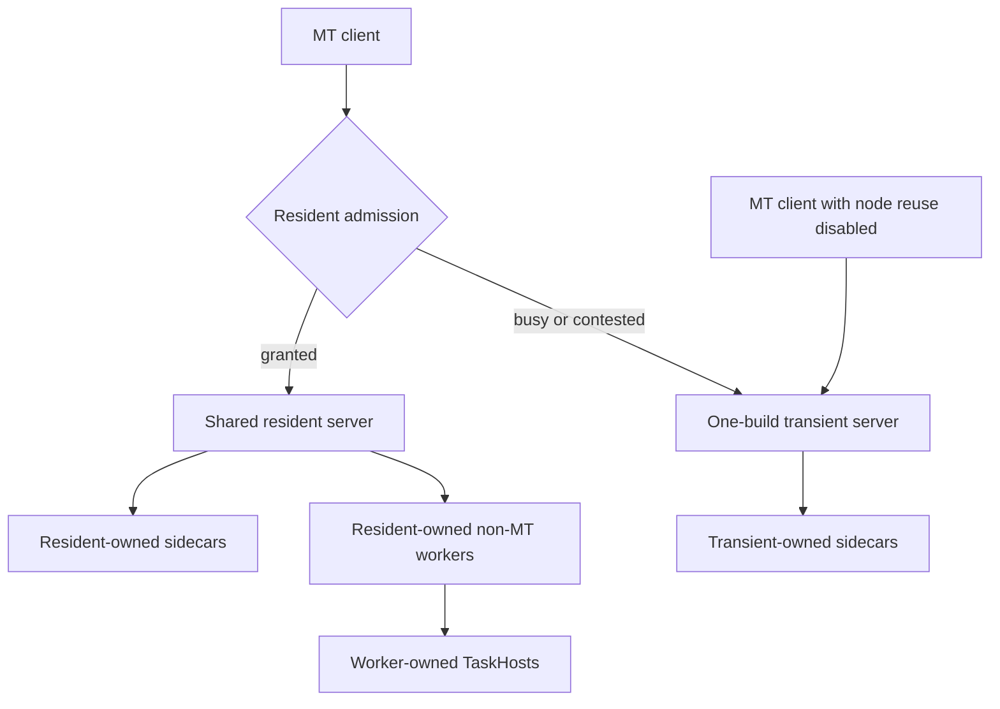

# Multithreaded MSBuild Server and TaskHost Ownership

**Status:** Proposed

Companion proposal:
[Non-Multithreaded Worker-Node Ownership](../non-mt-server-worker-node-ownership.md).

## Decision

The MSBuild Server defines the lifetime of every node it creates.

This applies whether the server performs project work in its own process or
delegates that work to worker processes, and therefore applies to both MT and
non-MT builds.

For MT builds:

- the shared resident server owns its directly-created sidecar TaskHosts;
- a transient server owns its directly-created sidecar TaskHosts;
- a worker owns any TaskHosts it creates; and
- an owned TaskHost cannot be adopted by another server or worker.

Owned nodes may be reused while their owner remains alive, but they cannot
outlive their owner.

## V1 server topology

V1 has one resident server for each compatible server identity.

- Sequential reusable builds reuse that resident.
- A reusable MT request that cannot acquire the resident launches a one-build
  transient server instead of running in the thin client process.
- `-mt -nodeReuse:false` bypasses the resident and launches a one-build
  transient server.
- A transient server exits after its build.
- Multiple resident servers are out of scope for V1.

MT and non-MT requests share the same resident identity. Request mode controls
the response to rejected admission:

- an MT client launches a transient server;
- a non-MT client follows the in-process fallback described by the companion
  proposal.

```mermaid
flowchart TB
    MT["MT client"] --> A{"Resident admission"}
    A -->|granted| R["Shared resident server"]
    A -->|busy or contested| T["One-build transient server"]
    NR["MT client with node reuse disabled"] --> T

    R --> RS["Resident-owned sidecars"]
    T --> TS["Transient-owned sidecars"]
    R --> RW["Resident-owned non-MT workers"]
    RW --> RWT["Worker-owned TaskHosts"]
```

## Ownership protocol

An owned node has:

1. an ownership-specific handshake that prevents cross-owner adoption;
2. a live connection retained for the owner's lifetime; and
3. an owner-specific shutdown path.

At reusable build completion:

1. the owner sends reusable completion;
2. the child disposes build-lifetime state and resets for the next build;
3. the child acknowledges reset completion; and
4. the ownership connection remains open.

At terminal shutdown:

1. the owner sends non-reusable completion;
2. workers cascade shutdown to their owned TaskHosts;
3. the owner waits for child exit, using the existing forced-termination
   fallback when necessary; and
4. the owner exits only after its ownership tree is gone.

Unexpected ownership-connection loss terminates the child instead of returning
it to a global reuse pool. Platform-specific lifetime containment may provide an
additional hard guarantee.

No process-name or machine-wide process enumeration is required to shut down
owned nodes.

## TaskHost lifetime

Engine-created sidecar and compatibility TaskHosts follow the ownership
protocol.

An explicitly requested transient TaskHost remains transient. A task that
requires process isolation for the duration of its project build must continue
to request that behavior explicitly; the TaskHost is shut down at that boundary.

## Task execution guarantees

This proposal changes process lifetime, not task isolation guarantees.

- A non-multithreaded, non-yielding task runs exclusively in its process while
  it is executing a project.
- Node reuse may later execute an unrelated project in the same process.
- Tasks must not treat process-static state as project-specific state.
- Any static state must be independent of project/build identity or validate
  that it is safe for the current invocation.
- MT-capable tasks may execute concurrently according to their declared
  contract.
- Full per-project process isolation still requires an explicitly transient
  TaskHost.

## Idle and clean shutdown

The resident retains the existing server idle-lifetime policy. When the resident
expires or receives `dotnet build-server shutdown`, it directly shuts down:

1. resident-owned sidecars;
2. resident-owned workers; and
3. TaskHosts owned by those workers.

After the resident and any one-build transient servers have been idle past
their lifetime, no owned MSBuild child process remains.

## Compatibility

Strict ownership does not reduce sharing between simultaneously active,
independent builds: an active node cannot be adopted by another build today.

The intentional behavior changes are:

- reusable TaskHosts no longer migrate between owners;
- busy MT requests use transient servers instead of thin-client execution;
- `-mt -nodeReuse:false` no longer consumes and shuts down the resident; and
- server shutdown deterministically reaps its TaskHosts.

Build results and task isolation guarantees remain unchanged.

## Non-goals

- Multiple resident servers.
- Concurrent build sessions inside one resident process.
- Dynamic downsizing of an idle ownership tree.
- Server GC policy.
- Refactoring all static engine state into per-build state.
- Per-build assembly-load isolation.

## Required tests

1. Sequential MT and non-MT requests reuse the same resident PID.
2. Busy MT admission launches a transient server and leaves the resident alive.
3. `-mt -nodeReuse:false` launches a transient and leaves the resident untouched.
4. Resident sidecars are reused only by their resident owner.
5. Transient sidecars exit with their transient server.
6. Worker-owned TaskHosts cannot be adopted by another worker.
7. Explicitly transient TaskHosts still exit at their requested boundary.
8. Resident idle timeout and `build-server shutdown` reap both direct sidecars
   and worker ownership trees.
9. Abrupt owner termination reaps owned TaskHosts.
10. Independent concurrent builds retain their existing task-execution
    guarantees.
