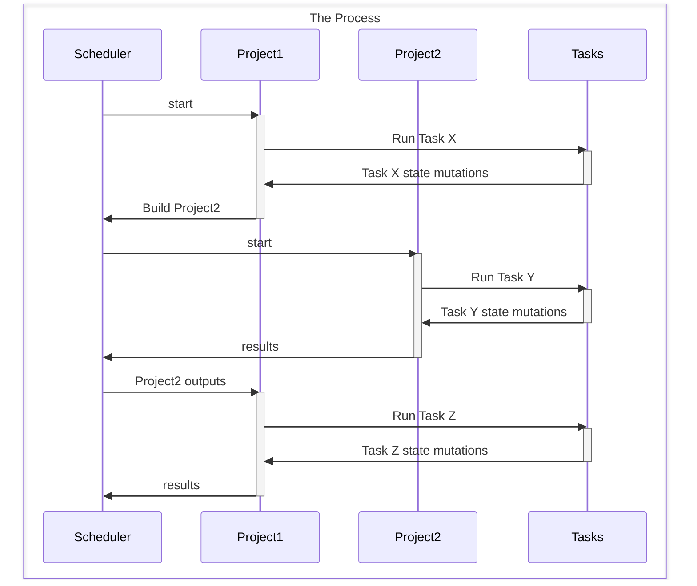
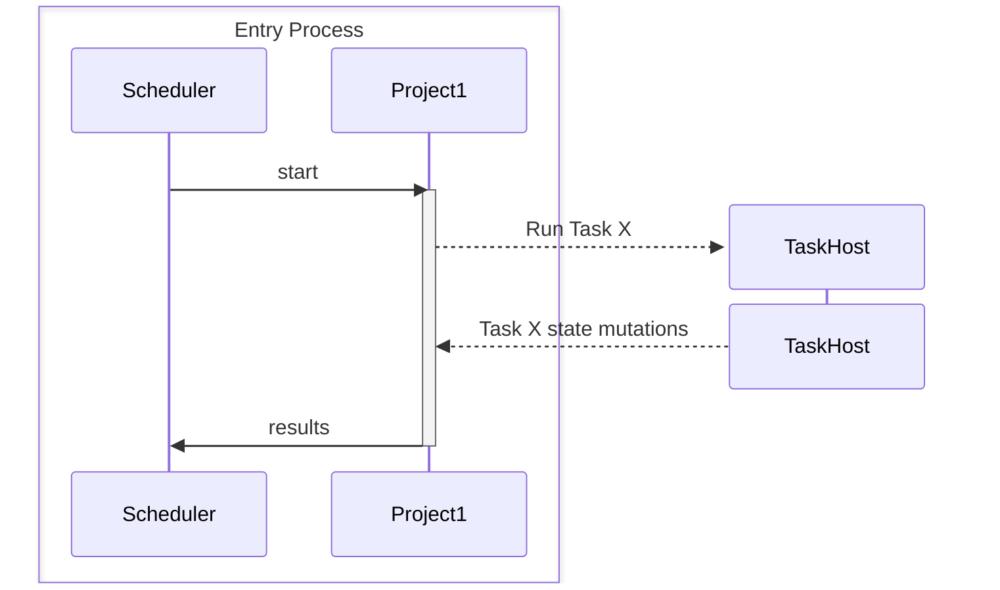
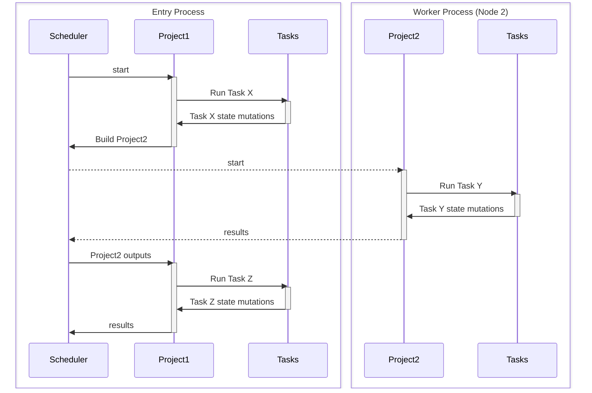
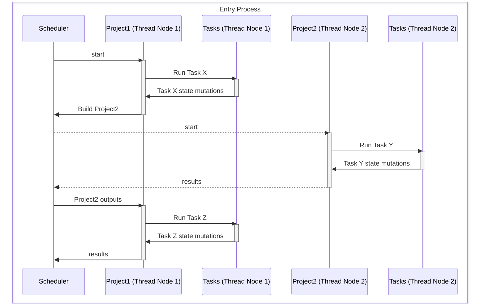
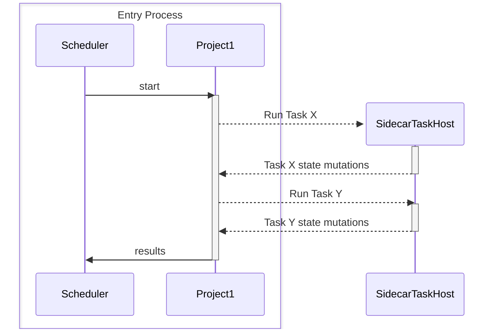
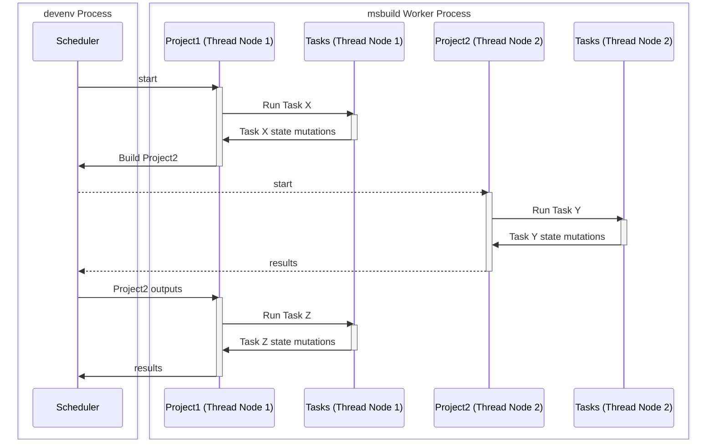

# Multithreaded MSBuild

This is a description of changes that will enable MSBuild to run multiple projects concurrently within the same process, rather than spawning separate processes for each node. This will allow better resource utilization and potentially faster builds, as fewer processes will need to be created, reducing .NET runtime overhead and inter-process communication--but it's nontrivial to implement without breaking existing builds, which we must not do.

## Current state

Currently, MSBuild supports parallel builds (a critical feature for a build system) by spawning worker processes. This made adoption easier because it didn't impose any requirements on tasks: they continue to own the whole process while they are executing, just like they did when the build was single-threaded and running one task at a time. But it's a pretty strange design decision in the modern age, where we assume things are multithreaded and async.

There are several components of MSBuild that are relevant to parallel builds. In the following sections we'll describe how they interact in the current implementation, and how we will change them to support multithreading.

* The **scheduler** decides what projects to build (and where, if there are options). It deduplicates requests for the same project, ensuring that
* **Projects** maintain mutable state, especially Properties and Items. Distinct projects can be built concurrently, and the scheduler ensures that requests for the same project are deduplicated, so that only one instance of a project is built. In MSBuild terminology, and the rest of this document, a Project is the combination of the project file contents + a particular bundle of global properties - this means that the same 'physical' Project may actually be part of many different Projects from the perspective of the scheduler.
* Projects are assigned to **nodes** (worker processes) that execute the build. Once a project is assigned to a node, it is not moved to another node.
* **Targets** are the unit of execution within a project. A target is an ordered list of tasks. Within a project, targets run sequentially, but different targets in different projects can run concurrently.
* **Tasks** are executed in targets in projects.

### Single-proc builds

In the oldest MSBuild mode of operation, there is a single process that executes the build. When a project is started, the engine `cd`s into the project directory and begins executing. If the process environment or current working directory is mutated during the project, it is saved when the project yields (either because it's waiting on results from another project or because it has finished executing). When the project is resumed, the environment is restored to the saved state. Tasks are instantiated and executed in the same process, so they can access the environment and current working directory.

> [!NOTE]
> In the following diagrams, assume that Project1 and Project2 are eligible to run concurrently, and that Project1 has a project reference to Project2, but each diagram may highlight only a portion of the full process.

### Out-of-proc task execution

Even in single-proc mode, MSBuild supports out-of-proc task execution. This is done by spawning a new TaskHost process to execute the task, which allows the task to run in isolation from the main build process. MSBuild handles passing the necessary information to the TaskHost process, such as the current environment, working directory, and explicit inputs. The TaskHost process can then execute and return results back to the main build process.

### Multi-proc builds

In multi-proc builds, the scheduler assigns projects to multiple worker processes (nodes). There is one in-process node running in the entry process, and multiple out-of-process nodes running in separate worker processes, with one node per worker process. Each node is responsible for executing the projects assigned to it. The scheduler manages the creation of the nodes, distribution of projects, and ensures that dependencies are respected. When a project is assigned to a node, it is not moved to another node, which means that the state of the project is maintained within that node.

(This diagram is simplified: the scheduler will not create a new node for every project, so in a two-project build, the scheduler will assign both projects to the same node.)

A task that needs to run out of process can spawn a new TaskHost process, as in a single-proc build, with potentially many TaskHost processes running concurrently.

## Adding Multithreading to MSBuild

The goal of multithreading MSBuild is to allow execution of multiple projects concurrently and in parallel within the same process, rather than spawning separate processes for each node. This would enable better resource utilization and potentially faster builds, as fewer processes would need to be created, reducing .NET runtime overhead and inter-process communication as well as increasing the efficacy of task-level caching.

But tasks are not currently designed to operate in a multithreaded environment. They assume that they own the whole process while they are executing, and they mutate the process state (environment, working directory, etc.). To make MSBuild multithreaded while maintaining task compatibility, we need to consider what parts of the build process (both MSBuild engine state like "what projects are currently executing" and "what is the state of properties and items" and task execution) can be moved to a multithreaded model without breaking existing tasks, as well as allowing new tasks to opt into multithreading.

The scheduler is already capable of juggling multiple projects, and there's already an abstraction layer for "where a project runs" (`INodeProvider`). To support multithreading, we will introduce a new type of node, called a "**thread node**", which represents a thread within either an in-process or out-of-process node. This will allow us to run multiple projects in parallel within the same process.

The scheduler should  be responsible for creating the appropriate combination of nodes (in-proc, out-of-proc, and thread nodes) based on the execution mode (multi-proc or multithreaded, CLI or Visual Studio scenarios). It will then coordinate projects execution through the node abstraction. Below is the diagram for cli multi-threaded mode creating all the thread nodes in the entry process for simplicity--in final production these will be in an [MSBuild Server process](#msbuild-server-integration).

Within a thread node, we can track the state of the projects assigned to the node. Since projects are independent from each other that should generally already be thread-safe.

This leaves us with tasks. Tasks will need to be modified to support multithreading (see [Thread-safe tasks](#thread-safe-tasks)), but we need a way to maintain compatibility with existing tasks that do not implement the new interface, so they can still run in a process they "own" while allowing new tasks to take advantage of multithreading. This will be important while migrating first-party tasks to the new interface (especially while honing the interface definition) and for third-party custom and inline tasks that may not be actively maintained.

For most tasks, an engine-level decision to push the tasks to a TaskHost process will maintain compatibility: the process will only run one task at a time, so the task will still "own" the process. When a task is pushed out of process this way, we will need to be careful to capture and preserve any global-process-state mutations that the task makes, so that they can be communicated back to the main MSBuild process and available to subsequent tasks in the same project.

Some tasks or sets of tasks will break if they are run in short-lived processes, because they expect to be able to mutate process state including things like static fields in shared classes.

## Sidecar TaskHosts

One feature addition that will support multithreading MSBuild is the ability to run tasks in sidecar TaskHost processes. With this feature tasks may be executed in separate sidecar TaskHost processes, which are long-lived and dedicated to a specific project-execution node, as opposed to the current implementation of short-lived TaskHost processes that are spawned for each task execution.

Sidecar TaskHosts will reduce the overhead of pushing task execution out of process, as the process will already be running, ready to execute tasks, and have an established IPC connection to the main MSBuild process.

With a sidecar TaskHost per node, tasks will get the same constraints and freedoms they have today: while running, they will get a consistent view of process state including environment and current working directory, they are free to mutate that state, and they will not be disturbed by concurrent task execution in the same process unless they `Yield()`. The fact that much of the MSBuild-level state is maintained and manipulated in a different process than the tasks themselves are running in should not be observable by a task, since they are generally unable to observe that MSBuild-level state except through task inputs and `IBuildEngine` APIs that we will continue to support.

## Thread-safe tasks

To mark that a task is multithreaded-MSBuild-aware, we use the `MSBuildMultiThreadableTaskAttribute` attribute. Tasks may also implement the `IMultiThreadableTask` interface to gain access to the `TaskEnvironment` object with information about the task invocation, including the current environment and working directory.

### Task Routing Strategy

In multithreaded mode, MSBuild determines where each task should execute based on:

* **Thread-safe tasks** (marked with `MSBuildMultiThreadableTaskAttribute`) run **in-process** within thread nodes
* **All other tasks** (without the attribute) run in **sidecar TaskHost processes** to maintain isolation and compatibility

#### Attribute Semantics

The `MSBuildMultiThreadableTaskAttribute` is **non-inheritable** (`Inherited = false`): each task class must explicitly declare its thread-safety capability. This ensures that:

* Task authors must consciously opt into multithreaded execution for each task class
* Derived classes cannot accidentally inherit thread-safety assumptions from base classes
* The routing decision is always explicit and visible in the task's source code

Tasks may optionally implement `IMultiThreadableTask` to access `TaskEnvironment` APIs, but only the attribute determines routing behavior.

## Tasks transition

In the initial phase of development of multithreaded execution mode, all tasks will run in sidecar taskhosts. Over time, we will update tasks that are maintained by us and our partners (such as MSBuild, SDK, and NuGet) to add the `MSBuildMultiThreadableTaskAttribute` and ensure thread-safety. As these tasks are marked with the attribute, their execution would be moved into the entry process. Customers' tasks would be executed in the sidecar taskhosts unless they add the attribute to their task classes.

To ease task authoring, we will provide a Roslyn analyzer that will check for known-bad API usage, like `System.Environment.GetEnvironmentVariable` or `System.IO.Directory.SetCurrentDirectory`, and suggest alternatives that use the `TaskEnvironment` object (for tasks that also implement `IMultiThreadableTask`).

## Interaction with `DisableInProcNode`

We need to ensure the support for multithreaded mode in Visual Studio builds. Currently, the entry node for MSBuild runs entirely within the devenv process, but the majority of the build operation are run in the MSBuild worker processes, because project systems set `BuildParameters.DisableInProcNode=true`. In multithreaded mode, all of the task execution must continue to be out of process. To address this, unlike the CLI scenario, we will move all thread nodes to the out-of-process MSBuild process, keeping only the scheduler in devenv.

## MSBuild Server integration

To avoid regressing CLI incremental build performance, it is essential to fully support the MSBuild server feature in multithreaded mode. Out-of-process nodes offer significant benefits by preserving caches across build command executions when node reuse is enabled. However, caches in the entry process are lost at the end of each build unless the MSBuild server feature is used. In multiprocess execution, that is a fraction of the caches and processes, but with multithreading, it is the entire process. As a result, opting into multithreading on the command line should automatically enable MSBuild server.
