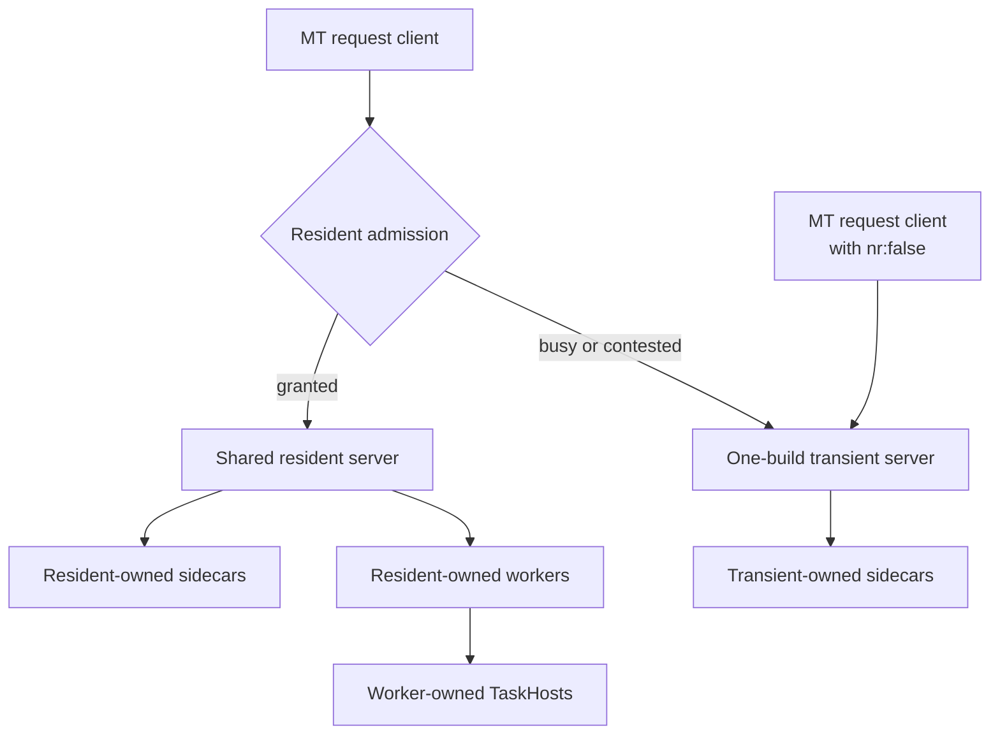

# MT Request Routing and TaskHost Ownership

**Status:** Proposed

## Terminology

- **Resident server:** the single stable MSBuild Server process for a compatible
  identity. It can serve both MT and non-MT requests; MT/non-MT are not server
  types.
- **MT request:** a build request with multithreaded mode enabled.
- **Non-MT request:** a build request without multithreaded mode enabled. It
  targets the same resident server as an MT request.
- **Transient server:** a private server process that serves one MT request and
  exits.
- **Worker:** an out-of-process node that evaluates and executes project work on
  behalf of the resident server or an in-process fallback.
- **Thin client:** the short-lived command-line process that submits work to the
  resident server.
- **In-process fallback:** execution in the thin client after a request cannot
  use the resident server.
- **Owned node:** a child whose lifetime is bounded by the process that created
  it and which cannot be adopted by another owner.
- **Sidecar TaskHost:** an engine-created TaskHost associated with an MT
  in-process/thread node for running a task that cannot execute safely in that
  node.
- **Compatibility TaskHost:** an engine-created TaskHost required by runtime,
  architecture, or task-loading constraints.

## Decision

Every node is owned by the process that created it, and cannot outlive it.

Ownership is not specific to the server. A sidecar TaskHost is always owned,
including when the server is explicitly disabled: in that case it is owned by
the ordinary MSBuild process that created it and dies with it. There is no
unowned, pool-resident sidecar and no machine-wide reuse pool for sidecars.

The resident server therefore defines the lifetime of every node it creates,
whether it performs project work in its own process or delegates that work to
workers.

When serving an MT request:

- the resident server owns its directly-created sidecar TaskHosts;
- a transient server owns its directly-created sidecar TaskHosts;
- an owned TaskHost cannot be adopted by another owner.

When the resident serves a non-MT request, it similarly owns the
out-of-process workers it uses. Those workers own any TaskHosts they create.

Owned nodes may be reused while their owner remains alive, but they cannot
outlive their owner. Sidecar reuse is therefore reuse within one owner's
lifetime, not reuse across independent MSBuild invocations.

Because a sidecar is always owned, no additional ownership marker is required
on the wire: the existing signal that distinguishes a sidecar from a short-lived
TaskHost is also the ownership signal.

## V1 server topology

V1 has one resident server for each compatible server identity.

- Sequential reusable builds reuse that resident.
- A reusable MT request that cannot acquire the resident launches a one-build
  transient server instead of running in the thin client process.
- `-mt -nodeReuse:false` bypasses the resident and launches a one-build
  transient server.
- A transient server exits after its build.
- Multiple resident servers are out of scope for V1.

MT and non-MT requests target the same resident identity. Request mode controls
the response to rejected admission:

- a rejected MT request launches a transient server;
- a rejected non-MT request executes through the existing in-process fallback.

## Ownership protocol

An owned node has:

1. a handshake that prevents adoption by a process that is not its owner;
2. a live connection retained for the owner's lifetime; and
3. an owner-specific shutdown path.

The handshake requirement is satisfied by the existing distinction between a
sidecar and a short-lived TaskHost. It does require that handshake comparison
not tolerate divergence in that distinction: leniency intended for architecture
differences must be scoped to architecture, or a non-owning process can be
admitted to an owned node.

Per-owner identity is not required in the handshake, because an owner connects
only to children it launched itself and retains those connections. No
discovery by process enumeration is involved.

At reusable build completion:

1. the owner sends reusable completion;
2. the child disposes build-lifetime state and resets for the next build;
3. the child acknowledges reset completion; and
4. the ownership connection remains open.

At terminal shutdown:

1. the owner sends non-reusable completion;
2. workers cascade shutdown to their owned TaskHosts;
3. the owner waits for child exit, using the existing forced-termination
   fallback when necessary; and
4. the owner exits only after its ownership tree is gone.

Unexpected ownership-connection loss terminates the child instead of returning
it to a global reuse pool. Platform-specific lifetime containment may provide an
additional hard guarantee.

No process-name or machine-wide process enumeration is required to shut down
owned nodes.

## TaskHost lifetime

Engine-created sidecar and compatibility TaskHosts follow the ownership
protocol.

An explicitly requested transient TaskHost remains transient. A task that
requires process isolation for the duration of its project build must continue
to request that behavior explicitly; the TaskHost is shut down at that boundary.

## Task execution guarantees

This proposal changes process lifetime, not task isolation guarantees.

- A non-multithreaded, non-yielding task runs exclusively in its process while
  it is executing a project.
- Node reuse may later execute an unrelated project in the same process.
- Tasks must not treat process-static state as project-specific state.
- Any static state must be independent of project/build identity or validate
  that it is safe for the current invocation.
- MT-capable tasks may execute concurrently according to their declared
  contract.
- Full per-project process isolation still requires an explicitly transient
  TaskHost.

## Idle and clean shutdown

The resident retains the existing server idle-lifetime policy. When the resident
expires or receives `dotnet build-server shutdown`, it directly shuts down:

1. resident-owned sidecars;
2. resident-owned workers; and
3. TaskHosts owned by those workers.

After the resident and any one-build transient servers have been idle past
their lifetime, no owned MSBuild child process remains.

When the server is disabled, the same cascade runs in the ordinary MSBuild
process at the end of its build, so no sidecar survives that process either.

## Compatibility

Strict ownership does not reduce sharing between simultaneously active,
independent builds: an active node cannot be adopted by another build today.

The intentional behavior changes are:

- reusable TaskHosts no longer migrate between owners;
- a sidecar no longer outlives the process that created it, so consecutive
  MSBuild invocations without a server each start their own sidecars;
- busy MT requests use transient servers instead of thin-client execution;
- `-mt -nodeReuse:false` no longer consumes and shuts down the resident; and
- server shutdown deterministically reaps its TaskHosts.

Build results and task isolation guarantees remain unchanged.

## Non-goals

- Multiple resident servers.
- Concurrent build sessions inside one resident process.
- Dynamic downsizing of an idle ownership tree.
- Server GC policy.
- Refactoring all static engine state into per-build state.
- Per-build assembly-load isolation.

## Required tests

1. Sequential MT and non-MT requests reuse the same resident PID.
2. Busy MT admission launches a transient server and leaves the resident alive.
3. `-mt -nodeReuse:false` launches a transient and leaves the resident untouched.
4. Resident sidecars are reused only by their resident owner.
5. Transient sidecars exit with their transient server.
6. Worker-owned TaskHosts cannot be adopted by another worker.
7. Explicitly transient TaskHosts still exit at their requested boundary.
8. Resident idle timeout and `build-server shutdown` reap both direct sidecars
   and worker ownership trees.
9. Abrupt owner termination reaps owned TaskHosts.
10. Independent concurrent builds retain their existing task-execution
    guarantees.
11. With the server disabled, a build that used sidecars leaves no TaskHost
    process behind.
12. A process that is not the owner cannot be admitted to an owned sidecar,
    including when it differs from the owner only in bits that architecture
    leniency would otherwise tolerate.
