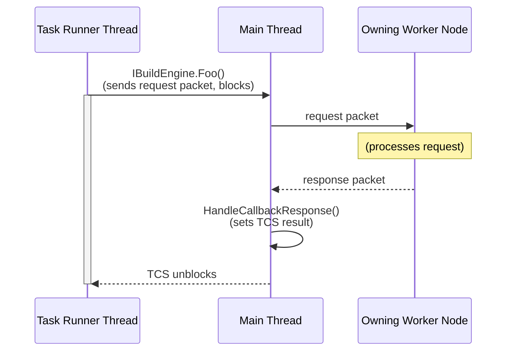
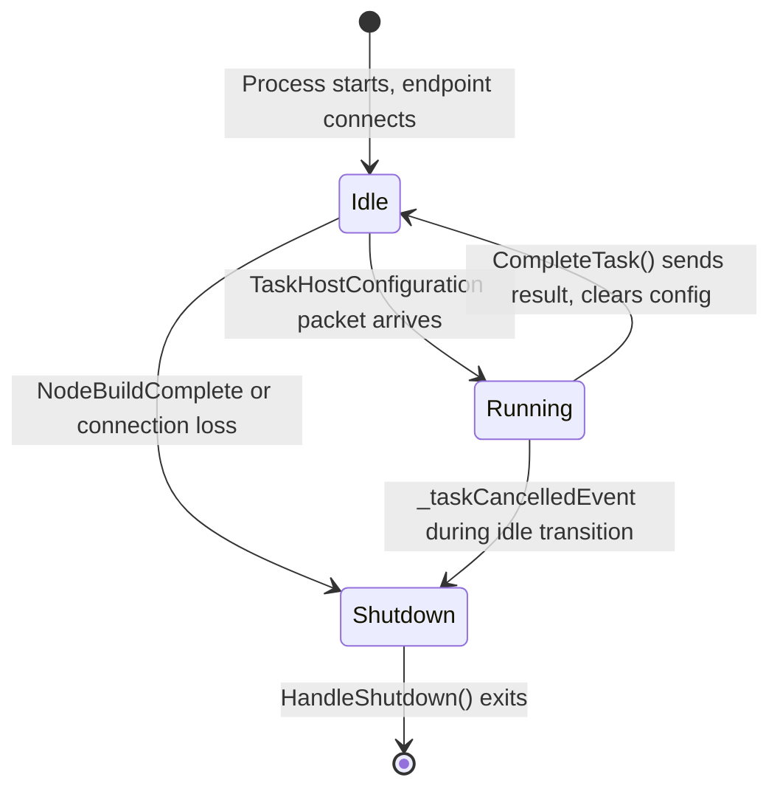

# Threading in TaskHost Processes

MSBuild can run tasks in a separate process called a **TaskHost** (`OutOfProcTaskHostNode`). This happens when a task requires a different runtime, architecture, or when multithreaded mode (`-mt`) ejects a non-thread-safe task out of the worker node. The TaskHost process communicates with the owning worker node over a named pipe.

## Thread Model

The TaskHost has two threads:

### Main Thread (Communication Thread)

The main thread runs `OutOfProcTaskHostNode.Run()`, a `WaitHandle.WaitAny` loop that services four events:

| Index | Event | Handler |
|-------|-------|---------|
| 0 | `_shutdownEvent` | `HandleShutdown()` — joins the task thread, cleans up, exits |
| 1 | `_packetReceivedEvent` | `HandlePacket()` — dispatches incoming IPC packets |
| 2 | `_taskCompleteEvent` | `CompleteTask()` — sends `TaskHostTaskComplete` to owning worker node |
| 3 | `_taskCancelledEvent` | `CancelTask()` — calls `ICancelableTask.Cancel()` on the task |

This thread is responsible for all IPC: receiving packets from the owning worker node (task configuration, cancellation, callback responses) and sending packets back (log messages, task completion, callback requests).

### Task Runner Thread

When the main thread receives a `TaskHostConfiguration` packet, it spawns the task runner thread (`RunTask`). This thread:

1. Sets up the environment (working directory, env vars, culture)
2. Loads the task assembly and instantiates the task
3. Sets task parameters via reflection
4. Calls `task.Execute()`
5. Collects output parameters
6. Packages the result into `TaskHostTaskComplete` and signals `_taskCompleteEvent`

The task runner thread is where user task code runs. Any `IBuildEngine` calls from the task (logging, property queries, building other projects) are serviced on this thread.

## IBuildEngine Callback Flow (added in Stage 1)

Before callback support, the two threads had a simple lifecycle: the main thread spawned the task thread, waited for completion, and sent the result. Communication was one-directional (worker node → TaskHost for configuration/cancellation, TaskHost → worker node for logs/completion).

With callback support, the task can query the owning worker node for information it doesn't have locally (e.g., `IsRunningMultipleNodes`, and in future stages: `RequestCores`, `BuildProjectFile`). This introduces **bidirectional IPC** between the threads:



### How It Works

1. **Task thread** calls an `IBuildEngine` method (e.g., `IsRunningMultipleNodes`).
2. This calls `SendCallbackRequestAndWaitForResponse<T>()`, which:
   - Assigns a unique request ID
   - Registers a `TaskCompletionSource` in `_pendingCallbackRequests`
   - Sends the request packet via `_nodeEndpoint.SendData()`
   - Blocks on `tcs.Task.GetAwaiter().GetResult()` until the TCS is completed
3. **Main thread** receives the response packet from the owning worker node, looks up the TCS by request ID, and calls `TrySetResult()`.
4. **Task thread** wakes up, retrieves the typed response, and returns it to the caller.

### Cancellation Semantics

The callback wait intentionally does **not** check `_taskCancelledEvent`. This aligns with how in-process `TaskHost` (regular worker node mode) handles callbacks:

- In regular mode, `IBuildEngine` callbacks are direct method calls that always complete. Cancellation never interrupts a callback mid-flight. Instead, cancellation causes the *work behind* the callback to fail fast (e.g., the scheduler cancels a child build started by `BuildProjectFile`), and the callback returns normally with a failure result.
- In TaskHost mode, the owning worker node continues processing callback requests even after sending `TaskHostTaskCancelled`. The response is **guaranteed** to arrive because the worker node's packet loop only exits upon receiving `TaskHostTaskComplete`, which cannot be sent until the task finishes, which cannot happen until the callback returns.

Cancellation is handled cooperatively: after the callback returns, the task checks its cancellation state (set by `ICancelableTask.Cancel()`) and exits.

The only exception path is connection loss (owning worker node killed), detected by `OnLinkStatusChanged` which fails all pending `TaskCompletionSource` entries with `InvalidOperationException`. This unblocks task threads immediately.

### Response Guarantee (Why the Callback Cannot Deadlock)

There is a causal dependency chain that prevents deadlock:

```
Worker node sends callback response
  → TaskHost callback returns
    → task finishes Execute()
      → TaskHost sends TaskHostTaskComplete
        → worker node exits packet loop
```

The worker node cannot exit its packet loop without first receiving `TaskHostTaskComplete`. But `TaskHostTaskComplete` cannot be sent until the task finishes. And the task cannot finish while it is blocked waiting for a callback response. Therefore, the worker node **must** process the callback request and send the response before it can ever stop.

## TaskHost Lifecycle

The TaskHost process can execute multiple tasks sequentially. After finishing one task, it returns to an idle state and waits for either a new task or a shutdown signal.

### Event Loop Cycle



1. **Idle**: `WaitAny()` blocks on the four wait handles. No task thread exists. `_currentConfiguration` is null.
2. **TaskHostConfiguration arrives**: `HandleTaskHostConfiguration()` stores the config and spawns `_taskRunnerThread` to call `RunTask()`. The main thread immediately returns to `WaitAny()`.
3. **Task executes**: `RunTask()` sets up the environment, loads the task assembly, calls `task.Execute()`, collects output parameters, and packages the result into `_taskCompletePacket`. On completion (success or failure), it signals `_taskCompleteEvent`.
4. **CompleteTask()**: The main thread wakes on index 2, sends `_taskCompletePacket` to the owning worker node, and sets `_currentConfiguration = null`. The node is now idle again.
5. **Back to step 1**: The main thread loops back to `WaitAny()`, ready for another `TaskHostConfiguration` or a `NodeBuildComplete`.

### State Between Tasks

Each new `TaskHostConfiguration` carries a full environment snapshot, task parameters, and warning settings. The task runner thread resets per-task state at the start of `RunTask()`:

**Reset per task:** `_isTaskExecuting`, `_currentConfiguration`, `_debugCommunications`, `_updateEnvironment`, `WarningsAsErrors`/`WarningsNotAsErrors`/`WarningsAsMessages`, `_fileAccessData`

**Persists across tasks (within a single build):**
- `s_mismatchedEnvironmentValues` (static) — environment variable fixups for bitness differences, computed once per process
- `_registeredTaskObjectCache` — task object cache with `Build` lifetime scope, disposed at end of each build (in `HandleShutdown()`), recreated fresh on the next `Run()` call
- `_pendingCallbackRequests` / `_nextCallbackRequestId` — callback tracking (should be empty between tasks)

### Shutdown vs. Reuse

When the owning worker node sends `NodeBuildComplete`, `HandleNodeBuildComplete()` decides whether to exit or stay alive:

- **Sidecar TaskHost** (`_nodeReuse = true`): Always sets `BuildCompleteReuse`. The sidecar process persists across builds, re-entering the `Run()` outer loop to accept new connections.
- **Regular TaskHost** (`_nodeReuse = false`): Sets `BuildCompleteReuse` only if `buildComplete.PrepareForReuse` is true **and** `Traits.Instance.EscapeHatches.ReuseTaskHostNodes` is enabled. Otherwise sets `BuildComplete` and the process exits. This avoids holding assembly locks on custom task DLLs between builds.

There is **no idle timeout**. The `WaitAny()` call has no timeout parameter — the TaskHost waits indefinitely until it receives a shutdown signal or the connection drops.
