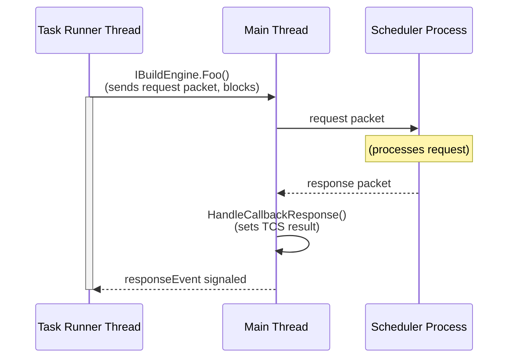

# Threading in TaskHost Processes

MSBuild can run tasks in a separate process called a **TaskHost** (`OutOfProcTaskHostNode`). This happens when a task requires a different runtime, architecture, or when multithreaded mode (`-mt`) ejects a non-thread-safe task out of the worker node. The TaskHost process communicates with the parent worker node over a named pipe.

## Thread Model

The TaskHost has two threads:

### Main Thread (Communication Thread)

The main thread runs `OutOfProcTaskHostNode.Run()`, a `WaitHandle.WaitAny` loop that services four events:

| Index | Event | Handler |
|-------|-------|---------|
| 0 | `_shutdownEvent` | `HandleShutdown()` — joins the task thread, cleans up, exits |
| 1 | `_packetReceivedEvent` | `HandlePacket()` — dispatches incoming IPC packets |
| 2 | `_taskCompleteEvent` | `CompleteTask()` — sends `TaskHostTaskComplete` to parent |
| 3 | `_taskCancelledEvent` | `CancelTask()` — calls `ICancelableTask.Cancel()` on the task |

This thread is responsible for all IPC: receiving packets from the parent (task configuration, cancellation, callback responses) and sending packets back (log messages, task completion, callback requests).

### Task Runner Thread

When the main thread receives a `TaskHostConfiguration` packet, it spawns the task runner thread (`RunTask`). This thread:

1. Sets up the environment (working directory, env vars, culture)
2. Loads the task assembly and instantiates the task
3. Sets task parameters via reflection
4. Calls `task.Execute()`
5. Collects output parameters
6. Packages the result into `TaskHostTaskComplete` and signals `_taskCompleteEvent`

The task runner thread is where user task code runs. Any `IBuildEngine` calls from the task (logging, property queries, building other projects) are serviced on this thread.

## IBuildEngine Callback Flow (added in Stage 1)

Before callback support, the two threads had a simple lifecycle: the main thread spawned the task thread, waited for completion, and sent the result. Communication was one-directional (parent → TaskHost for configuration/cancellation, TaskHost → parent for logs/completion).

With callback support, the task can query the parent for information it doesn't have locally (e.g., `IsRunningMultipleNodes`, and in future stages: `RequestCores`, `BuildProjectFile`). This introduces **bidirectional IPC** between the threads:



### How It Works

1. **Task thread** calls an `IBuildEngine` method (e.g., `IsRunningMultipleNodes`).
2. This calls `SendCallbackRequestAndWaitForResponse<T>()`, which:
   - Assigns a unique request ID
   - Registers a `TaskCompletionSource` in `_pendingCallbackRequests`
   - Sends the request packet via `_nodeEndpoint.SendData()`
   - Blocks on a `ManualResetEvent` bridged to the TCS, polling every 1000ms for connection loss
3. **Main thread** receives the response packet from the parent, looks up the TCS by request ID, and calls `TrySetResult()`, which signals the event.
4. **Task thread** wakes up, retrieves the typed response, and returns it to the caller.

### Cancellation Semantics

The callback wait intentionally does **not** check `_taskCancelledEvent`. This aligns with how in-process `TaskHost` (regular worker node mode) handles callbacks:

- In regular mode, `IBuildEngine` callbacks are direct method calls that always complete. Cancellation never interrupts a callback mid-flight. Instead, cancellation causes the *work behind* the callback to fail fast (e.g., the scheduler cancels a child build started by `BuildProjectFile`), and the callback returns normally with a failure result.
- In TaskHost mode, the parent continues processing callback requests even after sending `TaskHostTaskCancelled`. The response is **guaranteed** to arrive because the parent's packet loop only exits upon receiving `TaskHostTaskComplete`, which cannot be sent until the task finishes, which cannot happen until the callback returns.

Cancellation is handled cooperatively: after the callback returns, the task checks its cancellation state (set by `ICancelableTask.Cancel()`) and exits.

The only exception path is connection loss (parent process killed), detected by polling `_nodeEndpoint.LinkStatus` every 1000ms. This throws `InvalidOperationException`.

### Response Guarantee (Why the Callback Cannot Deadlock)

There is a causal dependency chain that prevents deadlock:

```
Parent sends callback response
  → TaskHost callback returns
    → task finishes Execute()
      → TaskHost sends TaskHostTaskComplete
        → parent exits packet loop
```

The parent cannot exit its packet loop without first receiving `TaskHostTaskComplete`. But `TaskHostTaskComplete` cannot be sent until the task finishes. And the task cannot finish while it is blocked waiting for a callback response. Therefore, the parent **must** process the callback request and send the response before it can ever stop.
