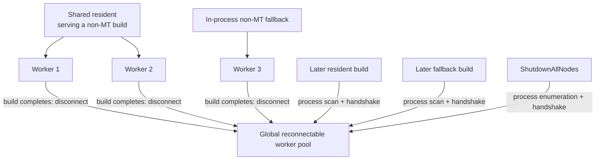
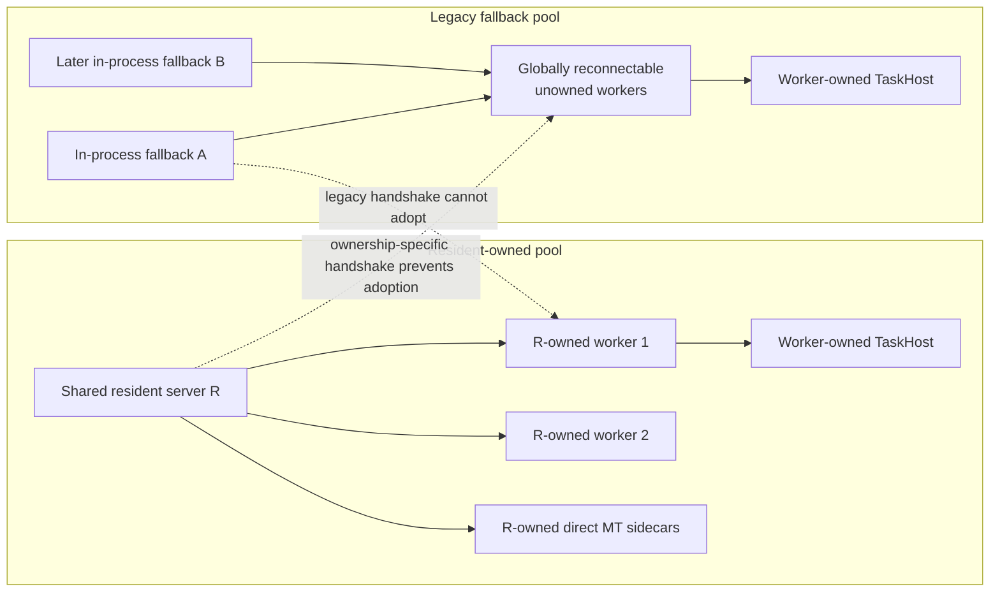
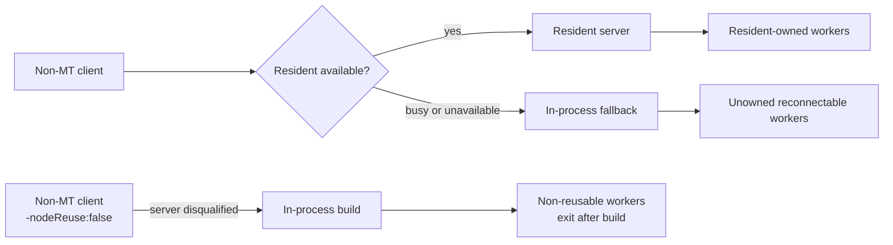
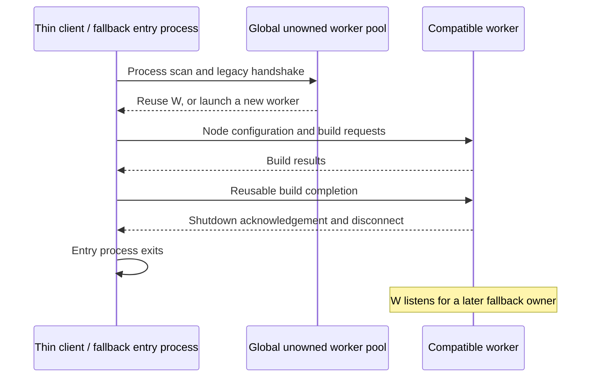

# Non-Multithreaded MSBuild Server Worker-Node Ownership

**Status:** Proposed

## Summary

When a non-multithreaded build runs in the resident MSBuild Server, every
out-of-process worker node used by that build should be owned by that resident
server. Resident-owned workers may remain warm across builds served by the same
resident, but they cannot be adopted by another MSBuild process and cannot
outlive their resident owner.

This is the same stable resident process used by MT builds. The resident may
therefore own both non-MT workers and direct MT sidecar TaskHosts accumulated
across different builds. This proposal adds worker ownership to that shared
resident; it does not create a separate non-MT server identity.

The existing non-`-mt` fallback remains intentionally different. If the server
is busy or unavailable, the thin client continues to execute the build
in-process. Worker nodes used by that fallback retain the current globally
reconnectable, non-owned lifetime so later fallback builds can reuse them.

This proposal therefore creates two deliberately separate worker-node pools:

1. **Resident-owned workers**, private to the shared resident server instance.
2. **Unowned fallback workers**, shared through the existing process-scan and
   handshake reuse mechanism.

The pools use distinct handshakes and never exchange processes.
The legacy fallback scan may still discover a resident-owned worker PID, but
the incompatible handshake rejects it. "Never exchange" means never adopt, not
never probe.

This is a companion to
[Multithreaded MSBuild Server and Sidecar Ownership](multithreading/mt-server-sidecar-ownership.md).
The companion proposal changes a busy `-mt` request to use a transient server.
This proposal does not make that change for non-`-mt`: its busy fallback remains
in-process.

## Goals

1. Give the shared resident deterministic ownership of worker nodes used by
   non-`-mt` builds.
2. Reuse resident-owned workers across sequential builds on the same resident.
3. Shut down resident-owned workers directly, without process enumeration.
4. Ensure resident-owned workers terminate when the resident exits or crashes.
5. Preserve the existing non-`-mt` in-process fallback when the resident is
   busy or unavailable.
6. Preserve globally reconnectable worker reuse for that fallback path.
7. Prevent resident-owned workers and unowned fallback workers from adopting
   one another.

## Non-goals

- Launching transient servers for non-`-mt` busy fallback.
- Making the transient thin client own fallback worker nodes.
- Removing the legacy globally reconnectable worker-node pool.
- Changing `-nodeReuse:false`; it continues to disqualify a non-`-mt` build from
  using the server.
- Sharing resident worker caches with in-process fallback builds.
- Defining the exact resident-local idle-worker retention limit.
- Splitting MT and non-MT work into separate resident identities.
- Defining or changing the shared resident's Server GC policy.

## Baseline: current state

The current `NodeProviderOutOfProc` uses one worker handshake for all compatible
node-reuse-enabled builds. The handshake distinguishes toolset, architecture,
priority, elevation, session, and node-reuse settings, but not the process that
logically owns the worker.

Both resident-server builds and in-process fallback builds:

1. enumerate candidate worker processes;
2. connect to any compatible idle worker by PID and handshake;
3. launch a new worker if no candidate can be reused;
4. send `NodeBuildComplete(PrepareForReuse=true)` at build completion; and
5. drop the live `NodeContext` after the worker disconnects and returns to
   listening for another owner.

The worker processes therefore form one global reuse pool. A worker launched by
the resident server can later be adopted by a fallback process, and a resident
server can adopt a worker launched by an earlier fallback.



### Current consequences

| Scenario | Current behavior |
|---|---|
| Sequential resident builds | May reconnect to compatible global workers. |
| Resident shutdown | Reusable workers have already disconnected into the global pool and survive; the resident has no retained set to terminate directly. |
| Resident crash | Previously disconnected workers survive and remain globally reusable. |
| Busy resident | Client runs the build in-process and uses the same global worker pool. |
| Later fallback | May adopt workers originally launched by the resident. |
| Later resident | May adopt workers originally launched by fallback. |

## Proposed end state

The resident and fallback paths retain different lifetime models:

| Dimension | Resident server path | In-process fallback path |
|---|---|---|
| Worker ownership | Exclusive to one resident server instance. | No persistent logical owner. |
| Connection between builds | Retained by the resident. | Disconnected after each build. |
| Discovery | Direct retained context. | Existing process scan and handshake. |
| Cross-process adoption | Forbidden. | Preserved between fallback processes. |
| Owner exit | Workers terminate. | Workers may remain for later fallback reuse. |
| Shutdown | Direct packet to retained workers. | Existing global enumeration remains available. |

The resident column describes the shared MT/non-MT resident. Direct sidecars
owned by that resident follow the companion proposal and coexist with this
worker pool.



The worker pools are intentionally isolated. This may produce more worker
processes than the current shared pool, but it gives resident shutdown a
deterministic scope without changing fallback behavior.

## Terminology

### Resident-owned worker

A **resident-owned worker**:

- is launched or retained by one resident server instance;
- uses an owned-worker handshake that is incompatible with the fallback pool
  and validates the resident instance identity;
- keeps its communication connection to that resident across builds;
- can be reused only by that resident;
- resets build-lifetime state before becoming idle; and
- exits when the resident shuts down or disappears.

### Unowned fallback worker

An **unowned fallback worker** uses the legacy reconnectable-node contract:

- its handshake has no owned-worker mode or owner-instance validation;
- it disconnects after a reusable build;
- it listens on its process-specific endpoint;
- a later compatible fallback process may find and adopt it; and
- global worker-node shutdown may continue to discover it by process scan.

"Unowned" describes logical lifetime ownership. The process still has the
ordinary operating-system parent created by `Process.Start`/`CreateProcess`, but
that parent does not determine its lifetime.

### Physical and logical node identity

A retained worker process is a physical resource owned by the resident. Each
build still assigns logical node IDs used by the scheduler and logging.

The physical connection keeps a stable communication node ID for the resident
lifetime because `NodeContext.NodeId` is immutable. At the start of each build,
an idle retained worker is rebound to the new build's packet routing,
configuration, logging, and scheduler state under that stable ID.

`NodeManager` repopulates its per-build node-to-provider mapping for activated
retained workers and advances new-node allocation beyond every retained
communication ID. A retained worker's numeric ID may therefore repeat across
builds, but its per-build scheduler and logging state is always newly
registered.

## Required invariants

1. A resident-owned worker belongs to exactly one resident server instance.
2. Resident-owned and unowned fallback worker handshakes are incompatible.
3. A worker's ownership mode never changes during its process lifetime.
4. Resident builds never scan for or adopt unowned fallback workers.
5. Fallback builds never scan for or adopt resident-owned workers.
6. Resident-owned workers retain a live ownership connection while idle.
7. Resident shutdown directly terminates every resident-owned worker.
8. Abrupt resident termination causes every resident-owned worker to terminate.
9. The resident path does not use machine-wide process enumeration for worker
   reuse or shutdown.
10. The fallback path preserves the existing process-scan and reconnect model.
11. A non-`-mt -nodeReuse:false` build remains in-process and does not preserve
    its worker nodes.
12. `MaxNodeCount` limits workers active in a build, even when the resident owns
    more idle physical workers.
13. Resident-owned and unowned fallback workers are tracked in separate active
    and idle collections; idle workers do not consume `AvailableNodes`.
14. A resident-owned worker owns any TaskHost sidecars that it launches; those
    sidecars cannot outlive or be adopted away from the worker.
15. MT and non-MT server builds use the same resident identity. Ownership state
    for direct sidecars and workers may coexist in that process.

## Routing behavior

This proposal does not alter non-`-mt` client routing:

| Request | Resident state | Execution |
|---|---|---|
| Non-`-mt`, server enabled | No resident | Launch resident; resident uses owned workers. |
| Non-`-mt`, server enabled | Resident idle | Reuse resident and its owned workers. |
| Non-`-mt`, server enabled | Resident busy | Execute in the client process with unowned fallback workers. |
| Non-`-mt`, server enabled | Launch/connect failure | Execute in the client process with unowned fallback workers. |
| Non-`-mt`, server explicitly disabled | Any | Execute in-process with unowned fallback workers. |
| Non-`-mt -nodeReuse:false` | Any | Server is disqualified; execute in-process and terminate workers after the build. |

The client-side busy-mutex check is only an optimization. Because MT and non-MT
clients share one resident build lease, admission is arbitrated by the resident.
If two clients both observe an idle resident, exactly one is admitted and the
other receives the structured busy rejection defined by the companion proposal.
A rejected non-MT client executes its in-process fallback; a rejected MT client
launches a transient server.



## Resident-owned worker lifecycle

### Acquisition

The resident first checks its retained idle-worker pool for a compatible
physical worker. Compatibility includes runtime, architecture, priority, and
other existing worker-handshake inputs, plus the resident instance ID.

If no compatible idle worker exists, the resident launches a new owned worker.
It does not inspect the global unowned pool.

### Build completion

At reusable build completion:

1. the resident sends a reusable completion packet;
2. the worker disposes build-lifetime registered objects and resets evaluation,
   execution, logging, environment, current-directory, SDK-resolution, and
   cancellation state;
3. the worker shuts down or resets any child TaskHosts according to the
   sidecar-ownership proposal;
4. the worker sends a reset acknowledgement;
5. the communication connection remains open; and
6. the provider records the physical worker as idle.

The acknowledgement is a reset-complete packet, not a terminal `NodeShutdown`
packet. It must not remove the retained `NodeContext` or its physical connection.

```mermaid
sequenceDiagram
    participant R as Resident server
    participant W as R-owned worker
    participant S as W-owned TaskHost

    R->>W: Build 1 node configuration and requests
    W->>S: Execute isolated task
    S-->>W: Task result
    W-->>R: Build 1 results
    R->>W: Reusable build completion
    W->>W: Reset build-lifetime state
    W->>S: Reset or terminate for build boundary
    W-->>R: Reset acknowledgement; keep connection

    R->>W: Build 2 configuration and requests
    W-->>R: Build 2 results

    R->>W: Resident shutdown; no reuse
    W->>S: Terminate owned TaskHosts
    S-->>W: Exit
    W-->>R: Exit acknowledgement
    W->>W: Exit
```

### Rebinding between builds

`NodeManager.ClearPerBuildState` currently clears logical node routing and resets
node-ID allocation. A retained physical worker cannot simply leave the old
mapping in place.

At `BeginBuild`, the resident-owned provider must:

1. select idle compatible physical workers;
2. reactivate their stable communication node IDs;
3. register those IDs with the new node-to-provider mapping, packet factory, and
   handlers;
4. send complete `NodeConfiguration` and environment state; and
5. mark workers active only after rebinding succeeds.

Termination or connection loss racing with rebinding must remove the physical
worker rather than leaving a logical node mapped to a dead process.

The existing `NodeProviderOutOfProc` and `NodeManager` are singleton build
components in a long-lived `BuildManager`; `BuildManager.Reset` clears their
per-build routing but does not dispose those singleton components. The retained
pool can therefore live in the provider for the resident lifetime, provided it
is separate from per-build active-node state.

### Active and idle accounting

The provider maintains separate collections for:

- all live resident-owned physical connections;
- workers activated for the current build; and
- connected idle workers available for rebinding.

`AvailableNodes` and the `MaxNodeCount` creation guard count only active logical
nodes for the current build. An idle retained connection must not reduce the
current build's available-node count or trigger the existing
`_nodeContexts.Count + numberOfNodesToCreate > MaxNodeCount` guard.

### Pool sizing

`MaxNodeCount` governs the number of logical nodes active in the current build.
It does not require the resident to terminate every extra idle physical worker
when a later build requests fewer nodes.

The resident may apply an owner-local retention limit and retire excess idle
workers. It must not count system-wide worker processes or use unrelated
fallback workers when making that decision.

## Worker-side reset protocol

The current reusable `OutOfProcNode` performs build cleanup, disconnects its
endpoint, returns `BuildCompleteReuse`, and re-enters the outer node loop. An
owned worker needs a distinct path:

1. `NodeBuildComplete(PrepareForReuse=true)` invokes the existing build cleanup
   responsibilities without disconnecting the endpoint.
2. Build-scoped `BuildRequestEngine`, SDK resolver, logging, registered-object,
   environment, current-directory, cancellation, and packet-routing state is
   reset or reconstructed.
3. The worker sends the reset-complete acknowledgement.
4. It remains idle on the same endpoint until the owner sends a new
   `NodeConfiguration` or terminal completion.
5. `NodeBuildComplete(PrepareForReuse=false)` remains terminal and disconnects
   after cascading shutdown to child TaskHosts.

Legacy unowned workers retain the current disconnect-and-relisten behavior.

### Worker-owned TaskHosts

Worker-side TaskHost ownership is net-new work. It cannot remain gated on
`OutOfProcServerNode.IsRunning`, because that value is false inside
`OutOfProcNode`.

An owned worker passes its own ownership mode and worker-instance token when it
launches a TaskHost. The TaskHost retains its connection to that worker and
cannot be adopted by another worker. An unowned fallback worker is still the
exclusive lifetime owner of any TaskHost it launches even though the worker
itself can later be adopted by another fallback entry process.

## In-process fallback worker lifecycle

The fallback path deliberately keeps the existing behavior:



The fallback process does not retain a connection after the build and does not
attempt to terminate reusable workers merely because the entry process exits.
This preserves current non-`-mt` fallback warm-node behavior.

The legacy `ShutdownAllNodes` path may continue to enumerate and terminate
unowned fallback workers. Its handshake must not match resident-owned workers.

## Shutdown and failure behavior

### Clean resident shutdown

The resident:

1. stops accepting new builds;
2. terminates direct sidecars owned by the resident;
3. sends non-reusable completion to every retained worker;
4. waits for worker exit with the existing timeout and kill fallback;
5. lets each worker cascade shutdown to its owned TaskHosts; and
6. exits after both ownership trees are gone.

No process enumeration is required to identify resident-owned workers.

`dotnet build-server shutdown` reaches resident-owned workers only through this
cascade:

```text
shutdown client -> shared resident -> direct sidecars
                                   -> owned workers -> worker-owned TaskHosts
```

Global shutdown handshakes intentionally do not match resident-owned workers.

### Resident crash

The retained connection is a normative lifetime signal. Connection loss causes
an idle or active resident-owned worker to terminate rather than return to the
global pool. Platform-specific containment, such as a Windows Job Object,
provides a hard backstop where available.

### Fallback exit or crash

Fallback workers retain the legacy behavior and may survive the fallback entry
process. They remain discoverable only through the unowned-worker handshake.

## Why fallback remains unowned

The resident is a stable owner, so ownership preserves warm workers while making
their lifetime deterministic.

The fallback entry process is intentionally short-lived. Binding workers to it
would discard worker JIT state and caches after every busy/unavailable-server
fallback, changing an established node-reuse behavior. Keeping fallback workers
unowned preserves that behavior and limits this proposal to the resident server
lifetime problem.

This asymmetry is intentional:

```text
resident server -> owned workers -> worker-owned TaskHosts
fallback entry  -> globally reconnectable workers -> worker-owned TaskHosts
```

## Observability

Diagnostics and telemetry should distinguish:

- resident-owned worker launched;
- resident-owned worker reused by the same resident;
- resident-owned worker retired by the local retention policy;
- resident-owned worker terminated with its resident;
- unowned fallback worker launched; and
- unowned fallback worker adopted from the legacy pool.

The existing worker PID and logical node ID should be accompanied by the worker
ownership mode. The resident instance ID is a correlation value, not a security
boundary.

## Compatibility

Build results and non-`-mt` client routing remain unchanged, but process
lifetime changes intentionally:

- a resident no longer adopts pre-existing global workers on its first build;
- workers launched by a resident no longer remain globally available after the
  resident exits;
- fallback builds retain current in-process execution and global worker reuse;
- process count can temporarily increase because the resident and fallback use
  separate pools; and
- resident shutdown no longer needs enumeration to find its workers.

MT and non-MT requests continue sharing the same resident process and stable
endpoint. This proposal does not partition caches or change the resident's GC
mode.

No warning, error, command-line switch, or public API changes are proposed.
MSBuild Server remains opt-in for non-`-mt` builds, so no ChangeWave is proposed.

## Implementation outline

1. Add a resident-owned worker handshake mode containing the resident instance
   identity. Use a handshake flag to distinguish owned from unowned workers. If
   per-resident validation is encoded in the handshake, carry the instance token
   in an additional component or owner-specific salt rather than in the flags
   word.
2. Select that mode only when `NodeProviderOutOfProc` is hosted by a resident,
   server while executing non-MT work.
3. Preserve the legacy handshake and process scan in the in-process fallback.
4. Keep resident-owned physical connections in the singleton provider across
   builds, separate from active-node accounting.
5. Add worker reset acknowledgement without disconnecting the ownership pipe.
6. Rebind stable communication node IDs to each build's NodeManager routing and
   packet handlers.
7. Update `AvailableNodes` and node-creation guards to count active logical
   workers rather than all retained physical contexts.
8. Add the owned-worker reset-in-place path to `OutOfProcNode`; preserve the
   legacy disconnect/relisten path for unowned workers.
9. Propagate worker ownership to TaskHosts launched inside `OutOfProcNode`,
   independently of `OutOfProcServerNode.IsRunning`.
10. Use owner-local worker retention instead of system-wide process counting for
    the resident pool.
11. Shut down resident-owned workers directly during server shutdown.
12. Make worker connection loss terminate worker-owned TaskHosts before the
    worker exits.
13. Keep legacy enumeration-based shutdown scoped to unowned fallback workers.
14. Coordinate resident shutdown with the companion's direct-sidecar manager so
    the shared resident reaps both ownership trees.

## Required tests

1. Two sequential non-`-mt` builds on the shared resident reuse the same owned
   worker PID.
2. A resident-owned worker keeps its connection across builds and receives a
   newly registered per-build logical binding and complete configuration.
3. Changed environment, current directory, culture, warnings, and global
   properties do not leak between resident builds.
4. A busy resident falls back in-process and reuses an unowned fallback worker.
5. Resident and fallback handshakes cannot adopt from one another's pools.
6. Resident shutdown directly exits all resident-owned workers without process
   enumeration.
7. Resident crash exits all resident-owned workers.
8. Resident-owned worker shutdown cascades to worker-owned TaskHosts.
9. Fallback entry-process exit leaves reusable unowned workers available.
10. Legacy `ShutdownAllNodes` finds unowned fallback workers but does not match
    resident-owned workers.
11. `-nodeReuse:false` stays in-process and leaves no reusable workers.
12. A later build with a smaller `MaxNodeCount` activates only the requested
    logical-node count while the owner-local idle policy remains valid.
13. Worker termination racing with cross-build rebinding cannot leave a dead
    logical node registered.
14. Idle retained workers do not reduce `AvailableNodes` or trip the active-node
    creation guard.
15. An owned worker resets in place without disconnecting; an unowned worker
    still disconnects and relistens.
16. An MT build followed by a non-MT build, and the reverse ordering, reuse the
    same resident PID.
17. A shared resident retaining both direct sidecars and workers reaps both
    ownership trees on shutdown.
18. Windows, Linux, and macOS cover resident ownership and fallback reuse.
