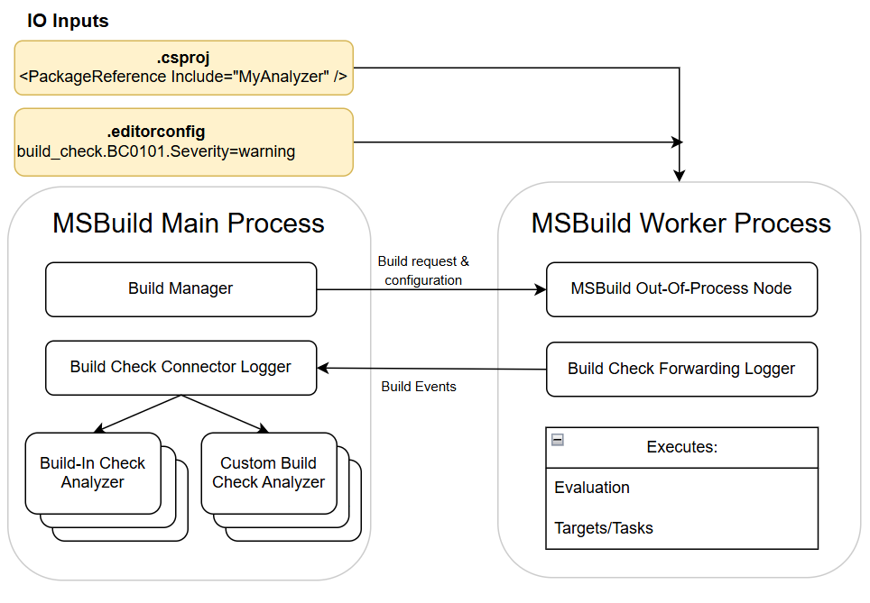

# BuildCheck - Perf and Acquisition Challenge

This is an internal engineering document. For general overview and user-oriented information please refer to [BuildCheck - Design Spec](BuildCheck.md).

# Challenge

Let's recall some details of build check analyzers acquisition. There might be two types of the build analyzer: build-in and custom. 
The build-in analyzers are configured in the `.editorconfig` file. The custom analyzers are declared in the project files via PackageReference and also configured in the `.editorconfig` file.
Project files are read during the first pass of the evaluation of the project. Given the multi-processing nature of msbuild, this might happen either on main node or on the msbuild worker node. When the analyzer is encountered, the event `BuildCheckAcquisitionEventArgs` is logged with information concerning the analyzer that is needed to be loaded. This event is forwarded by `BuildCheckForwardingLogger` through logging system via the named pipes to the main msbuild node, where it is processed by `BuildCheckConnectorLogger`. This requires the logging system to be configured on main and worker msbuild nodes. 

There two issues that arises from such a design:
1. The configuration of the logging system should be ideally dependent on the set of the applied build analyzers. Verbosity of the build hugely affects the set of logging events that are logged by default. Moreover, some events are not forwarded with forwarding loggers, depending on forwarding loggers configuration. This is done for performance reasons to allow to drop the events that are not consumed by any of the central loggers. We need to ensure that the events required for the analyzers to work pass through. For that we need to have information about active rules from the `.editorconfig` file and the declarations in the project files via PackageReference when setting up the logging system.
2. There is no synchronization between build manager and logging service. When the build check acquisition events get to the main node, most of the build might have been already finished on worker nodes.

# Solution ideas

- When analyzers are used, always create and forward all the events. This will have a considerable impact on performance but makes configuring of the logging system easy.
- Set up the logger configuration before the build starts on the worker nodes: the main node can read the `.editorconfig` file and set up the correct configuration. For custom analysers we cannot do that, as they could be downloaded during the restore and discovered during the evaluation. 
- Change the initial confuguration of the logging system (in particular, forwardning loggers) during the build. 
    - Do that as soon as we get the events `BuildCheckAcquisitionEventArgs` in forwarding logger: create a custom `BuildCheckForwardingLogger` that will re-configure itself when it gets `BuildCheckAcquisitionEventArgs`. This will need reading the editorconfig files and possibly loading custom analyzers in the worker node in order to find which events are needed for the custom analyzers. We will miss some of the events on the evaluation prior `BuildCheckAcquisitionEventArgs` event but since the events are processed in an order, the new filters in the forwarding logger will apply to the later events.
    - Process the events `BuildCheckAcquisitionEventArgs` in the build check manager and send a message to the worker node to re-configure it. However due to the absence of syncronization between build manager and logging service, this message might get processed on the worker node late and we will miss a lot of events needed for the analyzers.  
- As an addition the previous ideas, we may initialize the loggers from cache (either in-process cache or cache file in file system). We might have a strict mode which in case of cache miss invalidates and restarts a corresponding build.
