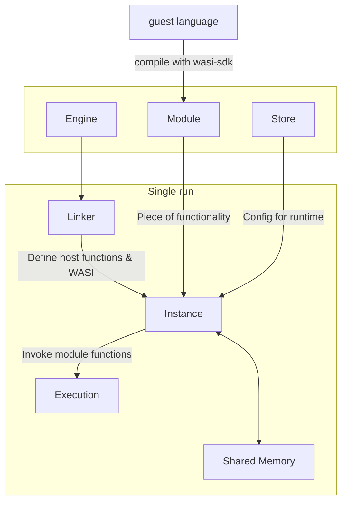
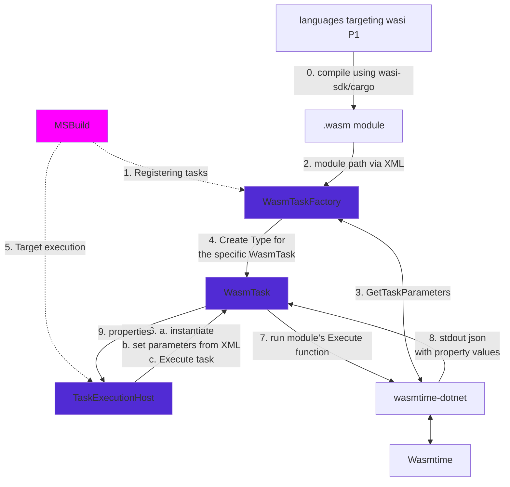

# Wasm/WASI tasks in MSBuild
Exploration of using Wasm/WASI to create sandboxed [Tasks in MSBuild](https://learn.microsoft.com/visualstudio/msbuild/msbuild-tasks) using non-dotnet Wasm/WASI compatible language.

## Stories 
Currently MSBuild tasks have unrestricted access to resources (filesystem, network, environment variables), Wasm/WASI runtimes provide a way to sandbox tasks (all access to resources has to be specified). Sandboxing is useful from a security perspective if someone wanted to run a task from an untrusted source without decompiling and analyzing it.

Today a MSBuild task = .NET class. We want to enable users to write a task in another language. This feature includes designing how tasks will communicate with MSBuild if they're running out of the .NET runtime. Ecosystems that support the Wasm/WASI development features are: Rust and C/C++ at the moment, with ongoing development in Go and others.

## Terminology and context
-  **WebAssembly (abbreviated Wasm)**
> is a binary instruction format for a stack-based virtual machine. Wasm is designed as a portable compilation target for programming languages, enabling deployment on the web for client and server applications. - [webassembly.org/](https://webassembly.org/)

- [**WASI**](https://wasi.dev/) : WebAssembly System Interface is a standard for APIs for software compiled to Wasm to use system resouces outside of browsers.
    - WASIp1 filesystem, environment variables, stdIO, programs are "Modules"
    - WASIp2 rich interface data types, networking, programs are "Components"
- [**Wasmtime**](https://wasmtime.dev) : Wasm runtime implementation for desktops supporting WASI
- **Wasm Module** a compiled Wasm program that exposes functions to the host and expects imports functions from the host

### Diagram of a Wasm execution from a host


### Interacting with Wasm/WASI in MSBuild without Wasm/WASI Tasks
In a build, we can use the [`Exec` task](https://learn.microsoft.com/visualstudio/msbuild/exec-task) with Wasmtime and an executable .wasm file, but this execution would not have any MSBuild capabilities such as logging and passing of file parameters.

#### Rust example:
1. install [wasi-sdk](https://github.com/WebAssembly/wasi-sdk), [wasmtime](https://wasmtime.dev), [cargo](https://doc.rust-lang.org/cargo/getting-started/installation.html)
3. write your Rust program
3. `project.csproj`
```xml
  <Target Name="CompileAndRun" BeforeTargets="Build">
    <Exec Command="cargo build --target wasm32-wasi --release --manifest-path='sometask/Cargo.toml'">
    <Exec Command="wasmtime run path_to_compiled_rust_program.wasm --additional_args_for_wasmtime_enabling_more_than_CPU_and_memory" />
</Target>
```
4. `dotnet build`
This does not provide an ergonomic way to pass MSBuild parameters to the "task" or get outputs from it.

## Goals for the Wasm tasks feature
1. specify how a Wasm/WASI task should communicate with MSBuild, and what it should contain to be recognized as a task
2. Write an `ITaskFactory` and a supporting `ITask` classes that when passed a `.wasm` file implementing required functions runs it as an MSBuild task
3. Demos/examples

### Prototype features
Prototypes are implemented in [https://github.com/JanProvaznik/MSBuildWasm](https://github.com/JanProvaznik/MSBuildWasm)
- ✅ WasmTask - creating tasks from .wasm files
    - ✅ Specification for what should this .wasm file export and how it will be ran
    - ✅ ITaskFactory that let's msbuild use task parameters defined inside the .wasm module
- ✅ Rust example

#### User Experience
1. `dotnet new install MSBuildWasm.Templates`
2. `dotnet new rust.msbuild.task -o new-project-using-rust-task` 
3. The user Writes a task in Rust based on the template, compiles it to a .wasm module e.g. `cargo b --target wasm32-wasi`
4. The user adds the task to their .proj file and it runs and logs as if it were a C# task. Template:
```xml
<ItemGroup>
  <PackageReference Include="MSBuildWasm" Version="0.2.0" />
</ItemGroup>

...

<UsingTask TaskName="FancyWasmTask" 
           AssemblyFile="$(MSBuildWasmAssembly)" 
           TaskFactory="WasmTaskFactory" 
           Condition="$(MSBuildWasmAssembly) != ''">
  <Task>compiled_task_implementation.wasm</Task>
</UsingTask>

<Target Name="name">
  <FancyWasmTask Param="..." Param2="asdf">
    <Output .../>
  </FancyWasiTask>
</Target>
```

### Advanced features
- ✅ prototype `MSBuildWasm.Templates` package
- ❌ ~~.NET example~~ (WASIp1 will not be supported in .NET)
- [ ] integrating pipeline for creating Wasm/WASI tasks from code in Rust 
    - [ ] investigate integrating tools compiling languages to Wasm/WASI
    - On task level
        - [ ] RustTaskFactory
        - exploring other languages (Go, C/C++, Zig)
- investigate running an arbitrary .NET task distributed as a dll in the WASI sandbox (👀 Mono runtime)
    - ❌ Due to the prototype implementing WasmTasks with WASIp1, it will not compatible with .NET runtime effort to support WASIp2; ecosystem for implementing WasmTasks with WASIp2 is not ready yet


## Design
### diagram


MSBuildWasm classes are purple.


### Wasm/WASI communication with MSBuild
Without WASIp2 WIT (which is not yet implemented in wasmtime-dotnet: [issue](https://github.com/bytecodealliance/wasmtime-dotnet/issues/324) ), the only data type that can be a Wasm function parameter and output is a number. MSBuild Tasks have parameters which are of the following types: `string`, `bool`, [ITaskItem](https://github.com/dotnet/msbuild/blob/main/src/Framework/ITaskItem.cs) (basically a string dict), and arrays of these types.

In the current implementation the .wasm task module has to: 
-  **import** functions from "module" `msbuild-log`: `LogError(u32 message_ptr, u32 message_len)`, `LogWarning(u32 message_ptr, u32 message_len)`, `LogMessage(u32 MessageImportance, u32 message_ptr, u32 message_len)`. 
-  **export** functions `GetTaskInfo()`; `Execute() -> u32`, which returns 0 for success and 1 for failure.

### Task parameters 
What parameters the task has is obtained by calling GetTaskInfo() in the Task wasm module. When initializing the task with the `WasmTaskFactory` we use reflection to create a C# type with corresponding properties.
Task parameter values are passed into the wasm module as a JSON string in stdin.

For future reference we describe the proposed interface [in the WASIp2 WIT format](./wasmtask.wit) once it is supported in wasmtime-dotnet as a model for rewrite to WASIp2. This would remove the need to use JSON strings for passing parameters and logs could be passed using strings rather than pointers, the [wit-bindgen](https://github.com/bytecodealliance/wit-bindgen) tool could be used to generate guest language bindings/composite types.

Every resource available to the Wasm/WASI runtime has to be specified explicitly when running the host - Wasmtime is a sandbox by default. WASIp1 via wasmtime-dotnet enables: preopening directories, environment variables, stdIO, args (if ran as a standalone program), 
The prototype implementation uses the following features:
It copies items on input to a temporary directory and passes the path to the Wasm module. The module can access these files and write to the directory. Output properties are copied out after the run. StdIn is used for passing parameters and StdOut for getting the output.
Users can specify in the task usage `Directories="directories on host that can be accessed in addition to the temporary one"`
- After the task is run, Output parameters as a JSON are read from stdout of the Wasm execution, and parsed back into C# class properties so the rest of MSBuild can use them.
WASIp2 defines more host features, but configuring them [is not yet exposed](https://github.com/bytecodealliance/wasmtime/issues/8036#issuecomment-2180272305) in the .NET host API: [WASI docs](https://github.com/WebAssembly/WASI/tree/main/wasip2) e.g. random, networking, clocks.

### Json format for parameter spec
They mirror MSBuild Task parameters as they need to be reflected to a C# class.
```jsonc
{
    "properties": [
        {
            "name": "Param1",
            "property_type": "String", 
            "required": true, // Maps to RequiredAttribute in MSBuild
            "output": false // Maps to OutputAttribute in MSBuild
        },
        {
            "name": "Param2",
            "property_type": "Bool",
            "required": false,
            "output": false
        },
        {
            "name": "Param3",
            "property_type": "ITaskItem", 
            "required": false,
            "output": false
        },
        {
            "name": "Param4",
            "property_type": "ITaskItemArray",
            "required": false,
            "output": true // output means that the parameter is read from the output of the task, but it can be inputted too
        }
    ]
}
```
### Json format for parameter values
```jsonc
{
    "Param1": "hello",
    "Param2": true,
    "Param3": {
        "ItemSpec": "C:\\real\\path\\file.txt",
        "WasmPath": "file.txt", // guest runtime path
        "More .NET metadata": "..."
    },
    "Param4": [
        {
            "ItemSpec": "item1",
            "Metadata1": "value1"
        },
        {
            "ItemSpec": "item2",
            "Metadata2": "value2"
        }
    ]
}
```

### Json format for task output
Only parameters with the output attribute set to true are recognized from the output in the MSBuild task.
```jsonc
{
    "Param4": [
        {
            "ItemSpec": "also/can/be/dir",
            "WasmPath": "also/can/be/dir"
        },
        {
            "ItemSpec": "name_in_host.txt",
            "WasmPath": "item.txt"
        }
    ]
}
```


### Testing
#### Unit tests
- [ ] setting parameters in the task
- [ ] parsing outputs
- [ ] examples contain expected functions

#### E2E tests
- Using Wasm/WASI Tasks in a build
- [ ] Rust tasks
    - [ ] logging
    - [x] passing parameters
    - [x] accessing files


## Implementation details
### wasmtime-dotnet bindings and basic usage
```csharp
using var engine = new Engine();
using var module = Module.FromFile(engine, WasmFilePath);
using var linker = new Linker(engine);
linker.DefineWasi(); // linking WASI
linker.Define("namespace", "function", (Action)delegate { /* do something */ }); // Host function that can be called from Wasm
using var store = new Store(engine);
var wasiConfigBuilder = new WasiConfiguration(); // enable resources: InheritEnvironment, PreopenedDirectory, StdIO 
store.SetWasiConfiguration(wasiConfigBuilder);
Instance instance = linker.Instantiate(store, module);
Action fn = instance.GetAction("Execute");
fn.Invoke();
```


## Development remarks

### Architectural decision record
- **Inside MSBuild or as an external package?**
    - the feature seems largely independent
    - *-> separate repo https://github.com/JanProvaznik/MSBuild-Wasm, some features might need coordination - feature branch `dev/wasi-tasks`*
    - *-> actually the TaskExecutionHost is a very deep MSBuild thing and would need refactoring*

- **implementing WASI api on our own like [wasm in vscode](https://github.com/microsoft/vscode-wasm)?**
    - customizable👍
    - hard to maintain👎, wasi is changing
    - lot of work 👎
    - *-> resolved to use wasmtime*
    - Choosing Wasm/WASI runtime 
        - https://wasi.dev/ mentions several possible runtimes: Wasmtime, WAMR, WasmEdge, wazero, Wasmer, wasmi, and wasm3.
        - An important criterion is popularity/activity in development as the WASM standard is evolving and needs a lot of developers to implement it.
        - This leads to considering [Wasmtime](https://wasmtime.dev/) or [Wasmer](https://wasmer.io/).
        - Interaction with C# is especially important for us so we will use **Wasmtime** because the integration via a NuGet package is more up to date and there is more active development in tooling and other .NET projects use it. [wasmtime-dotnet](https://github.com/bytecodealliance/wasmtime-dotnet) provides access to wasmtime API

- **bundling wasm runtime with MSBuild?**
    - compatibility👍
    - ease of use 👍
    - size👎
    - maintenance👎
    - *-> make a nuget package, no need to release under msbuild now, eventually could happen, lot of compat/licencing concerns. bytecodealliance is a consortium containing Microsoft*

- **Interacting with the tooling for creating .wasi files from other languages?**
    - hard, unstable
    - *-> in scope but ambitious, the package can check/download and install tooling (wasi-sdk, rust) in simple cases*

- **start with windows or UNIX?**
    - *-> most different is the investigation about how to bundle tooling for other languages*

- **renaming this feature from WASI-... to Wasm-...**
    - file extensions are called .wasm 👍
    - WASI is a standard building on Wasm 👍
    - the compilation target is called wasm-wasi 👍👎
    - *-> use Wasm/WASI, the repo is called [MSBuildWasm](https://github.com/JanProvaznik/MSBuildWasm) for brevity*

- **communication between host and a wasm module**
    - shared memory, both host and wasm can access it; callbacks where to read from it, environment vars, stdIO 
    - eventually with Wasm/WASI component model better data-structures  
    - component model would help us a lot with passing data it has support for complex types [WebAssembly interface type](https://github.com/WebAssembly/component-model/blob/main/design/mvp/WIT.md) 
        - but wasmtime-dotnet does not support it now and the implementation is nontrivial: https://github.com/bytecodealliance/wasmtime-dotnet/issues/324#issuecomment-2218889279
    - *-> use JSON strings with callbacks and stdIO for now, with parsing on both sides, WIT is not implemented in wasmtime-dotnet*
        - JSON is a suitable format because we pass: lists, dicts strings and bools; and [`serde`](https://serde.rs/) in Rust enables ergonomic serialization to/from data structures
     
- **TaskExecutionHost?**
    - TaskExecutionHost is the class that usually runs instantiated tasks and uses reflection to give them property values, 
    - if we want this layer to handle setting up the environment for the task it has to be abstracted and the interface implemented by custom WasmTaskExecutionHost
    - Blocked by having to bring the feature to MSBuild repo and refactoring TaskBuilder and including wasmtime-dotnet
    - *-> keep it separate from MSBuild for now, it's OK that the base WasmTask class will handle setting up the Wasm/WASI environment*

### Related projects

[wasmtime](https://wasmtime.dev/) - Wasm runtime supporting the WASI standard written in Rust by *Bytecode Alliance* - consortium, where Microsoft is a member 

[wasmtime-dotnet](https://github.com/bytecodealliance/wasmtime-dotnet) - Bindings for wasmtime API in C#, via the C API, maintained by *Bytecode Alliance*

[componentize-dotnet](https://github.com/bytecodealliance/componentize-dotnet) NuGet package to easily make a WASI component from a C#.NET project using NativeAOT-LLVM, experimental release June 2024, created by people from Microsoft, the prototype can't use it because components are different from modules and we can't switch because wasmtime-dotnet does not support components.

[dotnet-wasi-sdk](https://github.com/dotnet/dotnet-wasi-sdk) 
- compile dotnet to Wasm
- moved to sdk and runtime repos `dotnet workload install wasi-experimental` in .NET 8.0 
    - Discussions: [1](https://github.com/dotnet/runtime/tree/main/src/mono/wasm) [2](https://github.com/dotnet/runtime/discussions/98538#discussioncomment-8499105) [3](https://github.com/dotnet/runtime/issues/65895#issuecomment-1511265657)
    - it does not support function exports and imports to the extent needed for prototype implementation
- developments that would enable using Wasm/WASI tasks written in .NET were added after the workload release but recently removed as .NET will focus only on WASIp2

MSBuild issues for making other environments for running tasks: [711](https://github.com/dotnet/msbuild/issues/711) [4834](https://github.com/dotnet/msbuild/issues/4834) [7257](https://github.com/dotnet/msbuild/issues/7257)

### Random
- wasmtime-dotnet needs to be signed to have a StrongName and put in a private feed if we'd like to integrate it to MSBuild proper eventually [PR](https://github.com/bytecodealliance/wasmtime-dotnet/pull/320)

- languages other than Rust are moving slowly and it's unclear if they'll implement WASIp1 at all or just like .NET will focus on WASIp2. Closest to support is Go but it's missing function exports [issue](https://github.com/golang/go/issues/65199). .NET 9 preview 6 possibly implements everything needed for Wasm/WASI tasks via Mono but in preview 7 it changed to target WASIp2 and it won't come back [PR](https://github.com/dotnet/runtime/pull/104683).

### Conclusion and Future work
State of the Wasm/WASI ecosystem does not enable implementing a robust useful solution right now (August 2024), in terms of functionality [MSBuildWasm](https://github.com/JanProvaznik/MSBuildWasm) is close to what is ergonomically possible using WASIp1 modules.
To get the sandboxing benefit of using WASI runtimes, several things need to happen first:
- wasmtime C API to support WASIp2 components and better granularity for giving access to resources in the guest. 
- wasmtime-dotnet has to implement bindings to the updated C API 
- an easy way to convert WIT to C# host bindings (wit-bindgen only handles guest bindings)
- figure out what MSBuild context do we want to pass (now it's just the logging functions)
- less experimental Mono WASIp2 support
- make a component for executing .NET tasks

To get the multilanguage task authoring benefit:
- Other languages have to implement the component model and an easy workflow to compile library components