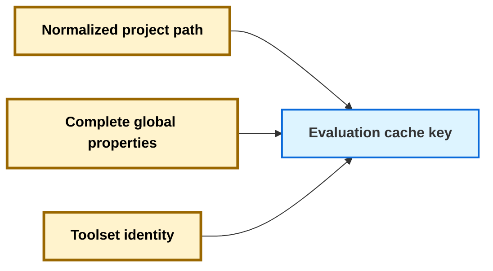
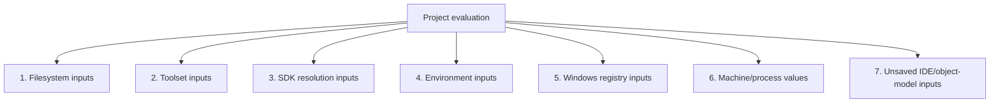

# Evaluation cache inputs and stale detection

Context: [evaluation-cache epic](https://github.com/dotnet/msbuild/issues/14234).

> **Goal:** cache an evaluated `ProjectInstance`, reuse it only while every evaluation input is current, and reevaluate when an input changes or its validity cannot be established.

> **Cache scope:** this investigation assumes an in-memory cache owned by one long-lived MSBuild server process and used only by the same operating-system user. It is not persisted or shared across users, server processes, or machines.

---

## Input stability overview

The first design question is whether an input is expected to change during normal development.

One of the scenarios we are interested in is an inner development loop.
An inner loop means repeated edit/build runs in the same checkout and server, with the same configuration, target framework, other request settings, request environment, and installed tools. Under those assumptions, some generally mutable inputs are usually stable. This is not immutability: another process, a restore, or a changed build request can still change them.

| Evaluation input | Expected to change between builds? | Within a fixed inner dev loop | Stored as |
| --- | --- | --- | --- |
| Root project file (`.csproj`, `.vbproj`, `.fsproj`, or another project file) | Yes | Can change; usually unchanged during source-code-only edits | Candidate key (path) + evaluation entry observation (file content or metadata) |
| Project-owned imported `.props` and `.targets` | Yes | Can change when build settings are edited | Evaluation entry observation |
| Restore-generated imports under `obj`, such as `*.nuget.g.props` and `*.nuget.g.targets` | Yes | Usually stable until restore or its inputs change | Evaluation entry observation |
| File/directory existence results from `Exists()` and import probes | Yes | Mutable: edits, generation, cleanup, and restore can change them | Evaluation entry observation |
| Directory contents and glob expansions | Yes | Mutable: adding, removing, or renaming files changes membership | Evaluation entry observation |
| Imported MSBuild environment properties | Yes | Usually stable for an unchanged request environment; must remain compatible | Evaluation context |
| Environment variables read on demand through property functions | Yes | Usually stable for an unchanged request environment; still need validation | Evaluation entry observation |
| Complete global properties | Yes | Stable while global properties stay fixed; changed properties need a different key | Candidate key |
| Other request-specific evaluation settings | Yes | Usually stable for the same build request; must remain compatible | Evaluation context |
| Windows Registry values read during evaluation | Yes | Usually stable without installation/configuration changes; other processes can still edit them | Evaluation entry observation |
| Filesystem metadata or accessibility state used by evaluation | Yes | Mutable, including timestamps changed by ordinary edits | Evaluation entry observation |
| Installed SDK files such as `Sdk.props` and `Sdk.targets` | No, normally stable | Usually stable while the installation is unchanged | Evaluation entry observation |
| Other existing files under the selected installed .NET SDK | No, normally stable | Usually stable while the installation is unchanged | Evaluation entry observation |
| Contents of an already extracted versioned NuGet package | No, normally stable | Usually stable; cache cleanup, replacement, or extraction can change them | Evaluation entry observation |
| Installed framework tools and reference assemblies | No, normally stable | Usually stable while the installation is unchanged | Evaluation entry observation |
| Default SDK resolver binaries/manifests under the MSBuild installation | No, normally stable | Usually stable while the installation is unchanged | Evaluation entry observation |
| Unsaved IDE/object-model project state | Yes | Mutable in an IDE loop; absent from disk-only CLI evaluation | Evaluation entry observation |

**Candidate key** identifies the project configuration. **Evaluation context** describes the settings under which it was evaluated. **Evaluation entry observations** describe the dependencies discovered during evaluation.

## Candidate cache key

The normalized project path, complete global properties, and toolset version already form MSBuild’s project-configuration key.

 We should **extend the toolset** part to identify its actual configuration, not just its version name.

| Candidate-key input | Existing MSBuild source | Rule |
| --- | --- | --- |
| Project path | `BuildRequestConfiguration.ProjectFullPath` | Use the normalized path for disk-backed projects. |
| Complete global properties | `BuildRequestConfiguration.GlobalProperties` | Include every property using MSBuild's case-insensitive name semantics and exact values. |
| Toolset | `BuildRequestConfiguration.ToolsVersion` and `Toolset` | Include version, tools path, selected subtoolset, and a fingerprint of the current toolset configuration. |

## Beyond the lookup key

Unchanged project data is not enough: **MSBuild configuration controls how that data is interpreted**. The settings below can affect evaluation even when the project path, global properties, tools-version value, and recorded data dependencies match.

| Configuration | What it can change | 
| --- | --- |
| **ChangeWave state** (`MSBUILDDISABLEFEATURESFROMVERSION`) | Disables behavior changes introduced at or after the specified MSBuild version, making affected features use their previous behavior|
| **Evaluation traits and escape hatches** (`IgnoreTreatAsLocalProperty`, `UseCaseSensitiveItemNames`, `SdkReferencePropertyExpansion`) | Changes property precedence, item-name comparison, or expansion of SDK references. | 
| **Feature switches** (`RestrictPropertyFunctionReceivers`, `EnableSdkResolverDynamicLoading`) | Changes which property functions or SDK resolvers may run. | 
| **Evaluation request options** (`ProjectLoadSettings`, `Interactive`, `MaxNodeCount`) | For example, `IgnoreMissingImports` changes import handling; interactive mode affects `MSBuildInteractive` and SDK resolution; node count changes `MSBuildNodeCount`. | 
| **Culture and UI culture** | Can change culture-sensitive property-function results, such as string casing or parsing. | 
| **Tools-version selection policy** (`ExplicitToolsVersionSpecified`, legacy/default tools-version settings) | An explicit tools-version override can follow different selection logic from an implicit default, even when the lookup's tools-version string matches. |
| **XML-parser rules** (`ParserIgnoreConfiguration`) | Determines which unknown XML attributes or elements are ignored instead of rejected. |

---

## Cached evaluation-input categories

### 1. Filesystem inputs

Record the normalized paths that evaluation reads, checks, or searches, including missing paths, and the state needed to detect changes.

| Evaluation input | Where evaluation uses it (concrete example) | Observation stored with the entry |
| --- | --- | --- |
| File content read during evaluation | Evaluation reads the contents of a file. **Example:** the root project, imported `.props`/`.targets`, and a supported `$([System.IO.File]::ReadAllText('version.txt'))` call. | File path and state used for change detection, such as last-write time and size |
| File/directory existence probe | Evaluation branches on whether a path exists and what kind it is. **Example:** `Exists('generated.props')` can decide whether to import a file, while `$([System.IO.Directory]::Exists('generated'))` can decide whether to add generated-source items. | Path and observed kind: file, directory, or missing |
| Import fallback search paths | For an import that directly uses a property configured in the toolset's `<projectImportSearchPaths>`, MSBuild tries the property's current value and then each configured fallback directory in order. **Example:** `MSBuildExtensionsPath=C:\Primary`, with fallbacks `C:\Fallback1;C:\Fallback2`, makes `<Import Project="$(MSBuildExtensionsPath)\Contoso\Custom.targets" />` try those three directories in that order. | Paths actually checked and their state, including missing candidates or missing fallback directories, plus the imported file's state |
| Upward file search | Evaluation searches the project directory and then each parent directory. **Example:** `GetPathOfFileAbove`, `GetDirectoryNameOfFileAbove`, and `Directory.Build.props`/`Directory.Build.targets` discovery select the nearest matching file. | Each candidate path checked, including missing candidates, plus the selected file's state |
| Directory membership or glob | Evaluation expands a filtered directory set. **Example:** `<Compile Include="src\**\*.cs" Exclude="src\obj\**\*" />` produces the evaluated `@(Compile)` items. | Directories traversed or probed, including missing roots, and their state |
| Metadata value | Evaluation reads filesystem metadata. **Example:** `<Stamp Include="@(Compile->'%(ModifiedTime)')" />` reads a source timestamp. MSBuild also compares project/import write times for `$(MSBuildAllProjects)`: build 1 can select newer `b.props`; after the user edits `a.props`, build 2 can select `a.props`. | Path, metadata field, and value returned to evaluation |
| Permission/accessibility result | Evaluation sees different paths or outcomes because of access control. **Example:** `Directory.GetFiles('generated')` returns fewer entries when one child directory is unreadable, or an import probe receives access denied. | Path, operation, and authoritative success/failure result |
| Symlink/reparse-point input | A project reads a path that is a link to another file. **Example:** `<Import Project="current.props" />` initially resolves `current.props` to `v1.props`; before the next build, the link is changed to point to `v2.props`. | The link path, resolved target path, and target file identity read by evaluation |

**Invalidation:** Use filesystem notifications, journals, or timestamp checks to detect edits to `version.txt`, newly created `generated.props`, or changes to `src\**\*.cs` membership. Metadata, permission, and link changes also matter; reject reuse when checks cannot establish validity.

### Filesystem invalidation options

- **Timestamp checks:** Compare file/folder timestamps and file sizes before reuse. Cost grows with input count, and unchanged metadata can hide edits.
- **FileSystemWatcher (Windows, Linux, macOS):** Invalidate affected evaluations when file or directory changes are reported.
- **USN journal (Windows):** Read filesystem change records to identify changed dependencies.
- **Direct comparison:** Compare file contents and directory listings with saved observations. More expensive, but useful when other checks are insufficient.

---

### 2. Toolset inputs

The effective toolset will be covered by the [candidate cache key](#candidate-cache-key), not recorded as a separate dependency.

---

### 3. SDK resolution inputs

`SdkResult` can contain success/failure, one or more paths, a version, properties, items with metadata, and environment values.

| Evaluation input | Where evaluation uses it (concrete example) |
| --- | --- |
| Effective SDK location/environment | SDK resolution uses the effective `MSBuildSDKsPath` and build environment. **Example:** `MSBuildSDKsPath=C:\dotnet\sdk\10.0.100\Sdks`. |
| SDK request from project | The project asks for an SDK by name and optional version. **Example:** `<Project Sdk="Microsoft.NET.Sdk/10.0.100">`. |
| Default SDK directory | The built-in resolver checks `MSBuildSDKsPath\<SdkName>\Sdk`. **Example:** `...\Sdks\Microsoft.NET.Sdk\Sdk`. |
| Resolver files and configuration | MSBuild finds and loads resolver plugins. **Example:** a resolver manifest, `Contoso.SdkResolver.dll`, `MSBUILDADDITIONALSDKRESOLVERSFOLDER`, workload manifests, or `NuGet.config`. |
| SDK resolution result and private resolver state | The returned `SdkResult` can add paths, properties, items, metadata, and environment values. **Example:** a resolver returns an additional SDK path and `PropertiesToAdd["WorkloadEnabled"]="true"`. |
| Resolved SDK files | MSBuild evaluates files returned by the result. **Example:** `Sdk.props` and `Sdk.targets`. |

**Invalidation:** A contract between MSBuild and SDK resolvers will be introduced to determine whether cached SDK results can be safely reused.

---

### 4. Environment inputs

| Evaluation input | Where evaluation uses it (concrete example) | Observation stored with the entry |
| --- | --- | --- |
| One environment variable | A property function reads one named value. **Example:** `$([System.Environment]::GetEnvironmentVariable('HOME'))` writes the current home directory into an evaluated property. | Name and value-or-missing result from the immutable raw request snapshot |
| Environment enumeration | A property function consumes the whole environment. **Example:** `$([System.Environment]::GetEnvironmentVariables())` can be passed to custom evaluation logic that derives items or properties. | Complete raw environment dictionary using platform name-comparison semantics |
| Environment expansion | Evaluation expands variable references embedded in text. **Example:** `$([System.Environment]::ExpandEnvironmentVariables('%HOME%\generated'))` can produce an import or item path. | Expanded text plus every referenced variable name/value-or-missing result |

**Invalidation:** Compare recorded values with the next request snapshot: for example, changed or missing `HOME` invalidates its reads and expansions. Enumeration requires comparing the entire raw dictionary.

---

### 5. Windows registry inputs

| Evaluation input | Example | Observation stored with the entry |
| --- | --- | --- |
| Existing registry value | `$(Registry:HKEY_LOCAL_MACHINE\Software\Contoso@InstallPath)` supplies an import path. | Registry key and value |
| Missing registry key/value | A missing `Contoso@InstallPath` makes evaluation use a default path. | Requested registry key/value and that it is missing |

**Invalidation:** We can use registry change notifications or just reread the value before cache use again.

---

### 6. Machine and process values

These are values read from the current computer or running MSBuild process that are not files, environment variables, or registry entries.

| Evaluation input | Where evaluation uses it (concrete example) | Observation stored with the entry |
| --- | --- | --- |
| Logical-drive/volume set | Evaluation enumerates drives or mounts. **Example:** `$([System.Environment]::GetLogicalDrives())` can generate items for each available drive. | Ordered volume set plus host volume/mount token |
| Server-lifetime values | Evaluation can read values fixed for the running MSBuild server. **Example:** `$([System.Environment]::MachineName)` returns the computer name and `$([System.Environment]::CommandLine)` returns the command that started the server process. | No separate observation; these values are part of the server/cache scope |
| Startup/effective evaluation directory | Evaluation can resolve relative paths against the build request's startup directory. **Example:** `$([System.IO.Path]::GetFullPath('config\settings.props'))`. | Startup and effective working directories in the evaluation context |
| Processor count | Evaluation can use the available processor count. **Example:** `$([System.Environment]::ProcessorCount)` controls a property or condition. | Processor-count value returned during evaluation |
| Volatile process/time value | Evaluation reads a value expected to change without a usable notification. **Example:** `Environment.WorkingSet`, `Environment.StackTrace`, `Environment.TickCount`, `DateTime.Now`, or `DateTime.UtcNow`. | No stable observation |

**Invalidation:** Check whether the request’s directories or available drives have changed. Values that stay fixed while the server runs need no rechecking. Evaluations that call  DateTime.Now  cannot be reused.

---

### 7. Unsaved IDE/object-model project inputs

An IDE/object-model host uses the `Microsoft.Build` APIs directly, for example Visual Studio evaluating unsaved XML for IntelliSense or design-time features. A host can also submit a `Project.CreateProjectInstance()` result through `BuildRequestData`.

An IDE or another MSBuild API host can change project XML/state in memory without saving the project file. A filesystem watcher sees no change, but the cached evaluation must still become stale.

| Evaluation input | Where evaluation uses it (concrete example) | Observation stored with the entry |
| --- | --- | --- |
| Unsaved changes to a loaded project | The IDE/host changes a `ProjectRootElement` or `Project` through the MSBuild API but does not save it. **Example:** `projectRootElement.AddProperty("LangVersion", "preview")` changes the next evaluation while the `.csproj` file on disk remains unchanged. | The source `Project`/`ProjectRootElement` object and its current version |
| Host-created or remote in-memory project | The project source is generated or owned by the host instead of a normal disk file. **Example:** `ProjectRootElement.Create(XmlReader)` evaluates generated XML, or `ProjectRootElementLink` exposes a remote project object. | Host source identity and  changing version |

**Invalidation:** Use `ProjectXmlChanged`/`ProjectChanged` and source-version comparisons to detect changes such as an unsaved `LangVersion` edit. Reject reuse when host sources lack stable identity/version information.

---

## Inputs that make evaluation non-cacheable

| Input/problem | Where evaluation uses it (concrete example) | Detection point | Cache action |
| --- | --- | --- | --- |
| Nondeterministic or unclassified property function | **Example:** `$([System.Guid]::NewGuid())` or `$([System.DateTime]::UtcNow)` is assigned to an evaluated property. | Property-function dispatch before/at invocation | Do not store the evaluation |
| All-property-functions mode | **Example:** with `MSBUILDENABLEALLPROPERTYFUNCTIONS=1`, project XML invokes `Contoso.Build.State::ReadDatabaseValue()`. | Feature-switch check before lookup/admission | Bypass lookup and admission |
