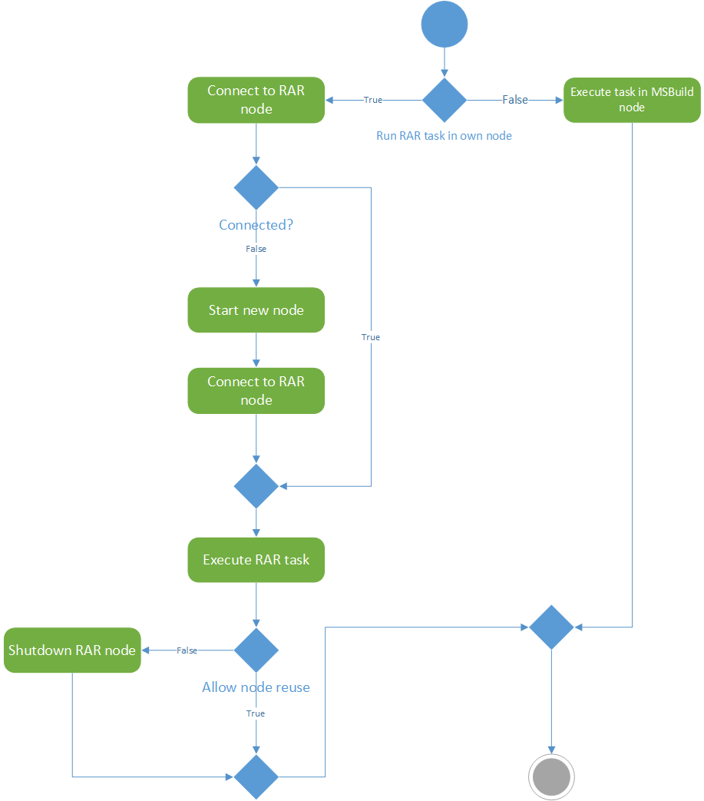

# Resolve Assembly Reference as Service Design

This document describes Resolve Assembly Reference as a Service

# Background

[MSBuild](https://docs.microsoft.com/visualstudio/msbuild/msbuild?view=vs-2019) is a universal build engine, used for building pretty much everything in the Microsoft world. It is available on command line (msbuild, [dotnet build](https://docs.microsoft.com/dotnet/core/tools/dotnet-build)), runs under the covers when building projects and solutions in Visual Studio, and is used as the local build engine in "higher-order" distributed build systems. Essentially all .NET applications use MSBuild as their primary build engine.

RAR is the acronym behind ResolveAssemblyReference (an MSBuild task) and ResolveAssemblyReferences (an MSBuild target). RAR is used in all .NET builds. Quoting the official documentation, RAR "_Determines all assemblies that depend on the specified assemblies, including second and nth-order dependencies._"

The RAR task has become very complex and slow over the years. It tends to rank high on the list of MSBuild's performance bottlenecks. There is an inherent cost to walking the assembly reference graph and computing the dependency closure, especially in terms of I/O operations. To address this, the task internally maintains caches, both in-memory and on disk. While it alleviates the problem somewhat, it is still a suboptimal solution because

1. The task runs in build nodes which are generally created as separate processes, one per logical CPU, so the in-memory state is duplicated.
2. Build nodes have limited lifetime and the in-memory state is lost when they die.
3. No state exists when the task runs for the given project for the first time.

    *NOTE:* This is tracked by issue [#5247](https://github.com/dotnet/msbuild/issues/5247).

There was already an attempt to introduce RAR as a service to MSBuild ([#3914](https://github.com/dotnet/msbuild/pull/3914)). This PR was not completed mainly because of discontinued development of Bond, which is in that PR used as method of communication between nodes.

# Design



_Figure 1 Rough diagram of lifetime of service_

## Lifetime of service

### Connect to RAR node

Connecting to the RAR node will not require any discovery of processes on computer. The algorithm will follow these steps:

1. Get expected node name, which will be based on the current setting of node. The name format is described in `Start new node`.
2. Setup named pipe. The construction of named pipe may differ between platforms (usage of different API for construction of the pipe object).
3. Try to connect to the node.

If the connection is successful, we can use this connection for execution of RAR task. The node is guaranteed to have all required properties since they must be encoded in name of the RAR node.

### Start new node

This step will create new process which will act as RAR node. It will also pass necessary information to the node to know what its settings are (reusable, ...). Node will be another instance of the MSBuild.exe which will have set parameter **nodeMode** to some specific value (it should be `/nodeMode:3`). 

We will use Mutex (as in [Roslyn](https://github.com/dotnet/roslyn/blob/838874b1b817db84ce146bef690cc95a39c213a5/src/Compilers/Server/VBCSCompiler/BuildServerController.cs#L143)) to ensure we don't create two RAR nodes at once. Its name must encode whether it is the user's only RAR node, including user name, administrator privileges, and some initial settings for the node. Such a name could be: `MSBuild.RAR.ostorc.7`, where **MSBuild.RAR** is its prefix, **ostorc** is the user who called MSBuild, and **7** represents encoded settings (flag enum).

### Execute RAR task

Execution should be the same as it is now.

There is already some layer of separation between Task interface and actual execution method. We will leverage this, and put the decision logic if to run locally or not into the "wrapper" method and so we will not have to modify this and in server-side execution we will directly call the internal execution method.

There is one big concern and that is how to handle multiple requests at once. As right now, RAR task is not prepared for multi-thread use.

### Shutdown RAR node

If the user does not want the node to be reused, we have the ensure that node will be killed after the build ends. This should be done after the main MSBuild node finishes building.

The RAR node, also has to support accepting of already established commands for MSBuild nodes (for example Shutdown command). This will be done by creating two pipes inside node, one will be for communication about RAR commands and second one for the servicing communication.

### Execute task in MSBuild node

User opted out of using the RAR nodes so we will execute the RAR task in the MSBuild node (as it is right now).

### Other

The new RAR node will not count toward total maximum CPU count specified by _/maxCpuCount_ switch, since the RAR task is taxing on IO operations not so much on CPU time. If we took one node from each instance of MSBuild it would lead to drastic decrease in performance.

The RAR task will be affected by the _/m_ switch. When we run in single node mode, it will implicitly say that we want to run the task inside current process. User would have to explicitly say that they want to use the RAR node.

__NOTE:__ The behavior described above depend on fact that the feature is opt-out (is active by default). If not, the paragraph above is meaningless. This has to be yet decided/clarified.

## Communication

The communication between nodes should be done over [StreamJsonRpc](https://github.com/microsoft/vs-streamjsonrpc/). The API over which two node will transfer data has to reflect inputs and outputs of RAR task as described in [docs](https://docs.microsoft.com/visualstudio/msbuild/resolveassemblyreference-task?view=vs-2019).

Note that, the following snippets are probably not final version of the API and are here to give rough idea, what must be transferred.

### RAR Input

This is direct representation of all RAR inputs.

```csharp
public sealed partial class ResolveAssemblyReferenceInput
{

    public ResolveAssemblyReferenceInput() { }

    public string[] AllowedAssemblyExtensions { get { throw null; } set { } }

    public string[] AllowedRelatedFileExtensions { get { throw null; } set { } }

    public string AppConfigFile { get { throw null; } set { } }

    public Microsoft.Build.Framework.ITaskItem[] Assemblies { get { throw null; } set { } }

    public Microsoft.Build.Framework.ITaskItem[] AssemblyFiles { get { throw null; } set { } }

    public bool AutoUnify { get { throw null; } set { } }

    public string[] CandidateAssemblyFiles { get { throw null; } set { } }

    public bool CopyLocalDependenciesWhenParentReferenceInGac { get { throw null; } set { } }

    public bool DoNotCopyLocalIfInGac { get { throw null; } set { } }

    public bool FindDependencies { get { throw null; } set { } }

    public bool FindDependenciesOfExternallyResolvedReferences { get { throw null; } set { } }

    public bool FindRelatedFiles { get { throw null; } set { } }

    public bool FindSatellites { get { throw null; } set { } }

    public bool FindSerializationAssemblies { get { throw null; } set { } }

    public Microsoft.Build.Framework.ITaskItem[] FullFrameworkAssemblyTables { get { throw null; } set { } }

    public string[] FullFrameworkFolders { get { throw null; } set { } }

    public string[] FullTargetFrameworkSubsetNames { get { throw null; } set { } }

    public bool IgnoreDefaultInstalledAssemblySubsetTables { get { throw null; } set { } }

    public bool IgnoreDefaultInstalledAssemblyTables { get { throw null; } set { } }

    public bool IgnoreTargetFrameworkAttributeVersionMismatch { get { throw null; } set { } }

    public bool IgnoreVersionForFrameworkReferences { get { throw null; } set { } }

    public Microsoft.Build.Framework.ITaskItem[] InstalledAssemblySubsetTables { get { throw null; } set { } }

    public Microsoft.Build.Framework.ITaskItem[] InstalledAssemblyTables { get { throw null; } set { } }

    public string[] LatestTargetFrameworkDirectories { get { throw null; } set { } }

    public string ProfileName { get { throw null; } set { } }

    public Microsoft.Build.Framework.ITaskItem[] ResolvedSDKReferences { get { throw null; } set { } }

    public string[] SearchPaths { get { throw null; } set { } }

    public bool Silent { get { throw null; } set { } }

    public string StateFile { get { throw null; } set { } }

    public bool SupportsBindingRedirectGeneration { get { throw null; } set { } }

    public string TargetedRuntimeVersion { get { throw null; } set { } }

    public string[] TargetFrameworkDirectories { get { throw null; } set { } }

    public string TargetFrameworkMoniker { get { throw null; } set { } }

    public string TargetFrameworkMonikerDisplayName { get { throw null; } set { } }

    public string[] TargetFrameworkSubsets { get { throw null; } set { } }

    public string TargetFrameworkVersion { get { throw null; } set { } }

    public string TargetProcessorArchitecture { get { throw null; } set { } }

    public bool UnresolveFrameworkAssembliesFromHigherFrameworks { get { throw null; } set { } }

    public string WarnOrErrorOnTargetArchitectureMismatch { get { throw null; } set { } }
}
```

### RAR Output

Output of RAR node has to also reflect RAR task.
```csharp
public sealed partial class ResolveAssemblyReferenceOutput
{
    public ResolveAssemblyReferenceOutput() { }

    public Microsoft.Build.Framework.ITaskItem[] CopyLocalFiles { get { throw null; } }

    public string DependsOnNETStandard { get { throw null; } }

    public string DependsOnSystemRuntime { get { throw null; } }

    public Microsoft.Build.Framework.ITaskItem[] FilesWritten { get { throw null; } }

    public Microsoft.Build.Framework.ITaskItem[] RelatedFiles { get { throw null; } }

    public Microsoft.Build.Framework.ITaskItem[] ResolvedDependencyFiles { get { throw null; } }

    public Microsoft.Build.Framework.ITaskItem[] ResolvedFiles { get { throw null; } }

    public Microsoft.Build.Framework.ITaskItem[] SatelliteFiles { get { throw null; } }

    public Microsoft.Build.Framework.ITaskItem[] ScatterFiles { get { throw null; } }

    public Microsoft.Build.Framework.ITaskItem[] SerializationAssemblyFiles { get { throw null; } }

    public Microsoft.Build.Framework.ITaskItem[] SuggestedRedirects { get { throw null; }
}
```
### Logging response

Node also has to return logged data, preferably in stream which will be transferred during the RAR task execution to the client node. This should by done by using IProgress\<T> support in StreamJsonRPC. There is also support for async enumerable, but they must be pulled and are not pushed to the client (comparison can be found [here](https://github.com/microsoft/vs-streamjsonrpc/blob/master/doc/asyncenumerable.md#comparison-with-iprogresst)).

### Concurrency

One of the biggest challenges with RAR as service, is to make execution and caching of RAR task thread-safe, since in most cases there will be multiple clients request data from it at once.

In the first phase of implementation the concurrency will be solved by serializing requests, but this will be replaced by optimal variant with no serializing.

# Non-Goals

- File watchers: using them would decrease required IO operations when checking disc changes
- Aggressive precomputation of results
- Improved caching of requests
- Providing verbosity to RAR task:
    As mentioned in original [PR](https://github.com/dotnet/msbuild/pull/3914), there should be some way to determine what thing we should log (by severity), and pass back to the original node.

    Providing the verbosity level to the task should not probably be part of this project, but the RAR node should be able to accept the required verbosity on its input. This verbosity level should be introduced into the RAR task by [#2700](https://github.com/dotnet/msbuild/issues/2700).
