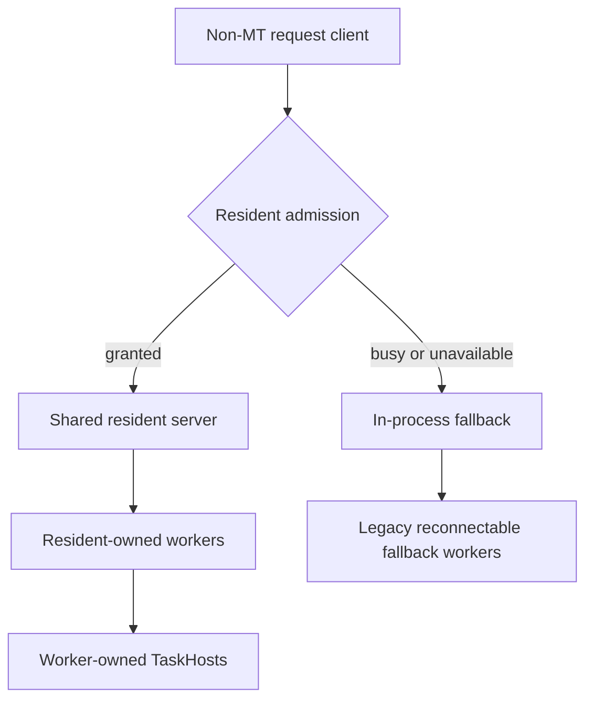

# Resident Server Worker-Node Ownership

**Status:** Proposed

## Terminology

- **Resident server:** the single stable MSBuild Server process for a compatible
  identity. It can serve both MT and non-MT requests; MT/non-MT are not server
  types.
- **MT request:** a build request with multithreaded mode enabled.
- **Non-MT request:** a build request without multithreaded mode enabled. It
  targets the same resident server as an MT request.
- **Resident-owned worker:** an out-of-process project worker whose lifetime is
  bounded by the resident server.
- **In-process fallback:** execution in the short-lived thin client after a
  non-MT request cannot acquire the resident.
- **Fallback worker:** a worker used by in-process fallback. Reusable fallback
  workers retain the existing global reconnectable-node contract.
- **TaskHost:** a process used by a server or worker to execute an isolated task.
- **Explicitly transient TaskHost:** a TaskHost requested by a caller that needs
  process isolation to end at the project-build boundary.

## Decision

When the resident server executes a non-MT request, it owns every
out-of-process worker it creates or reuses.

Resident-owned workers:

- may be reused by later builds on the same resident;
- retain a live connection to that resident;
- cannot be adopted by another MSBuild process; and
- cannot outlive the resident.

This applies whether the resident currently delegates all project work or also
retains TaskHosts from an earlier MT request.

## In-process fallback

A non-MT request rejected because the resident is busy or unavailable retains
the existing fallback:

- the thin client executes the build in-process;
- fallback workers use the legacy globally reconnectable worker handshake; and
- reusable fallback workers may survive the thin client and be adopted by a
  later fallback build.

The resident-owned and fallback worker pools use incompatible handshakes and
cannot adopt from one another.

`-nodeReuse:false` continues to disqualify a non-MT request from using the
resident.
That build runs in-process and leaves no reusable worker behind.

## Resident-owned worker reuse

At reusable build completion:

1. the resident sends reusable completion;
2. the worker resets build-lifetime execution, logging, environment,
   current-directory, SDK-resolution, registered-object, and cancellation state;
3. the worker resets or terminates its TaskHosts at the appropriate boundary;
4. the worker acknowledges reset completion; and
5. the ownership connection remains open.

The provider tracks retained physical workers separately from workers active in
the current build:

- `MaxNodeCount` limits active logical nodes;
- idle retained workers do not consume active-node slots; and
- retained communication IDs are rebound to the current build's routing and
  packet handlers before use.

## Shutdown

On resident idle expiration, explicit shutdown, or unrecoverable failure:

1. the resident sends non-reusable completion to every retained worker;
2. each worker terminates its owned TaskHosts;
3. the resident waits for worker exit, with the existing forced-termination
   fallback; and
4. the resident exits after all owned workers are gone.

Unexpected resident-connection loss terminates an owned worker rather than
returning it to the fallback pool.

The legacy enumeration-based `ShutdownAllNodes` path remains scoped to unowned
fallback workers and cannot match resident-owned workers.

## Compatibility

This proposal changes process lifetime, not task isolation guarantees.

- A non-multithreaded, non-yielding task runs exclusively in its process while
  it is executing a project.
- Node reuse may later execute an unrelated project in the same process.
- Tasks must not treat process-static state as project-specific state.
- Any static state must be independent of project/build identity or validate
  that it is safe for the current invocation.
- MT-capable tasks may execute concurrently according to their declared
  contract.
- Full per-project process isolation still requires an explicitly transient
  TaskHost.

An independent concurrent build cannot reuse workers active in another build
today, so ownership does not change that case.

The intentional process-lifetime changes are:

- resident builds no longer adopt workers from the global fallback pool;
- fallback builds no longer adopt workers launched by the resident; and
- resident workers exit with the resident instead of returning to a global
  pool.

The known tradeoff is that idle workers retained by a resident are unavailable
to an independent fallback build. V1 accepts that architectural tradeoff;
dynamic downsizing is outside this specification.

## Non-goals

- Changing non-MT busy/unavailable fallback routing.
- Owning fallback workers with the short-lived thin client.
- Removing the legacy fallback worker pool.
- Multiple resident servers.
- Dynamic idle-worker downsizing.
- Server GC policy.

## Required tests

1. Sequential non-MT requests on the resident reuse the same worker PID.
2. Resident-owned and fallback handshakes cannot adopt from one another.
3. Busy non-MT admission falls back in-process.
4. Fallback workers retain legacy cross-fallback reuse.
5. `-nodeReuse:false` remains in-process and leaves no reusable workers.
6. Changed build environment and state do not leak across resident worker reuse.
7. Idle retained workers do not reduce the current build's `AvailableNodes`.
8. Worker shutdown cascades to worker-owned TaskHosts.
9. Resident idle expiration and explicit shutdown reap every owned worker
   without process enumeration.
10. Abrupt resident termination reaps owned workers.
