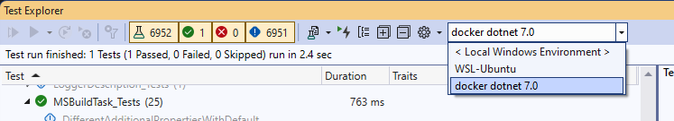

# Building MSBuild for the .NET Framework

These instructions refer to working with the `main` branch.

## Required Software

**Latest Microsoft Visual Studio 2022**: You can download the Visual Studio Community edition from [visualstudio.microsoft.com/vs/community/](https://visualstudio.microsoft.com/vs/community/).

All command lines should be executed from a Visual Studio developer command prompt.

## Getting the code

1. Clone the repo: `git clone https://github.com/dotnet/msbuild`
2. Build on the command line: `.\build.cmd`
   1. If you encounter errors, see [Something's wrong in my build](Something's-wrong-in-my-build.md).
3. Open the solution file in Visual Studio (`MSBuild.Dev.slnf`).

## Running Unit Tests

To run the unit tests from Visual Studio:

1. Open the MSBuild solution file (`MSBuild.Dev.slnf`) in Visual Studio.
2. Open the Test menu -> Windows -> Test Explorer.
3. Click Run All.

To build MSBuild and run all unit tests from the command line, use `.\build.cmd -test`.

Some tests are creating symlinks to test associated functionality - in order for them to succeed you have two options:
* Enable [Development Mode](https://learn.microsoft.com/en-us/windows/apps/get-started/enable-your-device-for-development) on your machine.
* Or run those tests elevated

To mimic our CI job use `eng\CIBuild.cmd`. Be aware that this command may delete your local NuGet cache.

The CI does two builds. In the second build, it uses the binaries from the first build to build the repository again.

### Unit testing inside virtualized environment 

In case you develop on Windows OS, but need to run/debug tests on other platforms - unit tests can be run and debugged on a local virtualized environment supported by [Visual Studio Remote Testing](https://learn.microsoft.com/en-us/visualstudio/test/remote-testing?view=vs-2022).
Initial configurations have been added for `WSL` and net 7.0 linux docker via [`testenvironments.json`](../../testenvironments.json).
Upon opening the Tests Explorer the advanced environments are available in the GUI: 



This readme will not discuss definitive list of details for proper setup of the environments instead we defer reader to the following information sources and warn about particular gotchas:

 * WSL runs
   * Install [WSL](https://learn.microsoft.com/en-us/windows/wsl/about).
   * Install the [distribution](https://aka.ms/wslstore) of your choice.
   * [Install .NET Runtime](https://learn.microsoft.com/en-us/dotnet/core/install/linux-ubuntu)
 * Docker runs
   * Install [Docker Desktop](https://www.docker.com/products/docker-desktop/)
   * First run of docker scenario might need elevation ([Test project does not reference any .NET NuGet adapter](https://developercommunity.visualstudio.com/t/test-project-does-not-reference-any-net-nuget-adap/1311698) error)  
 * Third party test runners might not support this feature. Use [Visual Studio Test Explorer](https://learn.microsoft.com/en-us/visualstudio/test/run-unit-tests-with-test-explorer).

## Contributing

Please see [Contributing Code](https://github.com/dotnet/msbuild/blob/main/documentation/wiki/Contributing-Code.md) for details on contributing changes back to the code. Please read this carefully and engage with us early to ensure work is not wasted.

## Walkthroughs

### Using the repository binaries to perform builds

To build projects using the MSBuild binaries from the repository, you first need to do a build which produces
a "bootstrap" directory. The "bootstrap" directory mimics a Visual Studio installation by acquiring additional
dependencies (Roslyn compilers, NuGet, etc.) from packages or from your local machine (e.g. props/targets
from Visual Studio). This will happen by default when running `.\build.cmd`. The bootstrap can be disabled by running `.\build.cmd /p:CreateBootstrap=false`.

Now, just point `artifacts\bin\bootstrap\net472\MSBuild\Current\Bin\MSBuild.exe` at a project file.

### Patching Visual Studio with repository binaries

Sometimes it's useful to patch your copy of Visual Studio in order to test or debug your local MSBuild changes from Visual Studio. You can use the [Deploy-MSBuild script](../Deploy-MSBuild.md) for copying your locally built MSBuild binaries over the MSBuild binaries shipping with Visual Studio. Example usage:
```
# bootstrap build
.\build.cmd

# copy the bootstrap build output over the MSBuild binaries in Visual Studio
.\scripts\Deploy-MSBuild.ps1 -destination "C:\Program Files\Microsoft Visual Studio\2022\Enterprise\MSBuild\Current\Bin"
```

### Debugging MSBuild

#### Breakpoints
To break into the [main method](https://github.com/dotnet/msbuild/blob/bd00d6cba24d41efd6f54699c3fdbefb9f5034a1/src/MSBuild/XMake.cs#L493-L506) of MSBuild.exe: set the environment variable `MSBUILDDEBUGONSTART` to 1 (uses `Debugger.Launch()`) or 2 (waits until debugger is attached).

To break into MSBuild's [BuildManager.BeginBuild](https://github.com/dotnet/msbuild/blob/bd00d6cba24d41efd6f54699c3fdbefb9f5034a1/src/Build/BackEnd/BuildManager/BuildManager.cs#L414) set the environment variable `MSBuildDebugBuildManagerOnStart` to 1 (uses `Debugger.Launch()`) or 2 (waits until debugger is attached).
This is useful for debugging MSBuild when it is called from other apps that use its APIs instead of its executable (for example Visual Studio). You can also filter which processes trigger the breakpoint by setting `MSBuildDebugProcessName` to a substring of the process name. For example, to trigger the breakpoint only under Visual Studio's top level process you would set `MSBuildDebugProcessName` to the value `devenv`.

#### Logs
You can set the environment variable `MSBuildDebugEngine` to 1 to have MSBuild dump all of its possible debugging logs (for example, scheduler state, node communication).

It also injects a binary log during [BuildManager.BeginBuild](https://github.com/dotnet/msbuild/blob/bd00d6cba24d41efd6f54699c3fdbefb9f5034a1/src/Build/BackEnd/BuildManager/BuildManager.cs#L491), which is incredibly useful when MSBuild is being called through its APIs from other apps that inhibit or filter MSBuild's event messages. For example, Visual Studio heavily filters build event messages when doing normal builds and inhibits build events when it's performing [design time builds](https://github.com/dotnet/project-system/blob/04474df00ebd742e05d31f8e487d6ed4ac83763e/docs/design-time-builds.md). `MSBuildDebugEngine` allows retrieving a full binary log for both real builds and all design time builds.

By default these logs get saved into an `MSBuild_Logs` directory under the current working directory. You can override this default by setting `MSBUILDDEBUGPATH`.

Like with breakpoints, you can filter which processes emit the logs by setting `MSBuildDebugProcessName` to a substring of the desired process name.

##### Dumping specific logs:
- scheduler state: set `MSBUILDDEBUGSCHEDULER` to 1; set `MSBUILDDEBUGPATH` to a directory to dump the scheduling state files.
- node communication: set `MSBUILDDEBUGCOMM` to 1; set `MSBUILDDEBUGPATH` to a directory to dump the scheduling state files.
