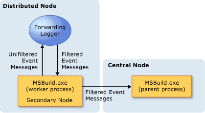
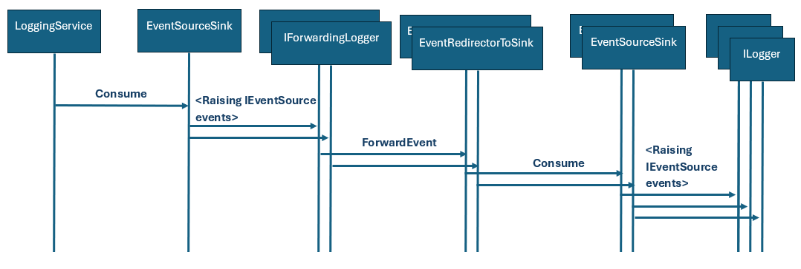
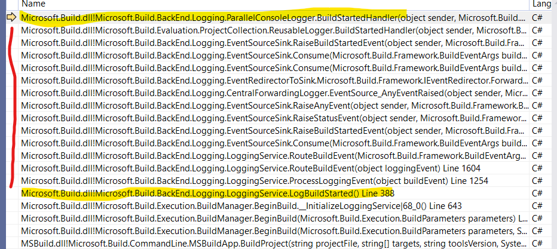
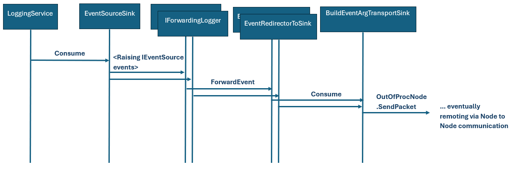
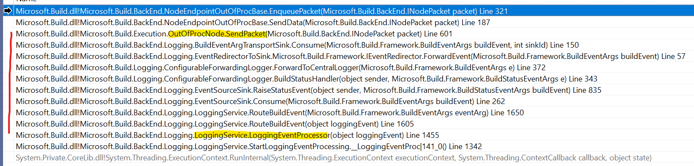
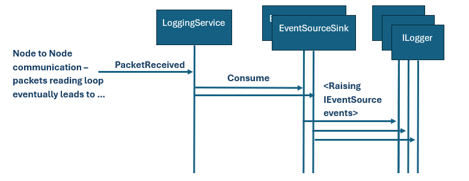
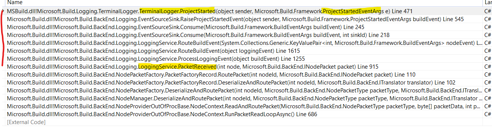

# Logging Internals

MSBuild allows plugging in inbox and custom loggers - those can be registered via the API or CLI and will be receiving rich tracing information during the build process (here as well referred to as `BuildEventArgs`). Detailed article from user point of view can be found on Microsoft Learn: [Build Loggers](https://learn.microsoft.com/en-us/visualstudio/msbuild/build-loggers)

Logging architecture allows usage in distributed execution nature of MSBuild (as [MSBuild has multi-process execution modes](Nodes-Orchestration.md#need-for-multiple-processes)) while pluggable logger might decide to be aware of the situation (then we speak about so called '*Distributed Loggers*') or they can operate in a mode where the distributed execution is not visible to them (they can be referred to as '*Central Loggers*'). Detailed article from user point of view can be found on Microsoft Learn: [Write multi-processor-aware loggers](https://learn.microsoft.com/en-us/visualstudio/msbuild/writing-multi-processor-aware-loggers) and [Create forwarding loggers](https://learn.microsoft.com/en-us/visualstudio/msbuild/creating-forwarding-loggers)

In this document we'll be describing mainly the internal design and implementation of the Logging infrastructure. We won't be going into actual implementation of individual loggers or a way to author custom one. So, this document is mainly targeted to MSBuild project developer or a curious user.

## Terminology

* **Entrypoint node** - build process that was created to serve the build request (either from CLI, API or from Visual Studio via API).
* **Scheduler node** - the process that runs the orchestration of the build. Currently it is the same process as the **Entrypoint node**, but possibly those can be separate (e.g. if a thing build client is provided).
* **In-Proc node** - the build executing unit that is running in the 'Scheduler node'
* **Out-Of-Proc node** / **OOP node** - the build executing unit that is running in the separate process.
* **Logger** - an implementor of `ILogger` (or `INodeLogger`) interface. Such a component then can be registered to receive detailed tracing info from the build process and process the info further. The most common use-case is logging the information into the console, file etc. - hence the name 'Logger', but it can be processed for other purposes (e.g. the [ParallelBuildDebuggingLogger](https://github.com/rainersigwald/parallelbuilddebugginglogger) for debugging purposes, or the BuildCheck for diagnostics).
* **Central Logger** - a logger that runs in the Central node - as well here referred to as the 'Scheduler Node'. It receives the information from the whole build regardless of if it's executed within single or multiple processes.
* **Forwarding Logger** - a logger that has a single instance in each logical executing node and is capable of filtering and/or alter the tracing stream formed of the `BuildEventArg`s before it undergoes serialization and remoting into the Scheduler node. Main built-in implementations are: `CentralForwardingLogger` and `ConfigurableForwardingLogger`.
* **Distributed Logger** - It is a pair of a Central Logger and a Forwarding Logger.
* **LoggerDescription** - Serializable information describing the Forwarding Logger - so that the forwarding logger can be constructed in the OOP node. It also holds the 'LoggerId' (AKA 'SinkId') - so that the remote data can be properly routed to the Central Logger. Other notable datapoints are `Verbosity` and `LoggerSwitchParameters` - which both serves for proper initialization of the forwarder after it's constructed in OOP node.

  
* **EventSource** - source of the tracing events - either from the life build process or replayed post-hoc from the stored source.
* **Sink** - Consumer of the tracing data that exposes and fires them as events - serving as a 'EventSource' for the consuming Logger

## LoggingService

`LoggingService` is the backbone of the Logging Infrastructure - it serves as the consumer of the logging from the build process and as a dispatcher to the individual distributed and central loggers (and internally as well as x-process transmission channel for the tracing in OOP nodes).

There is a single instance in the Scheduler node, single instance within each out-of-proc node and one in ProjectCollection (for standalone API driven evaluation). So, we can technically treat `LoggingService` as a singleton.

### Methods overview

**`RegisterLogger(ILogger logger)`**

* Registers logger as distributed with a single CentralForwardingLogger (regardless of number of calls to the method - just single forwarder)
* Called by BuildManager when starting the build (on the Scheduler node)
* Called by ProjectCollection to register loggers for operations through OM/API. ProjectCollection registers the loggers wrapped by `ReusableLogger` (which combines separate design time and build time invocation build events into a single registered logger)

**`RegisterDistributedLogger(ILogger centralLogger, LoggerDescription forwardingLogger)`**

* The central logger runs in the Scheduler node and the forwarding logger in the out-of-proc worker node
* It creates (1 for each distributed logger) `EventSourceSink` (to be run on the Scheduler Node, where it serves as the `IEventSource` for the registered central loggers (pumping events into them). `LoggingService` in the Scheduler Node multiplexes the build events to the appropriate `EventSourceSink` based on source forwarding logger the event went through in the OOP node)
* It creates (1 for each distributed logger) `EventRedirectorToSink` (to be run on OOP node and to wrap the BuildEvent with the proper LoggerId - so that it can then be multiplexed by the `LoggingService` in the Scheduler Node to the proper `EventSourceSink` and by extension to the proper logger)
* It maintains incrementing counter of registered distributed loggers, and each additional logger is assigned next id - to be used as identification for sinks (`EventSourceSink` and `EventRedirectorToSink`) and it adds the id into passed `LoggerDescription` - so that this can be remoted to the OOP node and proper forwarding is initialized.
* It creates a single `EventSourceSink` in the LoggingService - this is used by all the forwarders as a source of events.
	

**`InitializeNodeLoggers(ICollection<LoggerDescription> descriptions, IBuildEventSink forwardingLoggerSink, int nodeId)`**
* Called from OutOfProcNode.HandleNodeConfiguration - which handles NodeConfiguration 'packet' from the node -> node communiction. (This is as well when the environment and various build-wide configurations - like including evaluated properties in EvaluationFinished events - are received and applied, and as well when LoggingService in OOP node is created)
* `BuildEventArgTransportSink` is passed to the LoggingService - it is attached to each forwarding logger together with the central logger id, within a `EventRedirectorToSink`
* `BuildEventArgTransportSink` takes care about bundling the build events together with the target logger id (in some contexts referred to as sinkId) and sending them through node -> node communication
	
**`ProcessLoggingEvent(object buildEvent)`**
* Ingestion point of build events
* Can be called either to consume an event logged through the internal API (from LogBuildEvent or Log<XXX> [e.g. `LogBuildStarted`, `LogError` etc.])
* Or is called from the node -> node remoting (via PacketReceived)
* Ensures isolated delivery - as in synchronous mode it locks, in asynchronous mode it enqueues and delivers from the queue via single thread
* The isolated delivery however means that a single slow logger can block all others and that the event consuming time is a sum of all loggers consuming times.
 
 
 ### Delivery of events in a single-node build

* There is 1 instance of LoggingService per build.
* It holds 1 instance of EventSourceSink pumping events to forwarders.
* There can be multiple forwarders (one shared for all central loggers registered via [`RegisterLogger`](#RegisterLogger) and one per each distributed logger registered via [`RegisterDistributedLogger`](#RegisterDistributedLogger)).
Example of forwarders:
  * `CentralForwardingLogger`
  * `ConfigurableForwardingLogger`
* Each forwarder process the trace stream and may choose to forward to an `EventRedirectorToSink` (1 redirector per 1 forwarder)
* `EventRedirectorToSink` forwards to `EventSourceSink` (the instance of `EventSourceSink` was passed to `EventRedirectorToSink` during its construction). There is 1 `EventSourceSink` per each `EventRedirectorToSink`
* `EventSourceSink` distributes events to registered Loggers. There can be multiple registered Loggers to the single `EventSourceSink` (this is the case when Logger was registered as 'Central Logger' via [`RegisterLogger`](#RegisterLogger)).

The above diagram is simplified (it doesn't capture the calls within a single component), the current state of calls (that is subject to changes) is illustrated by the following stack trace capture:

 ### Delivery of events in a distributed build

 In case of distributed execution of build, NodeManager is requesting execution of additional Out Of Process (OOP) Nodes. Logging events from those nodes are transferred to the Scheduler node, where they are eventually consumed by the Central Loggers. In addition to the OOP Nodes, build can have a single 'In Proc Node' - an execution node sharing the same process with the Scheduler Node. For this reason the described process and diagram for the [Delivery of events in a single node build](#delivery-of-events-in-a-single-node-build) can apply fully for the distributed build as well (in addition to the following).

 #### OOP Node 

The initial part of the workflow of logging is identical to the in-proc delivery:

* There is 1 instance of LoggingService per build.
* It holds 1 instance of EventSourceSink pumping events to forwarders.
* There can be multiple forwarders (one shared for all central loggers registered via [`RegisterLogger`](#RegisterLogger) and one per each distributed logger registered via [`RegisterDistributedLogger`](#RegisterDistributedLogger)).
Example of forwarders:
  * `CentralForwardingLogger`
  * `ConfigurableForwardingLogger`
* Each forwarder processes the trace stream and optionally forwards each event to an `EventRedirectorToSink` (1 redirector per 1 forwarder)

Processing from `EventRedirectorToSink` differs. This is given by injection of a single sink `BuildEventArgTransportSink` (injected via [`InitializeNodeLoggers`](#InitializeNodeLoggers)) as a consumer of `EventRedirectorToSink` data:

* There is single `BuildEventArgTransportSink` per build, that consumes data from all `EventRedirectorToSink`. The data are enriched with the SinkId (AKA LoggerId) - the Id was created during the Logger registration and remoted to the OOP node together with the [`LoggerDescription`](#LoggerDescription).
* `BuildEventArgTransportSink` bundles the tracing data (instance of `BuildEventArgs`) together with the SinkId and passes it down the pipeline that enqueues data for remoting to the Scheduler Node.

Simplified diagram of the flow (calls within the single component are omitted):

Illustrative stack of the sequence of the calls:

 #### Scheduler Node

 * `LoggingService` recives the remoted data - the instance of `BuildEventArgs` bundled with the SinkId.
 * Based on the SinkId the `LoggingService` routes the received data to the registered `EventSourceSink` (one per registered forwarder).
 * `EventSourceSink` distributes the events to the subscribed Loggers (again - up to single subscribed logger in case of [distributed loggers registrations](#RegisterDistributedLogger), possible multiple loggers in case of [central loggers registrations](#RegisterLogger))

 Simplified diagram of the flow (calls within the single component are omitted):

Illustrative stack of the sequence of the calls:

### Synchronous and Asynchronous events processing

As was mentioned in the [`ProcessLoggingEvent`](#ProcessLoggingEvent) description - the `LoggingService` can deliver the logging events either in a synchronous or asynchronous mode.

The logging mode is dictated by the `LoggerMode` that is injected into the `LoggingService` as such:
 * In the Out Of Proc node the mode is always **asynchronous**.
 * In the Scheduler node the mode is by default **synchronous**, unless the `MSBUILDLOGASYNC` environment variable is set to `"1"`
 * For `ProjectCollection` the mode depends on the construction argument `useAsynchronousLogging`. In signatures that do not ask this argument - it defaults to **synchronous**.

Regardless of the mode used - sequential and isolated delivery of events is always guaranteed (single logger will not receive next event before returning from the previous, any logger will not receive an event while it's being processed by a different logger). The future versions might decide to deliver messages to separate loggers in independent mode - where a processing event by a single logger won't block other loggers.

## Notable Loggers

* [Binary logger](Binary-Log.md)
* [Terminal logger](../terminallogger/)
* Console logger ([parameters](https://github.com/dotnet/msbuild/blob/66e0371a64e08160e63000fc2ced8cb8bbc6739e/src/MSBuild/Resources/Strings.resx#L353-L388))
* File logger ([parameters](https://github.com/dotnet/msbuild/blob/66e0371a64e08160e63000fc2ced8cb8bbc6739e/src/MSBuild/Resources/Strings.resx#L593-L620))

