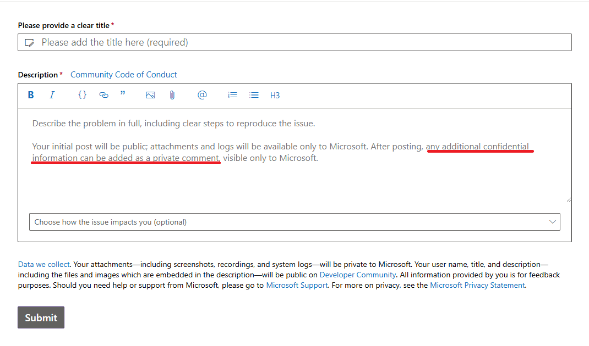

# Providing MSBuild Binary Logs for investigation

MSBuild has the ability to capture a detailed binary log file.  If you are having a build issue and are able to provide a binary log, this can be very helpful for investigating the issue.

However, you should be aware what type of information is captured in the binary log to make sure you are not inadvertently sharing more than you intend.  The binary log captures almost everything your build does, including the contents of your project files and any files (such as .props and .targets) that they import, all tasks that are run during the build as well as the input and output, as well as all environment variables used by the build logic.  It generally doesn't include the contents of the source files that are compiled, but it does capture their full names and paths.

⚠ NOTE: some build environments make secrets available using environment variables. Before sharing a binary log, make sure it does not expose API tokens or other important secrets.

## Capturing Binary Logs for command-line builds

You can create a binary log by passing the `-bl` parameter to MSBuild (`MSBuild.exe` or `dotnet build`). You can explore the contents of the generated .binlog file using [MSBuild Structured Log Viewer](http://msbuildlog.com/) or in your browser using [Live Structured Log Viewer](https://live.msbuildlog.com). Note: We don't capture any data from binary logs viewed on your browser.

Examples:

```sh
dotnet build -bl
dotnet build -bl:SpecificStep.binlog
MSBuild.exe -bl:ServiceRelease.binlog -p:Configuration=Release
```

[More details about binary logs](Binary-Log.md)

## Capturing Binary Logs Through Visual Studio

### Capturing logs for all MSBuild invocations

Set `MSBUILDDEBUGENGINE` environment variable to `'1'` and (optionally) set `MSBUILDDEBUGPATH` to an existing destination folder to store the captured logs. Then start Visual Studio from the same shell to inherit the environment:

`cmd:`

```batch
> SET MSBUILDDEBUGENGINE=1
> SET MSBUILDDEBUGPATH=C:\MSBuildReproLogs
> devenv.exe MySolution.sln
```

`PowerShell:`

```powershell
> $env:MSBUILDDEBUGENGINE = 1
> $env:MSBUILDDEBUGPATH="C:\MSBuildReproLogs"
> & "devenv.exe" MySolution.sln
```

MSBuild binary logs are then captured to a location specified via `MSBUILDDEBUGPATH` environment variable (or defaults to `MSBuild_Logs` subfolder of a current folder or `%temp%`, based on access rights).

⚠ NOTE: logs are being recorded for each MSBuild invocation (including design time builds) and kept in the folder without removing older ones - so the number of log files can grow quickly. It is recommended to set the opt-in environment variable only for the short duration of reproducing the issue to be investigated (though it is understandable that some nondeterministic issues might need multiple reproduction attempts)

Further reading:

* [More technical info](Building-Testing-and-Debugging-on-Full-Framework-MSBuild.md#logs)
* [Design time builds logs](https://github.com/dotnet/project-system/blob/main/docs/repo/debugging/design-time-builds.md#gathering-full-fidelity-binlogs)

### Capturing specific logs for chosen build invocations

See [this guide](https://github.com/dotnet/project-system-tools) in the Project System Tools repo for capturing binlogs through Visual Studio.

> [!TIP]
> You can share your logs with us anonymously [via MS developer community](https://developercommunity.microsoft.com/dotnet/report).



> [!CAUTION]
> Only attach sensitive information in the comments after the initial post to ensure anonymity.

