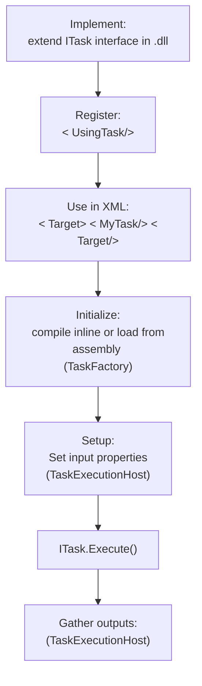

# Tasks
A Task is a unit of execution in a Target and a method of extensibility in MSBuild.
## Basics
A task is a class implementing [`ITask`](https://github.com/dotnet/msbuild/blob/main/src/Framework/ITask.cs).
- The notable method of this interface is `bool Execute()`. Code in it will get executed when the task is run. 
- A Task can have public properties that can be set by the user in the project file.
    - These properties can be `string`, `bool`, `ITaskItem` (representation of a file system object), `string[]`, `bool[]`, `ITaskItem[]`
    - the properties can have attributes `[Required]` which causes the engine to check that it has a value when the task is run and `[Output]` which exposes the property to be used again in XML
- Tasks have the `Log` property set by the engine to log messages/errors/warnings.

## Internals
- [`TaskRegistry`](https://github.com/dotnet/msbuild/blob/main/src/Build/Instance/TaskRegistry.cs) - has a list of all available tasks for the build, and resolves them.
- [`TaskExecutionHost`](https://github.com/dotnet/msbuild/tree/main/src/Build/BackEnd/TaskExecutionHost) - finds task in TaskRegistry, calls TaskFactory to create an instance of the task and sets its properties using reflection from the values in the XML. Then calls Execute on the task and gathers the outputs.
- TaskFactory - initializes the task, creates instance of the task
- ITask class - runs `Execute()` method

## Custom Tasks
Users can implement `ITask` and compile it into a .dll.
Then they can use in project file:
```xml
<UsingTask TaskName="MyTaskClass" AssemblyFile="MyTasks.dll"/>
```
This uses the AssemblyTaskFactory to load the task from the .dll and create an instance of it.

## Diagram of task lifecycle



## Task Factories
Task factories create instances of tasks. They implement [`ITaskFactory`](https://github.com/dotnet/msbuild/blob/main/src/Framework/ITaskFactory.cs) or [`ITaskFactory2`](https://github.com/dotnet/msbuild/blob/main/src/Framework/ITaskFactory2.cs).
This interface defines `bool Initialize(...)` and `ITask CreateTask(...)`.
They are e.g. responsible for loading a task from an assembly and initializing it.

### Built-in Task Factories
- [`AssemblyTaskFactory`](https://github.com/dotnet/msbuild/blob/main/src/Build/Instance/TaskFactories/AssemblyTaskFactory.cs) - constructs tasks from .NET assemblies
- [`RoslynCodeTaskFactory`](https://github.com/dotnet/msbuild/blob/main/src/Tasks/RoslynCodeTaskFactory/RoslynCodeTaskFactory.cs) - inline code tasks
- CodeTaskFactory, XamlTaskFactory - old, rarely used

### Custom Task Factories
This is a rarely used method of extensibility.
Users can implement `ITaskFactory` to create custom task factories.
Then they can use in project file:
```xml
<UsingTask TaskName="MyTask" AssemblyFile="Factory.dll" Factory="MyTaskFactory">
    <Task>Insides that the MyTaskFactory uses to initialize</Task>
</UsingTask>
```

# Microsoft Learn Resources
- [MSBuild task](https://learn.microsoft.com/visualstudio/msbuild/msbuild-task)
- [Task reference](https://learn.microsoft.com/visualstudio/msbuild/msbuild-task-reference)
- [Task Writing](https://learn.microsoft.com/visualstudio/msbuild/task-writing)
- [Creating custom task tutorial](https://learn.microsoft.com/visualstudio/msbuild/tutorial-custom-task-code-generation)