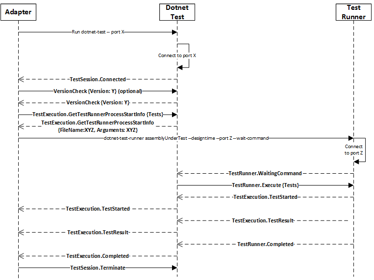
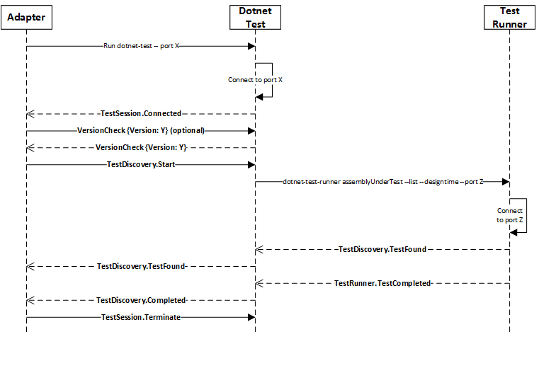

% DOTNET-TEST(1)
% Microsoft Corporation dotnetclifeedback@microsoft.com
% April 2016

Dotnet Test, Adapters and Test Runners
======================================

This document covers the interactions between dotnet test, a potential adapter (like VS) and
test runners (like [xunit](https://github.com/dotnet/coreclr.xunit)).

It describes the communication protocol for these agents, the parameters that the runner needs to support and the
modes on which dotnet test and the runner work.

## Running modes

Dotnet test supports two running modes:

1. Console: In console mode, dotnet test simply executes fully whatever command gets passed to it and outputs the results. Anytime you
invoke dotnet test without passing --port, it will run in console mode, which in turn will cause the runner to run in console mode.
2. Design time: Anytime you pass a port to dotnet test, we will run in design time. That means that dotnet test will connect to that port
using TCP and will then exchange a established set of messages with whatever else is connected to that port. When this happens, the runner
also receives a port (a new one, mind you) that dotnet test will use to communicate with it. The reason why the runner also uses TCP to
communicate with dotnet test is because in design mode, it is not sufficient to just output results to the console. We need to send the
adapter structure messages containing the results of the test execution.

### Communication protocol in design time.

1. Because during design time, dotnet test connects to a port when it starts up, the adapter needs to be listening on that port otherwise dotnet test will fail. We did it like this so that the adapter could reserve all the ports it needs by binding and listening to them before dotnet test ran and tried to get ports for the runner.
2. Once dotnet test starts, it sends a TestSession.Connected message to the adapter indicating that it is ready to receive messages.
3. It is possible to send an optional [version check](https://github.com/dotnet/cli/blob/rel/1.0.0/src/Microsoft.Extensions.Testing.Abstractions/Messages/ProtocolVersionMessage.cs) message with the adapter version of the protocol in it. Dotnet test will send back the version of the protocol that it supports.

All messages have the format described here: [Message.cs](https://github.com/dotnet/cli/blob/rel/1.0.0/src/Microsoft.Extensions.Testing.Abstractions/Messages/Message.cs). The payload formats for each message is described in links to the classes used to de/serialize the information in the description of the protocol.

#### Test Execution

1. After the optional version check, the adapter sends a TestExecution.GetTestRunnerProcessStartInfo, with the [tests](https://github.com/dotnet/cli/blob/rel/1.0.0/src/Microsoft.Extensions.Testing.Abstractions/Messages/RunTestsMessage.cs) it wants to execute inside of it. Dotnet test sends back a FileName and Arguments inside a [TestStartInfo](https://github.com/dotnet/cli/blob/rel/1.0.0/src/dotnet/commands/dotnet-test/TestStartInfo.cs) payload that the adapter can use to start the runner. In the past, we would send the list of tests to run as part of that argument, but we were actually going over the command line size limit for some test projects.
  1. As part of the arguments, we send a port that the runner should connect to and for executing tests, a --wait-command flag, that indicates that the runner should connect to the port and wait for commands, instead of going ahead and executing the tests.
2. At this point, the adapter can launch the runner (and attach to it for debugging if it chooses to).
3. Once the runner starts, it sends dotnet test a TestRunner.WaitCommand message that indicates it is ready to receive commands, at which point dotnet test sends a TestRunner.Execute with the list of [tests](https://github.com/dotnet/cli/blob/rel/1.0.0/src/Microsoft.Extensions.Testing.Abstractions/Messages/RunTestsMessage.cs) to run. This bypasses the command line size limit described above.
4. The runner then sends dotnet test (and it passes forward to the adapter) a TestExecution.TestStarted for each tests as they start with the [test](https://github.com/dotnet/cli/blob/rel/1.0.0/src/Microsoft.Extensions.Testing.Abstractions/Test.cs) information inside of it.
5. The runner also sends dotnet test (and it forwards to the adapter) a TestExecution.TestResult for each test with the [individual result](https://github.com/dotnet/cli/blob/rel/1.0.0/src/Microsoft.Extensions.Testing.Abstractions/TestResult.cs) of the test.
6. After all tests finish, the runner sends a TestRunner.Completed message to dotnet test, which dotnet test sends as TestExecution.Completed to the adapter.
7. Once the adapter is done, it sends dotnet test a TestSession.Terminate which will cause dotnet test to shutdown.

#### Test discovery

1. After the optional version check, the adapter sends a TestDiscovery.Start message. Because in this case, the adapter does not need to attach to the process, dotnet test will start the runner itself. Also, since there is no long list of arguments to be passed to the runner, no --wait-command flag is needed to be passed to the runner. dotnet test only passes a --list argument to the runner, which means the runner should not run the tests, just list them.
2. The runner then sends dotnet test (and it passes forward to the adapter) a TestDiscovery.TestFound for each [test](https://github.com/dotnet/cli/blob/rel/1.0.0/src/Microsoft.Extensions.Testing.Abstractions/Test.cs) found.
3. After all tests are discovered, the runner sends a TestRunner.Completed message to dotnet test, which dotnet test sends as TestDiscovery.Completed to the adapter.
4. Once the adapter is done, it sends dotnet test a TestSession.Terminate which will cause dotnet test to shutdown.

## Dotnet test parameters

Any parameters not accepted by dotnet test will be forwarded to the runner.
This is the list of parameters supported by dotnet test from its own help print out:

Usage: dotnet test [arguments] [options]

Arguments:
  <PROJECT>  The project to test, defaults to the current directory. Can be a path to a project.json or a project directory.

Options:
  -?|-h|--help                        Show help information
  --parentProcessId                   Used by IDEs to specify their process ID. Test will exit if the parent process does.
  --port                              Used by IDEs to specify a port number to listen for a connection.
  -c|--configuration <CONFIGURATION>  Configuration under which to build
  -o|--output <OUTPUT_DIR>            Directory in which to find the binaries to be run
  -b|--build-base-path <OUTPUT_DIR>   Directory in which to find temporary outputs
  -f|--framework <FRAMEWORK>          Looks for test binaries for a specific framework
  -r|--runtime <RUNTIME_IDENTIFIER>   Look for test binaries for a for the specified runtime
  --no-build                          Do not build project before testing

### Minimum parameters that the runner needs to support

* AssemblyUnderTest: Path to the dll that contains the tests to be run.
* --port: Used by dotnet test to specify a port number that the runner should connect to.
* --list: Indicates that the tests should only be listed and not executed.
* --designtime: Indicates that the runner is running in design time, for instance, inside an adapter.
* --wait-command: Indicates that the runner should wait to receive commands through the TCP channel instead of running tests right away. We use this to get around the command line size limit.
